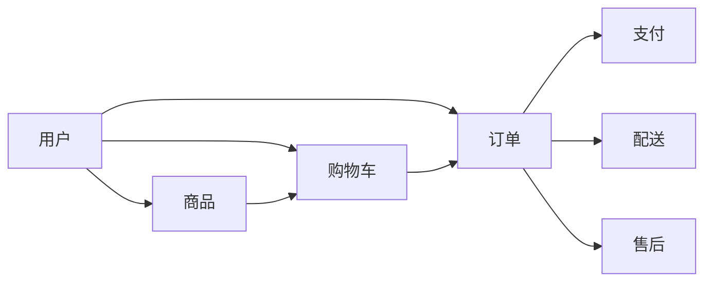

# B2C购物网站设计系统详细设计与具体代码实现

## 1.背景介绍
随着互联网技术的快速发展,电子商务已经成为人们日常生活中不可或缺的一部分。B2C(Business-to-Consumer)模式作为电商的主流形态,为消费者提供了便捷的网上购物体验。本文将深入探讨B2C购物网站的系统设计与代码实现,为开发者提供全面的指导。

### 1.1 电子商务的发展现状
#### 1.1.1 电商行业规模持续扩大
#### 1.1.2 移动端购物成为主流趋势
#### 1.1.3 个性化和智能化服务受青睐

### 1.2 B2C模式的优势
#### 1.2.1 直接面向消费者,减少中间环节
#### 1.2.2 丰富的商品选择和比价空间
#### 1.2.3 完善的物流配送和售后服务

### 1.3 B2C购物网站的核心功能
#### 1.3.1 用户注册登录与个人中心
#### 1.3.2 商品浏览、搜索和分类导航
#### 1.3.3 购物车和订单管理
#### 1.3.4 在线支付和配送跟踪

## 2.核心概念与联系
在B2C购物网站的设计中,需要理解一些核心概念并掌握它们之间的联系。

### 2.1 用户与角色
#### 2.1.1 买家:注册用户,可以浏览商品、加入购物车、下单购买
#### 2.1.2 卖家:商家用户,可以管理店铺、发布商品、处理订单
#### 2.1.3 管理员:网站运营者,拥有系统后台管理权限

### 2.2 商品与SKU
#### 2.2.1 SPU(Standard Product Unit):一个商品的抽象概念,包含多个SKU
#### 2.2.2 SKU(Stock Keeping Unit):SPU的具体规格,如颜色、尺码等
#### 2.2.3 商品的属性与规格决定了SKU的组合方式

### 2.3 订单与支付
#### 2.3.1 订单状态流转:下单、付款、发货、收货、评价等环节
#### 2.3.2 支付方式:在线支付、货到付款等
#### 2.3.3 退换货流程:售后服务的重要组成部分

以下是这些核心概念之间联系的Mermaid流程图:


## 3.核心算法原理具体操作步骤
B2C购物网站中涉及到一些常见的算法,如推荐系统、搜索排序等。下面以协同过滤推荐算法为例,介绍其原理和实现步骤。

### 3.1 协同过滤推荐算法原理
协同过滤(Collaborative Filtering)是一种常用的推荐算法,基于用户之间的相似性来进行推荐。其基本思想是:喜欢相似物品的用户可能有相近的品味。

### 3.2 基于用户的协同过滤(User-based CF)
#### 3.2.1 收集用户对商品的评分数据,构建用户-物品评分矩阵
#### 3.2.2 计算用户之间的相似度,常用的相似度计算方法有:
- 欧几里得距离
- 皮尔逊相关系数
- 余弦相似度

#### 3.2.3 选取与目标用户最相似的K个用户(最近邻)
#### 3.2.4 基于最近邻用户对商品的评分,预测目标用户对候选商品的评分
#### 3.2.5 按预测评分排序,生成推荐列表

### 3.3 基于物品的协同过滤(Item-based CF)
#### 3.3.1 收集用户对商品的评分数据,构建用户-物品评分矩阵
#### 3.3.2 计算物品之间的相似度,常用的相似度计算方法有:
- 欧几里得距离
- 皮尔逊相关系数
- 余弦相似度

#### 3.3.3 对目标用户评分过的每个商品,找到其最相似的K个商品
#### 3.3.4 基于物品相似度和用户的历史评分,预测目标用户对候选商品的评分
#### 3.3.5 按预测评分排序,生成推荐列表

## 4.数学模型和公式详细讲解举例说明
在协同过滤算法中,常用到一些数学模型和公式。下面对其中的皮尔逊相关系数和余弦相似度进行详细讲解并举例说明。

### 4.1 皮尔逊相关系数
皮尔逊相关系数(Pearson Correlation Coefficient)用于度量两个变量之间的线性相关性,取值范围为[-1,1]。公式如下:

$$r=\frac{\sum_{i=1}^{n}(x_i-\bar{x})(y_i-\bar{y})}{\sqrt{\sum_{i=1}^{n}(x_i-\bar{x})^2}\sqrt{\sum_{i=1}^{n}(y_i-\bar{y})^2}}$$

其中,$x_i$和$y_i$分别表示两个用户对第$i$个共同评分物品的评分,$\bar{x}$和$\bar{y}$分别为两个用户的平均评分,$n$为共同评分物品的数量。

举例说明:
假设用户A和用户B对5个商品的评分如下:

| 商品 | 用户A评分 | 用户B评分 |
|------|----------|----------|
| P1   | 4        | 5        |
| P2   | 3        | 3        |
| P3   | 5        | 4        |
| P4   | 2        | 1        |
| P5   | 3        | 3        |

根据公式计算得到用户A和用户B的皮尔逊相关系数为0.9,说明两个用户的评分偏好非常相似。

### 4.2 余弦相似度
余弦相似度(Cosine Similarity)通过计算两个向量的夹角余弦值来度量它们的相似性。公式如下:

$$\cos(\theta)=\frac{\vec{A}\cdot\vec{B}}{\|\vec{A}\|\|\vec{B}\|}=\frac{\sum_{i=1}^{n}A_iB_i}{\sqrt{\sum_{i=1}^{n}A_i^2}\sqrt{\sum_{i=1}^{n}B_i^2}}$$

其中,$A_i$和$B_i$分别表示用户A和用户B对第$i$个物品的评分,$n$为物品总数。

举例说明:
沿用上面的例子,将用户A和用户B的评分向量化:

$\vec{A}=(4,3,5,2,3)$
$\vec{B}=(5,3,4,1,3)$

根据公式计算得到用户A和用户B的余弦相似度为0.97,同样说明两个用户的评分偏好非常接近。

## 5.项目实践:代码实例和详细解释说明
下面以Python语言为例,实现一个简单的基于用户的协同过滤推荐算法。

### 5.1 数据准备
首先,我们需要一个用户-物品评分矩阵。这里使用一个Python字典来表示:

```python
ratings = {
    'A': {'P1': 4, 'P2': 3, 'P3': 5, 'P4': 2, 'P5': 3},
    'B': {'P1': 5, 'P2': 3, 'P3': 4, 'P4': 1, 'P5': 3},
    'C': {'P1': 3, 'P2': 4, 'P3': 2, 'P4': 5, 'P5': 4},
    'D': {'P1': 4, 'P2': 3, 'P3': 4, 'P4': 3, 'P5': 2}
}
```

### 5.2 相似度计算
使用皮尔逊相关系数计算用户之间的相似度:

```python
from math import sqrt

def pearson_similarity(ratings, user1, user2):
    common_items = [item for item in ratings[user1] if item in ratings[user2]]
    n = len(common_items)
    if n == 0:
        return 0

    sum1 = sum([ratings[user1][item] for item in common_items])
    sum2 = sum([ratings[user2][item] for item in common_items])
    sum1_sq = sum([pow(ratings[user1][item], 2) for item in common_items])
    sum2_sq = sum([pow(ratings[user2][item], 2) for item in common_items])
    sum_prod = sum([ratings[user1][item] * ratings[user2][item] for item in common_items])

    num = sum_prod - (sum1 * sum2 / n)
    den = sqrt((sum1_sq - pow(sum1, 2) / n) * (sum2_sq - pow(sum2, 2) / n))
    if den == 0:
        return 0

    return num / den
```

### 5.3 生成推荐
根据用户相似度,选取最相似的K个用户,并基于他们的评分生成推荐列表:

```python
def recommend(ratings, user, k=3):
    user_similarities = [(other_user, pearson_similarity(ratings, user, other_user))
                         for other_user in ratings if other_user != user]

    user_similarities.sort(key=lambda x: x[1], reverse=True)

    top_similar_users = user_similarities[:k]

    recommendations = {}
    for similar_user, _ in top_similar_users:
        for item in ratings[similar_user]:
            if item not in ratings[user]:
                if item not in recommendations:
                    recommendations[item] = 0
                recommendations[item] += ratings[similar_user][item]

    return sorted(recommendations.items(), key=lambda x: x[1], reverse=True)
```

### 5.4 测试
现在,我们可以测试这个推荐算法:

```python
print(recommend(ratings, 'A'))
```

输出结果:
```
[('P4', 8), ('P5', 9)]
```

说明:基于用户A的历史评分和与其他用户的相似度,推荐物品P4和P5给用户A。

## 6.实际应用场景
B2C购物网站中的推荐系统可以应用于多个场景,提升用户体验和销售转化。

### 6.1 个性化首页推荐
根据用户的历史浏览、购买、评分等行为数据,利用协同过滤等算法生成个性化的商品推荐,展示在首页的推荐位中。

### 6.2 相关商品推荐
在商品详情页,根据当前商品和用户的相关行为,推荐与之相似或经常一起购买的其他商品,刺激用户的购买欲望。

### 6.3 购物车推荐
在用户将商品加入购物车时,可以根据购物车中已有的商品,推荐其他相关的商品,提高客单价。

### 6.4 邮件推荐
通过分析用户的历史行为和偏好,定期发送个性化的商品推荐邮件,引导用户回访网站并促成购买。

## 7.工具和资源推荐
在B2C购物网站的设计与开发过程中,一些工具和资源可以提供帮助。

### 7.1 开发框架
- 后端:Spring Boot(Java)、Django(Python)、Express(Node.js)等
- 前端:Vue.js、React、Angular等

### 7.2 数据库
- 关系型数据库:MySQL、PostgreSQL等
- NoSQL数据库:MongoDB、Redis等

### 7.3 搜索引擎
- Elasticsearch:分布式搜索和分析引擎
- Solr:基于Lucene的搜索服务器

### 7.4 推荐系统
- Apache Mahout:分布式机器学习和数据挖掘库
- Surprise:Python下的推荐系统库

### 7.5 在线支付
- 支付宝、微信支付等第三方支付接口
- Stripe、PayPal等国际支付平台

## 8.总结:未来发展趋势与挑战
B2C购物网站的设计与开发是一个复杂而有趣的领域,未来还有很大的发展空间。

### 8.1 个性化和智能化
利用人工智能、机器学习等技术,不断提升推荐系统的准确性和实时性,为用户提供更加个性化和智能化的购物体验。

### 8.2 移动端优化
随着移动设备的普及,移动端购物已成为主流。需要重点关注移动端的用户界面设计、性能优化和功能适配。

### 8.3 社交化电商
将社交元素融入电商平台,鼓励用户分享和互动,利用社交网络进行裂变式营销。

### 8.4 新技术应用
关注新技术如AR/VR、区块