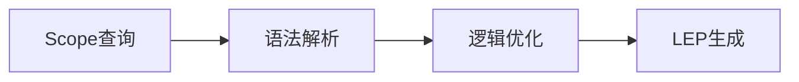
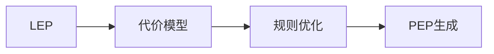
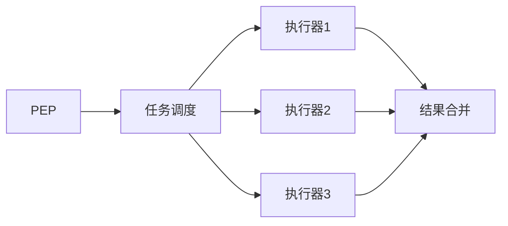
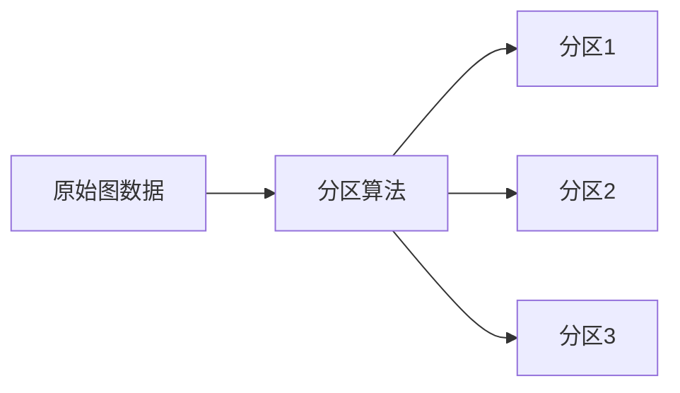
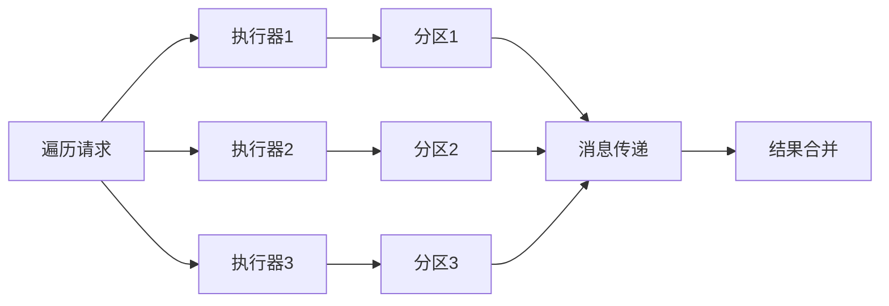
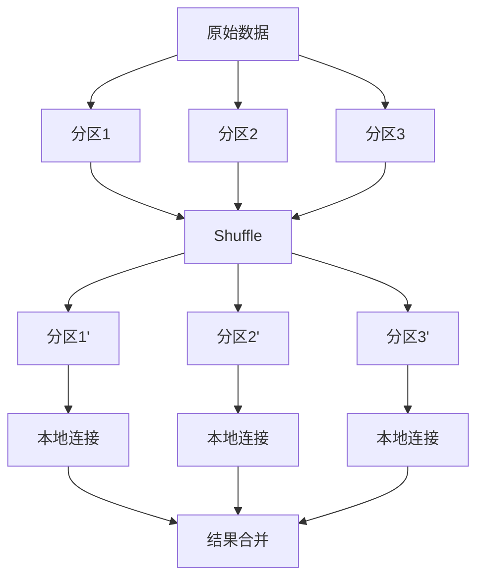
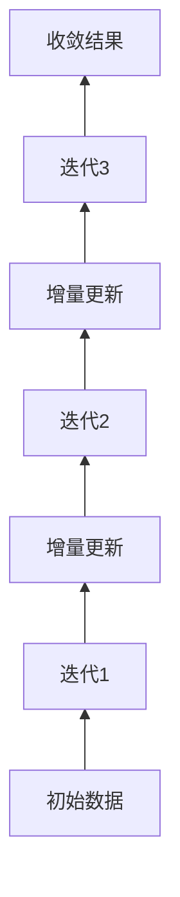

# Cosmos图计算引擎原理与Scope代码实例讲解

## 1.背景介绍

### 1.1 什么是Cosmos图计算引擎？

Cosmos是一个分布式图计算引擎，旨在高效处理大规模图形数据。它采用全新的图计算模型和架构设计，能够在单机或集群环境下执行图形分析、图算法和图查询等任务。Cosmos的核心目标是提供一个统一、高性能、可扩展的图计算平台。

### 1.2 图计算的重要性

随着大数据时代的到来,图形数据在诸多领域扮演着越来越重要的角色。社交网络、知识图谱、交通路线规划、推荐系统等都可以抽象为图形数据结构。对这些数据进行高效计算和分析,可以发掘隐藏其中的价值信息,为企业和组织带来新的洞见和竞争优势。

### 1.3 现有图计算引擎的局限性

现有的图计算系统如Neo4j、JanusGraph等,主要面向在线事务处理(OLTP)场景,对于大规模离线分析计算存在一些局限性:

1. 单机架构,扩展性差
2. 内存受限,无法处理大规模图数据
3. 缺乏统一的图计算模型和优化策略
4. 图算法实现效率低下

Cosmos旨在突破上述局限,为大规模图计算提供高效、可扩展的解决方案。

## 2.核心概念与联系

### 2.1 Scope图查询语言

Scope是Cosmos图计算引擎的原生查询语言,用于表达图形模式匹配和转换操作。它基于Gremlin查询语言,但进行了大量增强和优化。

Scope查询示例:

```
g.V().has('name','Alice').outE('knows').inV().values('name')
```

该查询从图中找到名为Alice的顶点,遍历其'knows'关系边,并返回目标顶点的名称。

### 2.2 逻辑执行计划(LEP)

Cosmos采用自动优化的查询执行策略。Scope查询首先被编译为逻辑执行计划(LEP),描述了查询的高层次执行逻辑。LEP由一系列逻辑运算符(如扫描、过滤、连接等)组成。



### 2.3 物理执行计划(PEP)

LEP接下来被转化为物理执行计划(PEP),描述了查询在集群上的具体执行方式。PEP由一系列并行化的物理运算符(如Shuffle、Broadcast等)组成,可高效利用集群资源。



### 2.4 分布式执行引擎

Cosmos采用分布式架构,查询由多个执行器并行执行。每个执行器负责处理图数据的一个分区,通过高效的数据洗牌(Shuffle)操作实现分布式连接等运算。



## 3.核心算法原理具体操作步骤  

### 3.1 图分区与数据布局

Cosmos采用顶点切分(Vertex-Cut)算法对图数据进行分区,将顶点均匀分布到不同分区,边跨分区存储。这种布局可最大化数据局部性,提高并行处理效率。



### 3.2 分布式图遍历

Cosmos使用优化的分布式遍历算法执行图遍历操作,避免冗余数据传输。遍历过程中,每个执行器只处理本地分区数据,并通过高效的消息传递协议与其他执行器协作,实现跨分区遍历。



### 3.3 分布式图连接

Cosmos采用基于哈希的分布式连接算法,高效执行图连接操作。首先根据连接键对数据进行重分区(Shuffle),使相同键值的数据位于同一分区,然后在每个分区内执行本地连接。



### 3.4 增量迭代图计算

Cosmos支持增量迭代图计算模型,适用于PageRank、连通分量等算法。每次迭代只需更新发生变化的数据,可显著减少计算量。Cosmos采用增量消息传递协议,高效传播并合并更新信息。



## 4.数学模型和公式详细讲解举例说明

### 4.1 图表示

在Cosmos中,一个图$G$可以表示为$G=(V, E, \phi)$,其中:

- $V$是顶点集合
- $E \subseteq V \times V$是边集合
- $\phi$是属性函数,将顶点或边映射到属性值

### 4.2 图分区模型

采用顶点切分算法对图$G$进行$k$路分区:

$$
\begin{aligned}
\pi: V &\rightarrow \{0, 1, \ldots, k-1\} \
(u, v) &\in E, \pi(u) \neq \pi(v) \Rightarrow (u, v) \in E_{\text{cross}}
\end{aligned}
$$

其中$\pi$是分区函数,将顶点映射到分区编号。$E_{\text{cross}}$是跨分区的边集合。

目标是最小化$|E_{\text{cross}}|$,即跨分区边的数量,从而提高数据局部性。

### 4.3 分布式遍历算法

假设要从顶点$v_0$开始,执行遍历操作$\mathcal{O}$。在分布式环境下,遍历过程可表示为:

$$
\mathcal{R} = \bigcup_{i=0}^{k-1} \mathcal{R}_i, \quad \mathcal{R}_i = \mathcal{O}(v_0, \mathcal{P}_i)
$$

其中$\mathcal{P}_i$是第$i$个分区的数据,包含顶点和边。$\mathcal{R}_i$是在第$i$个分区上执行遍历的局部结果集,最终结果$\mathcal{R}$是所有局部结果的并集。

为了处理跨分区遍历,Cosmos采用消息传递协议在执行器之间交换遍历前沿(frontier)信息。

### 4.4 分布式连接算法

假设要执行两个图$G_1$和$G_2$的连接操作,连接键为$f$。首先对两个图的数据进行重分区:

$$
\begin{aligned}
\pi_1: V_1 &\rightarrow \{0, 1, \ldots, k-1\} \
\pi_2: V_2 &\rightarrow \{0, 1, \ldots, k-1\} \
\pi_1(u) &= \pi_2(v) \iff f(u) = f(v)
\end{aligned}
$$

其中$\pi_1$和$\pi_2$是基于连接键$f$的重分区函数,确保相同键值的数据位于同一分区。

然后在每个分区内执行本地连接:

$$
\mathcal{R}_i = \mathcal{P}_{1i} \;\;\text{\underline{$\Join$}}\;\; \mathcal{P}_{2i}
$$

最终结果$\mathcal{R}$是所有分区结果的并集。

## 5.项目实践：代码实例和详细解释说明

这里我们通过一个简单的示例,演示如何使用Cosmos执行图查询和分析。我们将在一个社交网络图上执行好友推荐查询。

### 5.1 构建图数据

首先,我们使用Scope语言构建一个简单的社交网络图:

```scala
// 创建图实例
val g = Cosmos.openGraph("social")

// 添加顶点
val alice = g.addVertex(_.property("name", "Alice"))
val bob = g.addVertex(_.property("name", "Bob"))
val charlie = g.addVertex(_.property("name", "Charlie"))
val dave = g.addVertex(_.property("name", "Dave"))

// 添加边
g.addEdge(alice, "knows", bob)
g.addEdge(bob, "knows", charlie)
g.addEdge(alice, "knows", charlie)
g.addEdge(charlie, "knows", dave)
```

这个图包含4个顶点(Alice、Bob、Charlie和Dave),以及4条"knows"类型的边,表示他们之间的好友关系。

### 5.2 执行图查询

现在我们来执行一个好友推荐查询,找到Alice的好友的好友,但排除已经是Alice好友的人。

```scala
val recommendation = g.V()
  .has("name", "Alice")
  .outE("knows")
  .inV()
  .outE("knows")
  .inV()
  .dedup()
  .values("name")
  .filter(!_.contains("Alice"))
```

这个查询的执行过程如下:

1. 从图中找到名为"Alice"的顶点
2. 遍历Alice的"knows"出边,到达她的好友
3. 从好友出发,再次遍历"knows"出边,到达好友的好友
4. 去重,只保留唯一的顶点
5. 提取顶点的"name"属性
6. 过滤掉名为"Alice"的顶点

查询结果将包含Dave,因为Dave是Charlie的好友,而Charlie是Alice的好友。

### 5.3 执行图分析

除了查询,我们还可以使用Cosmos执行各种图分析算法,例如PageRank。PageRank是一种常用的链接分析算法,用于计算网页或顶点的重要性分数。

```scala
// 执行PageRank算法
val pr = g.pageRank()
  .maxIter(10)
  .tol(1e-6)
  .run()

// 查看结果
pr.vertices.show()
```

在这个示例中,我们在社交网络图上执行PageRank算法,最大迭代次数为10,收敛阈值为1e-6。算法结束后,我们可以查看每个顶点的PageRank分数。

分数较高的顶点通常表示在网络中较为重要或有影响力。这种分析在社交网络、网页排名等场景都有广泛应用。

## 6.实际应用场景

Cosmos图计算引擎可广泛应用于以下领域:

### 6.1 社交网络分析

社交网络本质上是一种图形数据结构,顶点表示用户,边表示关系。使用Cosmos可以高效执行好友推荐、社区发现、影响力分析等任务。

### 6.2 知识图谱构建

知识图谱是知识的图形化表示,可用于问答系统、智能助理等场景。Cosmos可以从海量数据中提取实体和关系,构建和查询知识图谱。

### 6.3 交通路线规划

道路网络可以抽象为图形结构,其中路口是顶点,道路是边。Cosmos可以在大规模交通网络中执行最短路径、交通流量分析等算法。

### 6.4 金融风险分析

金融实体(如公司、人员)及其关系可以构建为图形数据。Cosmos可以分析这些关系网络,发现潜在的风险和欺诈行为。

### 6.5 推荐系统

推荐系统的核心是发现用户、商品之间的相似性和关联关系。这些关系数据天然适合图形表示,Cosmos可以提供高效的相似度计算