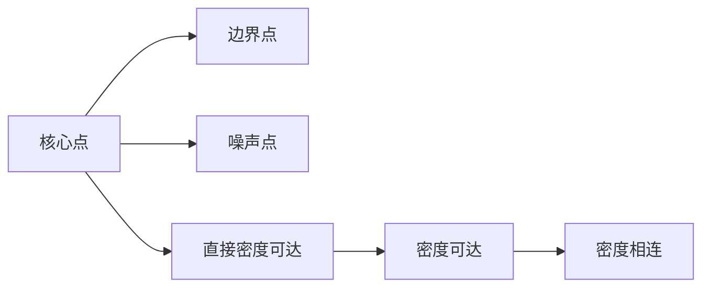

# DBSCAN聚类：基于密度的聚类算法

## 1.背景介绍
在数据挖掘和机器学习领域中，聚类是一项重要的任务，旨在将相似的数据点分组到同一个簇中。传统的聚类算法如K-means和层次聚类在处理非凸形状的簇和噪声数据时存在局限性。为了克服这些挑战，基于密度的聚类算法应运而生，其中最著名的算法之一就是DBSCAN（Density-Based Spatial Clustering of Applications with Noise）。

DBSCAN算法由Martin Ester等人于1996年提出，它能够发现任意形状的簇，并能有效地处理噪声数据。与其他聚类算法相比，DBSCAN具有以下优点：

1. 无需预先指定簇的数量
2. 能够发现任意形状的簇
3. 对噪声数据具有鲁棒性
4. 只需设置两个参数：ε（epsilon）和MinPts

### 1.1 DBSCAN的应用场景
DBSCAN算法在各个领域都有广泛的应用，例如：

- 社交网络分析：识别社交网络中的社区结构
- 图像分割：将图像中的像素点聚类成不同的区域
- 异常检测：识别数据中的异常点或离群点
- 地理空间数据分析：发现地理位置的热点区域

### 1.2 DBSCAN的局限性
尽管DBSCAN算法具有许多优点，但它也存在一些局限性：

- 对参数ε和MinPts敏感，不同的参数设置可能导致不同的聚类结果
- 在高维数据上效果可能不佳，因为高维空间中数据点的密度差异较小
- 对聚类密度差异较大的数据集效果不佳

## 2.核心概念与联系
为了更好地理解DBSCAN算法，我们需要了解以下核心概念：

### 2.1 ε-邻域（ε-neighborhood）
对于数据集D中的一个点p，其ε-邻域定义为以p为中心、半径为ε的区域内所有的点的集合，记为Nε(p)。

### 2.2 核心点（Core Point）
如果一个点p的ε-邻域内的点的数量大于等于MinPts，则称p为核心点。

### 2.3 边界点（Border Point）
如果一个点p不是核心点，但它位于某个核心点的ε-邻域内，则称p为边界点。

### 2.4 噪声点（Noise Point）
既不是核心点也不是边界点的点称为噪声点。

### 2.5 直接密度可达（Directly Density-Reachable）
如果点q位于点p的ε-邻域内，且p是核心点，则称q从p出发是直接密度可达的。

### 2.6 密度可达（Density-Reachable）
如果存在一个点序列p1, p2, ..., pn，其中p1 = p, pn = q，对于每个i (1 ≤ i ≤ n-1)，pi+1从pi出发是直接密度可达的，则称q从p出发是密度可达的。

### 2.7 密度相连（Density-Connected）
如果存在一个点o，使得点p和点q都从o出发是密度可达的，则称p和q是密度相连的。

下图展示了这些核心概念之间的联系：



## 3.核心算法原理具体操作步骤
DBSCAN算法的核心思想是：从任意一个核心点开始，找到所有从该点出发密度可达的点，这些点构成一个簇。重复这个过程，直到所有的点都被分配到某个簇或标记为噪声。

具体的操作步骤如下：

1. 随机选择一个未被访问过的点p
2. 如果p是核心点，则找到所有从p出发密度可达的点，这些点构成一个簇
3. 如果p是边界点，则继续选择下一个未被访问过的点
4. 重复步骤1-3，直到所有的点都被访问过
5. 将所有未被分配到任何簇的点标记为噪声

### 3.1 算法伪代码
下面是DBSCAN算法的伪代码：

```
DBSCAN(D, ε, MinPts)
   C = 0
   for each unvisited point p in dataset D
      mark p as visited
      NeighborPts = regionQuery(p, ε)
      if sizeof(NeighborPts) < MinPts
         mark p as NOISE
      else
         C = next cluster
         expandCluster(p, NeighborPts, C, ε, MinPts)

expandCluster(p, NeighborPts, C, ε, MinPts)
   add p to cluster C
   for each point p' in NeighborPts
      if p' is not visited
         mark p' as visited
         NeighborPts' = regionQuery(p', ε)
         if sizeof(NeighborPts') >= MinPts
            NeighborPts = NeighborPts joined with NeighborPts'
      if p' is not yet member of any cluster
         add p' to cluster C

regionQuery(p, ε)
   return all points within p's ε-neighborhood
```

### 3.2 算法复杂度分析
DBSCAN算法的时间复杂度为O(n log n)，其中n是数据集中点的数量。在最坏情况下，算法需要计算每个点与其他所有点之间的距离，因此时间复杂度为O(n^2)。但是，通过使用空间索引结构（如R*树），可以将时间复杂度降低到O(n log n)。

算法的空间复杂度为O(n)，因为需要存储每个点的访问状态和所属簇的信息。

## 4.数学模型和公式详细讲解举例说明
DBSCAN算法中涉及到一些数学概念和公式，下面我们通过举例来详细讲解。

### 4.1 距离度量
DBSCAN算法中需要计算两个点之间的距离，常用的距离度量有：

1. 欧几里得距离（Euclidean Distance）：
   对于两个点 $p=(p_1,p_2,...,p_n)$ 和 $q=(q_1,q_2,...,q_n)$，它们之间的欧几里得距离定义为：

   $$d(p,q) = \sqrt{(p_1-q_1)^2 + (p_2-q_2)^2 + ... + (p_n-q_n)^2}$$

2. 曼哈顿距离（Manhattan Distance）：
   对于两个点 $p=(p_1,p_2,...,p_n)$ 和 $q=(q_1,q_2,...,q_n)$，它们之间的曼哈顿距离定义为：

   $$d(p,q) = |p_1-q_1| + |p_2-q_2| + ... + |p_n-q_n|$$

例如，假设有两个二维点 $p=(1,2)$ 和 $q=(4,6)$，它们之间的欧几里得距离为：

$$d(p,q) = \sqrt{(1-4)^2 + (2-6)^2} = \sqrt{3^2 + 4^2} = 5$$

它们之间的曼哈顿距离为：

$$d(p,q) = |1-4| + |2-6| = 3 + 4 = 7$$

### 4.2 ε-邻域
给定一个点p和半径ε，p的ε-邻域定义为：

$$N_ε(p) = \{q \in D | d(p,q) \leq ε\}$$

其中，D表示数据集，d(p,q)表示点p和点q之间的距离。

例如，假设有一个二维数据集 $D=\{(1,1), (1,2), (2,2), (2,3), (3,3)\}$，给定点 $p=(2,2)$ 和 $ε=1$，则p的ε-邻域为：

$$N_ε(p) = \{(1,2), (2,2), (2,3)\}$$

### 4.3 核心点、边界点和噪声点
给定MinPts和ε，对于数据集D中的一个点p：

- 如果 $|N_ε(p)| \geq MinPts$，则p是核心点
- 如果p不是核心点，但存在一个核心点q使得 $p \in N_ε(q)$，则p是边界点
- 如果p既不是核心点也不是边界点，则p是噪声点

例如，假设 $MinPts=3$ 和 $ε=1$，对于上述数据集D中的点：

- (1,1)是噪声点，因为它的ε-邻域中只有1个点
- (1,2)是边界点，因为它不是核心点，但它位于核心点(2,2)的ε-邻域内
- (2,2)是核心点，因为它的ε-邻域中有3个点
- (2,3)是核心点，因为它的ε-邻域中有3个点
- (3,3)是边界点，因为它不是核心点，但它位于核心点(2,3)的ε-邻域内

## 5.项目实践：代码实例和详细解释说明
下面我们使用Python的scikit-learn库来实现DBSCAN算法，并通过一个示例数据集来说明算法的运行过程。

### 5.1 安装所需库
首先，确保已经安装了scikit-learn库：

```bash
pip install scikit-learn
```

### 5.2 生成示例数据集
我们生成一个包含3个簇和一些噪声点的二维数据集：

```python
from sklearn.datasets import make_blobs

X, y = make_blobs(n_samples=200, centers=3, cluster_std=0.5, random_state=0)

import numpy as np
X = np.append(X, [[5, 5], [6, 6], [7, 7]], axis=0)
```

### 5.3 应用DBSCAN算法
使用scikit-learn中的DBSCAN类，设置参数eps（ε）和min_samples（MinPts），然后拟合数据：

```python
from sklearn.cluster import DBSCAN

dbscan = DBSCAN(eps=0.5, min_samples=5)
labels = dbscan.fit_predict(X)
```

### 5.4 可视化聚类结果
使用Matplotlib库绘制聚类结果：

```python
import matplotlib.pyplot as plt

plt.figure(figsize=(6, 6))
plt.scatter(X[:, 0], X[:, 1], c=labels, cmap='viridis')
plt.xlabel('X')
plt.ylabel('Y')
plt.title('DBSCAN Clustering')
plt.show()
```

运行上述代码后，我们可以看到DBSCAN算法识别出了3个簇和一些噪声点（标记为-1）。

### 5.5 代码解释
1. 首先，我们使用scikit-learn的make_blobs函数生成一个包含3个簇的二维数据集，并添加了3个噪声点。
2. 然后，创建一个DBSCAN对象，设置eps为0.5，min_samples为5，这意味着一个点的ε-邻域内至少需要有5个点才能成为核心点。
3. 调用fit_predict方法拟合数据并获取聚类标签。
4. 最后，使用Matplotlib库绘制聚类结果，不同的簇用不同的颜色表示，噪声点用黑色表示。

通过调整eps和min_samples参数，我们可以控制DBSCAN算法的聚类效果。增大eps会导致更多的点被包含在同一个簇中，而增大min_samples会导致更多的点被标记为噪声。

## 6.实际应用场景
DBSCAN算法在许多实际场景中都有广泛的应用，下面我们介绍几个典型的应用场景。

### 6.1 社交网络分析
在社交网络分析中，DBSCAN算法可以用于识别社区结构。将用户视为数据点，将用户之间的相似性（如共同好友数量）视为距离度量，通过应用DBSCAN算法，我们可以发现紧密联系的用户群体，这些群体可能代表了不同的社区。

### 6.2 图像分割
在图像处理领域，DBSCAN算法可以用于图像分割任务。将图像的像素点视为数据点，将像素之间的颜色差异视为距离度量，通过应用DBSCAN算法，我们可以将图像分割成不同的区域，每个区域代表了图像中的一个对象或背景。

### 6.3 异常检测
DBSCAN算法还可以用于异常检测任务。在数据集中，异常点通常位于低密度区域，与其他点相距较远。通过应用DBSCAN算法并将噪声点视为异常点，我们可以有效地识别数据中的异常情况。

### 6.4 地理空间数据分析
在地理空间数据分析