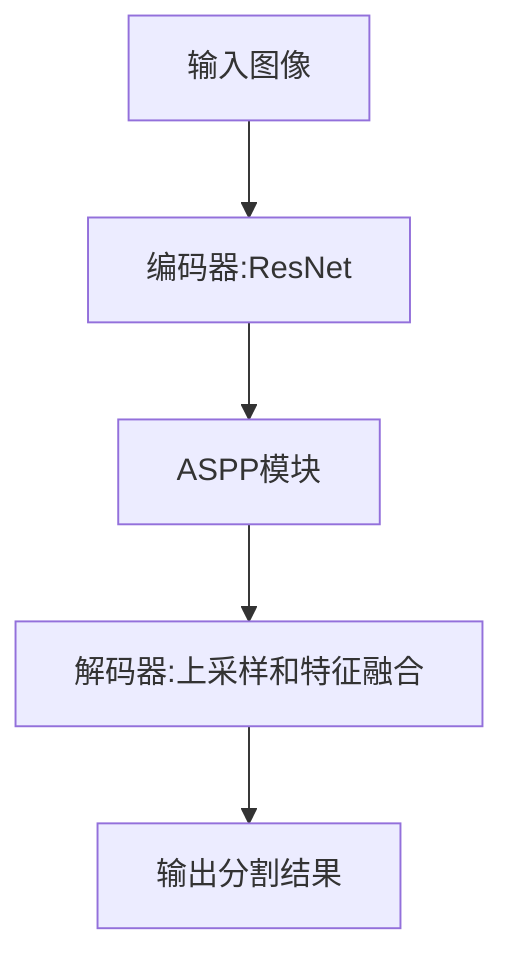

# DeepLab系列原理与代码实例讲解

## 1. 背景介绍

### 1.1 语义分割的重要性

在计算机视觉领域,语义分割是一项关键任务,旨在为图像中的每个像素指定语义标签(如人、汽车、树木等)。准确的语义分割对于许多应用程序至关重要,例如无人驾驶汽车、增强现实、机器人导航等。

### 1.2 DeepLab系列发展历程

DeepLab是一个用于语义分割的深度学习模型系列,最初由谷歌研究人员在2014年提出。自那以后,DeepLab系列经历了多次迭代和改进,包括DeepLab-v1、DeepLab-v2、DeepLab-v3和DeepLab-v3+。每个新版本都致力于提高分割质量和计算效率。

## 2. 核心概念与联系

### 2.1 全卷积神经网络

DeepLab系列建立在全卷积神经网络(FCN)的基础之上。FCN通过将传统卷积网络中的全连接层替换为卷积层,使得网络能够接受任意尺寸的输入图像,并产生对应尺寸的分割结果。

### 2.2 空洞卷积

空洞卷积(Atrous Convolution)是DeepLab系列的核心创新之一。它通过在卷积核中引入空洞(也称为"孔")来扩大卷积的感受野,从而捕获更大范围的上下文信息,同时不增加参数量或计算量。

### 2.3 编码器-解码器架构

DeepLab-v3及更高版本采用了编码器-解码器架构。编码器部分(如ResNet)用于提取图像特征,解码器部分则逐步恢复空间分辨率,并融合不同尺度的特征,从而产生高质量的分割结果。

### 2.4 空间金字塔池化模块

空间金字塔池化模块(ASPP)是DeepLab-v2中引入的一种并行滤波器组合,旨在捕获多尺度的上下文信息。它通过应用不同采样率的空洞卷积,从而获取不同感受野的特征。

## 3. 核心算法原理具体操作步骤

### 3.1 DeepLab-v3+算法流程

DeepLab-v3+是DeepLab系列中最新的版本,其核心算法流程如下:



1. 输入图像首先通过编码器(如ResNet)进行特征提取。
2. 提取的特征图被送入ASPP模块,以捕获多尺度上下文信息。
3. ASPP模块的输出被送入解码器,在这里进行上采样和不同尺度特征的融合。
4. 最终输出是与输入图像相同尺寸的语义分割结果。

### 3.2 空洞卷积操作步骤

空洞卷积是DeepLab系列的核心创新之一,其操作步骤如下:

1. 定义卷积核尺寸和空洞率(dilation rate)。
2. 在卷积核中,根据空洞率在权重之间插入零值。
3. 对输入特征图进行卷积运算,但跳过插入的零值位置。
4. 输出特征图的分辨率与输入相同,但感受野被扩大。

通过调整空洞率,可以控制感受野的大小,从而捕获不同尺度的上下文信息。

### 3.3 ASPP模块操作步骤

ASPP模块通过并行应用多个空洞卷积,以捕获不同尺度的上下文信息。其操作步骤如下:

1. 对输入特征图应用多个并行的空洞卷积,每个卷积使用不同的空洞率。
2. 将这些空洞卷积的输出与图像池化特征图进行拼接。
3. 通过一个额外的卷积层融合这些不同尺度的特征。
4. 输出融合后的特征图,用于后续的解码和分割。

## 4. 数学模型和公式详细讲解举例说明

### 4.1 空洞卷积公式

空洞卷积可以用以下公式表示:

$$
y[i] = \sum_{k=1}^{K} x[i + r \cdot k] w[k]
$$

其中:
- $y[i]$ 是输出特征图的第 $i$ 个元素
- $x$ 是输入特征图
- $w$ 是卷积核权重
- $r$ 是空洞率(dilation rate)
- $K$ 是卷积核尺寸

当空洞率 $r=1$ 时,就是标准卷积。当 $r>1$ 时,卷积核中的权重被稀疏化,从而扩大了感受野。

### 4.2 ASPP模块公式

ASPP模块的输出可以表示为:

$$
F_{aspp} = \sum_{i=1}^{I} \alpha_i F_i
$$

其中:
- $F_{aspp}$ 是ASPP模块的输出特征图
- $F_i$ 是第 $i$ 个并行分支(如不同空洞率的空洞卷积)的输出特征图
- $\alpha_i$ 是对应的权重系数

通过学习这些权重系数 $\alpha_i$,ASPP模块可以自适应地融合不同尺度的上下文信息。

### 4.3 交叉熵损失函数

DeepLab系列通常使用交叉熵作为损失函数进行训练。对于像素 $i$,交叉熵损失可以表示为:

$$
L_i = -\sum_{c=1}^{C} y_{i,c} \log(p_{i,c})
$$

其中:
- $C$ 是类别数量
- $y_{i,c}$ 是像素 $i$ 的真实标签,如果属于类别 $c$ 则为 1,否则为 0
- $p_{i,c}$ 是模型预测的像素 $i$ 属于类别 $c$ 的概率

总体损失函数是所有像素损失的平均值。

## 5. 项目实践:代码实例和详细解释说明

以下是使用TensorFlow实现DeepLab-v3+模型的Python代码示例:

```python
import tensorflow as tf

# 定义模型
def DeepLabV3Plus(inputs):
    # 编码器部分
    encoder = tf.keras.applications.ResNet50(weights='imagenet', include_top=False, input_tensor=inputs)
    encoder_output = encoder.get_layer('conv4_block6_out').output

    # ASPP模块
    aspp_rates = [6, 12, 18]
    aspp_conv_list = []
    for rate in aspp_rates:
        conv = tf.keras.layers.SeparableConv2D(256, 3, padding='same', dilation_rate=rate)(encoder_output)
        aspp_conv_list.append(conv)
    aspp_conv_list.append(tf.keras.layers.GlobalAveragePooling2D()(encoder_output))
    aspp_output = tf.keras.layers.Concatenate()(aspp_conv_list)
    aspp_output = tf.keras.layers.Conv2D(256, 1, padding='same')(aspp_output)

    # 解码器部分
    decoder_output = tf.keras.layers.Conv2DTranspose(256, 3, strides=2, padding='same')(aspp_output)
    decoder_output = tf.keras.layers.BatchNormalization()(decoder_output)
    decoder_output = tf.keras.layers.ReLU()(decoder_output)

    # 输出层
    outputs = tf.keras.layers.Conv2D(21, 1, padding='same', activation='softmax')(decoder_output)

    return tf.keras.Model(inputs=inputs, outputs=outputs)

# 定义输入
inputs = tf.keras.Input(shape=(512, 512, 3))

# 构建模型
model = DeepLabV3Plus(inputs)

# 编译模型
model.compile(optimizer='adam', loss='categorical_crossentropy', metrics=['accuracy'])

# 训练模型
model.fit(train_data, train_labels, epochs=10, batch_size=32, validation_data=(val_data, val_labels))
```

以上代码实现了DeepLab-v3+模型的核心部分,包括编码器(ResNet50)、ASPP模块和解码器。代码中的注释详细解释了每个部分的功能。

需要注意的是,在实际应用中,您可能需要进行数据预处理、数据增强、超参数调整等操作,以获得更好的性能。此外,您还需要准备好训练数据和标签。

## 6. 实际应用场景

DeepLab系列模型在以下领域有广泛的应用:

### 6.1 自动驾驶和机器人导航

准确的语义分割对于自动驾驶汽车和机器人导航至关重要。DeepLab模型可以帮助识别道路、行人、障碍物等关键对象,从而实现安全导航。

### 6.2 增强现实和虚拟现实

在增强现实和虚拟现实应用中,语义分割可以帮助区分不同的物体和场景,从而实现更加逼真的虚拟环境重构和物体插入。

### 6.3 医疗影像分析

DeepLab模型可以应用于医疗影像分析,如肿瘤分割、器官分割等,为医生提供更准确的诊断信息。

### 6.4 遥感图像处理

在遥感领域,DeepLab模型可以用于土地利用分类、建筑物检测、林火监测等任务。

## 7. 工具和资源推荐

以下是一些有用的工具和资源,可以帮助您进一步学习和使用DeepLab系列模型:

### 7.1 TensorFlow模型园

TensorFlow官方提供了DeepLab模型的预训练权重和示例代码,可以在这里找到:https://github.com/tensorflow/models/tree/master/research/deeplab

### 7.2 DeepLab-v3+论文

DeepLab-v3+的原始论文提供了详细的理论解释和实验结果,可以在这里找到:https://arxiv.org/abs/1802.02611

### 7.3 语义分割数据集

以下是一些常用的语义分割数据集:

- PASCAL VOC: http://host.robots.ox.ac.uk/pascal/VOC/
- Cityscapes: https://www.cityscapes-dataset.com/
- ADE20K: http://groups.csail.mit.edu/vision/datasets/ADE20K/

### 7.4 开源实现

除了TensorFlow官方实现外,还有一些开源的DeepLab实现,如:

- PyTorch实现: https://github.com/kazuto1011/deeplab-pytorch
- Keras实现: https://github.com/divamgupta/image-segmentation-keras

## 8. 总结:未来发展趋势与挑战

语义分割是计算机视觉领域的一个关键任务,DeepLab系列模型在该领域做出了重大贡献。然而,仍然存在一些挑战和未来发展趋势:

### 8.1 实时性和效率

虽然DeepLab模型在精度方面表现出色,但其计算复杂度也相对较高。未来需要继续优化模型结构和算法,以提高实时性和计算效率,从而满足实时应用的需求。

### 8.2 弱监督和无监督学习

大多数语义分割模型都依赖于大量的标注数据进行监督训练。未来需要探索弱监督和无监督学习方法,以减少对大量标注数据的依赖。

### 8.3 多任务学习和迁移学习

将语义分割与其他任务(如目标检测、实例分割等)结合起来进行多任务学习,可以提高模型的泛化能力和效率。此外,探索迁移学习方法也可以帮助模型在新领域快速适应。

### 8.4 三维语义分割

虽然DeepLab系列主要关注二维图像的语义分割,但三维语义分割(如视频分割、3D点云分割等)也是一个重要的研究方向。

### 8.5 可解释性和鲁棒性

提高模型的可解释性和鲁棒性也是未来的重要挑战,以确保模型的决策过程可解释,并且对噪声和对抗性攻击具有较强的鲁棒性。

## 9. 附录:常见问题与解答

### 9.1 什么是语义分割?

语义分割是一项计算机视觉任务,旨在为图像中的每个像素分配语义标签(如人、汽车、树木等)。它与目标检测和实例分割等任务不同,但都属于图像分析的范畴。

### 9.2 DeepLab系列的主要创新点是什么?

DeepLab系列的主要创新点包括:

1. 全卷积网络架构,可以处理任意尺寸的输入图像。
2. 空