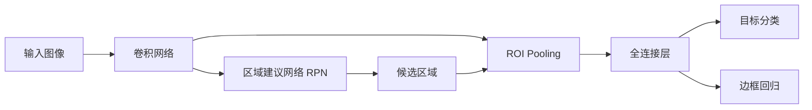

# Faster R-CNN原理与代码实例讲解

## 1.背景介绍

### 1.1 目标检测概述
目标检测是计算机视觉领域的一个重要任务,旨在从图像或视频中检测出感兴趣的目标,并给出其类别和位置信息。它在智能监控、无人驾驶、人机交互等领域有广泛应用。

### 1.2 两阶段目标检测器
目标检测方法主要分为两大类:两阶段检测器和单阶段检测器。两阶段检测器如R-CNN系列,先通过区域建议网络产生候选区域,再对候选区域进行分类和回归。代表工作有R-CNN、Fast R-CNN和Faster R-CNN等。

### 1.3 Faster R-CNN的优势
Faster R-CNN是两阶段检测器的集大成者,引入区域建议网络(RPN)实现nearly cost-free的区域建议,并采用共享卷积特征提高检测速度,在准确率和速度上取得了很好的平衡,是学习目标检测的必修课。

## 2.核心概念与联系

### 2.1 区域建议网络(RPN)
- 在原图上滑动一个小网络,判断每个位置是否包含目标
- 同时对目标的位置进行修正,得到更准确的候选区域
- RPN和检测网络共享卷积特征,使得计算区域建议的成本很低

### 2.2 锚框(Anchor)
- 在每个滑动窗口位置设置不同尺度和长宽比的参考框
- 通过预测参考框的偏移量来获得候选区域
- 使用参考框可以很好地覆盖不同形状的目标

### 2.3 ROI Pooling
- 将不同大小的候选区域统一池化为固定大小的特征图
- 实现了尺度和长宽比的归一化,便于后续分类和回归
- ROI Pooling是将候选区域和卷积特征图解耦的关键

### 2.4 联系
下图展示了Faster R-CNN的整体架构和各部分的联系:



## 3.核心算法原理具体操作步骤

### 3.1 特征提取
1. 使用预训练的卷积神经网络如ResNet提取图像特征
2. 得到一组高维度的卷积特征图

### 3.2 区域建议
1. 在卷积特征图上滑动一个3x3的卷积核,每个位置生成k个锚框
2. 对每个锚框进行二分类,判断是否包含目标
3. 对每个锚框进行四维回归,修正其位置坐标
4. 根据分类概率和回归偏移量,过滤出高质量的候选区域

### 3.3 ROI Pooling
1. 根据候选区域的坐标映射到卷积特征图上对应的区域
2. 将区域划分为固定数量的子区域,如7x7
3. 对每个子区域进行最大池化操作
4. 得到固定大小的ROI特征图,如7x7x512

### 3.4 目标分类和回归
1. 将ROI特征图展平并输入全连接层
2. 进行多分类,判断候选区域属于哪一类目标
3. 进行四维回归,进一步修正候选区域的位置坐标
4. 根据分类概率和回归结果,输出最终的检测结果

## 4.数学模型和公式详细讲解举例说明

### 4.1 锚框的参数化
假设锚框$A$的中心坐标为$(x_a,y_a)$,宽度和高度为$w_a,h_a$。候选区域$G$的对应参数为$(x,y,w,h)$。那么锚框到候选区域的转换可以表示为:

$$
\begin{aligned}
t_x &= (x - x_a) / w_a \
t_y &= (y - y_a) / h_a \
t_w &= \log(w / w_a) \
t_h &= \log(h / h_a)
\end{aligned}
$$

其中$(t_x,t_y,t_w,t_h)$就是RPN需要学习的四维回归目标。

### 4.2 RPN的损失函数
RPN网络的损失函数由两部分组成:二分类损失和边框回归损失。

对于二分类,使用交叉熵损失:

$$
L_{cls}(p_i,p_i^*) = -p_i^* \log p_i - (1-p_i^*)\log(1-p_i)
$$

其中$p_i$是第$i$个锚框预测为正样本的概率,$p_i^*$是真实标签(1为正样本,0为负样本)。

对于边框回归,使用Smooth L1损失:

$$
L_{reg}(t_i,t_i^*) = \sum_{i \in {x,y,w,h}} \text{Smooth}_{L1}(t_i - t_i^*)
$$

$$
\text{Smooth}_{L1}(x) =
\begin{cases}
0.5x^2, & \text{if } |x| < 1 \
|x| - 0.5, & \text{otherwise}
\end{cases}
$$

其中$t_i$是预测的边框偏移量,$t_i^*$是真实的边框偏移量。

RPN的总损失为:

$$
L_{RPN} = \frac{1}{N_{cls}}\sum_i L_{cls}(p_i,p_i^*) + \lambda \frac{1}{N_{reg}} \sum_i p_i^* L_{reg}(t_i,t_i^*)
$$

其中$N_{cls}$和$N_{reg}$分别是二分类和边框回归的归一化因子,$\lambda$用于平衡两种损失。

### 4.3 ROI Pooling的计算过程
假设候选区域在卷积特征图上的坐标为$(r_x,r_y,r_w,r_h)$,ROI Pooling的输出尺寸为$W \times H$。

那么每个子区域的大小为:

$$
\text{bin}_w = r_w / W, \quad \text{bin}_h = r_h / H
$$

对于第$(i,j)$个子区域,其对应特征图上的坐标范围为:

$$
\begin{aligned}
x_{start} &= \lfloor i \cdot \text{bin}_w \rfloor + r_x \
x_{end} &= \lceil (i+1) \cdot \text{bin}_w \rceil + r_x \
y_{start} &= \lfloor j \cdot \text{bin}_h \rfloor + r_y \
y_{end} &= \lceil (j+1) \cdot \text{bin}_h \rceil + r_y
\end{aligned}
$$

对该子区域内的所有特征值取最大值,得到输出特征图上第$(i,j)$个位置的值:

$$
\text{out}(i,j) = \max_{x_i \leq x < x_{i+1}, y_j \leq y < y_{j+1}} \text{in}(x,y)
$$

其中$\text{in}$表示输入特征图。

通过ROI Pooling,可以将不同大小的候选区域转化为固定大小的特征表示,便于后续的分类和回归。

## 5.项目实践：代码实例和详细解释说明

下面是使用PyTorch实现Faster R-CNN的核心代码:

```python
import torch
import torch.nn as nn
import torchvision.models as models
from torchvision.ops import RoIPool

class FasterRCNN(nn.Module):
    def __init__(self, num_classes):
        super(FasterRCNN, self).__init__()
        # 加载预训练的ResNet50作为特征提取器
        self.extractor = models.resnet50(pretrained=True)
        self.extractor = nn.Sequential(*list(self.extractor.children())[:-2])

        # 区域建议网络
        self.rpn = RPN()

        # ROI Pooling层
        self.roi_pool = RoIPool(7, 7, 1.0/16)

        # 分类和回归头
        self.cls_head = nn.Sequential(
            nn.Linear(2048*7*7, 4096),
            nn.ReLU(True),
            nn.Linear(4096, 4096),
            nn.ReLU(True),
            nn.Linear(4096, num_classes)
        )
        self.reg_head = nn.Sequential(
            nn.Linear(2048*7*7, 4096),
            nn.ReLU(True),
            nn.Linear(4096, 4096),
            nn.ReLU(True),
            nn.Linear(4096, 4*num_classes)
        )

    def forward(self, x):
        # 提取卷积特征
        feature_map = self.extractor(x)

        # 区域建议
        rois = self.rpn(feature_map)

        # ROI Pooling
        roi_feats = self.roi_pool(feature_map, rois)

        # 展平
        roi_feats = roi_feats.view(roi_feats.size(0), -1)

        # 分类和回归
        cls_scores = self.cls_head(roi_feats)
        bbox_preds = self.reg_head(roi_feats)

        return cls_scores, bbox_preds

class RPN(nn.Module):
    def __init__(self):
        super(RPN, self).__init__()
        # 3x3卷积核
        self.conv = nn.Conv2d(1024, 512, 3, 1, 1)
        # 二分类
        self.cls = nn.Conv2d(512, 18, 1, 1, 0)
        # 边框回归
        self.reg = nn.Conv2d(512, 36, 1, 1, 0)

    def forward(self, x):
        h = self.conv(x)
        cls_scores = self.cls(h)
        bbox_preds = self.reg(h)

        # 生成锚框并应用边框回归
        anchors = generate_anchors(cls_scores.shape[-2:])
        rois = apply_deltas(anchors, bbox_preds)

        return rois
```

代码说明:

1. `FasterRCNN`类定义了整个网络的架构,包括特征提取器、RPN、ROI Pooling以及分类和回归头。前向传播时依次执行这些模块。

2. 特征提取器使用预训练的ResNet50,去掉了最后两层(池化层和全连接层)。

3. `RPN`类实现了区域建议网络,通过3x3卷积和1x1卷积分别进行二分类和边框回归。`generate_anchors`函数生成锚框,`apply_deltas`函数应用边框回归偏移量得到候选区域。

4. `RoIPool`将候选区域映射到卷积特征图上并池化为7x7的特征图。

5. 分类头和回归头使用多层全连接网络,分别输出目标类别概率和边框坐标偏移量。

6. 在训练时,根据真实边框标签计算RPN和检测头的损失函数,并使用反向传播优化网络参数。推理时,使用非极大值抑制过滤重叠的检测框,得到最终的检测结果。

以上就是Faster R-CNN的PyTorch实现代码及其说明。通过这个项目,我们可以深入理解Faster R-CNN的原理,并掌握使用深度学习框架实现目标检测模型的方法。

## 6.实际应用场景

Faster R-CNN作为一种高效准确的通用目标检测算法,在很多领域得到了广泛应用,例如:

- 智能监控:通过检测人、车等目标,实现异常行为分析、人流量统计等功能
- 无人驾驶:检测道路上的车辆、行人、交通标志等,为自动驾驶提供环境感知能力
- 医学影像分析:定位病灶区域如肿瘤,辅助医生进行诊断
- 工业质检:检测工件的缺陷和异常,提高生产效率和质量
- 卫星遥感图像分析:检测建筑物、道路等地物,用于制图和城市规划
- 零售:货架商品的自动盘点和识别,优化库存管理
- 安防:人脸、车辆检测,协助犯罪分析和追踪

总之,只要需要从图像或视频中检测和定位感兴趣的目标,Faster R-CNN就能派上用场。它为解决现实世界的问题提供了有力的工具。

## 7.工具和资源推荐

- [PyTorch](https://pytorch.org/):基于Python的深度学习框架,提供了灵活的GPU加速模型构建和训练工具
- [TorchVision](https://pytorch.org/vision/):PyTorch官方的计算机视觉工具包,包含常用的数据集、模型和图像变换函数
- [MMDetection](https://github.com/open-mmlab/mmdetection):基于PyTorch的目标检测工具