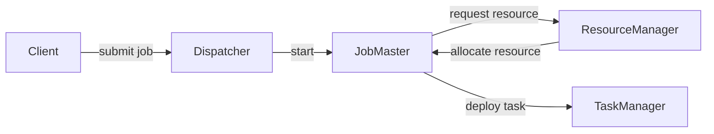

# Flink Dispatcher原理与代码实例讲解

## 1. 背景介绍
### 1.1 Flink简介
Apache Flink是一个开源的分布式流处理和批处理框架，它提供了高吞吐、低延迟、高可靠的数据处理能力。Flink支持有状态的计算，并提供了丰富的时间语义(event time、processing time)，是流批一体的大数据处理引擎。

### 1.2 Flink架构概览
Flink采用主从(master-slave)架构，由JobManager和TaskManager组成：
- JobManager负责接收客户端提交的Job，调度Job的执行，协调Checkpoint等。
- TaskManager负责具体的任务执行和状态管理。
- Client负责将编译好的Flink Job提交给JobManager。

### 1.3 Dispatcher在Flink架构中的作用
在Flink的架构中，Dispatcher是JobManager的一个组件，它主要负责：
- 提供REST接口，接收客户端提交的Job
- 启动新的JobMaster，并将Job提交给JobMaster
- 提供Web UI，用于监控和管理Job

## 2. 核心概念与联系
### 2.1 Dispatcher
Dispatcher是JobManager的一个组件，负责提供REST接口接收Job提交，并启动JobMaster。一个Flink集群只有一个Dispatcher实例。

### 2.2 JobMaster
JobMaster负责管理单个Job的执行，包括调度Task、协调Checkpoint、处理故障等。每个Job都有一个对应的JobMaster。

### 2.3 ResourceManager
ResourceManager负责管理Flink集群的资源，包括TaskManager的Slot。JobMaster向ResourceManager申请资源用于执行Job。

### 2.4 Dispatcher、JobMaster、ResourceManager之间的关系
下图展示了Dispatcher、JobMaster、ResourceManager三者之间的关系和交互：



## 3. 核心算法原理具体操作步骤
Dispatcher的核心功能是接收Job提交请求并启动JobMaster，具体步骤如下：

### 3.1 启动Dispatcher
- Dispatcher启动时会启动内部的WebServer，提供REST接口。
- Dispatcher会向ResourceManager注册自己。

### 3.2 接收Job提交请求
- 客户端通过REST接口向Dispatcher提交Job。
- Job以JAR包的形式提交，Dispatcher会将JAR包存储到BlobServer中。

### 3.3 启动JobMaster
- Dispatcher会为提交的Job启动一个新的JobMaster。
- JobMaster启动后，会向ResourceManager申请资源，用于后续的任务调度。
- Dispatcher将Job相关信息(如JAR包地址)提交给JobMaster。

### 3.4 提供Web UI
- Dispatcher会收集所有JobMaster的状态信息。
- 将状态信息展示在Web UI中，用于监控和管理Job。

## 4. 数学模型和公式详细讲解举例说明
Dispatcher本身的实现不涉及复杂的数学模型，但在Flink的任务调度中，会用到一些调度算法，如贪心算法、最小流量最大切割等。

以贪心算法为例，当JobMaster向ResourceManager申请资源时，ResourceManager会根据当前可用资源情况，尝试满足JobMaster的资源需求。这可以看做是一个贪心策略，总是优先满足当前的资源请求。

设$J_1, J_2, ..., J_n$表示当前待调度的$n$个Job，$R$表示集群的总资源量。$f(J_i)$表示为$J_i$分配资源的效用函数。则贪心算法可以表示为：

$$\max \sum_{i=1}^n f(J_i), \text{s.t.} \sum_{i=1}^n J_i \leq R$$

即在总资源约束下，每次都选择效用最大的Job进行资源分配，直到所有资源分配完毕。

## 5. 项目实践：代码实例和详细解释说明
下面通过一个简单的代码实例，展示如何通过Dispatcher提交Flink Job。

### 5.1 启动Flink集群
首先需要启动一个Flink集群，可以使用standalone模式：

```bash
./bin/start-cluster.sh
```

### 5.2 编写Flink Job
编写一个简单的WordCount Job：

```java
public class WordCount {
    public static void main(String[] args) throws Exception {
        StreamExecutionEnvironment env = StreamExecutionEnvironment.getExecutionEnvironment();
        
        DataStream<String> text = env.fromElements("Hello World", "Hello Flink");
        
        DataStream<Tuple2<String, Integer>> counts = text
            .flatMap(new Tokenizer())
            .keyBy(value -> value.f0)
            .sum(1);
        
        counts.print();
        
        env.execute("WordCount Example");
    }
    
    public static class Tokenizer implements FlatMapFunction<String, Tuple2<String, Integer>> {
        @Override
        public void flatMap(String value, Collector<Tuple2<String, Integer>> out) {
            String[] tokens = value.toLowerCase().split("\W+");
            for (String token : tokens) {
                if (token.length() > 0) {
                    out.collect(new Tuple2<>(token, 1));
                }
            }
        }
    }
}
```

### 5.3 打包Job
使用Maven将Job打包成JAR包：

```bash
mvn clean package
```

### 5.4 通过REST接口提交Job
通过POST请求将JAR包提交给Dispatcher：

```bash
curl -X POST -H "Expect:" -F "jarfile=@target/word-count-1.0.jar" http://localhost:8081/jars/upload
```

返回结果：

```json
{
  "filename": "word-count-1.0.jar",
  "status": "success"
}
```

然后通过POST请求提交Job：

```bash
curl -X POST -H "Content-Type: application/json" -d '{"entryClass":"WordCount"}' http://localhost:8081/jars/word-count-1.0.jar/run
```

返回结果：

```json
{
  "jobid": "7a9c1d9061e6a926a33e58d0e8b8f530"
}
```

这里返回的是新启动的JobMaster的ID。可以通过这个ID查询Job的执行状态。

### 5.5 查询Job执行结果
在Flink Web UI中可以查看Job的执行情况。也可以通过REST接口查询Job状态：

```bash
curl http://localhost:8081/jobs/7a9c1d9061e6a926a33e58d0e8b8f530
```

返回结果：

```json
{
  "jid": "7a9c1d9061e6a926a33e58d0e8b8f530",
  "name": "WordCount Example",
  "state": "FINISHED",
  "start-time": 1564386157346,
  "end-time": 1564386157463,
  "duration": 117,
  "last-modification": 1564386157463,
  "tasks": {
    "total": 2,
    "pending": 0,
    "running": 0,
    "finished": 2,
    "canceling": 0,
    "canceled": 0,
    "failed": 0
  }
}
```

可以看到Job最终以FINISHED状态结束。

## 6. 实际应用场景
Dispatcher在Flink中主要用于以下场景：

### 6.1 作为常驻服务接收Job提交
Dispatcher可以作为一个常驻的服务，随时接收客户端提交的Job。相比于每次提交Job都要启动一个新的JobManager进程，Dispatcher模式可以大大降低Job的启动开销。

### 6.2 集群级别的Job管理
通过Dispatcher提交的Job，可以在Web UI中进行集中管理和监控。这对于管理大规模的Flink集群和Job非常有帮助。

### 6.3 实现Job高可用
Dispatcher本身可以进行高可用配置，从而避免单点故障。当Dispatcher失效时，可以快速恢复，并重新接管已有的Job。

## 7. 工具和资源推荐
- Flink官网：https://flink.apache.org/
- Flink Github地址：https://github.com/apache/flink  
- Flink文档：https://ci.apache.org/projects/flink/flink-docs-release-1.12/
- Flink社区：https://flink.apache.org/community.html
- Ververica：https://www.ververica.com/ (Flink的商业化公司，提供Flink的商业支持和培训)

## 8. 总结：未来发展趋势与挑战
Dispatcher作为Flink架构中的重要组件，未来的发展趋势主要体现在以下几个方面：

### 8.1 提供更丰富的REST API
目前Dispatcher提供的REST API还比较简单，主要是提交Job、取消Job等。未来可以扩展更多的API，如更新Job配置、调整Job并行度等，让用户可以更灵活地管理Job。

### 8.2 支持多种资源调度器
目前Dispatcher主要和Flink自带的ResourceManager进行交互。未来可以扩展支持更多的资源调度器，如Kubernetes、Yarn等，让Flink可以更好地和现有的资源管理系统集成。  

### 8.3 提供更强大的Web UI
目前Dispatcher提供的Web UI还比较简陋，主要用于查看Job状态。未来可以扩展更多的功能，如Job配置管理、异常报警等，提供一站式的Job管理平台。

### 8.4 挑战
- 高可用性：如何保证Dispatcher自身的高可用性，避免单点故障。
- 可扩展性：如何让Dispatcher支持更大规模的Job提交和管理，提高并发处理能力。  
- 安全性：如何加强Dispatcher的安全性，如认证、授权等，防止非法的Job提交。

## 9. 附录：常见问题与解答
### Q1: Dispatcher和JobManager有什么区别？
A1: JobManager是Flink集群的master节点，负责整个集群的管理。Dispatcher是JobManager的一个组件，主要负责接收客户端提交的Job，并启动JobMaster执行Job。一个集群只有一个JobManager，但可以有多个Dispatcher。

### Q2: 如何配置Dispatcher的高可用？
A2: Dispatcher的高可用可以通过ZooKeeper来实现。具体步骤如下：
1. 在flink-conf.yaml中配置high-availability模式：
```yaml
high-availability: zookeeper
```
2. 配置ZooKeeper的地址：
```yaml
high-availability.zookeeper.quorum: localhost:2181
```
3. 配置Dispatcher在ZooKeeper中的存储路径：
```yaml
high-availability.dispatcher.storageDir: hdfs:///flink/dispatcher
```

这样，当一个Dispatcher失效时，另一个Dispatcher可以接管它的工作，从而实现高可用。

### Q3: Dispatcher的REST API可以用于生产环境吗？
A3: Dispatcher的REST API主要用于Job的提交和管理，在生产环境中使用时需要注意以下几点：
1. 安全性：生产环境中，需要对REST API进行安全认证和授权，防止非法请求。
2. 幂等性：对于同一个Job的重复提交，Dispatcher需要保证幂等性，即只执行一次。
3. 可监控性：需要对Dispatcher的请求进行监控和度量，及时发现和报警异常情况。

总的来说，只要做好安全、幂等、监控等方面的工作，Dispatcher的REST API是可以用于生产环境的。

作者：禅与计算机程序设计艺术 / Zen and the Art of Computer Programming