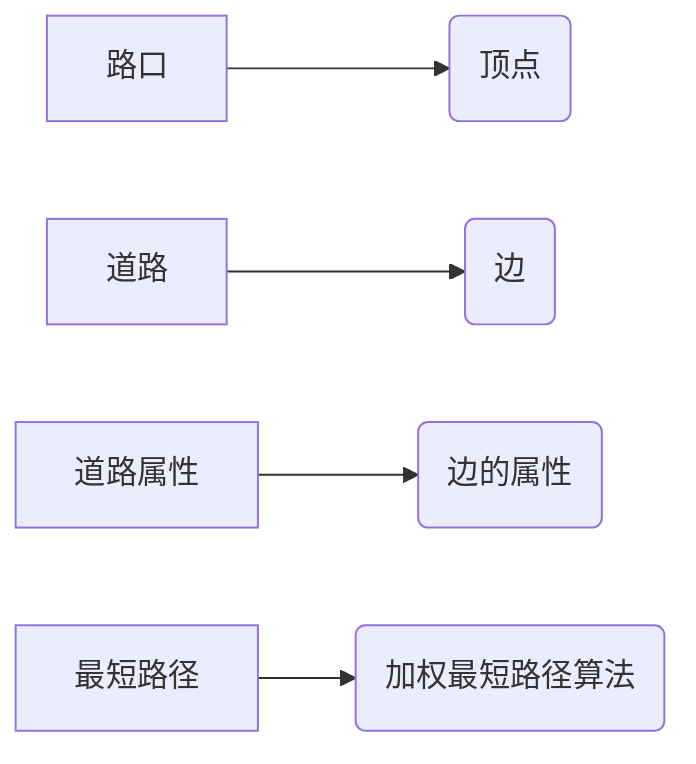

# GraphX在智能交通调度中的应用探索

## 1.背景介绍
### 1.1 智能交通调度的重要性
在现代城市中,交通拥堵已成为影响居民出行和生活质量的重要问题。智能交通调度系统通过实时收集和分析交通数据,优化交通信号控制和车辆路径规划,可以有效缓解交通拥堵,提高道路通行效率。因此,研究智能交通调度具有重要的现实意义。

### 1.2 图计算在智能交通中的应用
交通网络本质上是一个复杂的图结构,节点表示路口,边表示道路。利用图计算技术可以高效地分析交通网络的拓扑结构和动态特征。GraphX作为一个分布式图计算框架,提供了丰富的图算法和API,非常适合应用于智能交通调度领域。

### 1.3 本文的研究内容和贡献
本文将重点探讨GraphX在智能交通调度中的应用,包括:
- 如何使用GraphX构建城市交通网络模型
- 在GraphX中实现交通流量预测、路径规划等核心算法
- GraphX在实际交通调度项目中的应用实践
- 总结GraphX在智能交通领域的优势和面临的挑战

通过系统性的研究,本文旨在为GraphX在智能交通调度中的应用提供理论指导和实践参考。

## 2.核心概念与联系
### 2.1 GraphX的基本概念
- 属性图(Property Graph):包含节点、边以及它们的属性信息。
- 顶点RDD(VertexRDD):分布式存储图的节点。
- 边RDD(EdgeRDD):分布式存储图的边。
- 图算法(Graph Algorithms):GraphX提供的一系列图算法,如PageRank、连通分量等。

### 2.2 交通网络建模
交通网络可以抽象为一个加权有向图:
- 节点:表示路口,属性包括位置、信号配时等。
- 边:表示道路,属性包括长度、车道数、限速、通行时间等。
- 权重:表示道路的通行成本,如路径长度、通行时间等。

### 2.3 GraphX与交通网络的映射关系
GraphX中的概念与交通网络模型可以很好地对应:
- 路口 <---> 顶点
- 道路 <---> 边
- 道路属性 <---> 边的属性
- 最短路径 <---> 加权最短路径算法

下图展示了GraphX与交通网络的映射关系:



## 3.核心算法原理与具体操作步骤
### 3.1 交通网络构建
#### 3.1.1 数据准备
收集城市道路网络的地理信息数据,包括路口坐标、道路长度、车道数等。

#### 3.1.2 数据清洗和预处理
对原始数据进行清洗,剔除错误和冗余数据,统一数据格式。

#### 3.1.3 构建GraphX图
使用GraphX的API将预处理后的数据加载为属性图:
```scala
val vertices = roadNodes.map(n => (n.id, n))
val edges = roadLinks.map(e => Edge(e.srcId, e.dstId, e.length))
val graph = Graph(vertices, edges)
```

### 3.2 交通流量预测
#### 3.2.1 数据准备
收集历史交通流量数据,包括车辆GPS轨迹、路口流量等。

#### 3.2.2 特征工程
从原始数据中提取关键特征,如道路车流量、平均速度、拥堵指数等。

#### 3.2.3 模型训练
使用机器学习算法(如LSTM、GCN等)在GraphX图上训练流量预测模型:
```scala
val model = new TrafficFlowModel()
val trainedModel = model.train(graph, features, labels)
```

#### 3.2.4 模型预测
使用训练好的模型对未来一段时间的交通流量进行预测:
```scala
val predicts = trainedModel.predict(graph, futureFeatures)
```

### 3.3 路径规划
#### 3.3.1 最短路径算法
使用GraphX提供的Pregel API实现加权最短路径算法:
```scala
val sourceId = 1
val shortestPaths = graph.pregel(Double.PositiveInfinity)(
  (id, dist, newDist) => math.min(dist, newDist),
  triplet => {
    if (triplet.srcId == sourceId) {
      Iterator((triplet.dstId, triplet.attr))
    } else {
      Iterator.empty
    }
  },
  (a, b) => math.min(a, b)
)
```

#### 3.3.2 考虑实时路况的路径规划
将预测的交通流量信息更新到路网图中,使用最短路径算法计算实时最优路径:
```scala
val graph2 = graph.mapEdges(e => {
  val flow = predicts(e.srcId, e.dstId)
  val factor = math.exp(flow / capacity)
  e.attr * factor
})
val paths = graph2.shortestPaths(sourceId)
```

## 4.数学模型和公式详细讲解举例说明
### 4.1 交通流量预测模型
交通流量预测可以使用时空图神经网络(STGCN)模型。STGCN通过图卷积捕捉路网的空间特征,通过时间卷积捕捉交通流量的时间动态性。

假设 $G=(V, E, A)$ 表示路网图,其中 $V$ 是节点集合, $E$ 是边集合, $A$ 是邻接矩阵。 $X_t \in R^{N \times C}$ 表示 $t$ 时刻节点的特征矩阵。STGCN的前向传播公式为:

$$
X_{t}^{(l+1)}=\sigma\left(\tilde{D}^{-\frac{1}{2}} \tilde{A} \tilde{D}^{-\frac{1}{2}} X_{t}^{(l)} W_t^{(l)}\right)
$$

其中 $\tilde{A}=A+I$ 是加入自环的邻接矩阵, $\tilde{D}$ 是 $\tilde{A}$ 的度矩阵, $W_t^{(l)}$ 是第 $l$ 层的权重矩阵, $\sigma$ 是激活函数(如ReLU)。

在时间维度上,STGCN使用一维卷积捕捉流量的时间依赖性:

$$
X^{(l+1)}=\operatorname{Conv1D}\left(X^{(l)}, K_t\right)
$$

其中 $K_t$ 为时间卷积核。

最后,STGCN的输出为未来 $T$ 个时间步的流量预测值:

$$
\left[X_{t+1}, \cdots, X_{t+T}\right]=\operatorname{STGCN}\left(X_{t-T+1}, \cdots, X_t\right)
$$

### 4.2 路径规划模型
路径规划可以使用Dijkstra算法求解最短路径。假设 $d_i$ 表示源节点到节点 $i$ 的最短距离, $w_{ij}$ 表示边 $(i,j)$ 的权重,则Dijkstra算法的更新公式为:

$$
d_j=\min \left(d_j, d_i+w_{ij}\right)
$$

算法从源节点开始,不断更新其邻居节点的最短距离,直到所有节点都被访问为止。

在考虑实时路况时,可以将预测的通行时间作为边的权重,即:

$$
w_{ij}=\text{length}_{ij} \cdot e^{\text{flow}_{ij} / \text{capacity}_{ij}}
$$

其中 $\text{length}_{ij}$ 为道路长度, $\text{flow}_{ij}$ 为预测流量, $\text{capacity}_{ij}$ 为道路通行能力。

## 5.项目实践：代码实例和详细解释说明
下面以Scala代码为例,演示如何使用GraphX构建路网图并进行最短路径查询:

```scala
// 定义路网节点和边的样例类
case class RoadNode(id: Long, lat: Double, lng: Double)
case class RoadLink(srcId: Long, dstId: Long, length: Double, capacity: Double)

// 加载路网数据
val roadNodes = spark.read.csv("road_nodes.csv").as[RoadNode]
val roadLinks = spark.read.csv("road_links.csv").as[RoadLink]

// 构建GraphX图
val vertices = roadNodes.map(n => (n.id, n))
val edges = roadLinks.map(e => Edge(e.srcId, e.dstId, (e.length, e.capacity)))
val graph = Graph(vertices, edges)

// 调用Pregel API计算最短路径
val sourceId = 1
val shortestPaths = graph.pregel((Double.PositiveInfinity, List[Long]()))(
  (id, dist, newDist) => if (dist._1 < newDist._1) dist else newDist,
  triplet => {
    if (triplet.srcId == sourceId) {
      Iterator((triplet.dstId, (triplet.attr._1, triplet.srcAttr.id :: Nil)))
    } else if (triplet.srcAttr._1 + triplet.attr._1 < triplet.dstAttr._1) {
      Iterator((triplet.dstId, (triplet.srcAttr._1 + triplet.attr._1, triplet.srcAttr._2 :+ triplet.dstId)))
    } else {
      Iterator.empty
    }
  },
  (a, b) => if (a._1 < b._1) a else b
)

// 显示最短路径结果
shortestPaths.vertices.foreach(v => {
  val path = v._2._2.mkString(" -> ")
  println(s"Shortest path from $sourceId to ${v._1}: $path")
})
```

代码说明:
1. 定义`RoadNode`和`RoadLink`样例类表示路网的节点和边。
2. 使用Spark读取路网数据并转换为`RoadNode`和`RoadLink`的Dataset。
3. 使用`map`操作将节点和边数据转换为GraphX的顶点和边RDD。
4. 调用`Graph`的构造函数创建路网图。
5. 使用Pregel API实现最短路径算法,初始化源节点的距离为0,其他节点为正无穷。
6. 在`vprog`函数中,更新节点的最短距离和路径。
7. 在`sendMsg`函数中,将源节点到其邻居的距离和路径发送给邻居节点。
8. 在`mergeMsg`函数中,合并收到的消息,取距离最小的路径。
9. 迭代计算直到收敛,得到所有节点的最短路径。
10. 显示每个节点的最短路径结果。

通过以上步骤,我们就可以使用GraphX高效地进行路网最短路径查询。

## 6.实际应用场景
GraphX在智能交通调度中有广泛的应用场景,例如:
### 6.1 交通流量预测与仿真
利用GraphX构建城市路网模型,结合实时交通数据和机器学习算法,可以准确预测未来一段时间内的交通流量分布。这为交通管理部门制定信号配时方案和疏导策略提供了依据。同时,还可以在GraphX上进行交通仿真实验,评估不同调度方案的效果。

### 6.2 车辆路径规划与导航
GraphX可以用于为车辆规划实时最优路径。通过将预测的交通状况作为路径代价,可以综合考虑路径长度和通行时间,为车辆推荐拥堵最小的路线。GraphX的并行计算能力可以支持大规模车辆的路径查询请求。

### 6.3 异常事件检测与应急调度
利用GraphX对路网进行实时监控,通过异常检测算法可以及时发现交通事故、道路施工等异常事件。根据事件发生的位置和影响范围,GraphX可以快速重新计算周边区域的最优交通方案,指挥车辆绕行,缓解事故影响。

### 6.4 绿波带控制与公交优先
GraphX可以用于实现城市主干道的绿波带控制,通过合理设置连续路口的信号配时,使车辆以某一恒定速度通过时基本无需停车等待。此外,还可以利用GraphX优化公交线路和调度,通过公交专用道和优先信号等措施,提高公交系统的运行效率。

## 7.工具和资源推荐
### 7.1 GraphX官方文档
GraphX的官方文档提供了详细的API说明和使用指南,是学习GraphX的最佳资源。文档地址:http://spark.apache.org/docs/latest/graphx-programming-guide.html

### 7.2 GraphFrames
GraphFrames是在GraphX基础上构建的一个更高级的图计算库,提供了DataFrame风格的API和更