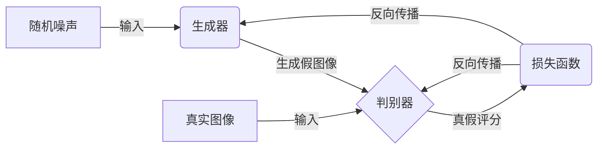
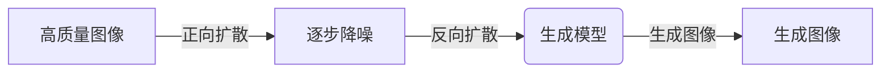
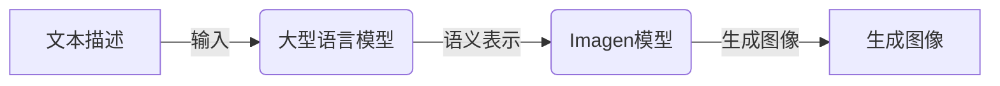
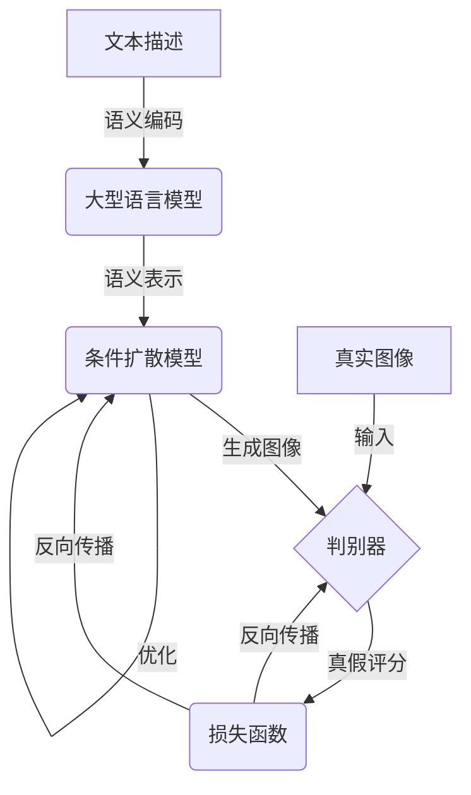

# Imagen原理与代码实例讲解

## 1.背景介绍

### 1.1 人工智能图像生成的兴起

近年来,随着深度学习技术的不断发展,人工智能图像生成(AI Image Generation)已成为计算机视觉和机器学习领域的一个热门研究方向。传统的图像生成方法主要依赖于显式建模和规则,效果有限且缺乏灵活性。而基于深度学习的图像生成模型可以直接从数据中学习,生成逼真、多样化的图像,大大拓展了图像生成的能力和应用前景。

### 1.2 Imagen的重要意义

Imagen是谷歌于2022年5月发布的一种新型大型人工智能文本到图像生成模型,堪称图像生成领域的里程碑式突破。它不仅能够根据简单的文本描述生成逼真的图像,而且可以生成前所未有的高分辨率(高达7.5亿像素)、高质量的图像,展现出强大的图像理解和生成能力。Imagen的出现将进一步推动人工智能图像生成技术在多个领域的应用,如视觉艺术创作、视觉化设计、虚拟现实等。

## 2.核心概念与联系

### 2.1 生成对抗网络(GAN)

Imagen的核心是基于生成对抗网络(Generative Adversarial Networks, GAN)。GAN由两个神经网络模型组成:生成器(Generator)和判别器(Discriminator)。生成器从随机噪声中生成假的图像样本,而判别器则努力区分生成器生成的假图像和真实图像。通过生成器和判别器的对抗训练,生成器可以不断改进,最终生成逼真的图像。



### 2.2 扩散模型(Diffusion Model)

除了GAN,Imagen还借鉴了扩散模型(Diffusion Model)的思想。扩散模型通过将高质量的图像逐步"扩散"为纯噪声,然后再逆向学习从噪声中"生成"原始图像的过程。相比GAN,扩散模型更加稳定,能生成更高质量的图像。



### 2.3 大型语言模型(Large Language Model)

Imagen利用了大型语言模型(如BERT、GPT-3等)在自然语言理解方面的强大能力。通过预训练的语言模型,Imagen能够深入理解文本描述的语义,从而指导图像生成的过程。这使得Imagen可以根据复杂的文本描述生成高质量的图像。



## 3.核心算法原理具体操作步骤

Imagen的核心算法原理可以概括为以下几个主要步骤:

### 3.1 文本编码

1) 将输入的文本描述通过预训练的大型语言模型(如BERT)进行编码,获得文本的语义表示。

### 3.2 条件扩散

2) 利用条件扩散模型,将文本语义表示作为条件,从纯噪声图像开始逆向生成图像。

   a) 正向扩散过程:将高质量图像逐步添加噪声,直至变为纯噪声图像。

   b) 反向扩散过程:利用文本语义表示作为条件,从纯噪声图像开始逐步去噪,最终生成与文本描述相符的图像。

### 3.3 对抗训练

3) 将生成的图像输入判别器,与真实图像进行对抗训练,提高生成图像的质量和真实性。

   a) 判别器努力区分生成图像和真实图像。

   b) 生成器根据判别器的反馈,不断优化生成的图像,使其更加逼真。

### 3.4 迭代优化

4) 重复步骤2和步骤3,通过多次迭代优化,最终获得高质量、与文本描述高度匹配的图像输出。



## 4.数学模型和公式详细讲解举例说明

### 4.1 生成对抗网络(GAN)损失函数

在GAN中,生成器 $G$ 和判别器 $D$ 之间的对抗损失函数可以表示为:

$$\min_G \max_D V(D,G) = \mathbb{E}_{x\sim p_\text{data}(x)}[\log D(x)] + \mathbb{E}_{z\sim p_z(z)}[\log(1-D(G(z)))]$$

其中:
- $x$ 是真实数据的样本,来自于真实数据分布 $p_\text{data}(x)$
- $z$ 是随机噪声,来自于噪声分布 $p_z(z)$
- $G(z)$ 表示生成器从噪声 $z$ 生成的假样本
- $D(x)$ 表示判别器对真实样本 $x$ 的真实性评分
- $D(G(z))$ 表示判别器对生成样本 $G(z)$ 的真实性评分

生成器 $G$ 的目标是最小化这个损失函数,使得生成的假样本 $G(z)$ 足够逼真,以欺骗判别器 $D$。而判别器 $D$ 的目标是最大化这个损失函数,以更好地区分真实样本和生成样本。

### 4.2 扩散模型(Diffusion Model)

扩散模型由两个主要过程组成:正向扩散过程和反向扩散(生成)过程。

**正向扩散过程**:

将高质量的图像 $x_0$ 通过 $T$ 个噪声扩散步骤,逐步"扩散"为纯噪声图像 $x_T$:

$$q(x_1, \ldots, x_T | x_0) = \prod_{t=1}^T q(x_t | x_{t-1})$$

其中 $q(x_t | x_{t-1})$ 是从 $x_{t-1}$ 到 $x_t$ 的单步扩散过程,通常是高斯噪声。

**反向扩散(生成)过程**:

从纯噪声图像 $x_T$ 开始,通过 $T$ 个逆扩散步骤,逐步"生成"出原始的高质量图像 $x_0$:

$$p_\theta(x_0 | x_T) = p(x_T) \prod_{t=1}^T p_\theta(x_{t-1} | x_t, c)$$

其中:
- $p_\theta(x_{t-1} | x_t, c)$ 是从 $x_t$ 到 $x_{t-1}$ 的单步逆扩散过程,由生成模型 $\theta$ 参数化
- $c$ 是条件(如文本描述的语义表示),用于指导生成过程

生成模型 $\theta$ 的目标是最大化 $p_\theta(x_0 | x_T)$,即从纯噪声 $x_T$ 生成原始高质量图像 $x_0$ 的概率。

### 4.3 示例:根据"一只红色的苹果"生成图像

假设我们希望根据文本描述"一只红色的苹果"生成对应的图像,Imagen的工作流程如下:

1) 将文本"一只红色的苹果"通过预训练的BERT语言模型编码,获得其语义表示向量 $c$。

2) 从纯噪声图像 $x_T$ 开始,利用条件扩散模型 $p_\theta(x_{t-1} | x_t, c)$,逐步去噪生成图像序列 $\{x_{T-1}, x_{T-2}, \ldots, x_1\}$,其中 $c$ 作为条件,指导生成过程符合"一只红色的苹果"的语义。

3) 将生成的图像 $x_1$ 输入到判别器 $D$,与真实苹果图像进行对抗训练,根据判别器的反馈优化生成模型 $\theta$ 的参数。

4) 重复步骤2和步骤3,通过多次迭代优化,最终获得高质量、符合"一只红色的苹果"描述的图像输出 $x_0$。

通过上述过程,Imagen能够根据自然语言描述生成逼真、高质量的图像,展现出卓越的文本到图像生成能力。

## 5.项目实践:代码实例和详细解释说明

以下是一个使用Imagen进行文本到图像生成的Python代码示例,基于Imagen官方提供的开源代码库。

```python
import torch
from imagen import Imagen, ImagenConfig

# 初始化Imagen模型配置
config = ImagenConfig(
    text_encoder_name="google/bert-base-uncased",
    diffusion_steps=1000,
    image_size=512
)

# 加载预训练的Imagen模型
model = Imagen(config)

# 定义文本输入
text = "一只红色的苹果"

# 生成条件图像
generated_image = model.generate_image(text)

# 保存生成的图像
generated_image.save("red_apple.png")
```

以上代码的关键步骤解释如下:

1. 导入必要的库和Imagen模型。

2. 初始化`ImagenConfig`对象,设置文本编码器、扩散步骤数和输出图像大小等参数。

3. 使用配置实例化`Imagen`模型对象,加载预训练的模型权重。

4. 定义输入的文本描述`"一只红色的苹果"`。

5. 调用`model.generate_image(text)`方法,根据文本描述生成条件图像。

6. 使用`generated_image.save("red_apple.png")`将生成的图像保存为PNG文件。

在实际应用中,您可以根据需求调整Imagen模型的配置参数,如使用更大的文本编码器、增加扩散步骤数以提高图像质量等。此外,您还可以将Imagen集成到更复杂的应用程序中,用于视觉艺术创作、设计可视化等场景。

## 6.实际应用场景

Imagen强大的文本到图像生成能力,为其在多个领域的实际应用带来了巨大潜力:

### 6.1 视觉艺术创作

艺术家可以使用Imagen根据文本描述生成创意图像,激发灵感并辅助艺术创作。Imagen还可以生成高分辨率的艺术作品,为数字艺术开辟新的可能性。

### 6.2 设计可视化

设计师可以利用Imagen快速生成产品原型、UI设计等可视化内容,大大提高设计效率。Imagen还可以根据文本描述生成逼真的3D场景渲染图,为建筑设计、虚拟现实等领域带来新的解决方案。

### 6.3 多媒体内容创作

Imagen可以用于生成插图、海报、封面等多媒体内容,为出版物、广告、营销等领域提供高质量的视觉素材。

### 6.4 辅助视觉理解

通过分析Imagen生成的图像,研究人员可以更好地理解模型对文本描述的理解能力,从而优化模型设计和训练策略,推动人工智能视觉理解技术的发展。

### 6.5 教育和娱乐

Imagen可以用于生成教育资源、游戏资产等内容,为教育和娱乐领域带来新的体验和可能性。

## 7.工具和资源推荐

### 7.1 Imagen开源代码库

谷歌提供了Imagen的官方开源代码库,包括模型实现、训练脚本和示例代码等,可在GitHub上获取: https://github.com/google-research/imagen

### 7.2 Diffusers库

Hugging Face提供了Diffusers库,支持各种扩散模型(包括Imagen)的加载、微调和推理,并提供了丰富的示例和教程: https://github.com/huggingface/diffusers

### 7.3 Stable Diffusion

Stable