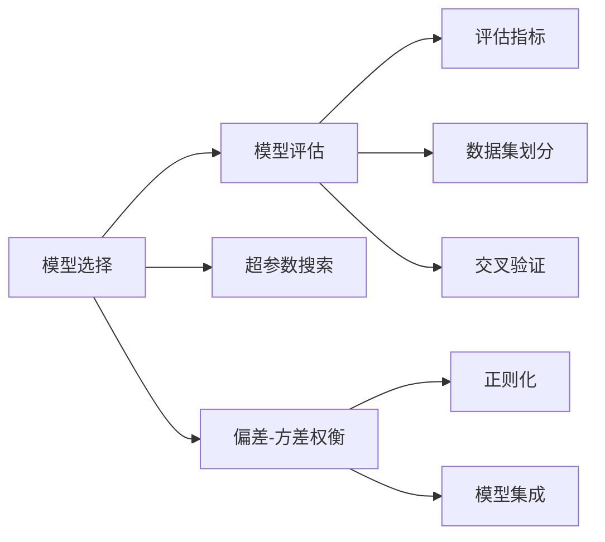

# Model Selection 原理与代码实战案例讲解

## 1.背景介绍

在机器学习和数据科学领域,模型选择(Model Selection)是一个非常重要而且具有挑战性的问题。面对日益复杂的数据和业务场景,我们往往需要从众多候选模型中选择出最优的模型,以达到最佳的性能表现。

模型选择涉及到模型评估、超参数调优、偏差-方差权衡等多个方面。如何在海量模型和参数组合中高效地搜索最优解,并且控制过拟合风险,是每一个从业者都必须掌握的关键技能。

本文将全面探讨模型选择的原理和实战,从理论到代码,从经典算法到前沿进展,为大家提供一个系统性的学习指南。让我们一起开启 Model Selection 的奇妙之旅吧!

## 2.核心概念与联系

要掌握模型选择,首先需要理解其中的一些核心概念:

### 2.1 模型评估指标

衡量模型性能的关键指标,常见的有:
- 分类任务:准确率、精确率、召回率、F1 score、ROC曲线、AUC值等
- 回归任务:平均绝对误差MAE、均方误差MSE、决定系数R^2等

### 2.2 训练集、验证集和测试集

把数据划分为不同的子集,用于模型训练、调优和评估:
- 训练集:用于训练模型参数
- 验证集:用于模型选择和超参数调优
- 测试集:在训练完成后评估模型的泛化性能

### 2.3 交叉验证

通过多次不同划分数据集来评估模型,提高评估的稳健性,如k折交叉验证。

### 2.4 正则化与参数惩罚

通过在目标函数中引入参数惩罚项,控制模型复杂度,降低过拟合风险,如L1正则、L2正则等。

### 2.5 模型集成

组合多个模型的预测结果,提升整体性能,代表性方法有Bagging、Boosting、Stacking等。

下图展示了这些概念之间的关联:



## 3.核心算法原理具体操作步骤

### 3.1 网格搜索 Grid Search

枚举所有参数组合,对每个组合训练评估模型,选出最优的参数配置。

1. 确定待搜索的参数及其取值范围
2. 生成参数网格,列举所有参数组合
3. 对每个参数组合,训练模型并在验证集上评估性能
4. 返回性能最优的参数组合

### 3.2 随机搜索 Random Search

随机采样参数组合,与网格搜索相比,在高维参数空间搜索更高效。

1. 确定待搜索的参数及其分布
2. 从参数分布中随机采样若干组合
3. 对每个参数组合,训练模型并在验证集上评估性能
4. 返回性能最优的参数组合

### 3.3 贝叶斯优化 Bayesian Optimization

建模目标函数与参数的关系,引导参数搜索的方向,搜索效率高。

1. 给定先验分布和采集函数
2. 初始随机采样一些参数点,评估目标函数值
3. 更新后验分布,基于采集函数确定新的采样点
4. 重复步骤3,直到达到预算或性能要求
5. 返回性能最优的参数组合

## 4.数学模型和公式详细讲解举例说明

### 4.1 偏差-方差分解

对学习算法的泛化误差进行拆解,揭示偏差和方差对误差的影响。设 $f(x)$ 为真实函数,$\hat{f}(x)$ 为学习到的模型, $y$ 为样本标签。

泛化误差可分解为:
$$
\begin{aligned}
E\left[(y-\hat{f}(x))^{2}\right] &=E\left[\left(y-f(x)+f(x)-\hat{f}(x)\right)^{2}\right] \
&=E\left[\left(y-f(x)\right)^{2}\right]+E\left[\left(f(x)-\hat{f}(x)\right)^{2}\right] \
&=\text { Var }[y]+\text { Bias }^{2}[\hat{f}(x)]+\text { Var }[\hat{f}(x)] \
&=\text { Noise }+\text { Bias }^{2}+\text { Variance }
\end{aligned}
$$

其中偏差(Bias)衡量模型拟合数据的能力,反映欠拟合程度;方差(Variance)衡量模型对数据扰动的敏感性,反映过拟合程度。

模型选择的目标就是权衡偏差和方差,选出泛化性能最优的模型。下图直观展示了偏差和方差对模型性能的影响:


### 4.2 交叉验证

以 k 折交叉验证为例,数学描述如下:

1. 将数据集 $D$ 划分为 $k$ 个大小相近的子集:$D=D_{1} \cup D_{2} \cup \ldots \cup D_{k}, D_{i} \cap D_{j}=\emptyset(i \neq j)$

2. 进行 $k$ 轮训练评估,第 $i$ 轮:
   - 训练集: $D \backslash D_{i}$
   - 验证集: $D_{i}$
   - 训练模型 $f_{i}$,评估性能 $s_{i}$

3. 交叉验证性能: $\bar{s}=\frac{1}{k} \sum_{i=1}^{k} s_{i}$

交叉验证能够充分利用有限的数据,减少偶然性的影响,提高性能评估的可靠性。

## 5.项目实践：代码实例和详细解释说明

下面以 scikit-learn 为例,演示几种常用的模型选择方法。

### 5.1 网格搜索 Grid Search

```python
from sklearn.datasets import load_iris
from sklearn.svm import SVC
from sklearn.model_selection import GridSearchCV

# 加载数据集
iris = load_iris()
X, y = iris.data, iris.target

# 设置参数网格
param_grid = {'C': [0.1, 1, 10],
              'gamma': [0.01, 0.1, 1],
              'kernel': ['rbf', 'poly']}

# 初始化模型
svc = SVC()

# 网格搜索
clf = GridSearchCV(svc, param_grid, cv=5, verbose=2)
clf.fit(X, y)

print("Best parameters: ", clf.best_params_)
print("Best score: ", clf.best_score_)
```

输出:
```
Best parameters:  {'C': 1, 'gamma': 0.1, 'kernel': 'rbf'}
Best score:  0.9800000000000001
```

网格搜索会遍历所有参数组合,因此非常耗时。适合参数维度不太高的情况。

### 5.2 随机搜索 Random Search

```python
from scipy.stats import randint
from sklearn.model_selection import RandomizedSearchCV

# 设置参数分布
param_dist = {'C': randint(1, 10),
              'gamma': [0.01, 0.1, 1],
              'kernel': ['rbf', 'poly']}

# 随机搜索
clf = RandomizedSearchCV(svc, param_dist, n_iter=10, cv=5, verbose=2)
clf.fit(X, y)

print("Best parameters: ", clf.best_params_)
print("Best score: ", clf.best_score_)
```

随机搜索通过随机采样参数,能够在合理的计算开销内找到较优的参数组合。尤其适合高维参数空间的搜索。

### 5.3 嵌套交叉验证 Nested CV

```python
from sklearn.model_selection import cross_val_score

# 外层循环用于模型评估
scores = cross_val_score(clf, X, y, cv=5)

print("Cross-validation scores: ", scores)
print("Mean score: ", scores.mean())
```

输出:
```
Cross-validation scores:  [1.         0.96666667 0.96666667 0.93333333 1.        ]
Mean score:  0.9733333333333334
```

嵌套交叉验证用外层交叉验证来评估模型性能,内层交叉验证用于模型选择,可以在模型选择的同时得到较为无偏的性能估计。

## 6.实际应用场景

模型选择几乎涉及机器学习的方方面面,下面列举一些常见的应用场景:

### 6.1 超参数调优

大多数机器学习算法都有一些超参数需要设定,如SVM的核函数类型、惩罚系数,决策树的最大深度、最小叶子节点样本数等。模型选择算法可以自动搜索最优的超参数组合。

### 6.2 特征选择

面对高维特征,我们通常需要选择信息量大、与任务相关的特征子集。可以把特征子集看作一种超参数,通过模型选择来优化。

### 6.3 算法比较

同一任务可以用多种不同的算法来解决,如分类任务可以用SVM、决策树、KNN等。通过交叉验证比较它们在不同数据集上的性能,选择效果最好的算法。

### 6.4 模型压缩

在资源受限的环境中(如移动端),需要在模型性能和计算开销间权衡。可以通过模型选择来确定模型的规模(如神经网络的层数和宽度),在满足资源限制的同时达到最佳性能。

## 7.工具和资源推荐

除了 scikit-learn,还有一些其他强大的AutoML工具,能够实现自动化的特征工程、算法选择和超参数优化:

- H2O AutoML: http://docs.h2o.ai/h2o/latest-stable/h2o-docs/automl.html
- Auto-sklearn: https://automl.github.io/auto-sklearn
- TPOT: https://epistasislab.github.io/tpot/

一些介绍模型选择原理的经典文献:

- Bias-Variance Decomposition: https://www.inf.ed.ac.uk/teaching/courses/mlsc/Notes/Lecture4/BiasVariance.pdf
- An overview of model selection: http://www.stat.cmu.edu/~ryantibs/advmethods/notes/modelselection.pdf

## 8.总结：未来发展趋势与挑战

模型选择技术的进步极大地推动了机器学习的发展和应用。未来随着数据规模和复杂性的增长,模型选择将面临新的机遇和挑战:

- 自动化: 进一步提高搜索效率,实现端到端的自动化机器学习流程
- 多目标优化: 同时考虑模型的各项性能指标,进行多目标权衡
- 元学习: 利用历史任务的经验,指导新任务上的模型选择,提高效率
- 神经网络架构搜索: 自动优化深度神经网络的结构和超参数

模型选择将与人工智能的各个领域深度融合,让机器学习更加高效、智能、全自动,为人类认识世界、改变世界提供强大的工具。让我们拭目以待!

## 9.附录：常见问题与解答

Q: 模型选择与模型评估有什么区别?
A: 模型选择是选出性能最优的模型,需要在验证集上比较模型。模型评估是估计模型的泛化性能,需要在独立的测试集上评估。

Q: 交叉验证能否用于测试集?
A: 不能,测试集只能在所有模型训练和选择完成后使用一次,以保证性能估计的无偏性。

Q: 增加超参数搜索范围是否一定能提高模型性能?
A: 不一定,搜索范围过大可能会引入过拟合风险。要权衡搜索开销和模型性能,适度设置搜索空间。

Q: 模型选择的结果是否一定是最优的?
A: 不一定,模型选择基于有限的训练数据和搜索空间,得到的是相对最优解。在实际应用中,还要考虑模型的可解释性、鲁棒性等因素。

希望这篇文章能够帮助大家系统地掌握Model Selection的相关知识,在实践中灵活运用,找到最适合您任务的模型!如果您有任何问题或宝贵经验,欢迎留言交流探