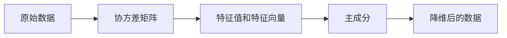

# Python机器学习实战：主成分分析(PCA)的原理和实战操作

## 1.背景介绍
### 1.1 什么是主成分分析(PCA)？
主成分分析（Principal Component Analysis，PCA）是一种常用的无监督学习算法，用于数据降维和特征提取。它通过线性变换将原始高维数据映射到低维空间，同时保留数据的主要特征和信息。PCA 的目标是找到数据中最主要的方向（主成分），沿着这些方向对数据进行投影，从而实现降维。

### 1.2 PCA的应用场景
PCA 在机器学习和数据分析领域有广泛的应用，主要包括：

- 数据压缩：通过降维，可以减少数据的存储和传输成本。
- 可视化：将高维数据降维到二维或三维空间，方便可视化和理解数据的结构。
- 特征提取：提取数据中最重要的特征，去除噪声和冗余信息，提高后续分析和建模的效果。
- 预处理：作为其他机器学习算法的预处理步骤，提高算法的性能和效率。

### 1.3 PCA的优缺点
PCA 的优点包括：

- 降低数据维度，减少计算复杂度。
- 去除数据中的噪声和冗余信息。
- 提取数据的主要特征，便于可视化和理解。

PCA 的缺点包括：

- 仅考虑线性关系，对非线性数据的降维效果可能不佳。
- 对数据的尺度敏感，需要对数据进行标准化处理。
- 计算主成分需要较大的内存和计算资源。

## 2.核心概念与联系
### 2.1 协方差矩阵
协方差矩阵是 PCA 的核心概念之一。对于一个 n 维数据集 $X=(x_1,x_2,...,x_n)^T$，其协方差矩阵 $\Sigma$ 定义为：

$$\Sigma=\frac{1}{m}\sum_{i=1}^m(x_i-\mu)(x_i-\mu)^T$$

其中，$m$ 是样本数量，$\mu$ 是数据的均值向量。协方差矩阵描述了数据各维度之间的相关性，对角线元素表示各维度的方差，非对角线元素表示不同维度之间的协方差。

### 2.2 特征值和特征向量
特征值和特征向量是线性代数中的重要概念，在 PCA 中起关键作用。对于一个方阵 $A$，如果存在标量 $\lambda$ 和非零向量 $v$ 满足：

$$Av=\lambda v$$

则称 $\lambda$ 为矩阵 $A$ 的特征值，$v$ 为对应的特征向量。在 PCA 中，我们对协方差矩阵 $\Sigma$ 进行特征值分解，得到的特征值表示主成分的重要性，特征向量表示主成分的方向。

### 2.3 主成分
主成分是数据在新坐标系下的表示，是原始数据的线性组合。第一主成分是数据变化最大的方向，第二主成分是与第一主成分正交且变化次大的方向，以此类推。主成分的数量小于等于原始数据的维度。通过选择前 k 个主成分，可以实现数据的降维。

### 2.4 核心概念之间的联系
下图展示了 PCA 中核心概念之间的联系：



## 3.核心算法原理具体操作步骤
PCA 的具体操作步骤如下：

### 3.1 数据标准化
对原始数据进行标准化处理，使每个特征的均值为0，方差为1。这一步可以消除不同特征之间的量纲差异，使 PCA 对数据尺度不敏感。

### 3.2 计算协方差矩阵
根据标准化后的数据，计算协方差矩阵 $\Sigma$。

### 3.3 特征值分解
对协方差矩阵 $\Sigma$ 进行特征值分解，得到特征值 $\lambda_1,\lambda_2,...,\lambda_n$ 和对应的特征向量 $v_1,v_2,...,v_n$。

### 3.4 选择主成分
根据特征值的大小，选择前 k 个最大的特征值对应的特征向量作为主成分。这 k 个特征向量构成了新的坐标系。

### 3.5 数据投影
将原始数据投影到新的坐标系上，得到降维后的数据表示。

## 4.数学模型和公式详细讲解举例说明
下面我们通过一个简单的二维数据集来详细说明 PCA 的数学模型和公式。

假设有一个二维数据集 $X=\{x_1,x_2,...,x_m\}$，其中 $x_i=(x_{i1},x_{i2})^T$。

### 4.1 数据标准化
对数据进行标准化处理，使每个特征的均值为0，方差为1。标准化后的数据 $\hat{X}=\{\hat{x}_1,\hat{x}_2,...,\hat{x}_m\}$，其中：

$$\hat{x}_{ij}=\frac{x_{ij}-\mu_j}{\sigma_j}$$

$\mu_j$ 和 $\sigma_j$ 分别是第 j 个特征的均值和标准差。

### 4.2 计算协方差矩阵
计算标准化后数据的协方差矩阵 $\Sigma$：

$$\Sigma=\frac{1}{m}\sum_{i=1}^m\hat{x}_i\hat{x}_i^T=\begin{bmatrix}
\sigma_{11} & \sigma_{12} \
\sigma_{21} & \sigma_{22}
\end{bmatrix}$$

其中，$\sigma_{jk}=\frac{1}{m}\sum_{i=1}^m\hat{x}_{ij}\hat{x}_{ik}$ 表示第 j 个特征和第 k 个特征的协方差。

### 4.3 特征值分解
对协方差矩阵 $\Sigma$ 进行特征值分解：

$$\Sigma v_i=\lambda_i v_i, i=1,2$$

得到特征值 $\lambda_1,\lambda_2$ 和对应的特征向量 $v_1,v_2$。

### 4.4 选择主成分
根据特征值的大小，选择前 k 个最大的特征值对应的特征向量作为主成分。在这个二维数据集中，我们选择 $\lambda_1$ 对应的特征向量 $v_1$ 作为主成分。

### 4.5 数据投影
将标准化后的数据 $\hat{X}$ 投影到主成分 $v_1$ 上，得到降维后的一维数据 $Y$：

$$Y=\hat{X}v_1$$

通过这个例子，我们详细说明了 PCA 的数学模型和公式，展示了如何通过特征值分解找到主成分，并将数据投影到主成分上实现降维。

## 5.项目实践：代码实例和详细解释说明
下面我们使用 Python 和 scikit-learn 库来实现 PCA，并通过一个具体的数据集说明 PCA 的使用方法。

### 5.1 数据集介绍
我们使用 scikit-learn 库中的 iris 数据集，这是一个经典的分类数据集，包含了三种鸢尾花（setosa、versicolor 和 virginica）的四个特征：花萼长度、花萼宽度、花瓣长度和花瓣宽度。我们将使用 PCA 对这个四维数据集进行降维。

### 5.2 代码实现
```python
from sklearn.datasets import load_iris
from sklearn.preprocessing import StandardScaler
from sklearn.decomposition import PCA
import matplotlib.pyplot as plt

# 加载数据集
iris = load_iris()
X = iris.data
y = iris.target

# 数据标准化
scaler = StandardScaler()
X_std = scaler.fit_transform(X)

# 创建 PCA 对象，指定降维后的维度为 2
pca = PCA(n_components=2)

# 对数据进行 PCA 降维
X_pca = pca.fit_transform(X_std)

# 可视化降维后的数据
plt.figure(figsize=(8, 6))
colors = ['navy', 'turquoise', 'darkorange']
for color, i, target_name in zip(colors, [0, 1, 2], iris.target_names):
    plt.scatter(X_pca[y == i, 0], X_pca[y == i, 1], color=color, alpha=.8, label=target_name)
plt.legend(loc='best', shadow=False, scatterpoints=1)
plt.title('PCA of IRIS dataset')
plt.xlabel('Principal Component 1')
plt.ylabel('Principal Component 2')
plt.show()
```

### 5.3 代码解释
1. 首先，我们从 scikit-learn 库中加载 iris 数据集，并将特征数据和标签分别存储在 X 和 y 中。
2. 使用 StandardScaler 对数据进行标准化处理，得到标准化后的数据 X_std。
3. 创建一个 PCA 对象，指定降维后的维度为 2。
4. 调用 PCA 对象的 fit_transform 方法，对标准化后的数据 X_std 进行 PCA 降维，得到降维后的数据 X_pca。
5. 使用 matplotlib 库对降维后的数据进行可视化，不同颜色表示不同的鸢尾花类别。

通过这个项目实践，我们展示了如何使用 Python 和 scikit-learn 库实现 PCA，并将四维的 iris 数据集降维到二维空间进行可视化。

## 6.实际应用场景
PCA 在实际应用中有广泛的用途，下面列举几个典型的应用场景：

### 6.1 人脸识别
在人脸识别任务中，原始的人脸图像数据通常维度很高（如 100x100 像素的图像就有 10000 维）。使用 PCA 可以将高维的人脸数据降维到一个低维空间，提取人脸的主要特征。这不仅可以减少存储和计算开销，还能提高人脸识别的效率和准确性。

### 6.2 基因表达数据分析
在基因表达数据分析中，一个样本可能包含成千上万个基因的表达量数据。使用 PCA 可以将高维的基因表达数据降维，识别出影响表型的关键基因，有助于理解基因与疾病的关系，发现潜在的生物标记物。

### 6.3 金融数据分析
在金融领域，股票价格、汇率、经济指标等数据通常具有高维特性。使用 PCA 可以将这些高维金融数据降维，提取主要的市场因子和风险因子，帮助投资者和金融机构进行投资决策和风险管理。

### 6.4 图像压缩
PCA 可以用于图像压缩，将高分辨率的图像数据降维到一个低维空间，同时保留图像的主要特征。这种方法可以显著减小图像的存储空间，同时保证一定的图像质量。

## 7.工具和资源推荐
下面推荐一些学习和应用 PCA 的工具和资源：

- scikit-learn：Python 机器学习库，提供了易用的 PCA 实现。
- MATLAB：广泛用于科学计算和工程设计的软件，提供了 PCA 函数。
- R 语言：统计计算和数据分析的编程语言，提供了多个 PCA 相关的包。
- 《Pattern Recognition and Machine Learning》：经典的机器学习教材，对 PCA 有深入的理论讲解。
- 《Python Machine Learning》：使用 Python 和 scikit-learn 进行机器学习的实践指南，包含 PCA 的示例代码。

## 8.总结：未来发展趋势与挑战
PCA 作为一种经典的线性降维方法，在机器学习和数据分析领域有着广泛的应用。未来，PCA 的研究和应用可能有以下几个发展趋势和挑战：

### 8.1 非线性降维方法
PCA 是一种线性降维方法，对于非线性结构的数据，其降维效果可能不佳。因此，发展和应用非线性降维方法，如核主成分分析（KPCA）、流形学习等，是一个重要的研究方向。

### 8.2 大规模数据降维
随着数据量的增长，传统的 PCA 算法在计算效率和内存消耗方面面临挑战。开发适用于大规模数据的 PCA 变体算法，如随机 PCA、在线 PCA 等，是未来的一个重要课题。

###