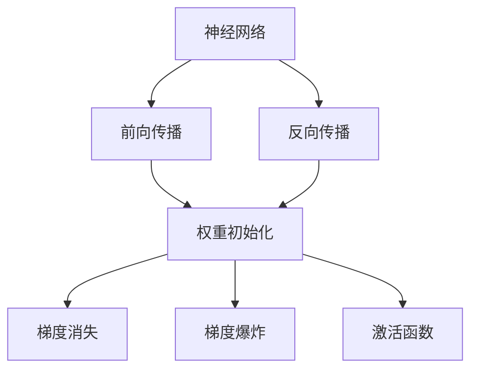

# Python深度学习实践：优化神经网络的权重初始化策略

## 1.背景介绍
### 1.1 深度学习的兴起与挑战
近年来,深度学习在计算机视觉、自然语言处理等领域取得了突破性进展,展现出强大的学习和建模能力。然而,训练一个高性能的深度神经网络并非易事,其中网络权重的初始化策略是一个关键因素。不恰当的权重初始化会导致梯度消失、梯度爆炸等问题,严重影响网络的收敛速度和泛化能力。

### 1.2 权重初始化的重要性
神经网络权重的初始值会极大地影响网络的训练动态和最终性能。好的初始化策略可以加速训练收敛,提升模型泛化能力,而不当的初始化则可能使网络陷入局部最优或无法收敛。因此,深入理解各种权重初始化方法的原理并加以利用,对于训练出优秀的深度学习模型至关重要。

### 1.3 本文的目标与贡献
本文将重点探讨几种主流的神经网络权重初始化策略,包括Xavier初始化、He初始化等。通过理论分析和代码实践,揭示它们的内在机制和适用场景。同时,本文还将介绍一些最新的研究进展,为进一步优化权重初始化提供思路。

## 2.核心概念与联系
### 2.1 神经网络的基本组成
神经网络由大量的神经元组成,通过这些神经元的连接和信息传递来实现学习。每个神经元接收来自上一层神经元的加权输入,经过非线性变换后输出到下一层。因此,网络权重的初始值直接决定了信息在网络中的流动。

### 2.2 前向传播与反向传播
- 前向传播：输入数据经过逐层的加权变换和非线性映射,得到网络的预测输出。
- 反向传播：根据预测输出和真实标签的差异,计算损失函数对各层权重的梯度,并用梯度下降等优化算法更新权重。

权重初始化策略对前向传播中的信息流动和反向传播中的梯度传递都有重要影响。

### 2.3 梯度消失与梯度爆炸
- 梯度消失：反向传播过程中,梯度幅值不断衰减,导致网络前面几层权重更新缓慢。
- 梯度爆炸：反向传播过程中,梯度幅值不断放大,导致权重更新剧烈震荡。

合理的权重初始化有助于缓解梯度消失和梯度爆炸问题,使网络更稳定高效地学习。

### 2.4 权重初始化与激活函数的关系
激活函数的选择与权重初始化策略密切相关。ReLU等非饱和激活函数能缓解梯度消失,但对权重初始化的要求更高。因此,针对不同激活函数设计专门的初始化方法很有必要。

下图展示了这些核心概念之间的联系:


## 3.核心算法原理具体操作步骤
### 3.1 Xavier初始化(Glorot初始化)
#### 3.1.1 基本思想
Xavier初始化的目标是使每一层输出的方差与其输入的方差相等,从而在前向传播过程中保持信息流的稳定性。同时还要使梯度的方差在反向传播过程中也保持稳定。

#### 3.1.2 数学推导
假设第 $l$ 层有 $n_l$ 个输入,$n_{l+1}$ 个输出,权重 $W_l$ 的元素服从均值为0、方差为 $Var(w_l)$ 的分布。令 $a_l$ 表示第 $l$ 层网络的输入,则有:

$$
Var(a_{l+1}) = n_l \cdot Var(w_l) \cdot Var(a_l)
$$

为了使 $Var(a_{l+1}) = Var(a_l)$,可得:

$$
n_l \cdot Var(w_l) = 1 \quad\Rightarrow\quad Var(w_l) = \frac{1}{n_l}
$$

类似地,在反向传播中,为了使梯度的方差保持稳定,可推导出:

$$
Var(w_l) = \frac{1}{n_{l+1}}
$$

综合前向传播和反向传播,Xavier初始化的权重方差为:

$$
Var(w_l) = \frac{2}{n_l + n_{l+1}}
$$

#### 3.1.3 初始化步骤
1. 确定每层权重张量的形状 $(n_l, n_{l+1})$。
2. 从均值为0、方差为 $\frac{2}{n_l + n_{l+1}}$ 的高斯分布或均匀分布中采样得到初始权重值。
3. 对网络的每一层权重执行步骤1和2。

### 3.2 He初始化
#### 3.2.1 基本思想
He初始化是针对ReLU激活函数提出的。由于ReLU在负半轴上输出恒为0,He初始化将Xavier初始化的方差再放大2倍,以补偿ReLU的特性。

#### 3.2.2 数学推导
对于使用ReLU激活函数的网络,假设有一半的神经元输出为0,则在前向传播中,为了维持方差稳定,有:

$$
\frac{1}{2} \cdot n_l \cdot Var(w_l) = 1 \quad\Rightarrow\quad Var(w_l) = \frac{2}{n_l}
$$

类似可推导出,在反向传播中:

$$
Var(w_l) = \frac{2}{n_{l+1}}
$$

He初始化取前向和反向传播的均值,得到权重方差:

$$
Var(w_l) = \frac{2}{n_l}
$$

#### 3.2.3 初始化步骤
1. 确定每层权重张量的形状 $(n_l, n_{l+1})$。
2. 从均值为0、方差为 $\frac{2}{n_l}$ 的高斯分布或均匀分布中采样得到初始权重值。
3. 对网络的每一层权重执行步骤1和2。

## 4.数学模型和公式详细讲解举例说明
### 4.1 均匀分布与高斯分布
在Xavier和He初始化中,初始权重可以从均匀分布或高斯分布中采样。这两种分布的概率密度函数分别为:

- 均匀分布 $U(a,b)$:
$$
f(x) = \begin{cases}
\frac{1}{b-a}, & a \leq x \leq b \\
0, & \text{otherwise}
\end{cases}
$$

其中,均值 $\mu = \frac{a+b}{2}$,方差 $\sigma^2 = \frac{(b-a)^2}{12}$。

- 高斯分布 $N(\mu,\sigma^2)$:
$$
f(x) = \frac{1}{\sqrt{2\pi}\sigma} \exp\left(-\frac{(x-\mu)^2}{2\sigma^2}\right)
$$

其中,$\mu$ 为均值,$\sigma^2$ 为方差。

### 4.2 举例说明
以一个具有两个隐藏层的全连接网络为例,每层的神经元个数分别为 $n_1=784,n_2=256,n_3=128$。假设使用ReLU激活函数,采用He初始化。

对于第一个隐藏层,权重的形状为 $(784, 256)$,He初始化的权重方差为:

$$
Var(w_1) = \frac{2}{n_1} = \frac{2}{784} \approx 0.0025
$$

从均值为0、方差为0.0025的高斯分布中采样得到权重初始值,示例代码如下:

```python
import numpy as np

n1, n2 = 784, 256
std = np.sqrt(2 / n1)  # 标准差
w1 = np.random.normal(0, std, size=(n1, n2))
```

类似地,对第二个隐藏层的权重进行He初始化:

$$
Var(w_2) = \frac{2}{n_2} = \frac{2}{256} \approx 0.0078
$$

采样代码:

```python
n2, n3 = 256, 128
std = np.sqrt(2 / n2)
w2 = np.random.normal(0, std, size=(n2, n3))
```

这样,网络的每一层权重都根据He初始化策略设置了合适的初始值,有助于实现快速、稳定的训练。

## 5.项目实践：代码实例和详细解释说明
下面以Keras框架为例,展示如何在实际项目中应用Xavier和He初始化。

### 5.1 Xavier初始化示例
```python
from tensorflow.keras.layers import Dense
from tensorflow.keras.initializers import GlorotNormal

model = Sequential([
    Dense(256, activation='sigmoid', kernel_initializer=GlorotNormal()),
    Dense(128, activation='sigmoid', kernel_initializer=GlorotNormal()),
    Dense(10, activation='softmax')
])
```

说明:
- 使用 `GlorotNormal` 初始化器,它对应Xavier初始化的高斯分布版本。
- 对前两个隐藏层应用Xavier初始化,最后一层使用默认初始化。
- 隐藏层的激活函数为sigmoid,适合Xavier初始化。

### 5.2 He初始化示例
```python
from tensorflow.keras.layers import Dense
from tensorflow.keras.initializers import HeNormal

model = Sequential([
    Dense(256, activation='relu', kernel_initializer=HeNormal()),
    Dense(128, activation='relu', kernel_initializer=HeNormal()),
    Dense(10, activation='softmax')
])
```

说明:
- 使用 `HeNormal` 初始化器,它对应He初始化的高斯分布版本。
- 对前两个隐藏层应用He初始化,最后一层使用默认初始化。
- 隐藏层的激活函数为ReLU,适合He初始化。

### 5.3 自定义初始化器
如果需要更细粒度的控制,可以自定义初始化器。以均匀分布版本的He初始化为例:

```python
from tensorflow.keras.initializers import Initializer

class HeUniform(Initializer):
    def __call__(self, shape, dtype=None):
        fan_in = shape[0] if len(shape) == 2 else np.prod(shape[1:])
        limit = np.sqrt(6 / fan_in)
        return tf.random.uniform(shape, minval=-limit, maxval=limit, dtype=dtype)

model = Sequential([
    Dense(256, activation='relu', kernel_initializer=HeUniform()),
    Dense(128, activation='relu', kernel_initializer=HeUniform()),
    Dense(10, activation='softmax')
])
```

说明:
- 自定义一个 `HeUniform` 初始化器类,继承自 `Initializer` 基类。
- 在 `__call__` 方法中,根据He初始化的权重方差公式,计算均匀分布的范围。
- 从计算出的均匀分布中采样得到权重初始值。

## 6.实际应用场景
### 6.1 图像分类
在图像分类任务中,卷积神经网络(CNN)是最常用的模型。由于CNN主要由卷积层和池化层组成,其权重初始化主要关注卷积核。He初始化是CNN中广泛使用的初始化策略,特别适合ReLU激活函数。

### 6.2 自然语言处理
在自然语言处理任务中,循环神经网络(RNN)和Transformer是主流模型。对于RNN,如LSTM和GRU,由于其复杂的门控机制,权重初始化需要更加谨慎。一般可以使用Xavier初始化或更小方差的初始化策略。对于Transformer,由于其主要由全连接层组成,使用He初始化是个不错的选择。

### 6.3 推荐系统
在推荐系统中,常用的模型有矩阵分解(MF)和深度学习模型如神经协同过滤(NCF)。对于MF,由于其本质是线性模型,权重初始化相对简单,可以使用较小方差的高斯分布或均匀分布。对于NCF等深度学习模型,可以参考上述CNN和RNN的初始化策略。

### 6.4 生成对抗网络
生成对抗网络(GAN)由生成器和判别器两部分组成,其训练过程较为敏感。权重初始化不当容易导致训练崩溃。一般来说,可以为生成器和判别器选择不同的初始化策略,如生成器使用Xavier初始化,判别器使用He初始化。此外,还可以尝试