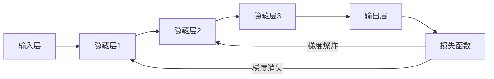

# Python深度学习实践：梯度消失和梯度爆炸的解决方案

## 1.背景介绍
### 1.1 深度学习的发展历程
### 1.2 深度学习面临的挑战
### 1.3 梯度消失和梯度爆炸问题的提出

深度学习自提出以来，已经在计算机视觉、自然语言处理、语音识别等领域取得了巨大的成功。然而，随着深度学习模型的不断加深，训练过程中往往会遇到梯度消失和梯度爆炸的问题，严重影响了模型的收敛速度和性能表现。

梯度消失和梯度爆炸最早由 Bengio 等人在 1994 年提出。他们发现，随着网络深度的增加，反向传播过程中的梯度幅值会指数级衰减或爆炸，导致网络难以训练。这两个问题成为了深度学习发展的一大障碍。

## 2.核心概念与联系
### 2.1 反向传播算法
### 2.2 梯度的定义与计算
### 2.3 激活函数与梯度的关系
### 2.4 梯度消失与梯度爆炸的定义

要理解梯度消失和梯度爆炸问题，首先需要了解反向传播算法的原理。反向传播是训练神经网络的核心算法，它通过链式法则计算损失函数对每个参数的梯度，并利用梯度下降法更新参数以最小化损失函数。

梯度是偏导数在多元函数中的推广，表示函数在各个变量方向上的变化率。对于神经网络的每一层，反向传播过程需要计算损失函数对该层输入的梯度，并将其传递到上一层，直到输入层。

激活函数的选择对梯度的传播有很大影响。传统的 Sigmoid 和 Tanh 激活函数容易导致梯度消失，而 ReLU 激活函数虽然缓解了梯度消失问题，但在某些情况下又可能引起梯度爆炸。

梯度消失是指随着网络深度的增加，梯度幅值会迅速衰减趋近于0，使得网络前面的层难以得到有效训练。梯度爆炸则相反，是指梯度幅值快速增长并趋于无穷大，导致网络权重剧烈震荡，无法收敛到最优解。



## 3.核心算法原理具体操作步骤
### 3.1 梯度剪裁 Gradient Clipping
#### 3.1.1 全局梯度范数裁剪
#### 3.1.2 局部梯度值裁剪 
### 3.2 权重正则化 Weight Regularization
#### 3.2.1 L1正则化
#### 3.2.2 L2正则化
### 3.3 残差连接 Residual Connection
#### 3.3.1 恒等映射 Identity Mapping
#### 3.3.2 跨层连接 Skip Connection
### 3.4 层归一化 Layer Normalization
#### 3.4.1 批归一化 Batch Normalization
#### 3.4.2 权重归一化 Weight Normalization

针对梯度消失和梯度爆炸问题，研究者们提出了多种有效的解决方案，下面逐一介绍其原理和操作步骤。

梯度裁剪是一种直接控制梯度幅值的方法。全局梯度范数裁剪是将整个模型的梯度范数限制在一个固定阈值内，超过阈值的梯度会被等比例缩放。局部梯度值裁剪则是对每个参数的梯度分别进行裁剪，限制在一个预设的区间内。

权重正则化通过在损失函数中加入权重的 L1 范数或 L2 范数项，鼓励模型学习较小的权重，从而缓解梯度爆炸。L1 正则化倾向于得到稀疏的权重矩阵，而 L2 正则化则使权重均匀地接近于0。

残差连接是一种在网络中引入恒等映射的方法，使得梯度可以直接传递到前面的层，缓解了梯度消失问题。代表性的结构有 ResNet 中的跨层连接，使用恒等映射将浅层特征与深层特征相加，加强了信息的流动。

层归一化是对网络每一层的输入进行归一化处理，使其均值为0，方差为1，从而稳定了梯度的传播。批归一化对每个小批量的样本进行归一化，而权重归一化则对网络权重进行归一化，两者都能有效缓解梯度消失和爆炸问题。

## 4.数学模型和公式详细讲解举例说明
### 4.1 梯度的数学定义与计算公式
### 4.2 Sigmoid 激活函数的梯度计算
### 4.3 ReLU 激活函数的梯度计算
### 4.4 反向传播算法的数学推导
### 4.5 梯度裁剪的数学原理
### 4.6 权重正则化的数学原理
### 4.7 层归一化的数学原理

梯度的数学定义为损失函数 $L$ 对参数 $w$ 的偏导数：

$$\nabla_{w} L=\frac{\partial L}{\partial w}$$

对于多层神经网络，设第 $l$ 层的权重为 $W^{l}$，偏置为 $b^{l}$，激活函数为 $\sigma$，则前向传播过程为：

$$a^{l}=W^{l} x^{l-1}+b^{l}$$
$$x^{l}=\sigma\left(a^{l}\right)$$

其中 $x^{l-1}$ 为上一层的输出。反向传播过程需要计算损失函数 $L$ 对每一层输入 $a^{l}$ 的梯度 $\delta^{l}$：

$$\delta^{L}=\nabla_{a} L \odot \sigma^{\prime}\left(a^{L}\right)$$
$$\delta^{l}=\left(\left(W^{l+1}\right)^{T} \delta^{l+1}\right) \odot \sigma^{\prime}\left(a^{l}\right)$$

其中 $\odot$ 表示 Hadamard 积，即逐元素相乘。

对于 Sigmoid 激活函数 $\sigma(x)=\frac{1}{1+e^{-x}}$，其导数为：

$$\sigma^{\prime}(x)=\sigma(x)(1-\sigma(x))$$

可见当 $x$ 较大或较小时，Sigmoid 函数的导数趋近于0，容易导致梯度消失。

对于 ReLU 激活函数 $\sigma(x)=\max (0, x)$，其导数为：

$$\sigma^{\prime}(x)=\left\{\begin{array}{ll}
1, & x>0 \
0, & x \leq 0
\end{array}\right.$$

ReLU 函数在正区间内导数恒为1，缓解了梯度消失问题，但在负区间内导数为0，可能引起梯度爆炸。

梯度裁剪对梯度 $g$ 进行如下操作：

$$\hat{g}=\left\{\begin{array}{ll}
\frac{g}{\|g\|} \cdot c, & \text { if }\|g\|>c \
g, & \text { otherwise }
\end{array}\right.$$

其中 $\|g\|$ 表示 $g$ 的 L2 范数，$c$ 为预设的阈值。

权重正则化在损失函数中加入 L1 正则项 $\lambda\|w\|_{1}$ 或 L2 正则项 $\lambda\|w\|_{2}^{2}$，其中 $\lambda$ 为正则化强度。

层归一化对每一层的输入 $x$ 进行归一化：

$$\hat{x}=\frac{x-\mathrm{E}[x]}{\sqrt{\operatorname{Var}[x]+\epsilon}}$$

其中 $\mathrm{E}[x]$ 和 $\operatorname{Var}[x]$ 分别表示 $x$ 的均值和方差，$\epsilon$ 为一个小常数，用于数值稳定性。

## 5.项目实践：代码实例和详细解释说明
### 5.1 使用 PyTorch 实现梯度裁剪
### 5.2 使用 Keras 实现权重正则化
### 5.3 使用 TensorFlow 实现残差连接
### 5.4 使用 PyTorch 实现批归一化
### 5.5 使用 Keras 实现权重归一化

下面通过代码实例演示如何在深度学习框架中应用上述方法。

使用 PyTorch 实现梯度裁剪：

```python
import torch

# 定义模型和优化器
model = MyModel()
optimizer = torch.optim.SGD(model.parameters(), lr=0.01)

# 设置梯度裁剪阈值
clip_value = 1.0

# 正向传播和反向传播
outputs = model(inputs)
loss = criterion(outputs, targets)
loss.backward()

# 对所有参数进行梯度裁剪
torch.nn.utils.clip_grad_norm_(model.parameters(), clip_value)

# 更新参数
optimizer.step()
```

使用 Keras 实现权重正则化：

```python
from keras.layers import Dense
from keras.regularizers import l1, l2

# 在全连接层中应用L1和L2正则化
model.add(Dense(64, kernel_regularizer=l1(0.01), bias_regularizer=l2(0.01)))
```

使用 TensorFlow 实现残差连接：

```python
import tensorflow as tf

# 定义残差块
def residual_block(x, filters, kernel_size, strides):
    identity = x
    
    out = tf.keras.layers.Conv2D(filters, kernel_size, strides=strides, padding='same')(x)
    out = tf.keras.layers.BatchNormalization()(out)
    out = tf.keras.layers.ReLU()(out)
    
    out = tf.keras.layers.Conv2D(filters, kernel_size, strides=1, padding='same')(out)
    out = tf.keras.layers.BatchNormalization()(out)
    
    if strides != 1:
        identity = tf.keras.layers.Conv2D(filters, 1, strides=strides, padding='same')(identity)
        identity = tf.keras.layers.BatchNormalization()(identity)
        
    out = tf.keras.layers.Add()([identity, out])
    out = tf.keras.layers.ReLU()(out)
    
    return out
```

使用 PyTorch 实现批归一化：

```python
import torch.nn as nn

# 在全连接层后添加批归一化层
self.fc1 = nn.Linear(784, 256)
self.bn1 = nn.BatchNorm1d(256)
self.fc2 = nn.Linear(256, 128)
self.bn2 = nn.BatchNorm1d(128)

# 在前向传播中应用批归一化
def forward(self, x):
    x = self.fc1(x)
    x = self.bn1(x)
    x = F.relu(x)
    x = self.fc2(x)
    x = self.bn2(x)
    x = F.relu(x)
    ...
```

使用 Keras 实现权重归一化：

```python
from keras.constraints import unit_norm

# 在全连接层中应用权重归一化
model.add(Dense(64, kernel_constraint=unit_norm()))
```

## 6.实际应用场景
### 6.1 计算机视觉中的应用
#### 6.1.1 图像分类
#### 6.1.2 目标检测
#### 6.1.3 语义分割
### 6.2 自然语言处理中的应用 
#### 6.2.1 机器翻译
#### 6.2.2 情感分析
#### 6.2.3 文本生成
### 6.3 语音识别中的应用
#### 6.3.1 声学模型
#### 6.3.2 语言模型

梯度消失和梯度爆炸问题在深度学习的各个领域都有广泛存在，下面列举一些具体的应用场景。

在计算机视觉领域，解决梯度问题对训练更深层次的卷积神经网络至关重要。对于图像分类任务，残差网络 ResNet 引入了跨层连接，使得网络可以达到上百层而不发生退化。对于目标检测任务，特征金字塔网络 FPN 利用横向连接在不同尺度特征图之间建立了信息流，缓解了梯度消失问题。对于语义分割任务，U-Net 网络使用跳跃连接将编码器和解码器对称连接，加强了梯度的传播。

在自然语言处理领域，循环神经网络 RNN 和长短期记忆网络 LSTM 经常遇到梯度消失和爆炸问题，影响了它们对