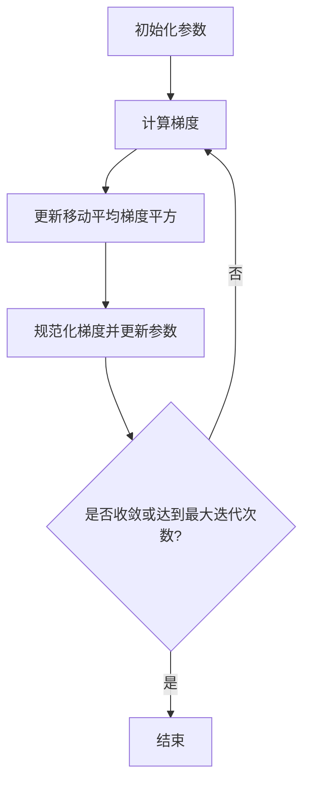

# RMSProp优化器原理与代码实例讲解

## 1. 背景介绍

### 1.1 优化算法在机器学习中的重要性

在机器学习和深度学习领域中,优化算法扮演着至关重要的角色。训练模型的目标是找到一组参数值,使得模型在训练数据上的损失函数(loss function)最小化。然而,这个过程通常需要在高维空间中搜索,并且目标函数可能是非凸的、存在许多局部最小值的复杂函数。传统的优化算法,如梯度下降法(Gradient Descent),往往在这种情况下表现不佳,收敛缓慢或陷入局部最小值。

### 1.2 优化算法的发展历程

为了克服梯度下降法的缺陷,研究人员提出了各种改进的优化算法,例如动量优化(Momentum)、RMSProp、Adagrad、Adadelta、Adam等。这些算法通过引入动量项、自适应学习率等技巧,显著提高了优化效率,加快了收敛速度,并且能够更好地逃离局部最小值。

### 1.3 RMSProp优化器的背景

RMSProp(Root Mean Square Propagation)是一种自适应学习率的优化算法,由Geoffrey Hinton在他的课程中提出。它是对Adagrad算法的改进版本,旨在解决Adagrad算法在训练后期学习率过度衰减的问题。RMSProp通过引入指数加权移动平均的方式来平滑梯度,从而使得学习率能够更好地适应不同参数的更新情况。

## 2. 核心概念与联系

### 2.1 梯度下降法

梯度下降法是最基本的优化算法,它通过计算目标函数关于参数的梯度,并沿着梯度的反方向更新参数,以期找到函数的最小值。然而,这种方法存在一些缺陷,例如:

1. 固定的学习率难以适应不同的参数更新情况。
2. 在高曲率区域,步长过大可能导致发散;在低曲率区域,步长过小可能导致收敛缓慢。
3. 容易陷入局部最小值或鞍点。

### 2.2 动量优化

为了解决梯度下降法的缺陷,动量优化(Momentum)算法被提出。它在梯度更新中引入了一个动量项,使得参数更新不仅受当前梯度的影响,也受之前累积的速度(动量)的影响。这种方式有助于加速收敛,并且能够更好地逃离局部最小值。

$$
v_t = \gamma v_{t-1} + \eta \nabla_{\theta} J(\theta)\
\theta = \theta - v_t
$$

其中,$\gamma$是动量系数,$v_t$是当前时刻的速度(动量),$\eta$是学习率,$\nabla_{\theta} J(\theta)$是目标函数关于参数$\theta$的梯度。

### 2.3 自适应学习率算法

尽管动量优化算法在一定程度上改善了梯度下降法的性能,但它仍然使用了固定的学习率,这可能导致收敛缓慢或发散。为了解决这个问题,研究人员提出了一系列自适应学习率的优化算法,如Adagrad、RMSProp和Adam等。这些算法通过根据历史梯度的统计信息动态调整每个参数的学习率,从而更好地适应不同参数的更新情况。

RMSProp算法就属于自适应学习率算法的一种,它通过计算指数加权移动平均的梯度平方,来动态调整每个参数的学习率。

## 3. 核心算法原理具体操作步骤

RMSProp算法的核心思想是维护一个移动平均的梯度平方,并使用它来规范化梯度。具体操作步骤如下:

1. 初始化参数$\theta$,移动平均的梯度平方$E[g^2]_0$,学习率$\eta$,指数加权平均系数$\beta$和一个很小的常数$\epsilon$。

2. 在每一次迭代中,计算目标函数$J(\theta)$关于参数$\theta$的梯度$\nabla_{\theta} J(\theta)$。

3. 更新移动平均的梯度平方:

$$
E[g^2]_t = \beta E[g^2]_{t-1} + (1 - \beta)(\nabla_{\theta} J(\theta))^2
$$

其中,$\beta$是一个接近于1的常数,用于控制移动平均的窗口大小。较大的$\beta$值意味着更多地考虑历史梯度信息。

4. 使用移动平均的梯度平方来规范化梯度,并更新参数:

$$
\theta_{t+1} = \theta_t - \frac{\eta}{\sqrt{E[g^2]_t + \epsilon}} \nabla_{\theta} J(\theta)
$$

其中,$\epsilon$是一个很小的常数,用于避免分母为零的情况。

5. 重复步骤2-4,直到收敛或达到最大迭代次数。

RMSProp算法的核心思想可以用以下Mermaid流程图来表示:



## 4. 数学模型和公式详细讲解举例说明

RMSProp算法的数学模型可以表示为:

$$
E[g^2]_t = \beta E[g^2]_{t-1} + (1 - \beta)(\nabla_{\theta} J(\theta))^2\
\theta_{t+1} = \theta_t - \frac{\eta}{\sqrt{E[g^2]_t + \epsilon}} \nabla_{\theta} J(\theta)
$$

其中:

- $E[g^2]_t$是时刻$t$的移动平均梯度平方。
- $\beta$是指数加权平均系数,控制移动平均窗口的大小。通常取值接近于1,如0.9。
- $\nabla_{\theta} J(\theta)$是目标函数$J(\theta)$关于参数$\theta$的梯度。
- $\eta$是学习率,控制每一步参数更新的幅度。
- $\epsilon$是一个很小的常数,用于避免分母为零的情况,通常取值为$10^{-8}$。

让我们通过一个简单的例子来理解RMSProp算法的工作原理。假设我们有一个单变量函数$f(x) = x^4$,目标是找到它的最小值点。

初始化:

```python
x = 1.0  # 初始参数值
g_sq = 0.0  # 初始移动平均梯度平方
beta = 0.9  # 指数加权平均系数
eta = 0.1  # 学习率
eps = 1e-8  # 防止分母为零
```

迭代过程:

```python
for i in range(10):
    grad = 4 * x**3  # 计算梯度
    g_sq = beta * g_sq + (1 - beta) * grad**2  # 更新移动平均梯度平方
    x -= eta / (g_sq**0.5 + eps) * grad  # 更新参数
    print(f"Iteration {i}: x = {x:.6f}, g_sq = {g_sq:.6f}")
```

输出:

```
Iteration 0: x = 0.760000, g_sq = 16.000000
Iteration 1: x = 0.457856, g_sq = 6.340800
Iteration 2: x = 0.229537, g_sq = 1.869203
Iteration 3: x = 0.092899, g_sq = 0.415900
Iteration 4: x = 0.030144, g_sq = 0.069922
Iteration 5: x = 0.007847, g_sq = 0.009489
Iteration 6: x = 0.001638, g_sq = 0.001034
Iteration 7: x = 0.000273, g_sq = 0.000092
Iteration 8: x = 0.000036, g_sq = 0.000006
Iteration 9: x = 0.000004, g_sq = 0.000000
```

从输出结果可以看出,RMSProp算法能够快速地将参数$x$优化到接近0的值,这是函数$f(x) = x^4$的最小值点。同时,移动平均梯度平方$g_{sq}$也逐渐减小,这说明算法正在适应参数的更新情况,动态调整学习率。

## 5. 项目实践:代码实例和详细解释说明

下面是一个使用PyTorch实现RMSProp算法的示例代码:

```python
import torch

# 定义模型
model = torch.nn.Linear(10, 1)

# 定义损失函数和优化器
criterion = torch.nn.MSELoss()
optimizer = torch.optim.RMSprop(model.parameters(), lr=0.01, alpha=0.9)

# 训练循环
for epoch in range(100):
    inputs = torch.randn(64, 10)
    targets = torch.randn(64, 1)

    # 前向传播
    outputs = model(inputs)
    loss = criterion(outputs, targets)

    # 反向传播和优化
    optimizer.zero_grad()
    loss.backward()
    optimizer.step()

    # 打印损失
    if (epoch + 1) % 10 == 0:
        print(f"Epoch {epoch+1}, Loss: {loss.item():.4f}")
```

让我们逐步解释这段代码:

1. 首先,我们定义了一个简单的线性模型,输入维度为10,输出维度为1。

2. 接下来,我们定义了均方误差损失函数(MSELoss)和RMSProp优化器。在创建RMSProp优化器时,我们需要传入模型的可训练参数,并设置学习率`lr`和指数加权平均系数`alpha`(对应于前面公式中的$\beta$)。

3. 在训练循环中,我们首先生成一批随机输入数据`inputs`和目标值`targets`。

4. 然后,我们通过模型进行前向传播,计算输出`outputs`和损失`loss`。

5. 在反向传播和优化步骤中,我们首先调用`optimizer.zero_grad()`来清除之前计算的梯度。接着,我们调用`loss.backward()`来计算损失关于模型参数的梯度。最后,我们调用`optimizer.step()`来使用RMSProp算法更新模型参数。

6. 每隔10个epoch,我们打印当前的损失值。

在这个示例中,我们使用了PyTorch内置的`torch.optim.RMSprop`优化器,它实现了RMSProp算法。我们只需要设置合适的超参数,如学习率和指数加权平均系数,就可以在训练过程中使用这个优化器来更新模型参数。

## 6. 实际应用场景

RMSProp优化器在各种机器学习和深度学习任务中都有广泛的应用,包括但不限于:

1. **计算机视觉**:在图像分类、目标检测、语义分割等计算机视觉任务中,RMSProp优化器被广泛用于训练深度卷积神经网络模型。

2. **自然语言处理**:在文本分类、机器翻译、语言模型等自然语言处理任务中,RMSProp优化器被用于训练循环神经网络、transformer等模型。

3. **推荐系统**:在协同过滤、内容推荐等推荐系统任务中,RMSProp优化器被用于训练矩阵分解、深度神经网络等模型。

4. **强化学习**:在游戏AI、机器人控制等强化学习任务中,RMSProp优化器被用于训练策略网络和值函数网络。

5. **生成对抗网络(GAN)**:在图像生成、风格迁移等GAN任务中,RMSProp优化器被用于训练生成器和判别器网络。

总的来说,RMSProp优化器由于其自适应学习率的特性,在各种需要训练深度神经网络的任务中都有广泛的应用。它能够加快收敛速度,提高模型性能,因此被广泛采用。

## 7. 工具和资源推荐

如果您想进一步了解和使用RMSProp优化器,以下是一些推荐的工具和资源:

1. **PyTorch**:PyTorch是一个流行的深度学习框架,它内置了RMSProp优化器的实现。您可以通过`torch.optim.RMSprop`来创建RMSProp优化器实例。PyTorch官方文档提供了详细的API说明和使用示例。

2. **TensorFlow**:TensorFlow也是一个广泛使用的深度学习框架,它同样提供了RMSProp优化器的实现。您可以通过`tf.train.RMSPropOptimizer`来创建RM