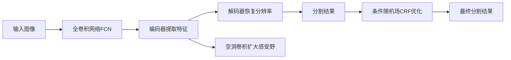

# Semantic Segmentation原理与代码实例讲解

## 1. 背景介绍
### 1.1 什么是Semantic Segmentation
Semantic Segmentation(语义分割)是计算机视觉领域的一个重要任务,旨在将图像中的每个像素分类到预定义的类别中。与传统的图像分类和目标检测不同,语义分割提供了图像的像素级别理解,可以精确定位图像中的物体轮廓。

### 1.2 语义分割的应用场景
语义分割在很多领域有广泛应用,例如:
- 无人驾驶:精确分割道路、车辆、行人等
- 医学影像:肿瘤、器官等组织的自动勾画  
- 卫星遥感影像:土地利用分类
- 增强现实:虚拟物体与真实场景的融合

### 1.3 语义分割的技术挑战
尽管语义分割取得了长足进展,但仍面临诸多技术挑战:
- 类别不平衡:背景像素往往占大多数
- 物体尺度差异大:从小物体到大场景
- 物体形状多样:规则物体与不规则物体
- 场景复杂多变:光照、视角、遮挡等因素

## 2. 核心概念与联系
### 2.1 全卷积网络(FCN)
FCN是深度学习时代语义分割的开山之作。它将分类网络中的全连接层转化为卷积层,使网络可以接受任意尺寸的输入,并输出与输入分辨率相同的分割结果。FCN通过跨层连接融合不同感受野的特征,提升分割精度。

### 2.2 编码器-解码器架构
编码器负责提取图像的多尺度特征,解码器将特征图上采样到原始分辨率。U-Net等网络采用对称的编码器-解码器结构,并在编码器和解码器之间引入跨层连接,有利于恢复物体的空间细节。

### 2.3 空洞卷积(Dilated Convolution)
空洞卷积通过在标准卷积中引入空洞因子,在不增加参数量和计算量的情况下扩大感受野。多个空洞卷积串联可以获得指数级感受野,有利于捕获图像的长程依赖关系。

### 2.4 条件随机场(CRF)
语义分割结果通常存在噪点和不连续的问题。条件随机场作为一种概率图模型,可以对分割结果进行平滑和细化。它通过像素间的相似性和标签一致性对分割结果进行全局优化。

### 2.5 概念关系图
下面的Mermaid流程图展示了以上核心概念之间的关系:


## 3. 核心算法原理具体操作步骤
下面以FCN为例,详细讲解语义分割的核心算法步骤。

### 3.1 骨干网络
选择一个预训练的分类网络(如ResNet)作为骨干网络,移除最后的全连接层。

### 3.2 卷积化
将骨干网络中的全连接层转化为卷积层。全连接层可以看作是卷积核覆盖整个特征图的卷积层。

### 3.3 上采样
通过反卷积或双线性插值对最后一个卷积层的特征图进行上采样,恢复到输入图像的分辨率。上采样的过程中,特征图的空间尺寸扩大,通道数减少到类别数。

### 3.4 跨层连接
将骨干网络中间层的特征图上采样并与最后的预测结果相加,细化分割边界。浅层特征语义信息少但空间信息丰富,深层特征语义信息丰富但空间信息少,跨层连接可以兼顾两者。

### 3.5 损失函数
对每个像素使用交叉熵损失函数,衡量预测类别与真实类别的差异。由于类别不平衡问题,常用加权交叉熵损失,提高小物体和边缘像素的权重。

### 3.6 推理
将测试图像输入到训练好的网络,转化为概率图,取最大概率的类别作为每个像素的预测标签。

## 4. 数学模型和公式详细讲解举例说明
### 4.1 交叉熵损失
假设$p_i$是第$i$个像素属于真实类别的概率,$q_i$是网络预测的概率,则交叉熵损失为:

$$
L = -\frac{1}{N}\sum_{i=1}^N\sum_{c=1}^C y_{ic} \log(p_{ic})
$$

其中$N$为像素总数,$C$为类别总数,$y_{ic}$为真实标签(one-hot形式)。

举例:假设有3个像素,类别数为2,网络输出和真实标签如下:

网络输出:
```
[[0.8, 0.2], 
 [0.3, 0.7],
 [0.1, 0.9]]
```

真实标签:
```
[[1, 0],
 [0, 1], 
 [0, 1]]
```

则交叉熵损失为:
$$
\begin{aligned}
L &= -\frac{1}{3} [1*\log(0.8) + 0*\log(0.2) \
&+ 0*\log(0.3) + 1*\log(0.7) \  
&+ 0*\log(0.1) + 1*\log(0.9)] \
&= 0.364
\end{aligned}
$$

### 4.2 Dice损失
Dice系数常用于评估两个集合的相似性,定义为两集合交集的2倍除以两集合元素总数。对于二分类问题,Dice系数可以写为:

$$
Dice = \frac{2\sum_{i=1}^N p_i q_i}{\sum_{i=1}^N p_i^2 + \sum_{i=1}^N q_i^2}
$$

其中$p_i$和$q_i$分别是第$i$个像素预测为目标类别的概率和真实标签。

Dice损失定义为Dice系数的负数:

$$
L_{dice} = -Dice = -\frac{2\sum_{i=1}^N p_i q_i}{\sum_{i=1}^N p_i^2 + \sum_{i=1}^N q_i^2}
$$

相比交叉熵损失,Dice损失对类别不平衡更加鲁棒。

## 5. 项目实践:代码实例和详细解释说明
下面以PyTorch为例,实现一个简单的FCN网络用于语义分割。

### 5.1 导入依赖包
```python
import torch
import torch.nn as nn
import torch.nn.functional as F
```

### 5.2 定义FCN网络
```python
class FCN(nn.Module):
    def __init__(self, num_classes):
        super(FCN, self).__init__()
        
        # 骨干网络(假设为3个卷积层)
        self.conv1 = nn.Conv2d(3, 64, 3, padding=1)
        self.conv2 = nn.Conv2d(64, 128, 3, padding=1)
        self.conv3 = nn.Conv2d(128, 256, 3, padding=1)
        
        # 1x1卷积调整通道数
        self.conv1x1_1 = nn.Conv2d(64, num_classes, 1)
        self.conv1x1_2 = nn.Conv2d(128, num_classes, 1)
        self.conv1x1_3 = nn.Conv2d(256, num_classes, 1)
        
    def forward(self, x):
        # 骨干网络前向传播
        x1 = F.relu(self.conv1(x))
        x2 = F.relu(self.conv2(x1))
        x3 = F.relu(self.conv3(x2))
        
        # 调整通道数
        s1 = self.conv1x1_1(x1)
        s2 = self.conv1x1_2(x2)
        s3 = self.conv1x1_3(x3)
        
        # 上采样并相加
        s2 = F.interpolate(s2, size=s1.size()[2:], mode='bilinear', align_corners=True)
        s3 = F.interpolate(s3, size=s1.size()[2:], mode='bilinear', align_corners=True)
        
        y = s1 + s2 + s3
        
        return y
```

### 5.3 实例化网络
```python
num_classes = 10
net = FCN(num_classes)
```

### 5.4 定义损失函数
```python
criterion = nn.CrossEntropyLoss()
```

### 5.5 定义优化器
```python
optimizer = torch.optim.Adam(net.parameters(), lr=1e-3)
```

### 5.6 训练代码
```python
for epoch in range(num_epochs):
    for i, (images, labels) in enumerate(train_loader):
        # 前向传播
        outputs = net(images)
        loss = criterion(outputs, labels)
        
        # 反向传播
        optimizer.zero_grad()
        loss.backward()
        optimizer.step()
```

### 5.7 推理代码
```python
net.eval()
with torch.no_grad():
    for images, labels in test_loader:
        # 前向传播
        outputs = net(images)
        
        # 取最大概率的类别
        _, predicted = torch.max(outputs, 1)
```

以上就是使用PyTorch实现FCN进行语义分割的基本流程,实际项目中还需要进行数据预处理、数据增强、模型微调、超参数选择等步骤。

## 6. 实际应用场景
语义分割在很多领域有广泛应用,下面列举几个具体场景。

### 6.1 无人驾驶中的道路分割
在无人驾驶系统中,精确分割道路区域是自动驾驶的关键。通过在车载摄像头拍摄的图像上运行语义分割模型,可以实时分割出道路、车道线、交通标志等关键元素,为规划和控制提供环境感知信息。

### 6.2 医学影像分析
在医学影像分析中,语义分割可以自动勾画出CT、MRI等医学图像中的器官、肿瘤等组织区域,辅助医生进行疾病诊断和治疗计划制定。相比手动标注,自动分割可以大幅提高分析效率和客观性。

### 6.3 卫星遥感影像分析
卫星遥感影像包含丰富的地物信息,如建筑、道路、农田、森林等。通过语义分割可以自动对遥感影像进行土地利用分类、变化检测等分析,在城市规划、农业监测、生态保护等领域有重要应用。

### 6.4 虚拟/增强现实
在虚拟/增强现实中,需要将虚拟物体无缝融合到真实场景中。通过对真实场景进行语义分割,可以获得场景的三维结构和语义信息,从而实现虚拟物体的遮挡、碰撞等逼真交互效果。

## 7. 工具和资源推荐
- 编程框架:PyTorch、TensorFlow、Keras等
- 数据集:PASCAL VOC、Cityscapes、ADE20K等
- 论文:FCN、U-Net、DeepLab系列等
- 开源代码:MMSegmentation、SimpleCVReproduction等
- 教程:CS231n课程、PyTorch官方教程等

## 8. 总结:未来发展趋势与挑战
语义分割技术目前已经取得了长足进展,在众多领域得到应用。展望未来,仍有许多发展方向和挑战:
- 小样本学习:减少对大规模标注数据的依赖
- 域适应:缓解训练数据与应用场景的分布差异
- 实时性:在嵌入式和移动设备上实现实时分割
- 三维分割:从2D图像拓展到3D点云、体数据
- 多模态融合:联合文本、音频等模态的先验知识

总之,语义分割作为图像理解的核心任务之一,仍有许多值得探索的问题,需要计算机视觉、机器学习等多个领域的协同创新。

## 9. 附录:常见问题与解答
### 9.1 语义分割与实例分割的区别?
语义分割是像素级别的分类,不区分同类物体的不同实例。实例分割在语义分割的基础上进一步区分每个物体实例。以行人为例,语义分割会将所有行人像素标记为同一类别,而实例分割会将不同行人分别标记为不同的实例。

### 9.2 U-Net与FCN的异同?
相同点:都