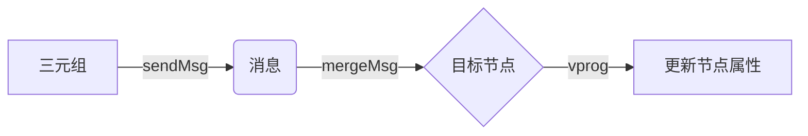
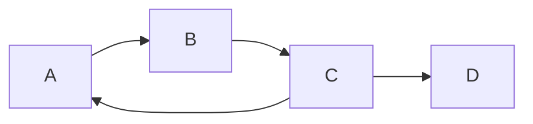

# Spark GraphX图计算引擎原理与代码实例讲解

## 1.背景介绍
### 1.1 图计算的重要性
在当今大数据时代,图计算已经成为了一个非常重要的研究领域。图能够很好地表示现实世界中各种实体之间的复杂关系,如社交网络、交通网络、金融网络等。通过对图数据的分析和挖掘,我们可以发现很多有价值的信息和规律。

### 1.2 Spark GraphX的诞生
Apache Spark是目前最流行的大数据处理框架之一,其中的GraphX组件是专门用于图计算的引擎。GraphX建立在Spark之上,继承了Spark的分布式计算能力和内存计算优势,同时针对图计算进行了专门的优化,使得在海量图数据上的复杂计算变得简单高效。

### 1.3 GraphX的特点
- 基于Spark的分布式计算框架
- 提供了灵活的图数据结构 - 属性图
- 丰富的图算法库,包括PageRank、连通分量、最短路径等
- 支持图的ETL(Extract-Transform-Load)操作
- 支持图的存储和加载

## 2.核心概念与联系
### 2.1 属性图(Property Graph)
GraphX使用属性图来统一表示图数据。属性图由节点(Vertex)和边(Edge)组成:
- 节点用唯一的64位长整型VertexId标识,并带有属性(Properties)
- 边由源节点(srcId)、目标节点(dstId)、方向(direction)标识,同时也带有属性

属性图的定义如下:
```scala
class Graph[VD, ED] {
  val vertices: VertexRDD[VD]
  val edges: EdgeRDD[ED]
}
```
其中VD、ED分别是节点和边的属性类型。

### 2.2 VertexRDD和EdgeRDD
- VertexRDD是由(VertexId, VD)对组成的RDD,代表所有节点
- EdgeRDD是由Edge[ED]组成的RDD,代表所有边,其中Edge是一个三元组:
```scala
case class Edge[ED](srcId: VertexId, dstId: VertexId, attr: ED)
```

VertexRDD和EdgeRDD之间可以通过Graph互相转换:
```scala
val graph = Graph(vertices, edges)
val vertices = graph.vertices
val edges = graph.edges
```

### 2.3 三元组视图(Triplet View)
三元组视图将每条边与它的源、目节点合并在一起,形成`EdgeTriplet`的RDD:
```scala
val triplets: RDD[EdgeTriplet[VD, ED]]
```
其中EdgeTriplet定义为:
```scala
case class EdgeTriplet[VD, ED](
  srcId: VertexId,
  srcAttr: VD,
  dstId: VertexId,
  dstAttr: VD,
  attr: ED)
```
通过三元组视图,我们可以非常方便地访问一条边的两端节点的属性。这在很多基于边的计算中非常有用。

### 2.4 消息传递(Message Passing)
GraphX基于Pregel模型,使用消息传递的方式进行图计算。
- 用户定义一个`sendMsg`函数,对于每个三元组生成消息
- 用户定义一个`mergeMsg`函数,将发给同一个节点的消息进行合并
- 用户定义一个`vprog`函数,用于根据收到的消息更新节点属性

消息传递的过程如下:



## 3.核心算法原理与具体操作步骤
下面我们以最经典的PageRank算法为例,讲解GraphX中图算法的实现原理。

### 3.1 PageRank 算法原理
PageRank算法的基本思想是:一个网页的重要性取决于指向它的其他网页的重要性。具体来说:
1. 初始时,每个网页的PageRank值为1。
2. 每一轮迭代中,每个网页将其当前的PageRank值平均分给它指向的网页。
3. 同时,每个网页将收到的PageRank值求和,再加上一个随机游走因子,作为新的PageRank值。
4. 重复步骤2-3,直到PageRank值收敛。

### 3.2 GraphX中的实现步骤
1. 准备图数据,构建图Graph
```scala
// 定义节点和边
val vertices = Array((1L, "A"), (2L, "B"), (3L, "C"), (4L, "D"))
val edges = Array(Edge(1L, 2L, 1), Edge(2L, 3L, 1), Edge(3L, 1L, 1), Edge(3L, 4L, 1))

// 构建图
val graph = Graph(sc.parallelize(vertices), sc.parallelize(edges))
```

2. 初始化每个节点的PageRank值为1
```scala
val pagerankGraph = graph.mapVertices((id, attr) => 1.0)
```

3. 定义`sendMsg`函数,每个节点将当前的PageRank值平分给出边
```scala
def sendMsg(e: EdgeTriplet[Double, Int]): Iterator[(VertexId, Double)] = {
  Iterator((e.dstId, e.srcAttr / e.srcAttr.outDegree))
}
```

4. 定义`mergeMsg`函数,对收到的PageRank值求和
```scala
def mergeMsg(a: Double, b: Double): Double = a + b
```

5. 定义`vprog`函数,更新每个节点的PageRank值
```scala
def vprog(id: VertexId, attr: Double, msg: Double): Double =
  0.15 + 0.85 * msg
```

6. 迭代计算PageRank,直到收敛
```scala
val tol = 0.0001
var iteration = 0
var prevRank = pagerankGraph

do {
  iteration += 1
  val msgs = prevRank.aggregateMessages(sendMsg, mergeMsg)
  prevRank = pagerankGraph.outerJoinVertices(msgs) {
    (id, oldPR, newPR) => vprog(id, oldPR, newPR.getOrElse(0))
  }
} while (prevRank.vertices.join(pagerankGraph.vertices)
           .map{ case(id, (pr1, pr2)) => math.abs(pr1 - pr2) }.reduce(_ + _) > tol)
```

7. 输出最终的PageRank结果
```scala
pagerankGraph.vertices.collect.foreach(println(_))
```

## 4.数学模型和公式详细讲解举例说明
PageRank算法可以用以下数学公式表示:

$$
PR(u) = \alpha + (1-\alpha) \sum_{v \in B_u} \frac{PR(v)}{L(v)}
$$

其中:
- $PR(u)$ 表示网页 $u$ 的PageRank值
- $B_u$ 表示指向网页 $u$ 的网页集合
- $L(v)$ 表示网页 $v$ 的出链数
- $\alpha$ 是随机游走因子,一般取值0.15

举例说明:

假设有如下的网页链接关系:


初始时,每个网页的PageRank值为1:
- $PR(A) = 1$
- $PR(B) = 1$
- $PR(C) = 1$
- $PR(D) = 1$

第一轮迭代:
- A将其PageRank值1平分给B,B获得1
- B将其PageRank值1平分给C,C获得1
- C将其PageRank值1平分给A和D,A和D各获得0.5

每个网页的新PageRank值为:
- $PR(A) = 0.15 + 0.85 * 0.5 = 0.575$
- $PR(B) = 0.15 + 0.85 * 1 = 1$
- $PR(C) = 0.15 + 0.85 * 1 = 1$
- $PR(D) = 0.15 + 0.85 * 0.5 = 0.575$

重复迭代直至PageRank值收敛。

## 5.项目实践：代码实例和详细解释说明
下面给出使用Spark GraphX实现PageRank的完整Scala代码:

```scala
import org.apache.spark._
import org.apache.spark.graphx._
import org.apache.spark.rdd.RDD

object PageRank {
  def main(args: Array[String]): Unit = {
    // 创建Spark上下文
    val conf = new SparkConf().setAppName("PageRank")
    val sc = new SparkContext(conf)

    // 定义节点和边
    val vertices: RDD[(VertexId, String)] = sc.parallelize(Array(
      (1L, "A"), (2L, "B"), (3L, "C"), (4L, "D")
    ))
    val edges: RDD[Edge[Int]] = sc.parallelize(Array(
      Edge(1L, 2L, 1),
      Edge(2L, 3L, 1),
      Edge(3L, 1L, 1),
      Edge(3L, 4L, 1)
    ))

    // 构建图
    val graph: Graph[String, Int] = Graph(vertices, edges)

    // 初始化PageRank值为1
    val pagerankGraph: Graph[Double, Int] = graph.mapVertices((id, attr) => 1.0)

    // 定义发送消息函数
    def sendMsg(e: EdgeTriplet[Double, Int]): Iterator[(VertexId, Double)] = {
      Iterator((e.dstId, e.srcAttr / e.srcAttr.outDegree))
    }

    // 定义合并消息函数
    def mergeMsg(a: Double, b: Double): Double = a + b

    // 定义更新节点属性函数
    def vprog(id: VertexId, attr: Double, msg: Double): Double =
      0.15 + 0.85 * msg

    // 迭代计算PageRank
    val tol = 0.0001
    var iteration = 0
    var prevRank = pagerankGraph

    do {
      iteration += 1
      val msgs = prevRank.aggregateMessages(sendMsg, mergeMsg)
      prevRank = pagerankGraph.outerJoinVertices(msgs) {
        (id, oldPR, newPR) => vprog(id, oldPR, newPR.getOrElse(0))
      }
    } while (prevRank.vertices.join(pagerankGraph.vertices)
               .map{ case(id, (pr1, pr2)) => math.abs(pr1 - pr2) }.reduce(_ + _) > tol)

    // 打印PageRank结果
    println(s"Converged after $iteration iterations.")
    pagerankGraph.vertices.collect.foreach(println(_))

    sc.stop()
  }
}
```

代码详细解释:
1. 首先创建Spark上下文,定义图的节点和边数据。
2. 使用`Graph(vertices, edges)`构建图。
3. 使用`mapVertices`初始化每个节点的PageRank值为1。
4. 定义`sendMsg`函数,对于每条边,将源节点的PageRank值除以出度,发送给目标节点。
5. 定义`mergeMsg`函数,对于每个节点,将收到的PageRank值相加。
6. 定义`vprog`函数,使用0.15+0.85*msg更新节点的PageRank值。
7. 使用`aggregateMessages`和`outerJoinVertices`进行迭代计算,直到PageRank值收敛。
8. 最后使用`vertices.collect.foreach`打印每个节点的PageRank值。

## 6.实际应用场景
GraphX在实际中有非常广泛的应用,下面列举几个典型场景:

### 6.1 社交网络分析
- 使用PageRank算法度量用户的重要性和影响力
- 使用连通分量算法检测社区
- 使用最短路径算法计算用户之间的最短距离,度量用户的相似性

### 6.2 推荐系统
- 将用户和商品看作图中的节点,购买关系看作边
- 使用随机游走算法实现基于图的协同过滤推荐
- 使用最短路径算法计算用户与商品之间的相关度

### 6.3 交通路网分析
- 使用最短路径算法计算两地之间的最优出行路线
- 使用连通分量算法检测路网的连通性
- 使用PageRank算法度量道路的重要性

### 6.4 网页分析
- 使用PageRank算法度量网页的权重,用于搜索引擎排序
- 使用连通分量算法检测网站的连通性
- 使用Label Propagation算法进行网页分类

## 7.工具和资源推荐
- Spark官网: http://spark.apache.org/  提供了Spark和GraphX的下载、文档和示例程序。
- GraphX Programming Guide: http://spark.apache.org/docs/latest/graphx-programming-guide.html GraphX的官方编程指南,系统全面地介绍了GraphX的各种功能和API。
- Spark GraphX源码: https://github.com/apache/spark/tree/master/graphx  通过阅读源码可以深入理解GraphX的实现原理。
- GraphX Examples: https://github.com/apache/spark/tree/master/examples/src/main/scala/org/apache/spark/examples/graphx Spark示例程序中关于GraphX的部分,包括PageRank、连通分量、三角形计数等算法。