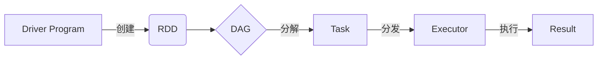

# Spark原理与代码实例讲解

## 1.背景介绍

### 1.1 大数据时代的到来

在当今时代,数据已经成为了一种新的资源和生产力。随着互联网、物联网、云计算等技术的快速发展,海量的数据正以前所未有的速度被生成和积累。传统的数据处理方式已经无法满足大数据时代的需求,因此分布式计算框架应运而生。

### 1.2 Spark 的崛起

Apache Spark 作为一种快速、通用的大数据处理引擎,凭借其优秀的性能、易用性和丰富的生态系统,迅速成为大数据领域的明星项目。Spark 不仅支持批处理,还支持流式计算、机器学习等多种应用场景,被广泛应用于各行各业。

## 2.核心概念与联系

### 2.1 RDD

RDD(Resilient Distributed Dataset)是 Spark 的核心数据抽象,表示一个不可变、分区的记录集合。RDD 可以从 HDFS、HBase 等数据源创建,也可以通过现有 RDD 转换而来。RDD 支持丰富的转换操作,如 map、filter、join 等,并提供了诸如 reduce 之类的行动操作来触发计算。

### 2.2 DAG

Spark 将计算任务表示为有向无环图(DAG),每个 RDD 都是 DAG 中的一个节点。当执行行动操作时,Spark 会根据 DAG 构建计算任务,并将任务分发到集群中的 Executor 执行。

### 2.3 Executor

Executor 是 Spark 中的计算单元,负责执行任务并返回结果。每个 Executor 运行在集群中的一个工作节点上,并占用一定数量的 CPU 和内存资源。

### 2.4 核心组件关系

Spark 的核心组件之间的关系如下所示:



## 3.核心算法原理具体操作步骤

### 3.1 RDD 创建

RDD 可以通过以下几种方式创建:

1. 从外部数据源创建,如 HDFS、HBase、Kafka 等。
2. 从 Scala 集合(如 Array、List)创建。
3. 通过其他 RDD 转换而来。

以从 HDFS 创建 RDD 为例,代码如下:

```scala
val textFile = sc.textFile("hdfs://path/to/file")
```

### 3.2 RDD 转换

RDD 支持丰富的转换操作,常见的有:

- map: 对 RDD 中的每个元素执行指定的函数。
- filter: 返回 RDD 中满足指定条件的元素。
- flatMap: 对 RDD 中的每个元素执行指定的函数,并将结果扁平化。
- union: 返回两个 RDD 的并集。
- join: 根据键将两个 RDD 中的元素连接起来。

以 map 和 filter 为例:

```scala
val lines = textFile.map(line => line.length)
val longLines = lines.filter(length => length > 80)
```

### 3.3 RDD 行动操作

行动操作会触发 Spark 作业的执行,常见的有:

- reduce: 通过指定的函数对 RDD 中的元素进行聚合。
- collect: 将 RDD 中的所有元素收集到驱动程序中。
- count: 返回 RDD 中元素的个数。
- saveAsTextFile: 将 RDD 中的元素保存到外部存储系统,如 HDFS。

以 reduce 为例:

```scala
val totalLength = lines.reduce((a, b) => a + b)
```

### 3.4 Spark 作业执行流程

1. 驱动程序构建 DAG。
2. DAG 被分解为多个任务(Task)。
3. 任务被分发到 Executor 执行。
4. Executor 执行任务,并将结果返回给驱动程序。

## 4.数学模型和公式详细讲解举例说明

### 4.1 数据划分

Spark 将 RDD 划分为多个分区(Partition),每个分区由一个任务处理。分区的数量取决于 RDD 的创建方式和转换操作。

假设有一个 RDD,包含 $N$ 个元素,被划分为 $P$ 个分区,每个分区包含 $\frac{N}{P}$ 个元素。对于 map 这样的转换操作,每个分区会被独立处理,因此总的计算量为:

$$
计算量 = P \times \frac{N}{P} \times 操作复杂度 = N \times 操作复杂度
$$

### 4.2 数据洗牌

某些操作(如 groupByKey、reduceByKey)需要在不同的分区之间移动数据,这个过程称为数据洗牌(Shuffle)。假设有两个 RDD $A$ 和 $B$,分别包含 $N_A$ 和 $N_B$ 个元素,被划分为 $P_A$ 和 $P_B$ 个分区。在执行 join 操作时,需要将相同键值的数据进行聚合,计算量为:

$$
计算量 = N_A + N_B + \sum_{i=1}^{P_A}\sum_{j=1}^{P_B}数据传输量_{i,j}
$$

其中,数据传输量取决于数据的分布情况。

### 4.3 广播变量

对于需要在所有任务之间共享的只读数据,Spark 提供了广播变量(Broadcast Variable)的机制。假设有一个大小为 $M$ 的只读数据集,如果不使用广播变量,每个任务都需要复制一份数据,总的数据传输量为:

$$
数据传输量 = P \times M
$$

使用广播变量后,只需要将数据发送一次,数据传输量降低为:

$$
数据传输量 = M + P \times 常数
$$

## 5.项目实践:代码实例和详细解释说明

### 5.1 WordCount 示例

WordCount 是一个经典的大数据示例程序,用于统计文本文件中每个单词出现的次数。下面是使用 Spark 实现 WordCount 的代码:

```scala
import org.apache.spark.SparkContext

object WordCount {
  def main(args: Array[String]): Unit = {
    // 创建 SparkContext
    val sc = new SparkContext("local", "WordCount")

    // 从文件创建 RDD
    val textFile = sc.textFile("data.txt")

    // 将每一行拆分为单词
    val words = textFile.flatMap(line => line.split(" "))

    // 将单词映射为 (word, 1) 键值对
    val pairs = words.map(word => (word, 1))

    // 按键值对进行聚合,统计每个单词的个数
    val counts = pairs.reduceByKey((a, b) => a + b)

    // 收集结果并打印
    counts.foreach(println)
  }
}
```

代码解释:

1. 创建 SparkContext 对象,作为与 Spark 集群的连接入口。
2. 使用 `textFile` 方法从文件创建 RDD。
3. 对每一行使用 `flatMap` 和 `split` 方法拆分为单词。
4. 使用 `map` 方法将每个单词映射为 (word, 1) 键值对。
5. 使用 `reduceByKey` 方法按键值对进行聚合,统计每个单词的个数。
6. 使用 `foreach` 方法收集结果并打印。

### 5.2 机器学习示例

Spark 提供了 MLlib 机器学习库,支持多种常见的机器学习算法。下面是一个使用 Spark MLlib 进行逻辑回归的示例:

```scala
import org.apache.spark.ml.classification.LogisticRegression
import org.apache.spark.ml.linalg.Vectors
import org.apache.spark.sql.SparkSession

object LogisticRegressionExample {
  def main(args: Array[String]): Unit = {
    // 创建 SparkSession
    val spark = SparkSession.builder()
      .appName("LogisticRegressionExample")
      .getOrCreate()

    // 准备训练数据
    val training = spark.createDataFrame(Seq(
      (1.0, Vectors.dense(0.0, 1.1, 0.1)),
      (0.0, Vectors.dense(2.0, 1.0, -1.0)),
      (0.0, Vectors.dense(2.0, 1.3, 1.0)),
      (1.0, Vectors.dense(0.0, 1.2, -0.5))
    )).toDF("label", "features")

    // 创建逻辑回归模型
    val lr = new LogisticRegression()
      .setMaxIter(10)
      .setRegParam(0.3)
      .setElasticNetParam(0.8)
      .setFamilyStartingPoint(Vectors.dense(0.5, 0.5, 0.5))

    // 训练模型
    val lrModel = lr.fit(training)

    // 打印模型参数
    println(s"Coefficients: ${lrModel.coefficients} Intercept: ${lrModel.intercept}")
  }
}
```

代码解释:

1. 创建 SparkSession 对象。
2. 准备训练数据,每个样本包含一个标签(label)和一个特征向量(features)。
3. 创建逻辑回归模型对象,设置相关参数。
4. 使用 `fit` 方法在训练数据上训练模型。
5. 打印模型参数。

## 6.实际应用场景

Spark 广泛应用于各个领域,包括但不限于:

- 网络日志分析: 分析网站访问日志,了解用户行为。
- 推荐系统: 基于用户历史数据,为用户推荐感兴趣的内容。
- 金融风险分析: 分析金融交易数据,识别潜在风险。
- 生物信息学: 处理基因组测序数据,发现基因模式。
- 物联网数据处理: 实时处理来自传感器的海量数据流。

## 7.工具和资源推荐

- Apache Spark 官网: https://spark.apache.org/
- Spark 编程指南: https://spark.apache.org/docs/latest/rdd-programming-guide.html
- Spark 机器学习库 MLlib: https://spark.apache.org/mllib/
- Spark 源代码: https://github.com/apache/spark
- Spark 社区邮件列表: https://spark.apache.org/community.html

## 8.总结:未来发展趋势与挑战

### 8.1 未来发展趋势

- 人工智能和机器学习的融合: Spark 将进一步加强对人工智能和机器学习的支持,提供更多算法和工具。
- 流式计算的优化: Spark Streaming 将继续优化,提高实时数据处理的性能和可靠性。
- 云原生支持: Spark 将更好地与云平台集成,支持自动扩展和容器化部署。
- 安全性和隐私保护: 随着数据隐私问题日益受到重视,Spark 将加强对数据安全和隐私保护的支持。

### 8.2 挑战

- 大数据管理: 随着数据量的持续增长,如何高效地管理和处理海量数据将是一个持续的挑战。
- 资源利用率: 提高集群资源利用率,避免资源浪费,是 Spark 需要解决的重要问题。
- 易用性: 简化 Spark 的使用和部署,降低学习和维护成本。
- 故障恢复: 提高 Spark 应用的容错能力和故障恢复能力。

## 9.附录:常见问题与解答

### 9.1 Spark 与 Hadoop MapReduce 的区别是什么?

Spark 和 Hadoop MapReduce 都是大数据处理框架,但有以下主要区别:

- 计算模型: MapReduce 采用磁盘存储和批处理模型,而 Spark 基于内存计算,支持批处理和流式计算。
- 性能: 由于内存计算,Spark 通常比 MapReduce 更快。
- 易用性: Spark 提供了更高级的 API,如 RDD、DataFrame 和 Dataset,使用更加方便。
- 生态系统: Spark 拥有更丰富的生态系统,包括 Spark SQL、Spark Streaming、MLlib 等组件。

### 9.2 什么是 Spark 的宽依赖和窄依赖?

- 窄依赖(Narrow Dependency): 每个父 RDD 的分区最多被子 RDD 的一个分区使用,不需要进行数据洗牌。
- 宽依赖(Wide Dependency): 每个父 RDD 的分区可能被多个子 RDD 的分区使用,需要进行数据洗牌。

避免宽依赖可以提高 Spark 作业的性能。

### 9.3 如何优化 Spark 作业的性能