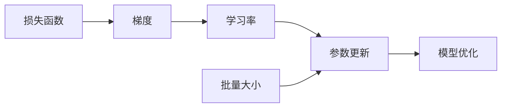

# Stochastic Gradient Descent (SGD) 原理与代码实战案例讲解

## 1.背景介绍

随机梯度下降(Stochastic Gradient Descent, SGD)作为机器学习和深度学习中最常用的优化算法之一,在训练大规模数据集和复杂模型时展现出卓越的性能。本文将深入探讨SGD的原理,阐述其数学模型,并通过代码实例和实际应用场景来帮助读者全面理解和掌握这一重要算法。

### 1.1 机器学习中的优化问题
- 机器学习的本质是通过优化模型参数,使模型在训练数据上的损失最小化
- 常见的损失函数包括均方误差、交叉熵等
- 优化算法的目标是找到损失函数的最小值点

### 1.2 梯度下降法的基本原理
- 梯度下降法通过迭代的方式,沿着损失函数梯度的反方向更新参数
- 学习率决定了每次更新的步长
- 批量梯度下降(BGD)在每次迭代时使用整个训练集计算梯度,更新参数

### 1.3 SGD的优势与挑战
- SGD通过每次随机抽取一个样本来计算梯度,大大加快了训练速度
- 随机性使SGD能够跳出局部最优,更容易收敛到全局最优
- SGD对内存要求低,适用于大规模数据集的训练
- 但SGD的随机性也带来了收敛速度慢、不稳定等问题

## 2.核心概念与联系

### 2.1 损失函数
- 衡量模型预测值与真实值之间的差距
- 常见的损失函数:均方误差(MSE)、交叉熵(Cross-entropy)等
- 损失函数的选择取决于问题的类型(回归、分类等)

### 2.2 梯度
- 多元函数在某一点处沿各个坐标方向的导数构成的向量
- 梯度方向是函数值增加最快的方向
- 梯度的反方向是函数值下降最快的方向

### 2.3 学习率
- 控制每次参数更新的步长
- 学习率过大可能导致优化过程不稳定,甚至无法收敛
- 学习率过小会使收敛速度变慢
- 学习率的选择需要根据具体问题和模型来调整

### 2.4 批量大小
- 每次迭代中用于计算梯度的样本数量
- SGD的批量大小为1,即每次随机选择一个样本
- 小批量随机梯度下降(Mini-batch SGD)在SGD的基础上使用一个小批量的样本
- 批量大小的选择需要权衡计算效率和收敛速度

### 核心概念之间的联系


## 3.核心算法原理具体操作步骤

### 3.1 SGD算法流程
1. 初始化模型参数
2. 重复以下步骤直到满足停止条件:
   a. 从训练集中随机选择一个样本
   b. 计算该样本上的损失函数关于模型参数的梯度
   c. 沿梯度反方向更新模型参数
3. 返回优化后的模型参数

### 3.2 参数更新公式
假设损失函数为$L(θ)$,模型参数为$θ$,学习率为$η$,则参数更新公式为:

$$
θ_{t+1} = θ_t - η·∇L(θ_t)
$$

其中$∇L(θ_t)$表示损失函数在$θ_t$处的梯度。

### 3.3 随机抽样方式
- 随机抽样是SGD的关键步骤,保证了每次更新的随机性
- 常见的抽样方式有:
  - 无放回抽样:每个样本在一个epoch中只被抽取一次
  - 有放回抽样:每次抽样都是独立的,同一个样本可能被多次抽取
- 无放回抽样更常用,可以保证每个样本都参与训练

### 3.4 停止条件的选择
- 迭代次数:预先设定一个最大迭代次数,达到后停止训练
- 验证集性能:在每个epoch结束后在验证集上评估模型性能,如果性能不再提升则停止训练
- 早停法:如果验证集上的性能连续几个epoch没有提升,则停止训练以防止过拟合

## 4.数学模型和公式详细讲解举例说明

### 4.1 二元分类问题中的SGD

考虑一个二元分类问题,使用sigmoid函数作为激活函数,交叉熵作为损失函数。假设样本特征为$x∈ℝ^n$,标签为$y∈{0,1}$,模型参数为$w∈ℝ^n$和$b∈ℝ$。模型的预测值为:

$$
\hat{y} = \sigma(w^Tx + b)
$$

其中sigmoid函数$\sigma(z) = \frac{1}{1+e^{-z}}$。

交叉熵损失函数为:

$$
L(w,b) = -[y·\log(\hat{y}) + (1-y)·\log(1-\hat{y})]
$$

根据链式法则,损失函数关于参数$w$和$b$的梯度为:

$$
\begin{aligned}
\frac{∂L}{∂w} &= (\hat{y} - y)x \\
\frac{∂L}{∂b} &= \hat{y} - y
\end{aligned}
$$

因此,SGD的参数更新公式为:

$$
\begin{aligned}
w_{t+1} &= w_t - η·(\hat{y} - y)x \\
b_{t+1} &= b_t - η·(\hat{y} - y)
\end{aligned}
$$

### 4.2 线性回归问题中的SGD

考虑一个线性回归问题,使用均方误差作为损失函数。假设样本特征为$x∈ℝ^n$,标签为$y∈ℝ$,模型参数为$w∈ℝ^n$和$b∈ℝ$。模型的预测值为:

$$
\hat{y} = w^Tx + b
$$

均方误差损失函数为:

$$
L(w,b) = \frac{1}{2}(\hat{y} - y)^2
$$

损失函数关于参数$w$和$b$的梯度为:

$$
\begin{aligned}
\frac{∂L}{∂w} &= (\hat{y} - y)x \\
\frac{∂L}{∂b} &= \hat{y} - y
\end{aligned}
$$

SGD的参数更新公式与二元分类问题相同:

$$
\begin{aligned}
w_{t+1} &= w_t - η·(\hat{y} - y)x \\
b_{t+1} &= b_t - η·(\hat{y} - y)
\end{aligned}
$$

## 5.项目实践:代码实例和详细解释说明

下面以Python为例,实现SGD算法用于线性回归问题的求解。

```python
import numpy as np

class SGDRegressor:
    def __init__(self, learning_rate=0.01, n_epochs=100):
        self.lr = learning_rate
        self.n_epochs = n_epochs
        self.w = None
        self.b = None

    def fit(self, X, y):
        n_samples, n_features = X.shape
        self.w = np.zeros(n_features)
        self.b = 0

        for _ in range(self.n_epochs):
            for i in range(n_samples):
                rand_index = np.random.randint(n_samples)
                x_i = X[rand_index]
                y_i = y[rand_index]
                y_pred = np.dot(x_i, self.w) + self.b
                dw = (y_pred - y_i) * x_i
                db = y_pred - y_i
                self.w -= self.lr * dw
                self.b -= self.lr * db

    def predict(self, X):
        y_pred = np.dot(X, self.w) + self.b
        return y_pred
```

代码解释:
- 初始化学习率`learning_rate`和迭代次数`n_epochs`
- 在`fit`方法中:
  - 初始化参数`w`和`b`为零
  - 对于每个epoch,随机抽取一个样本,计算预测值和梯度,更新参数
- 在`predict`方法中,使用优化后的参数计算预测值

使用示例:

```python
from sklearn.datasets import make_regression
from sklearn.model_selection import train_test_split

X, y = make_regression(n_samples=100, n_features=1, noise=20, random_state=42)
X_train, X_test, y_train, y_test = train_test_split(X, y, test_size=0.2, random_state=42)

regressor = SGDRegressor(learning_rate=0.01, n_epochs=100)
regressor.fit(X_train, y_train)
y_pred = regressor.predict(X_test)
```

## 6.实际应用场景

### 6.1 大规模机器学习
- SGD能够高效处理海量数据,适用于大规模机器学习问题
- 常见的应用包括:
  - 推荐系统:使用SGD优化矩阵分解模型,从海量用户-物品交互数据中学习用户和物品的隐向量
  - 自然语言处理:使用SGD训练word2vec等词嵌入模型,从大规模文本语料中学习单词的分布式表示

### 6.2 在线学习
- SGD可以实现在线学习,即模型在接收到新数据后能够实时更新参数
- 在线学习在诸如实时异常检测、动态推荐等场景中有广泛应用
- 与批量学习相比,在线学习能够更快地适应数据分布的变化

### 6.3 深度学习
- SGD及其变体(如Momentum、Adagrad、Adam等)是训练深度神经网络的主要优化算法
- 深度学习模型通常包含大量参数,使用SGD能够有效加速训练过程
- 常见的深度学习应用如图像分类、语音识别、机器翻译等都依赖于SGD优化算法

## 7.工具和资源推荐

### 7.1 机器学习库
- scikit-learn:Python机器学习库,提供了SGDClassifier和SGDRegressor等实现
- TensorFlow、PyTorch:深度学习框架,内置了SGD及其变体优化器
- Spark MLlib:分布式机器学习库,支持SGD优化算法

### 7.2 数据集
- MNIST:手写数字识别数据集,常用于测试SGD算法的性能
- ImageNet:大规模图像分类数据集,使用SGD训练的深度卷积神经网络在该数据集上取得了突破性进展
- Netflix Prize:电影推荐数据集,SGD优化的矩阵分解模型在该问题上表现出色

### 7.3 学习资源
- 《机器学习》(周志华):系统介绍了机器学习算法的原理,包括SGD
- 《统计学习方法》(李航):详细讲解了梯度下降法及其变体
- CS231n课程(斯坦福大学):深入浅出地讲解了SGD在深度学习中的应用
- 《Optimization Methods for Large-Scale Machine Learning》(2018):综述了大规模机器学习中的优化算法,重点讨论了SGD及其变体

## 8.总结:未来发展趋势与挑战

### 8.1 SGD的改进与变体
- Momentum:引入动量项,加速SGD收敛并减少震荡
- Adagrad:自适应学习率,为每个参数维护一个学习率
- RMSprop:解决Adagrad学习率过度衰减的问题
- Adam:结合Momentum和RMSprop的优点,自适应调整学习率
- 未来可能会出现更多融合不同思想的SGD变体,进一步提升优化性能

### 8.2 分布式与并行SGD
- 大规模机器学习需要在分布式环境下训练模型
- 异步SGD:每个worker独立进行SGD更新,无需同步等待
- 同步SGD:所有worker同步计算梯度,聚合后再更新参数
- 参数服务器架构:中心化存储和更新模型参数,worker负责计算梯度
- 分布式SGD面临的挑战包括通信开销、负载均衡、容错等

### 8.3 SGD的理论分析
- SGD的收敛性分析:在凸优化问题上,SGD能够以$O(1/\sqrt{T})$的速率收敛到最优解
- SGD在非凸优化问题(如深度学习)中的收敛性尚未完全解决
- 噪声对SGD收敛速度的影响:适当的噪声有助于加速SGD收敛并逃离鞍点
-