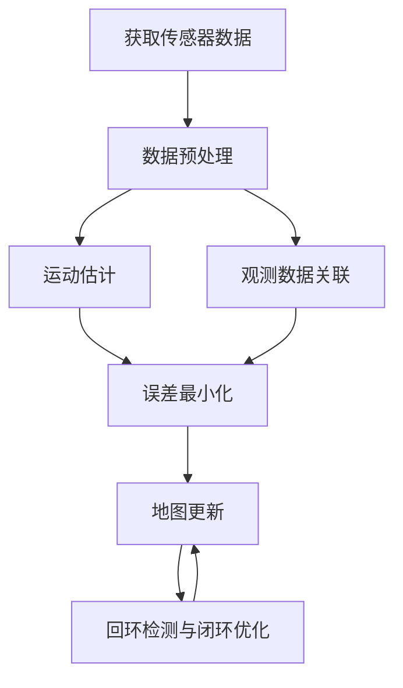

# simultaneous localization and mapping

## 1.背景介绍

### 1.1 什么是SLAM?

同时定位与地图构建(Simultaneous Localization and Mapping, SLAM)是机器人领域中一个核心问题,旨在在未知环境中构建环境地图的同时估计机器人自身在该地图中的位置。SLAM技术广泛应用于自动驾驶汽车、服务机器人、无人机等多个领域。

### 1.2 SLAM的重要性

SLAM是实现真正自主导航的关键技术,它解决了机器人在未知环境中自主探索和建图的难题。有了SLAM,机器人就能够持续定位自身位置,并且逐步构建出环境地图,从而实现自主导航和决策。

### 1.3 SLAM的挑战

SLAM问题是一个典型的鸡生蛋、蛋生鸡的难题。要估计机器人的运动,需要知道环境地图;但要构建环境地图,也需要知道机器人的运动。此外,SLAM还面临着实时性、鲁棒性、计算复杂度等诸多挑战。

## 2.核心概念与联系

### 2.1 概率机器人定位

机器人定位是指估计机器人在给定地图中的位置和姿态。常用的方法有:

- 蒙特卡罗定位(Monte Carlo Localization)
- 卡尔曼滤波定位(Kalman Filter Localization)
- 图优化定位(Graph-based Optimization)

### 2.2 概率地图构建

地图构建是指基于传感器数据构建环境地图的过程。常用的方法有:

- 占据网格地图(Occupancy Grid Mapping)
- 特征点地图(Feature-based Mapping)
- pose SLAM

### 2.3 SLAM中的核心概念

- 前端(Front-end):包括特征提取、数据关联、运动估计等
- 后端(Back-end):包括误差最小化、图优化、非线性最小二乘等
- 回环检测(Loop Closure Detection)
- 里程计(Odometry)

## 3.核心算法原理具体操作步骤

### 3.1 SLAM算法框架

SLAM算法通常包括以下步骤:

1. 获取传感器数据(如激光、视觉等)
2. 数据预处理(如去噪、特征提取等)
3. 运动估计(如里程计等)
4. 观测数据关联
5. 误差最小化(如图优化、滤波等)
6. 地图更新
7. 回环检测与闭环优化



### 3.2 滤波器SLAM

滤波器SLAM利用概率滤波技术(如卡尔曼滤波、粒子滤波等)递归估计机器人位姿和地图。其核心思想是将SLAM问题建模为贝叶斯估计问题。

$$
p(x_t, m | z_{1:t}, u_{1:t}) = \eta p(z_t | x_t, m) \int p(x_t | x_{t-1}, u_t) p(x_{t-1}, m | z_{1:t-1}, u_{1:t-1}) dx_{t-1}
$$

其中$x_t$为时刻t的机器人位姿,$m$为地图,$z_t$为观测,$u_t$为控制输入,$\eta$为归一化常数。

### 3.3 图优化SLAM

图优化SLAM将SLAM问题建模为一个图优化问题,通过最小化误差项来同时估计机器人轨迹和地图。

$$
X^* = \arg\min_X \sum_{i,j \in C} e_{ij}(X_i, X_j)^T \Omega_{ij} e_{ij}(X_i, X_j)
$$

其中$X$为待估计的机器人位姿和地图,$C$为观测约束集合,$e_{ij}$为误差项,$\Omega_{ij}$为信息矩阵。

### 3.4 视觉SLAM

视觉SLAM利用相机作为主要传感器,通过提取和匹配图像特征点来估计相机运动和构建三维点云地图。常用的视觉SLAM算法有ORB-SLAM、DSO、LDSO等。

## 4.数学模型和公式详细讲解举例说明

### 4.1 概率模型

SLAM问题的概率模型可以表示为:

$$
p(x_{1:t}, m | z_{1:t}, u_{1:t}) = \eta p(z_t | x_t, m) \int p(x_t | x_{t-1}, u_t) p(x_{1:t-1}, m | z_{1:t-1}, u_{1:t-1}) dx_{t-1}
$$

其中$x_{1:t}$表示从时刻1到t的机器人轨迹,$m$表示地图,$z_{1:t}$表示观测序列,$u_{1:t}$表示控制输入序列,$\eta$为归一化常数。

该模型描述了在给定观测和控制输入的情况下,机器人轨迹和地图的联合概率分布。它由运动模型$p(x_t | x_{t-1}, u_t)$和观测模型$p(z_t | x_t, m)$组成。

### 4.2 误差模型

在图优化SLAM中,我们需要最小化误差项:

$$
e_{ij}(X_i, X_j) = \begin{pmatrix}
    e_r \\
    e_t
\end{pmatrix} = \begin{pmatrix}
    R_i^T (R_j(p_j - p_i) - t_{ij}) \\
    \log(R_i^TR_j)
\end{pmatrix}
$$

其中$e_r$表示位置误差,$e_t$表示姿态误差,$R_i, p_i$分别表示节点$i$的旋转和平移,$t_{ij}$表示节点$i$到$j$的测量平移向量。

该误差模型反映了估计值与观测值之间的残差,我们希望通过优化使残差最小化。

### 4.3 Bundle Adjustment

Bundle Adjustment(BA)是一种常用的非线性最小二乘优化技术,广泛应用于视觉SLAM中。BA的目标是同时优化相机位姿和三维点云,使重投影误差最小化:

$$
\min_{\mathbf{C}, \mathbf{P}} \sum_{i=1}^{n} \sum_{j=1}^{m_i} \rho \left( \left\| \mathbf{q}_{ij} - \pi(\mathbf{C}_i, \mathbf{P}_j) \right\|_{\Sigma_{ij}}^2 \right)
$$

其中$\mathbf{C}$为相机位姿,$\mathbf{P}$为三维点云,$\mathbf{q}_{ij}$为观测到的二维特征点,$\pi$为投影函数,$\rho$为鲁棒核函数。

## 5.项目实践：代码实例和详细解释说明

这里我们以开源的ORB-SLAM3作为示例,介绍视觉SLAM的实现细节。ORB-SLAM3支持单目、双目和RGB-D相机,能够实时构建稠密点云地图。

### 5.1 ORB特征提取和匹配

ORB-SLAM3使用ORB特征进行特征提取和匹配。ORB特征是一种基于BRIEF描述子的旋转不变特征,具有较好的鲁棒性和计算效率。

```cpp
// 计算ORB特征
void ExtractORB(cv::Mat &img, std::vector<cv::KeyPoint> &keypoints, cv::Mat &descriptors) {
    cv::Ptr<cv::FeatureDetector> detector = cv::ORB::create();
    cv::Ptr<cv::DescriptorExtractor> extractor = cv::ORB::create();
    detector->detect(img, keypoints);
    extractor->compute(img, keypoints, descriptors);
}
```

### 5.2 运动估计

ORB-SLAM3使用双向匹配的方式进行运动估计。首先通过投影模型对三维点云和二维特征点进行匹配,然后使用RANSAC估计相机运动。

```cpp
cv::Mat Tracker::GrabImageRGBD(...)
{
    ...
    mCurrentFrame = Frame(mRgbdImages,...);
    Track();
}

void Tracker::Track()
{
    ...
    if(mState==NO_IMAGES_YET)
        mCurrentFrame.SetPose(mVelocity);
    else
        mMotionModel.UpdateModel();
    ...
}
```

### 5.3 局部建图和回环检测

ORB-SLAM3将地图划分为多个局部地图,每个局部地图由一个关键帧和相邻的普通帧组成。回环检测则通过词袋模型进行快速检测,然后使用相对运动一致性验证回环。

```cpp
bool LocalMapping::Run() {
    ...
    // 关键帧插入
    InsertKeyFrame(mpCurrentKeyFrame);

    // 检查并融合重复的地图点
    ProcessNewKeyFrame();

    // 检查并融合重复的地图点
    MapPointCulling();

    // 创建新的地图点
    SearchInNeighbors();
    ...
}
```

### 5.4 位姿图优化

ORB-SLAM3使用g2o作为后端优化器,通过位姿图优化的方式进行全局一致性优化。

```cpp
void Optimizer::GlobalBundleAdjustemnt(...)
{
    // 设置g2o优化器
    g2o::SparseOptimizer optimizer;
    g2o::BlockSolver_6_3::LinearSolverType * linearSolver;
    ...

    // 添加节点和边
    const vector<KeyFrame*> vpKFs = vpMap->GetAllKeyFrames();
    const vector<MapPoint*> vpMP = vpMap->GetAllMapPoints();
    const unsigned int nInsertedKFs = vpKFs.size();

    // 优化
    optimizer.initializeOptimization();
    optimizer.optimize(nIterations);
    ...
}
```

上述只是ORB-SLAM3的一个简单示例,实际代码实现远比这复杂得多。通过这个例子,我们可以看到视觉SLAM系统是如何通过特征提取、运动估计、局部建图、回环检测和图优化等模块协同工作的。

## 6.实际应用场景

SLAM技术在多个领域都有广泛的应用,下面列举了一些典型场景:

### 6.1 自动驾驶

在自动驾驶汽车中,SLAM技术被用于精确定位和高精度地图构建,为自动驾驶决策提供关键输入。

### 6.2 增强现实(AR)

通过SLAM技术,AR设备(如智能手机、AR眼镜等)能够精确估计自身位姿,并将虚拟物体稳定渲染到真实环境中。

### 6.3 机器人导航

SLAM使服务机器人能够在未知环境中自主探索和构建地图,从而实现自主导航和任务执行。

### 6.4 三维重建

利用SLAM技术,可以通过移动相机或深度相机获取场景的三维结构信息,广泛应用于三维建模、文物保护等领域。

### 6.5 无人机导航

无人机上的SLAM系统能够实时估计飞行器位姿和构建三维地图,从而实现自主导航和避障。

## 7.工具和资源推荐

### 7.1 开源SLAM库

- ORB-SLAM3: 支持单目、双目和RGB-D相机的视觉SLAM库
- Cartographer: 谷歌开源的实时SLAM库,支持2D和3D
- RTAB-Map: 基于RGB-D相机的SLAM库

### 7.2 SLAM数据集

- KITTI: 自动驾驶数据集,包含激光雷达、视觉等传感器数据
- EuRoC: 微型无人机数据集,包含视觉、IMU等数据
- TUM RGB-D: RGB-D SLAM数据集

### 7.3 SLAM教程和课程

- 塞维利亚大学SLAM教程
- 多伦多大学SLAM课程
- 清华大学SLAM课程

### 7.4 SLAM会议和期刊

- IEEE International Conference on Robotics and Automation (ICRA)
- IEEE/RSJ International Conference on Intelligent Robots and Systems (IROS)
- International Journal of Robotics Research (IJRR)

## 8.总结：未来发展趋势与挑战

SLAM是机器人领域的核心技术之一,在过去几十年中取得了长足的进步。但仍然存在一些亟待解决的挑战和发展趋势:

### 8.1 鲁棒性和实时性

提高SLAM系统在复杂环境下的鲁棒性和实时性,满足实际应用的严格要求。

### 8.2 语义SLAM

融合深度学习技术,实现基于语义理解的SLAM,提升场景理解能力。

### 8.3