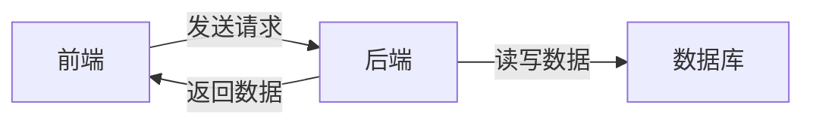

# 个人博客Blog建设系统详细设计与具体代码实现

## 1. 背景介绍

在当今互联网时代,个人博客已经成为一种流行的表达自我、分享知识和经验的方式。越来越多的人希望拥有自己的个人博客网站,但是对于非技术背景的人来说,从零开始搭建一个博客系统可能是一个不小的挑战。本文将详细介绍如何从零开始设计并实现一个完整的个人博客系统,包括前端界面设计、后端服务开发以及数据库设计等方面。通过本文的学习,读者可以掌握博客系统的核心概念和实现原理,并能够动手实践,开发出一个属于自己的个人博客网站。

### 1.1 个人博客的价值和意义

个人博客不仅仅是一个展示自我的平台,更是一个连接作者与读者的桥梁。通过博客,我们可以:

- 记录和分享自己的学习心得、生活感悟、旅行见闻等
- 与志同道合的读者交流想法,碰撞思想的火花
- 提升自己的写作能力和逻辑思维能力
- 积累知识和经验,为未来的发展奠定基础

### 1.2 博客系统开发的必要性

市面上有许多现成的博客平台如WordPress、Hexo等,为什么我们还要从头开发一个博客系统呢?主要有以下几点原因:

- 学习价值:通过自己动手从零开始,能够对系统架构、开发流程有更深入的理解
- 可定制性:自己开发的博客系统可以根据自己的需求量身定制,不受限于现有平台
- 数据所有权:博客的所有数据掌握在自己手中,不用担心平台倒闭或封号
- 技术积累:整个开发过程是一次难得的全栈开发经历,技术积累价值极高

## 2. 核心概念与联系

在正式进入博客系统的设计与实现之前,我们先来了解一下博客系统涉及到的几个核心概念:

### 2.1 前端(Frontend)

前端指的是博客网站的用户界面部分,主要由HTML、CSS、JavaScript等Web技术构成,负责数据展示和交互。

### 2.2 后端(Backend)

后端指的是服务器端,负责处理前端的请求,提供数据支持,通常采用某种服务端编程语言如Java、Python、Node.js等。

### 2.3 数据库(Database)

数据库用于存储博客的各种数据,如文章、分类、标签、用户信息等。常见的数据库有MySQL、MongoDB等。

### 2.4 Restful API

Restful API是前后端通信的接口规范,采用HTTP协议,通过GET、POST等方法实现数据的增删改查。

它们之间的关系如下图所示:



可见,前端通过Restful API与后端通信,后端负责业务逻辑处理,并与数据库交互,最终将结果返回给前端显示。

## 3. 核心算法原理具体操作步骤

接下来我们将对博客系统的几个核心算法和操作步骤进行详细讲解。

### 3.1 文章展示的分页算法

博客文章数量多时需要分页展示,后端需要实现分页查询算法。以MySQL数据库为例:

```sql
SELECT * FROM article
ORDER BY create_time DESC
LIMIT (pageNum - 1) * pageSize, pageSize
```

其中,pageNum为页码,pageSize为每页大小。该SQL语句会根据文章的创建时间倒序排列,并根据页码和每页大小截取对应区间的数据。

### 3.2 文章内容的Markdown解析

博客文章通常采用Markdown格式编写,前端需要将Markdown解析成HTML。可以使用一些开源的Markdown解析器,如marked.js:

```js
import marked from 'marked';

const markdown = '# 标题\n正文内容';
const html = marked(markdown);
console.log(html); // <h1>标题</h1><p>正文内容</p>
```

### 3.3 文章搜索的倒排索引

为了加快文章搜索速度,可以对文章内容建立倒排索引。倒排索引的核心思想是:

1. 将文章内容分词,提取关键词
2. 创建关键词到文章ID的映射关系

搜索时,对搜索词分词,然后查找关键词对应的文章ID即可。

### 3.4 标签云的权重计算

标签云展示了博客的所有标签,标签的大小根据使用频率确定。假设标签数组为tags,每个标签对象的属性为name和count,则权重的计算公式为:

$$
weight_i = \frac{count_i - min}{max - min} * (max\_font\_size - min\_font\_size) + min\_font\_size
$$

其中,min和max分别为count的最小值和最大值,max_font_size和min_font_size为字体大小的上下界。

## 4. 数学模型和公式详细讲解举例说明

在博客系统中,有一些功能需要借助数学模型和公式来实现,下面我们举例说明。

### 4.1 文章相似度计算

我们可以利用余弦相似度公式来计算两篇文章的相似程度。假设文章A和B的关键词向量分别为a和b,则它们的相似度为:

$$
similarity = \frac{a · b}{||a|| \times ||b||}
$$

其中,·表示向量点积,||表示向量模长,计算公式为:

$$
||a|| = \sqrt{\sum_{i=1}^n a_i^2}
$$

### 4.2 热度排名算法

对于一些根据热度排名的功能,如阅读量最高的文章、最受欢迎的标签等,可以采用类似Reddit的热度排名算法:

$$
Hot(item) = log(p) + \frac{t - t_0}{45000}
$$

其中,p为item的得分(如阅读量),t为当前时间戳,t0为item的创建时间戳,45000为一个时间常量,可以根据实际情况调整。

该公式的特点是,得分越高、时间越新的item排名越靠前,随着时间推移,排名会逐渐下降,符合热度衰减规律。

## 5. 项目实践:代码实例和详细解释说明

下面我们将结合代码实例,对博客系统的一些核心功能进行讲解。

### 5.1 博客文章的CRUD

以Node.js + Express + MongoDB为例,实现博客文章的增删改查。

```js
// 文章Model
const mongoose = require('mongoose');
const articleSchema = new mongoose.Schema({
  title: String,
  content: String,
  viewCount: Number,
  createdAt: Date,
  updatedAt: Date,
});
const Article = mongoose.model('Article', articleSchema);

// 创建文章
app.post('/api/articles', async (req, res) => {
  const article = new Article(req.body);
  await article.save();
  res.send(article);
});

// 获取所有文章
app.get('/api/articles', async (req, res) => {
  const pageNum = parseInt(req.query.pageNum) || 1;
  const pageSize = parseInt(req.query.pageSize) || 10;
  const articles = await Article
    .find()
    .sort({createdAt: -1})
    .skip((pageNum - 1) * pageSize)
    .limit(pageSize);
  res.send(articles);
});

// 获取单个文章
app.get('/api/articles/:id', async (req, res) => {
  const article = await Article.findById(req.params.id);
  await article.update({$inc: {viewCount: 1}}); // 浏览量+1
  res.send(article);
});

// 更新文章
app.put('/api/articles/:id', async (req, res) => {
  const article = await Article.findByIdAndUpdate(
    req.params.id,
    req.body,
    {new: true}
  );
  res.send(article);
});

// 删除文章
app.delete('/api/articles/:id', async (req, res) => {
  await Article.findByIdAndDelete(req.params.id);
  res.send({message: '删除成功'});
});
```

### 5.2 Markdown编辑器

前端采用一些开源的Markdown编辑器如SimpleMDE,Vue代码如下:

```vue
<template>
  <div>
    <textarea ref="textarea"></textarea>
  </div>
</template>

<script>
import SimpleMDE from 'simplemde';
import 'simplemde/dist/simplemde.min.css';

export default {
  props: ['value'],
  mounted() {
    this.simplemde = new SimpleMDE({
      element: this.$refs.textarea,
      initialValue: this.value,
    });
    this.simplemde.codemirror.on('change', () => {
      this.$emit('input', this.simplemde.value());
    });
  },
  destroyed() {
    this.simplemde = null;
  }
}
</script>
```

### 5.3 文章内容检索

可以使用Elasticsearch来实现文章内容的检索。Node.js示例代码如下:

```js
const elasticsearch = require('elasticsearch');
const client = new elasticsearch.Client({
  host: 'localhost:9200'
});

// 创建索引
client.indices.create({
  index: 'blog'
}, (err) => {
  if (err) console.log(err);
});

// 新增文档
client.index({
  index: 'blog',
  type: 'article',
  body: {
    title: '文章标题',
    content: '文章内容',
  }
}, (err, resp) => {
  if (err) console.log(err);
});

// 搜索文档
client.search({
  index: 'blog',
  q: '关键词',
}, (err, resp) => {
  if (err) console.log(err);
  console.log(resp.hits.hits);
});
```

## 6. 实际应用场景

个人博客系统可以应用于以下几个场景:

- 个人知识管理:通过写博客总结学习过程中的心得体会,方便日后复习回顾
- 技术分享:撰写技术博客分享自己的开发经验,帮助他人解决问题
- 个人品牌打造:高质量的博客有助于提升个人影响力,为未来的职业发展奠定基础
- 商业变现:优质的博客可以通过接广告、写付费专栏、出版图书等方式实现商业价值

## 7. 工具和资源推荐

- 前端框架:Vue.js、React、Angular
- UI组件库:Element UI、Ant Design、Bootstrap
- 后端框架:Express、Koa、Egg
- 服务器环境:Node.js、Nginx
- 数据库:MongoDB、MySQL
- 部署工具:Docker、Git
- Markdown编辑器:SimpleMDE、Typora
- 图床:七牛云、又拍云、GitHub

## 8. 总结:未来发展趋势与挑战

随着技术的发展,个人博客系统也面临着新的机遇和挑战:

- Serverless架构的兴起,可以让博客的开发部署更加便捷
- AI辅助写作工具的出现,有望提高内容生产效率
- 算法推荐、个性化定制将成为博客系统的标配
- 移动端阅读需求增加,需要兼顾PC和移动端的适配
- 用户互动和社交元素越来越重要,评论、点赞等功能不可或缺

## 9. 附录:常见问题与解答

### 问题1:如何备份博客数据?

定期将数据库导出为SQL文件或者JSON文件,保存在本地或者云端。

### 问题2:如何提高博客的访问速度?

- 开启gzip压缩
- 配置CDN加速
- 优化数据库查询
- 减小页面体积,压缩JS/CSS文件

### 问题3:如何防止博客被恶意攻击?

- 隐藏管理后台地址
- 修改数据库默认端口
- 限制同一IP的访问频率
- 定期备份数据库
- 及时更新系统和软件版本

---

作者:禅与计算机程序设计艺术 / Zen and the Art of Computer Programming