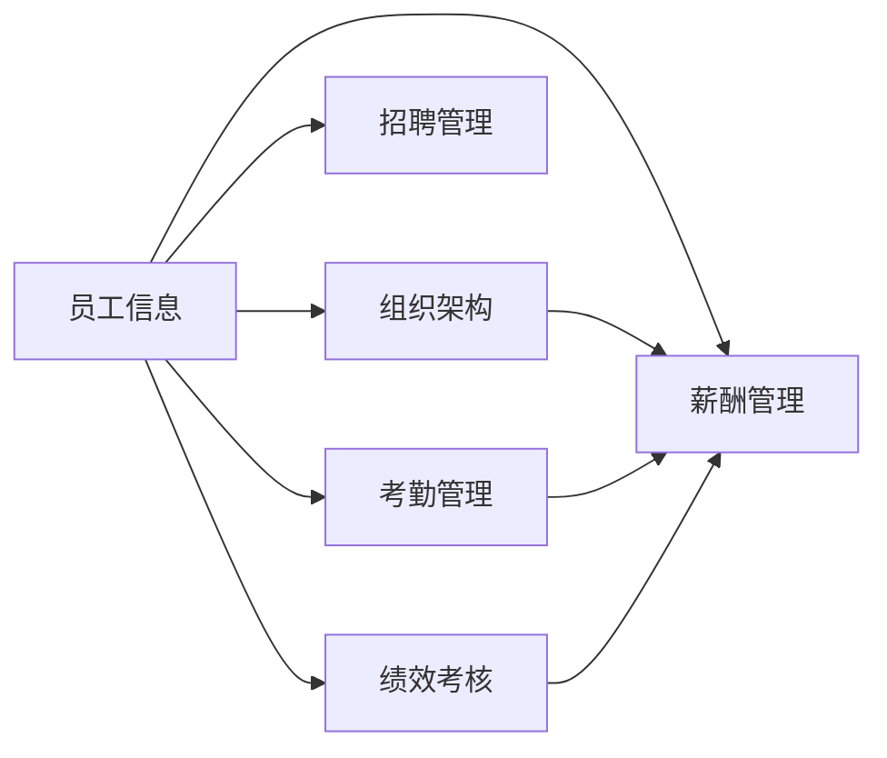

# 人事管理系统设计与实现

## 1.背景介绍

在现代企业管理中,人力资源管理是一个非常重要的环节。传统的人事管理方式效率低下,无法满足企业快速发展的需求。因此,开发一套功能完善、高效实用的人事管理系统就显得尤为重要。

本文将详细介绍一个基于 Web 的人事管理系统的设计与实现过程,该系统采用 B/S 架构,后端使用 Java 语言,前端采用 Vue.js 框架。系统主要包括员工信息管理、招聘管理、考勤管理、薪酬管理、绩效考核等模块,旨在提高人事管理工作效率,为企业的人力资源管理提供有力支撑。

### 1.1 人事管理系统的意义
#### 1.1.1 提高人事管理效率
#### 1.1.2 规范人事管理流程  
#### 1.1.3 为企业决策提供数据支持

### 1.2 系统目标与应用前景
#### 1.2.1 系统目标
#### 1.2.2 应用前景

## 2.核心概念与联系

人事管理系统涉及的核心概念包括:

- 员工信息:包括员工的基本信息、教育背景、工作经历等。
- 组织架构:反映企业内部的部门设置和汇报关系。
- 招聘管理:包括职位发布、简历筛选、面试安排、offer发放等环节。  
- 考勤管理:对员工的出勤情况进行记录和统计。
- 薪酬管理:包括薪资的计算、发放、调整等。
- 绩效考核:对员工的工作表现进行评估和反馈。

这些概念之间的关系如下图所示:



由图可见,员工信息是整个系统的基础,与其他模块都有关联。组织架构体现了员工之间的上下级关系,影响到薪酬的计算。考勤和绩效又是薪酬的重要依据。因此各个模块之间是相辅相成、密不可分的。

## 3.核心算法原理具体操作步骤

系统中使用的核心算法主要有:

### 3.1 考勤统计算法
#### 3.1.1 每日考勤数据采集
#### 3.1.2 考勤异常处理
#### 3.1.3 月度考勤汇总

### 3.2 薪酬计算算法  
#### 3.2.1 基本工资计算
#### 3.2.2 绩效工资计算
#### 3.2.3 加班工资计算
#### 3.2.4 个税计算

### 3.3 绩效考核算法
#### 3.3.1 考核指标设置  
#### 3.3.2 考核结果计算
#### 3.3.3 考核结果应用

以薪酬计算为例,具体步骤如下:

1. 获取员工基本信息,包括岗位、职级、工龄等
2. 根据岗位职级对应的薪酬标准,计算基本工资
3. 获取员工当月考勤数据,计算出勤天数
4. 获取员工当月绩效考核结果 
5. 根据出勤天数、绩效结果,计算绩效工资
6. 获取加班数据,计算加班工资
7. 基本工资+绩效工资+加班工资得到应发工资
8. 计算个人所得税,从应发工资中扣除,得到实发工资
9. 数据保存并生成工资条

## 4.数学模型和公式详细讲解举例说明

在薪酬计算过程中,我们用到了以下数学模型和公式:

### 4.1 基本工资计算

基本工资根据员工的岗位和职级确定,可以用一个二维数组$S$来表示:

$$
S = 
\begin{bmatrix}
S_{11} & S_{12} & \cdots & S_{1n}\
S_{21} & S_{22} & \cdots & S_{2n}\
\vdots & \vdots & \ddots & \vdots\
S_{m1} & S_{m2} & \cdots & S_{mn}\
\end{bmatrix}
$$

其中$S_{ij}$表示第$i$个岗位第$j$个职级的基本工资标准。

假设员工A的岗位编号为$p$,职级编号为$l$,则其基本工资$B$为:

$$B = S_{pl}$$

### 4.2 绩效工资计算

绩效工资根据基本工资和绩效考核系数计算,假设绩效考核分为A、B、C、D四个等级,对应的绩效系数为$k_A$,$k_B$,$k_C$,$k_D$,则员工的绩效工资$P$为:

$$
P = 
\begin{cases}
B \times k_A, & \text{绩效等级为A}\
B \times k_B, & \text{绩效等级为B}\  
B \times k_C, & \text{绩效等级为C}\
B \times k_D, & \text{绩效等级为D}
\end{cases}
$$

### 4.3 个税计算

个人所得税采用梯度计算方式,设月应纳税所得额为$T$,则:

$$
\text{个税} =  
\begin{cases}
T \times 3\%, & 0 < T \leq 3000 \
T \times 10\% - 210, & 3000 < T \leq 12000 \
T \times 20\% - 1410, & 12000 < T \leq 25000 \  
T \times 25\% - 2660, & 25000 < T \leq 35000 \
T \times 30\% - 4410, & 35000 < T \leq 55000 \
T \times 35\% - 7160, & 55000 < T \leq 80000 \
T \times 45\% - 15160, & 80000 < T
\end{cases}
$$

## 5.项目实践：代码实例和详细解释说明

下面以Java代码为例,展示薪酬计算的核心逻辑:

```java
public class SalaryCalculator {
    
    private int[][] salaryLevel = {{3000,3500,4000},{5000,5500,6000}}; //岗位职级工资标准
    
    private double[] performanceRatio = {1.2, 1.0, 0.8, 0.6}; //绩效系数
    
    //计算基本工资
    private int getBasicSalary(int positionLevel, int rankLevel){
        return salaryLevel[positionLevel-1][rankLevel-1];
    }
    
    //计算绩效工资
    private double getPerformanceSalary(int basicSalary, String performanceGrade){
        double ratio = 0;
        switch (performanceGrade){
            case "A": ratio = performanceRatio[0];break;
            case "B": ratio = performanceRatio[1];break;  
            case "C": ratio = performanceRatio[2];break;
            case "D": ratio = performanceRatio[3];break;
            default: break; 
        }
        return basicSalary * ratio;
    }
    
    //计算个人所得税
    private double getPersonalIncomeTax(int salary){
        if(salary <= 3000){
            return salary * 0.03;
        }else if(salary <= 12000){
            return salary * 0.1 - 210; 
        }else if(salary <= 25000){
            return salary * 0.2 - 1410;
        }else if(salary <= 35000){
            return salary * 0.25 - 2660;
        }else if(salary <= 55000){
            return salary * 0.3 - 4410;
        }else if(salary <= 80000){
            return salary * 0.35 - 7160;
        }else{
            return salary * 0.45 - 15160;
        }
    }
    
    //计算实发工资
    public double calculate(int positionLevel, int rankLevel, String performanceGrade){
        int basicSalary = getBasicSalary(positionLevel, rankLevel);
        double performanceSalary = getPerformanceSalary(basicSalary, performanceGrade);
        int totalSalary = (int)(basicSalary + performanceSalary);
        double tax = getPersonalIncomeTax(totalSalary);
        return totalSalary - tax;  
    }
}
```

以上代码实现了基本工资、绩效工资的计算,并根据应税工资计算个人所得税,最终得到实发工资。其中:

- `salaryLevel`数组存储了各个岗位职级的基本工资标准
- `performanceRatio`数组存储了各个绩效等级对应的绩效系数
- `getBasicSalary`方法根据岗位和职级获取基本工资
- `getPerformanceSalary`方法根据绩效等级计算绩效工资  
- `getPersonalIncomeTax`方法根据应税工资计算个税
- `calculate`方法综合以上计算过程,得到最终实发工资

实际项目中,还需要从数据库中读取员工信息,并将计算结果写回数据库,这里不再赘述。

## 6.实际应用场景

人事管理系统在企业的日常运作中应用广泛,下面列举几个典型场景:

### 6.1 员工入职

- 人事专员在系统中录入员工信息,包括基本信息、合同信息等
- 系统根据员工岗位自动生成薪酬标准,并关联考勤、社保等信息
- 员工领取工牌,系统记录并关联门禁权限

### 6.2 员工离职

- 人事专员在系统中发起离职流程
- 系统自动回收门禁权限,停止薪酬发放
- 财务根据系统信息计算离职补偿金

### 6.3 例行调薪

- 人事经理在系统中发起调薪流程,录入调薪方案
- 系统自动计算调薪后的薪酬标准,生成调薪通知单
- 流程审批通过后,系统自动按新的标准计算薪酬

可以看出,人事管理系统贯穿了员工入职到离职的全生命周期,极大地提升了人事管理的效率和准确性。

## 7.工具和资源推荐

在人事管理系统的开发过程中,我们使用了以下工具和资源,推荐给大家:

- 项目管理:Jira、Confluence
- 版本控制:GitLab
- 开发IDE:IntelliJ IDEA、WebStorm
- 数据库:MySQL
- Java框架:Spring Boot、MyBatis  
- 前端框架:Vue.js、Element UI
- 中间件:Redis、RocketMQ
- 接口文档:Swagger
- 持续集成:Jenkins

除此之外,我们的项目参考了以下资源:

- 《Java编程思想》
- 《Effective Java》
- 《阿里巴巴Java开发手册》
- 《人力资源管理》

对于项目团队的新成员,我们建议先学习以上资源,并熟悉我们的项目架构和代码规范,然后再参与到具体模块的开发中来。

## 8.总结：未来发展趋势与挑战

随着人工智能、大数据等新兴技术的发展,人事管理系统也面临着新的机遇和挑战:

### 8.1 智能化

利用机器学习算法,实现简历筛选、面试评估的智能化,提高招聘效率;结合自然语言处理技术,开发智能问答机器人,辅助员工自助查询。

### 8.2 数据化  

利用大数据分析,挖掘人才流失规律,预测离职风险;分析员工画像,优化人员配置;追踪员工成长轨迹,制定个性化培养方案。

### 8.3 移动化

顺应移动办公趋势,开发移动端App,支持员工自助办理事项,随时随地查询个人信息。

### 8.4 平台化

从单一系统向人力资源管理平台发展,打通组织架构、人事、薪酬、绩效、培训等各个模块,实现数据共享和流程贯通。

要实现以上目标,我们还需要攻克以下技术难题:

- 海量数据存储与计算
- 复杂算法的工程化实现
- 移动端与后台的安全高效对接
- 各类系统与平台的互联互通

这需要我们在夯实基础的同时,持续学习创新,与时俱进。让我们携手并进,共同打造下一代人事管理系统!

## 9.附录：常见问题与解答

### Q1:系统是否支持多公司、多语言?

答:支持。系统采用多租户架构,可以灵活配置多个公司,每个公司可以独立设置组织架构、人事策略等。同时,系统支持多语言切换,可以满足跨国企业的需求。