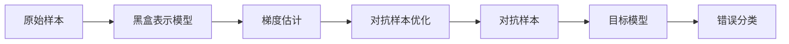

# 剖析GhostNet:AI黑盒攻击的本质探讨

## 1.背景介绍
### 1.1 人工智能系统的脆弱性
### 1.2 对抗性攻击的兴起
### 1.3 GhostNet的出现及影响

## 2.核心概念与联系
### 2.1 对抗性攻击
#### 2.1.1 定义
#### 2.1.2 类型
#### 2.1.3 特点
### 2.2 黑盒攻击
#### 2.2.1 定义
#### 2.2.2 与白盒攻击的区别
#### 2.2.3 黑盒攻击的优势
### 2.3 GhostNet
#### 2.3.1 GhostNet的原理
#### 2.3.2 GhostNet的攻击过程
#### 2.3.3 GhostNet的危害

## 3.核心算法原理具体操作步骤
### 3.1 目标模型的黑盒表示
### 3.2 生成对抗样本
#### 3.2.1 梯度估计
#### 3.2.2 扰动生成
#### 3.2.3 样本优化
### 3.3 转移对抗样本
#### 3.3.1 模型间的转移
#### 3.3.2 任务间的转移
#### 3.3.3 物理世界的转移

## 4.数学模型和公式详细讲解举例说明
### 4.1 问题定义与数学建模
### 4.2 目标函数与约束条件
### 4.3 优化算法推导
### 4.4 收敛性分析

## 5.项目实践：代码实例和详细解释说明
### 5.1 环境配置
### 5.2 数据集准备
### 5.3 模型搭建
### 5.4 对抗样本生成
### 5.5 攻击效果评估

## 6.实际应用场景
### 6.1 人脸识别系统
### 6.2 自动驾驶系统
### 6.3 恶意软件检测
### 6.4 垃圾邮件识别

## 7.工具和资源推荐
### 7.1 主流机器学习框架
### 7.2 对抗样本生成工具
### 7.3 模型鲁棒性评估工具
### 7.4 相关论文与学习资源

## 8.总结：未来发展趋势与挑战
### 8.1 AI系统安全的重要性
### 8.2 黑盒攻击的发展趋势
### 8.3 防御策略的探索
### 8.4 未来研究方向

## 9.附录：常见问题与解答
### 9.1 什么是对抗性攻击？
### 9.2 黑盒攻击与白盒攻击有何区别？
### 9.3 如何评估AI系统面对对抗攻击的鲁棒性？
### 9.4 针对黑盒攻击，有哪些可行的防御策略？

---

## 1.背景介绍

人工智能技术的快速发展为我们的生活带来了诸多便利，但与此同时，AI系统的脆弱性也日益凸显。研究表明，许多看似"智能"的AI模型实际上极易受到恶意攻击的影响，轻则导致判断失误，重则可能酿成灾难性后果。其中，对抗性攻击（Adversarial Attack）就是一种典型的威胁。

所谓对抗性攻击，是指攻击者通过向原始样本中加入人眼难以察觉的细微扰动，从而使得AI模型对其输出错误预测结果的一种方法。自2014年Szegedy等人首次提出这一概念以来，对抗性攻击迅速成为AI安全领域的研究热点。一系列相关工作相继问世，如FGSM、DeepFool、C&W攻击等，它们从不同角度展示了对抗样本的强大威力。

值得注意的是，已有的对抗攻击大多属于白盒攻击，即攻击者可以完全访问目标模型的结构和参数。然而在现实场景中，AI系统通常是部署在远程服务器上的黑盒模型，攻击者无法直接获取其内部信息。因此，如何在黑盒条件下实现高效、隐蔽的对抗攻击，成为了一个亟待解决的难题。

最近，一种名为GhostNet的新型黑盒攻击方法引起了学界的广泛关注。它通过巧妙的梯度估计技术，在仅能访问模型输出的情况下生成了高质量的对抗样本，并实现了跨模型、跨任务的攻击迁移。GhostNet的出现，使得AI系统面临的安全威胁进一步加剧，同时也为对抗攻防领域开辟了新的研究方向。

本文将围绕GhostNet展开深入探讨。我们首先介绍对抗攻击的基本概念和黑盒攻击的特点，然后重点剖析GhostNet的核心原理和算法流程。通过理论分析和代码实践，揭示其内在机理和实现细节。在此基础上，我们进一步讨论GhostNet在人脸识别、自动驾驶等领域的潜在应用，以及AI系统防御黑盒攻击的可能策略。最后，对未来对抗攻防技术的发展趋势和面临的挑战进行展望。

## 2.核心概念与联系

### 2.1 对抗性攻击

#### 2.1.1 定义

对抗性攻击是指利用人工合成的、蕴含特定扰动的数据样本，误导机器学习模型做出错误判断的一种方法。形式化地，给定一个训练完成的模型$f$和原始样本$x$，对抗性攻击的目标是找到一个扰动$\delta$，使得扰动后的样本$x'=x+\delta$被模型$f$错误分类，且$\delta$满足某种约束（如$l_p$范数小于给定阈值）。

#### 2.1.2 类型

根据攻击者可获取的模型信息，对抗性攻击可分为白盒攻击和黑盒攻击两大类：

- 白盒攻击：攻击者可以完全访问目标模型的结构和参数，并利用这些信息精心构造对抗样本。代表性方法有FGSM、BIM、DeepFool等。

- 黑盒攻击：攻击者无法直接获取目标模型的内部信息，只能访问模型的输入和输出接口。黑盒攻击通常基于迁移性或者查询的思想，如ZOO、NES等。

此外，根据对抗样本是否需要被正确分类，对抗攻击还可分为非定向攻击和定向攻击。前者只要求对抗样本被错分类，后者则要求其被分入指定类别。

#### 2.1.3 特点

对抗样本具有以下几个显著特点：

- 扰动微小：对抗样本与原始样本的差异往往非常细微，肉眼难以察觉。这是由约束条件决定的，过大的扰动会使对抗样本失去隐蔽性。

- 迁移性强：在某个模型上生成的对抗样本，可能同样会误导其他结构和参数不同的模型。这为黑盒攻击提供了可能。

- 目标特异：不同样本所需的对抗扰动往往不尽相同，这意味着对抗样本需要针对具体目标"量身定制"。

### 2.2 黑盒攻击

#### 2.2.1 定义

黑盒攻击，是指在无法访问目标模型内部信息（如网络结构、参数权重等）的情况下，仅利用模型的输入输出对其进行攻击的方法。形式化地，给定原始样本$x$，黑盒模型$f$，黑盒攻击旨在找到扰动$\delta$，使得$f(x+\delta) \neq f(x)$。

#### 2.2.2 与白盒攻击的区别

相比白盒攻击，黑盒攻击面临更大的挑战，主要体现在：

- 信息受限：黑盒条件下，攻击者无法直接获取模型梯度等重要信息，难以直接求解扰动。

- 优化困难：由于缺乏模型内部信息，黑盒攻击通常依赖启发式优化或数值估计，收敛速度慢、计算开销大。

- 鲁棒性差：黑盒攻击生成的对抗样本针对性不强，容易被目标模型的细微变化所影响。

#### 2.2.3 黑盒攻击的优势

尽管存在诸多挑战，但黑盒攻击仍然具有其独特的优势：

- 适用性强：黑盒攻击对目标模型的访问仅限于输入输出接口，这与大多数实际场景相符。

- 隐蔽性高：黑盒攻击无需探查模型内部，相比白盒攻击更难被目标系统察觉。

- 评估全面：黑盒攻击可以客观评估AI系统面对未知威胁的鲁棒性，具有重要的安全测试意义。

### 2.3 GhostNet

#### 2.3.1 GhostNet的原理

GhostNet是一种先进的黑盒对抗攻击方法，其核心思想是通过少量查询估计目标模型的梯度信息，进而高效生成对抗样本。具体而言，GhostNet分为三个关键步骤：

1. 目标模型的黑盒表示：用一个参数化的函数（通常是神经网络）去拟合黑盒模型的判别边界，将其映射为连续可微的形式。

2. 梯度信息的估计：在黑盒表示的基础上，利用有限差分等数值方法估计样本点处的梯度信息，用于指导对抗样本的生成。

3. 对抗样本的优化：基于估计的梯度信息，通过投影梯度下降等优化算法迭代更新对抗扰动，使其在满足约束的同时最大程度地影响目标模型的判别。

#### 2.3.2 GhostNet的攻击过程

下图展示了GhostNet的整体攻击流程：

首先，GhostNet根据原始样本和黑盒模型的输入输出训练一个黑盒表示模型。然后，它在该模型上应用梯度估计技术，获取样本点的梯度信息。接着，GhostNet利用估计的梯度指导对抗样本的优化，通过迭代更新不断提升其攻击效果。最终，生成的对抗样本被发送至目标模型，使其产生错误分类。

#### 2.3.3 GhostNet的危害

GhostNet的出现，使得AI系统面临更加严峻的安全挑战：

- 攻击效率高：通过黑盒表示和梯度估计，GhostNet能够以较低的查询开销生成高质量对抗样本，大大提升了黑盒攻击的效率。

- 适用范围广：GhostNet可以适配各种类型的机器学习模型，包括深度神经网络、决策树、支持向量机等，攻击目标不再局限。

- 迁移性强：GhostNet生成的对抗样本展现出了优异的迁移能力，可以在不同模型、不同任务间保持较高的攻击成功率。

- 危害巨大：一旦GhostNet被恶意利用，可能导致人脸识别、自动驾驶等关键AI系统发生重大失误，后果不堪设想。

因此，深入研究GhostNet的原理和特点，探索相应的防御策略，对于保障AI系统安全和社会稳定至关重要。

## 3.核心算法原理具体操作步骤

本节将详细介绍GhostNet的核心算法原理，主要包括三个关键步骤：目标模型的黑盒表示、对抗样本的生成和迁移。

### 3.1 目标模型的黑盒表示

黑盒表示是GhostNet的基础，其目的是用一个参数化的可微函数去近似目标模型的判别边界，为后续的梯度估计创造条件。设目标模型为$f$，GhostNet采用如下形式的黑盒表示模型$g_{\theta}$：

$$g_{\theta}(x) = \sigma(\theta^T \phi(x))$$

其中$\phi