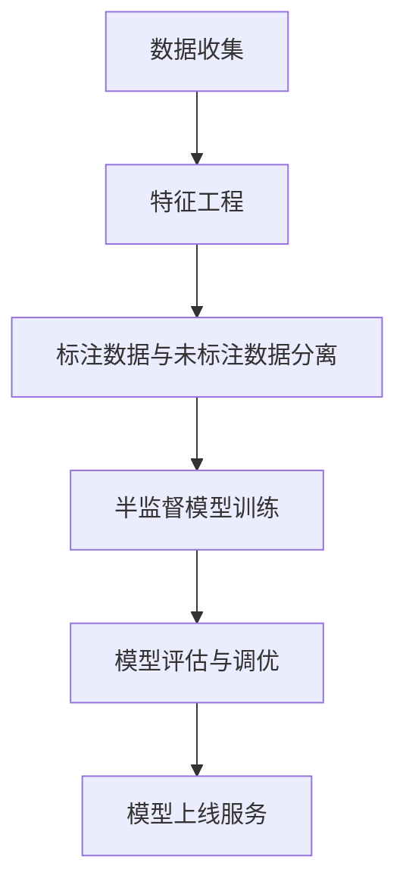
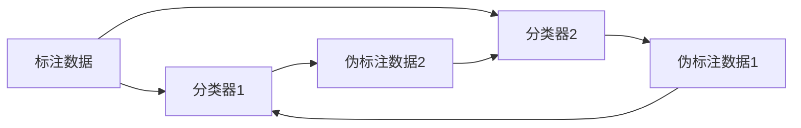

# 半监督学习在推荐系统中的应用

## 1.背景介绍

### 1.1 推荐系统的重要性

在当今信息过载的时代,推荐系统已经无处不在,它可以帮助用户从海量信息中发现感兴趣的内容。推荐系统广泛应用于电子商务、在线视频、新闻资讯、社交网络等领域,为用户提供个性化的内容推荐,提升用户体验,增加用户粘性。

### 1.2 推荐系统的挑战

构建高质量的推荐系统面临着诸多挑战:

- 数据稀疏性:用户对商品的显式反馈数据(如评分)通常很稀疏
- 冷启动问题:对新用户或新商品缺乏足够的历史数据
- 数据标注成本高:需要大量人工标注数据作为监督信号

### 1.3 半监督学习的优势

半监督学习可以利用大量未标注数据和少量标注数据进行训练,克服了监督学习对大量标注数据的依赖。在推荐系统中应用半监督学习可以:

- 利用大量未标注的用户行为数据(如浏览记录)
- 降低人工标注数据的成本
- 提高推荐系统的泛化能力

## 2.核心概念与联系

### 2.1 半监督学习

半监督学习是介于监督学习和非监督学习之间的一种机器学习范式,它同时利用少量标注数据和大量未标注数据进行模型训练。

$$
\mathcal{L} = \mathcal{L}_\text{supervised}(X_l, Y_l) + \lambda \mathcal{L}_\text{unsupervised}(X_u)
$$

其中:
- $\mathcal{L}_\text{supervised}$是监督损失函数,利用标注数据 $(X_l, Y_l)$ 进行训练
- $\mathcal{L}_\text{unsupervised}$是无监督损失函数,利用未标注数据 $X_u$ 进行训练
- $\lambda$是平衡两个损失函数的超参数

### 2.2 推荐系统

推荐系统的目标是为用户推荐感兴趣的商品(Item),通常基于以下几种信息:

- 用户的历史交互数据(如浏览、购买记录)
- 商品的元数据(如标题、描述、类别)
- 上下文信息(如用户地理位置、时间等)

根据利用的信息类型,推荐系统可分为:

- 协同过滤(Collaborative Filtering): 利用用户对商品的历史交互数据
- 内容过滤(Content-based Filtering): 利用商品的元数据
- 混合推荐(Hybrid Recommender): 结合协同过滤和内容过滤

### 2.3 半监督学习与推荐系统的结合

在推荐系统中应用半监督学习,可以同时利用:

- 少量标注数据,如用户对商品的显式反馈(评分、购买等)
- 大量未标注数据,如用户的浏览记录、商品元数据等

这种方式可以充分利用所有可获得的信息,提高推荐系统的性能。

## 3.核心算法原理具体操作步骤

半监督学习在推荐系统中的应用主要分为以下几个步骤:



### 3.1 数据收集

收集用户行为数据(如浏览记录)、商品元数据、上下文信息等原始数据。

### 3.2 特征工程

根据原始数据提取特征,常用的特征有:

- 用户特征:年龄、性别、地理位置等
- 商品特征:标题、描述、类别等
- 交互特征:浏览时长、购买次数等

### 3.3 标注数据与未标注数据分离

将收集到的数据划分为标注数据和未标注数据两部分:

- 标注数据:用户对商品的显式反馈,如评分、购买记录等
- 未标注数据:用户的浏览记录、商品元数据等

### 3.4 半监督模型训练

利用标注数据和未标注数据,训练半监督学习模型。常用的半监督算法有:

- 图半监督学习
- 生成对抗网络
- 自训练(Self-Training)
- 协同训练(Co-Training)
- ...

### 3.5 模型评估与调优

在验证集上评估模型性能,并根据评估指标(如准确率、覆盖率等)对模型进行调优,重复3.4步骤。

### 3.6 模型上线服务

将训练好的模型部署到线上系统,为用户提供个性化推荐服务。

## 4.数学模型和公式详细讲解举例说明

半监督学习中常用的一些数学模型和公式如下:

### 4.1 图半监督学习

图半监督学习利用数据之间的相似性构建图结构,通过在图上传播标签信息来学习模型。常用的图正则化模型如下:

$$
\begin{aligned}
\min_{\mathbf{f}} &\quad \frac{1}{n_l}\sum_{i=1}^{n_l}V(y_i,f_i) + \lambda_A \|\mathbf{f}\|_K^2 + \lambda_I \|\mathbf{f}\|_I^2\\
\text{s.t.} &\quad f_i = y_i, \quad i=1,\ldots,n_l
\end{aligned}
$$

其中:

- $V(\cdot)$是损失函数,衡量标注数据的拟合程度
- $\|\mathbf{f}\|_K^2$是图正则化项,确保相似样本的预测值相近
- $\|\mathbf{f}\|_I^2$是惩罚项,避免过拟合
- $\lambda_A, \lambda_I$是平衡各项的超参数

### 4.2 生成对抗网络

生成对抗网络(GAN)由生成器(Generator)和判别器(Discriminator)组成,通过对抗训练来学习数据分布。在推荐系统中,GAN可用于从未标注数据中学习用户兴趣,并生成高质量的负样本(Non-Relevant Items)。

$$
\begin{aligned}
\min_G \max_D V(D,G) &= \mathbb{E}_{x\sim p_\text{data}(x)}[\log D(x)] \\
&+ \mathbb{E}_{z\sim p_z(z)}[\log(1-D(G(z)))]
\end{aligned}
$$

- 生成器 $G$ 努力生成逼真的负样本,使判别器 $D$ 无法区分
- 判别器 $D$ 努力区分真实样本和生成样本

### 4.3 自训练(Self-Training)

自训练是一种简单而有效的半监督学习方法,它先用标注数据训练一个初始模型,然后利用该模型对未标注数据进行伪标注,再将伪标注数据加入训练集继续训练模型,重复此过程。

$$
\begin{aligned}
\theta^{(0)} &\leftarrow \arg\min_\theta \mathcal{L}_\text{supervised}(X_l, Y_l; \theta)\\
X_u^{(0)} &\leftarrow \emptyset\\
\text{for }t&=1,2,\ldots,T:  \\
\hat{Y}_u^{(t)} &\leftarrow f_\text{predict}(X_u; \theta^{(t-1)})\\
X_u^{(t)} &\leftarrow \text{SelectData}(X_u, \hat{Y}_u^{(t)})\\
\theta^{(t)} &\leftarrow \arg\min_\theta \mathcal{L}(X_l, Y_l, X_u^{(t)}, \hat{Y}_u^{(t)}; \theta)
\end{aligned}
$$

其中 $\text{SelectData}$ 是选择高置信度伪标注数据的策略。

### 4.4 协同训练(Co-Training)

协同训练利用两个初始分类器在不同视图(如不同特征空间)上进行训练,然后将每个分类器高置信度的预测结果加入另一个分类器的训练集,交替进行训练。



协同训练的前提是两个视图足够冗余,但又不是完全冗余。

## 5.项目实践:代码实例和详细解释说明

以下是一个利用自训练进行半监督推荐的简单示例(基于TensorFlow):

```python
import tensorflow as tf

# 标注数据
X_l = ... # 用户特征
Y_l = ... # 商品ID

# 未标注数据
X_u = ... # 用户特征

# 构建模型
model = tf.keras.Sequential([
    tf.keras.layers.Dense(64, activation='relu', input_shape=(X_l.shape[1],)),
    tf.keras.layers.Dense(32, activation='relu'),
    tf.keras.layers.Dense(Y_l.max()+1, activation='softmax')
])

# 初始化训练
model.compile(optimizer='adam', loss='sparse_categorical_crossentropy', metrics=['accuracy'])
model.fit(X_l, Y_l, epochs=10)

# 自训练
for epoch in range(20):
    # 在未标注数据上做伪标注
    y_pred = model.predict(X_u)

    # 选取高置信度的伪标注数据
    conf_idx = y_pred.max(axis=1) > 0.7
    X_u_conf = X_u[conf_idx]
    y_u_conf = y_pred.argmax(axis=1)[conf_idx]

    # 将伪标注数据加入训练集
    X_train = np.concatenate((X_l, X_u_conf), axis=0)
    y_train = np.concatenate((Y_l, y_u_conf), axis=0)

    # 在扩展的训练集上继续训练
    model.fit(X_train, y_train, epochs=1)

# 在测试集上评估模型
model.evaluate(X_test, y_test)
```

上述代码首先用标注数据对模型进行初始化训练,然后进入自训练循环:

1. 在未标注数据上做伪标注预测
2. 选取高置信度的伪标注数据
3. 将伪标注数据加入训练集
4. 在扩展的训练集上继续训练模型

经过多轮自训练后,模型可以利用未标注数据进一步提升性能。

## 6.实际应用场景

半监督学习在推荐系统中有广泛的应用场景,例如:

### 6.1 电子商务推荐

在电商网站中,用户对商品的显式反馈(如购买、评分)可作为标注数据,而浏览记录则是未标注数据。利用半监督学习可以充分利用两种数据,提高个性化推荐的准确性。

### 6.2 视频/音乐推荐

视频/音乐网站通常只有少量用户对内容的评分数据,但有大量的观看/播放记录数据。半监督学习可以同时利用这两种数据,为用户推荐感兴趣的视频/音乐内容。

### 6.3 新闻推荐

对于新闻推荐系统,用户对新闻的点击、分享等行为可视为正样本,而大量的浏览记录则是未标注数据。半监督学习可以学习用户的兴趣偏好,提高新闻推荐的个性化程度。

### 6.4 社交网络推荐

在社交网络中,用户对内容的点赞、评论等可作为标注数据,而大量的浏览记录则是未标注数据。半监督学习可以充分利用这些数据,为用户推荐感兴趣的人物、主题等内容。

## 7.工具和资源推荐

以下是一些实现半监督学习的开源工具和资源:

- **TensorFlow**:Google开源的机器学习框架,支持半监督学习算法的实现。
- **PyTorch**:Facebook开源的机器学习框架,也支持半监督学习。
- **Scikit-learn**:流行的机器学习库,包含部分半监督算法的实现。
- **LBC**:开源的图半监督学习库。
- **OpenNRE**:新闻推荐系统开源库,包含半监督学习模块。
- **PetRec**:宠物推荐系统开源库,基于半监督学习。

除此之外,还有一些半监督学习的论文、教程和课程资源可供参考。

## 8.总结:未来发展趋势与挑战

半监督学习在推荐系统中的