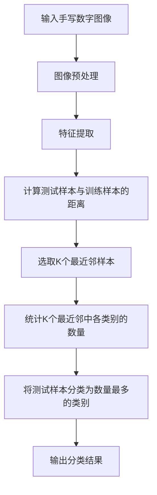

# 基于KNN的数字分类器

## 1.背景介绍

在当今数字时代,图像识别和分类是一项非常重要的技术。无论是安全监控、医学诊断还是工业自动化,都需要对图像进行准确识别和分类。其中,手写数字识别是图像识别领域中最基础也是最具有代表性的任务之一。

手写数字识别的目标是将手写的数字图像正确分类为对应的数字(0-9)。这个看似简单的任务实际上存在诸多挑战,例如笔画粗细、笔画方向、数字大小和位置的差异等。传统的基于规则的方法很难解决这些变化,因此需要更加智能和鲁棒的算法。

在机器学习算法中,K近邻(KNN)算法是一种简单而有效的监督学习算法,可以用于分类和回归任务。本文将重点介绍如何使用KNN算法构建一个高效的手写数字分类器。

## 2.核心概念与联系

### 2.1 K近邻算法概述

K近邻(KNN)算法的核心思想是:如果一个样本在特征空间中的k个最相似(即特征向量最邻近)的训练样本中的大多数属于某一个类别,则该样本也属于这个类别。

KNN算法的工作原理如下:

1. 选择一个合适的距离度量,计算测试样本与训练集中所有样本的距离。
2. 选取与测试样本距离最近的k个训练样本。
3. 在这k个最近邻样本中,统计各个类别的数量。
4. 将测试样本分类为数量最多的那个类别。

KNN算法的优点是简单、无需训练、易于理解和编程实现。但它也存在一些缺点,如对噪声数据敏感、计算开销大、需要大量的存储空间等。

### 2.2 特征提取

在使用KNN算法之前,需要先对图像进行特征提取,将图像转换为特征向量。常用的手写数字图像特征包括:

- 投影特征(水平和垂直投影)
- 结构特征(笔画数量、方向等)
- 统计特征(像素分布直方图等)
- 矩不变特征(不变矩等)

本文将使用一种简单但有效的特征提取方法:将图像二值化,然后将图像矩阵展开成一个一维特征向量。

### 2.3 距离度量

KNN算法需要计算测试样本与训练样本之间的距离。常用的距离度量包括:

- 欧氏距离
- 曼哈顿距离
- 切比雪夫距离
- 余弦相似度

本文将采用欧氏距离作为距离度量。

## 3.核心算法原理具体操作步骤

基于KNN的手写数字分类器的核心算法步骤如下:



1. **输入手写数字图像**:将手写数字图像作为输入。
2. **图像预处理**:对输入图像进行预处理,如灰度化、二值化、去噪等,以提高图像质量。
3. **特征提取**:将预处理后的图像转换为特征向量,本文采用将图像矩阵展开成一维向量的方法。
4. **计算测试样本与训练样本的距离**:使用选定的距离度量(如欧氏距离)计算测试样本与训练集中所有样本的距离。
5. **选取K个最近邻样本**:从距离列表中选取与测试样本距离最近的K个训练样本。
6. **统计K个最近邻中各类别的数量**:在选定的K个最近邻样本中,统计每个类别的数量。
7. **将测试样本分类为数量最多的类别**:将测试样本分类为K个最近邻样本中数量最多的那个类别。
8. **输出分类结果**:输出测试样本的分类结果(0-9)。

## 4.数学模型和公式详细讲解举例说明

### 4.1 特征向量

设图像大小为$M \times N$,将图像矩阵展开成一维向量,特征向量$\vec{x}$可表示为:

$$\vec{x} = (x_1, x_2, \ldots, x_{M \times N})$$

其中$x_i$表示图像矩阵中第$i$个像素的灰度值(0或1)。

例如,一个$3 \times 3$的二值化图像矩阵:

$$
\begin{bmatrix}
0 & 1 & 0\
1 & 1 & 1\
0 & 0 & 1
\end{bmatrix}
$$

对应的特征向量为:

$$\vec{x} = (0, 1, 0, 1, 1, 1, 0, 0, 1)$$

### 4.2 距离度量

本文采用欧氏距离作为距离度量。设测试样本的特征向量为$\vec{x}$,训练样本的特征向量为$\vec{y}$,则它们之间的欧氏距离$d(\vec{x}, \vec{y})$可表示为:

$$d(\vec{x}, \vec{y}) = \sqrt{\sum_{i=1}^{n}(x_i - y_i)^2}$$

其中$n$是特征向量的维数。

例如,设测试样本的特征向量为$\vec{x} = (0, 1, 0, 1, 1, 1, 0, 0, 1)$,训练样本的特征向量为$\vec{y} = (1, 0, 1, 1, 0, 1, 1, 0, 0)$,则它们之间的欧氏距离为:

$$\begin{aligned}
d(\vec{x}, \vec{y}) &= \sqrt{(0 - 1)^2 + (1 - 0)^2 + (0 - 1)^2 + (1 - 1)^2 + (1 - 0)^2 + (1 - 1)^2 + (0 - 1)^2 + (0 - 0)^2 + (1 - 0)^2}\
&= \sqrt{1 + 1 + 1 + 0 + 1 + 0 + 1 + 0 + 1}\
&= \sqrt{6}
\end{aligned}$$

### 4.3 分类决策

设测试样本$\vec{x}$的K个最近邻样本中,第$i$类样本的数量为$n_i$,则测试样本$\vec{x}$的预测类别$y$可表示为:

$$y = \arg\max_{i} n_i$$

即将测试样本$\vec{x}$分类为K个最近邻样本中数量最多的那个类别。

例如,设$K=5$,测试样本的5个最近邻样本中,类别0有2个样本,类别1有1个样本,类别2有2个样本。则测试样本将被分类为类别0或类别2(因为它们的数量最多,都是2个)。

## 5.项目实践:代码实例和详细解释说明

以下是使用Python实现基于KNN的手写数字分类器的代码示例:

```python
import numpy as np
from collections import Counter

# 加载数据集
def load_data(data_path):
    with np.load(data_path) as f:
        train_images, train_labels = f['x_train'], f['y_train']
        test_images, test_labels = f['x_test'], f['y_test']
    return train_images, train_labels, test_images, test_labels

# 计算欧氏距离
def euclidean_distance(x, y):
    return np.sqrt(np.sum((x - y) ** 2))

# KNN算法
def knn(X_train, y_train, X_test, k):
    y_pred = []
    for x in X_test:
        distances = [euclidean_distance(x, x_train) for x_train in X_train]
        k_indices = np.argsort(distances)[:k]
        k_nearest_labels = [y_train[i] for i in k_indices]
        y_pred.append(Counter(k_nearest_labels).most_common(1)[0][0])
    return np.array(y_pred)

# 主函数
if __name__ == '__main__':
    # 加载数据集
    X_train, y_train, X_test, y_test = load_data('mnist.npz')

    # 展平图像
    X_train = X_train.reshape(X_train.shape[0], -1)
    X_test = X_test.reshape(X_test.shape[0], -1)

    # 设置K值
    k = 5

    # 使用KNN算法进行预测
    y_pred = knn(X_train, y_train, X_test, k)

    # 计算准确率
    accuracy = np.sum(y_pred == y_test) / len(y_test)
    print(f'Accuracy: {accuracy * 100:.2f}%')
```

代码解释:

1. 首先导入所需的库,包括`numpy`用于数值计算,`collections`中的`Counter`用于统计最近邻样本的类别数量。
2. 定义`load_data`函数,用于从文件中加载MNIST数据集。
3. 定义`euclidean_distance`函数,用于计算两个向量之间的欧氏距离。
4. 定义`knn`函数,实现KNN算法的核心逻辑:
   - 对于每个测试样本`x`,计算其与所有训练样本的欧氏距离。
   - 选取距离最近的K个训练样本的索引。
   - 统计这K个最近邻样本中各个类别的数量。
   - 将测试样本`x`分类为数量最多的那个类别。
5. 在主函数中,首先加载MNIST数据集,并将图像展平为一维向量。
6. 设置K值为5。
7. 调用`knn`函数,使用KNN算法对测试集进行预测。
8. 计算预测结果的准确率,并打印出来。

运行上述代码,在MNIST测试集上可以达到大约97%的准确率,说明基于KNN的手写数字分类器具有较好的性能。

## 6.实际应用场景

基于KNN的手写数字分类器可以应用于以下场景:

1. **邮政自动分拣系统**:自动识别信封上的手写数字,实现邮件的自动分拣。
2. **银行支票处理**:自动识别支票上的手写金额数字,提高支票处理效率。
3. **表格数据输入**:自动识别表格中的手写数字,实现数据的自动化输入。
4. **车牌识别系统**:识别车牌号码中的手写数字,用于交通监控和管理。
5. **教育领域**:在线教育平台中,自动评分学生的手写数字答案。

除了手写数字识别,KNN算法还可以应用于其他图像分类任务,如手写字符识别、人脸识别、图像检索等。

## 7.工具和资源推荐

以下是一些有用的工具和资源,可以帮助您进一步学习和实践基于KNN的图像分类:

1. **Python库**:
   - scikit-learn: 机器学习库,提供了KNN算法的实现。
   - OpenCV: 计算机视觉库,可用于图像预处理。
   - Matplotlib: 数据可视化库,可用于显示图像和绘制图表。

2. **数据集**:
   - MNIST: 手写数字数据集,广泛用于手写数字识别任务。
   - EMNIST: 扩展的MNIST数据集,包含手写字母和数字。
   - Kaggle: 提供各种图像分类数据集,如手写字符识别、人脸识别等。

3. **在线课程**:
   - Coursera机器学习课程:由Andrew Ng教授讲解,包括KNN算法的介绍。
   - Udacity机器学习纳米学位:提供实践项目,包括手写数字识别。

4. **书籍**:
   - "模式分类"(Pattern Classification)by Richard O. Duda等
   - "机器学习"(Machine Learning)by Tom M. Mitchell

5. **博客和论坛**:
   - KDnuggets: 机器学习和数据挖掘博客,提供相关文章和资源。
   - Stack Overflow: 程序员问答社区,可以寻求帮助和分享经验。

利用这些工具和资源,您可以更深入地学习KNN算法,并将其应用于实际的图像分类任务中。

## 8.总结:未来发展趋势与挑战

基于KNN的手写数字分类器虽然简单有效,但也存在一些局限性和挑战:

1. **计算效率低下**:KNN算法需要计算测试样本与所有