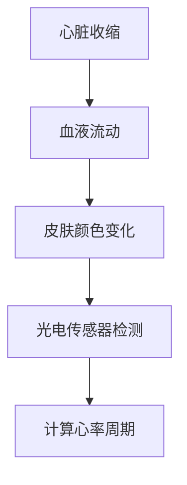
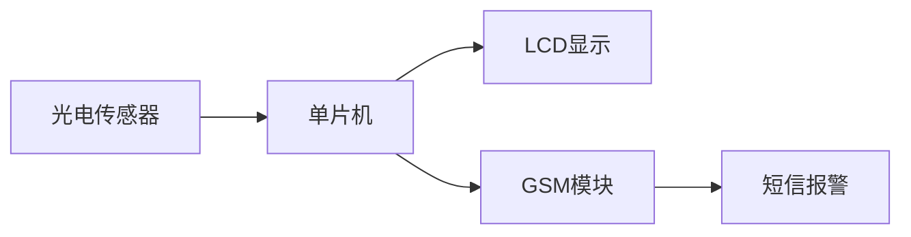
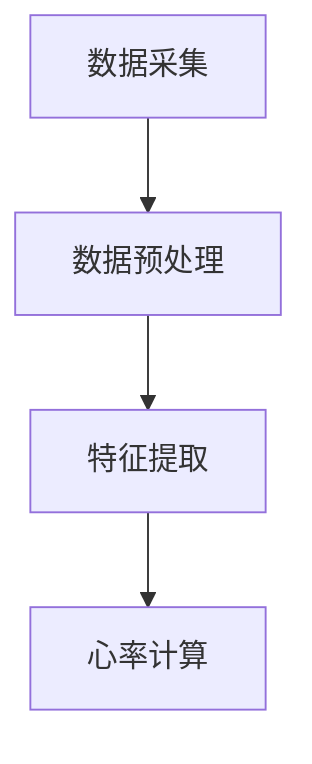
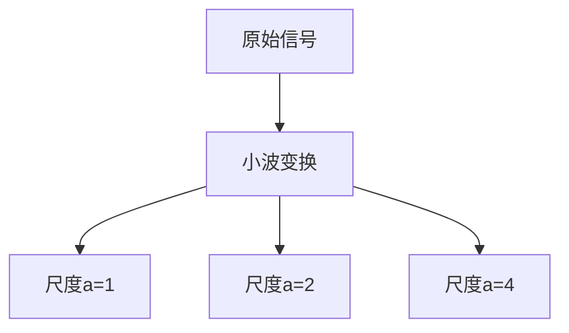
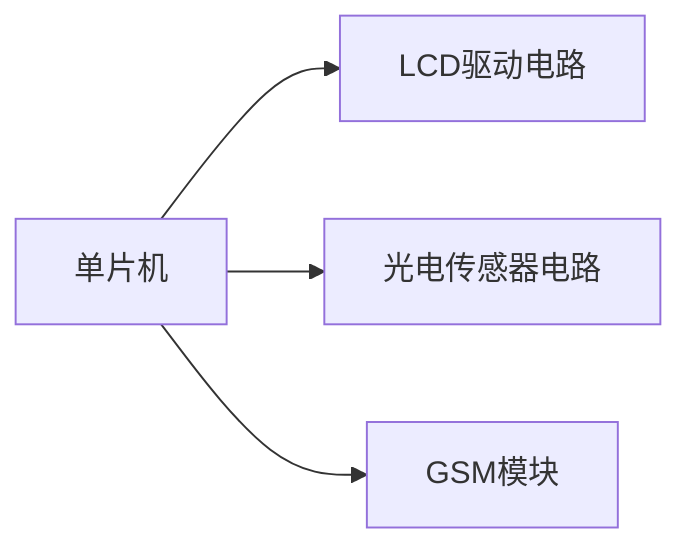
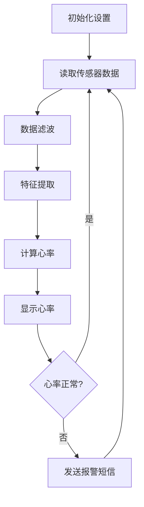

# 基于单片机心率检测短信报警的设计与实现

## 1.背景介绍

### 1.1 心率监测的重要性

心率是反映人体生命体征的重要指标,对于监测人体健康状况具有重要意义。心率过快或过慢都可能预示着潜在的健康风险。因此,实时监测和记录心率数据对于及时发现异常情况、预防疾病至关重要。

### 1.2 现有心率监测方案的局限性

目前,医院和家庭中广泛使用的心率监测设备大多需要将传感器直接贴附在皮肤上,给使用带来一定不便。此外,大部分便携式设备只能在现场查看数据,缺乏远程报警功能,难以实现实时监控。

### 1.3 单片机心率检测系统的优势

基于单片机的心率检测系统能够弥补上述不足。它采用非接触式传感器,无需直接贴附在人体,使用更加方便。同时,系统集成了短信报警模块,一旦检测到心率异常,可以及时通过短信的形式将报警信息发送给医护人员或家人,实现远程实时监控。

## 2.核心概念与联系

### 2.1 心率检测原理

心率检测的基本原理是利用光电传感器来检测人体微小的血液循环运动。当心脏收缩时,血液在血管中的流动会引起人体表面的微小颜色变化。通过对比不同时刻皮肤颜色的差异,可以检测到血液流动的周期性变化,进而计算出心率值。



### 2.2 单片机系统框架

该系统以单片机为核心,集成了光电传感器、LCD显示模块、GSM模块等外围电路。光电传感器负责采集皮肤颜色数据,单片机对数据进行处理计算得到心率值,并将结果显示在LCD上。如果检测到心率异常,单片机还会通过GSM模块发送报警短信。



## 3.核心算法原理具体操作步骤

### 3.1 数据采集

系统通过光电传感器对皮肤进行不间断的采样,获取一系列的模拟电压值,这些值反映了皮肤颜色的变化情况。

### 3.2 数据预处理

为了消除高频噪声和基线漂移的影响,需要对原始数据进行滤波和归一化处理。常用的方法有移动平均滤波、中值滤波等。

### 3.3 特征提取

对预处理后的数据进行特征提取,以发现其中的周期性变化规律。常用的方法有傅里叶变换、小波变换等。

### 3.4 心率计算

根据提取出的特征,利用频率分析或峰值检测等算法计算出心率值。例如,可以检测出数据中的主频率,将其转化为每分钟的心跳次数即可得到心率。



## 4.数学模型和公式详细讲解举例说明

### 4.1 移动平均滤波

移动平均滤波是一种常用的数字滤波方法,可以有效消除高频噪声。设原始数据序列为$x(n)$,滤波窗口大小为$M$,则滤波后的序列$y(n)$可表示为:

$$y(n) = \frac{1}{M}\sum_{i=0}^{M-1}x(n-i)$$

例如,对序列$\{8,6,7,9,3\}$进行3点移动平均滤波,结果为:

$$
\begin{aligned}
y(1) &= \frac{1}{3}(8+6+7) = 7\
y(2) &= \frac{1}{3}(6+7+9) = 7.33\
y(3) &= \frac{1}{3}(7+9+3) = 6.33
\end{aligned}
$$

### 4.2 小波变换

小波变换是时频分析的有效工具,能够很好地描述信号中的突变和周期性特征。设母小波为$\psi(t)$,则连续小波变换可表示为:

$$W(a,b) = \frac{1}{\sqrt{a}}\int_{-\infty}^{\infty}f(t)\psi\left(\frac{t-b}{a}\right)dt$$

其中,$a$为尺度因子,$b$为平移因子。通过选择不同的$a$和$b$值,可以观察到信号在不同尺度和位置上的特征。

例如,对方波信号进行小波变换,结果如下所示:



可以看出,在较小尺度上,小波系数能够很好地描述信号的突变特征;而在较大尺度上,则能够反映出信号的周期性特征。

## 5.项目实践:代码实例和详细解释说明

### 5.1 硬件电路连接



1. 单片机:选用性能适中的单片机作为系统控制核心,如STC89C52RC等。
2. LCD驱动电路:将LCD显示模块与单片机相连,用于显示检测的心率数值。
3. 光电传感器电路:将光电传感器与单片机的ADC通道相连,用于采集皮肤颜色数据。
4. GSM模块:GSM模块通过串口与单片机相连,用于发送报警短信。

### 5.2 软件流程



1. 初始化设置:初始化单片机、LCD、传感器等硬件设备。
2. 读取传感器数据:通过ADC采集光电传感器的模拟电压值。
3. 数据滤波:对原始数据进行滤波处理,消除噪声和基线漂移。
4. 特征提取:对滤波后的数据进行特征提取,发现其中的周期性变化规律。
5. 计算心率:根据提取的特征,计算出心率数值。
6. 显示心率:将计算出的心率值显示在LCD上。
7. 判断心率是否正常:将计算出的心率值与正常范围进行比较。
8. 发送报警短信:如果检测到心率异常,通过GSM模块发送报警短信。

### 5.3 关键代码解释

```c
// 移动平均滤波函数
void MovingAverageFilter(uint16 *data, uint8 len, uint8 M)
{
    uint8 i, j;
    uint32 sum = 0;
    for(i=0; i<len; i++)
    {
        sum = 0;
        for(j=0; j<M; j++)
        {
            if(i+j >= len)
                break;
            sum += data[i+j];
        }
        data[i] = sum / M;
    }
}

// 心率计算函数
uint16 CalcHeartRate(uint16 *data, uint16 len, uint16 fs)
{
    uint16 i, maxIdx = 0;
    uint32 maxVal = 0;

    // 计算FFT
    arm_rfft_instance_q15 rfft;
    arm_rfft_init_q15(&rfft, len, 0, 1);
    arm_rfft_q15(&rfft, data, rfftOutput);

    // 找到最大频率分量
    for(i=0; i<len/2; i++)
    {
        if(rfftOutput[i] > maxVal)
        {
            maxVal = rfftOutput[i];
            maxIdx = i;
        }
    }

    // 将频率转换为心率(次/分钟)
    return maxIdx * 60 / len * fs;
}
```

1. `MovingAverageFilter`函数实现了移动平均滤波算法,用于消除高频噪声。它对输入数据进行滑动窗口求平均,窗口大小由参数`M`控制。
2. `CalcHeartRate`函数用于计算心率值。它首先对输入数据进行FFT变换,找到频谱中的最大分量,该分量对应的频率就是主频率。然后根据主频率和采样率,转换得到每分钟的心跳次数,即心率值。

该代码使用了ARM CMSIS-DSP库中的FFT函数`arm_rfft_q15`,可以高效地计算实序列的FFT变换。

## 6.实际应用场景

### 6.1 远程医疗监控

该系统可以应用于远程医疗监控场景。通过将检测设备配置在患者家中,医护人员就能够实时监控患者的心率数据,一旦发现异常情况,系统会立即发出报警短信,医护人员可以及时采取应对措施。

### 6.2 运动健康监测

心率是反映人体运动强度的重要指标。该系统可以应用于健身场所,为运动员提供实时的心率监测,避免过度运动导致的健康风险。同时,也可以帮助运动员根据心率数据来调整运动强度,实现科学健身。

### 6.3 新生儿监护

新生儿的心率变化是评估其健康状况的重要依据。在医院的新生儿重症监护室中,可以采用该系统对新生儿进行24小时不间断的心率监测,确保能够及时发现并处理任何异常情况。

## 7.工具和资源推荐

### 7.1 硬件工具

- 单片机开发板:如STC-ISP、Arduino等
- 光电传感器:如心率传感器模块
- GSM模块:如SIM900A、SIM800L等
- LCD显示模块

### 7.2 软件工具

- Keil MDK:用于单片机C语言编程
- Proteus:电路模拟和单片机仿真软件
- MATLAB:用于数字信号处理算法设计和仿真

### 7.3 在线资源

- 单片机入门教程:http://www.iopenhec.com/
- ARM CMSIS-DSP库:https://www.keil.com/pack/doc/CMSIS/DSP/html/index.html
- 心率检测算法论文:https://ieeexplore.ieee.org/document/6165886

## 8.总结:未来发展趋势与挑战

### 8.1 发展趋势

1. 智能化发展:未来的心率检测系统将会更加智能化,能够自动分析数据、识别异常模式,提供更精准的健康评估。
2. 物联网融合:系统将与物联网技术深度融合,实现远程数据传输和云端存储,为用户提供更完善的健康大数据服务。
3. 可穿戴设备:随着可穿戴设备的普及,心率检测功能将被集成到手环、手表等设备中,使用更加便捷。

### 8.2 面临的挑战

1. 算法精度:如何在保证实时性的同时,提高心率检测算法的精确度,是一个亟待解决的问题。
2. 数据安全:如何保护用户的心率数据免受非法窃取和滥用,是系统设计中需要重点考虑的安全问题。
3. 功耗优化:对于可穿戴设备而言,如何在满足持续工作时间的同时,降低系统的功耗水平,是一个需要解决的技术难题。

## 9.附录:常见问题与解答

1. **为什么要使用非接触式心率检测?**

   非接触式心率检测相比传统的接触式方式,使用更加方便和舒适,无需将传感器直接贴附在皮肤上。此外,它还避免了因传感器松动而引起的数据丢失问题。

2. **如何提高心率检测的精确度?**

   可以采取以下措施:优化算法参数、增加采样率、使用更高性能的硬件、结合多种算法进行融合等。同时,也可以通过机器学习的方法,从大量数据中自动学习出更准确的检测模型。

3. **为什么要使用短信报警功