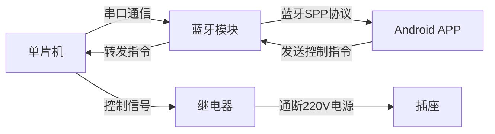

# 基于单片机蓝牙控制插座的设计与实现

## 1.背景介绍
随着物联网技术的快速发展,智能家居已经成为未来生活的重要趋势。而在智能家居系统中,智能插座是一个不可或缺的组成部分。传统的插座只能通过物理开关来控制,缺乏灵活性和便捷性。而基于单片机和蓝牙技术设计的智能插座,可以通过手机APP远程控制,大大提高了插座的智能化水平和用户体验。本文将详细介绍一种基于单片机蓝牙控制的智能插座的设计与实现方案。

### 1.1 智能插座的应用现状
目前市面上已经出现了各种智能插座产品,如小米、公牛等品牌推出的WiFi智能插座。这些产品一般采用WiFi模块与手机APP连接,通过APP实现远程控制。但是,WiFi智能插座需要连接家庭路由器,配置相对麻烦,且受路由器信号覆盖范围的限制。

### 1.2 蓝牙智能插座的优势
相比之下,蓝牙智能插座具有以下优势:

1. 配对简单:手机与插座通过蓝牙直接连接配对,不需要额外的网络设备,使用更加便捷。
2. 控制灵活:用户可以通过手机APP随时随地控制插座的通断,不受距离的限制。
3. 低功耗:蓝牙是一种低功耗的无线通信技术,非常适合用于电池供电的智能设备。
4. 成本低:蓝牙模块的价格相对较低,有利于降低智能插座的制造成本。

### 1.3 项目目标
本项目旨在设计一款基于单片机和蓝牙模块的智能插座,实现以下目标:

1. 硬件设计:选择合适的单片机和蓝牙模块,设计插座的电源控制电路。
2. 软件开发:开发单片机固件,实现蓝牙通信协议,并开发配套的安卓APP。
3. 功能实现:插座可以通过APP进行远程开关控制,并具有定时、延时、电量统计等功能。
4. 性能优化:保证插座的控制实时性和稳定性,降低功耗,提高可靠性。

## 2.核心概念与联系
要实现基于单片机蓝牙控制的智能插座,需要涉及以下几个核心概念:

### 2.1 单片机
单片机是一种集成度高、功能强大的微型计算机,包含CPU、存储器、外设等部件。它可以通过编程实现各种控制功能。本项目选用成本低、性能稳定的51系列单片机作为控制核心。

### 2.2 蓝牙模块
蓝牙是一种短距离无线通信技术标准,通过蓝牙模块可以实现单片机与手机之间的数据传输。常见的蓝牙模块有HC-05、HC-06等,支持SPP协议,便于单片机的串口通信。

### 2.3 继电器
继电器是一种电控开关元件,通过电磁原理控制大电流的通断。使用继电器可以用小电流控制大电流,是电源控制电路的关键器件。

### 2.4 Android APP
为了实现手机对插座的控制,需要开发配套的Android APP。APP通过蓝牙与单片机通信,发送控制指令,并接收插座的状态数据。可以使用Android Studio开发工具,采用Java语言编写。

以下是各个概念之间的联系:



单片机通过串口与蓝牙模块通信,发送和接收数据。Android APP通过蓝牙SPP协议与蓝牙模块建立连接,发送控制指令。蓝牙模块将接收到的指令转发给单片机,单片机经过处理后,向继电器发送控制信号,从而实现对插座的通断控制。

## 3.核心算法原理具体操作步骤
本项目的核心算法主要体现在单片机对蓝牙数据的处理和控制逻辑的实现上。以下是具体的操作步骤:

### 3.1 蓝牙数据的接收与解析
1. 单片机通过串口初始化蓝牙模块,设置波特率、数据位、停止位等参数。
2. 单片机循环检测串口缓冲区,判断是否有新的数据到达。
3. 如果接收到新的数据,将其存储到接收缓冲区中。
4. 判断接收到的数据是否符合指定的格式,例如以特定字符开头和结尾。
5. 如果数据格式正确,则解析出有效的控制指令和参数。

### 3.2 控制逻辑的实现
1. 根据解析出的控制指令,判断需要执行的操作,例如开启、关闭、定时等。
2. 对于开启和关闭操作,直接控制继电器的通断。
3. 对于定时操作,启动定时器,当达到设定时间后,自动执行相应的开启或关闭操作。
4. 对于延时操作,类似定时操作,但需要记录当前的时间,并在达到延时时间后执行操作。
5. 对于电量统计,需要通过ADC采集电压和电流数据,并根据公式计算出功率和电量。

### 3.3 数据的发送与应答
1. 当插座执行完一个操作后,需要向APP发送应答数据,告知当前的状态。
2. 单片机将应答数据组装成指定格式,通过串口发送给蓝牙模块。
3. 蓝牙模块将数据转发给已连接的APP。
4. APP接收到数据后,更新界面显示,让用户及时了解插座的状态变化。

### 3.4 错误处理与异常保护
1. 在数据解析和控制过程中,要加入必要的错误检测和处理机制。
2. 例如,当接收到非法的指令时,应该予以丢弃,并向APP返回错误提示。
3. 当出现通信中断、电源异常等情况时,应该及时停止操作,确保插座的安全。
4. 必要时可以加入看门狗定时器,防止程序死循环或长时间无响应。

## 4.数学模型和公式详细讲解举例说明
在智能插座的设计中,需要用到一些数学模型和公式,主要涉及电量统计和功率计算。

### 4.1 电量统计
电量是指一段时间内消耗的电能,单位是千瓦时(kWh)。要统计电量,需要测量电压和电流,并根据公式计算。

设电压为$U$,电流为$I$,功率为$P$,时间为$t$,则有以下公式:

$$P = UI$$

$$W = Pt = UIt$$

其中,$W$表示电量,$P$表示功率,$t$表示时间。

例如,如果插座的工作电压是220V,当前电流为2A,运行了3个小时,则消耗的电量为:

$$W = 220V \times 2A \times 3h = 1.32kWh$$

### 4.2 功率计算
功率是指单位时间内做功的快慢,反映了用电器的耗电速度,单位是瓦(W)。

对于额定功率已知的电器,可以直接使用额定功率值。例如,一个60W的灯泡,其额定功率就是60W。

对于功率未知的电器,可以通过测量电压和电流,使用公式计算功率:

$$P = UI$$

例如,如果插座的工作电压是220V,当前电流为1A,则实际功率为:

$$P = 220V \times 1A = 220W$$

在实际应用中,电压一般是稳定的,而电流会随着负载的变化而变化。因此,可以通过单片机的ADC功能实时采集电流值,并代入公式计算功率。

为了提高计算精度,可以多次采样取平均值,或者使用滑动平均滤波算法。同时,要注意ADC的量程和分辨率,选择合适的采样电阻和放大电路。

## 5.项目实践：代码实例和详细解释说明
下面是一个基于51单片机和HC-05蓝牙模块的智能插座控制代码实例,并对关键部分进行详细解释说明。

```c
#include <reg52.h>
#include <string.h>

#define RELAY_PIN P1_0  // 继电器控制引脚
#define LED_PIN P1_1    // 指示灯引脚

#define BAUD_RATE 9600  // 蓝牙通信波特率

unsigned char rx_buf[16];  // 接收缓冲区
unsigned char rx_cnt = 0;  // 接收计数器

bit relay_state = 0;  // 继电器状态

// 串口初始化函数
void uart_init()
{
    SCON = 0x50;  // 8位数据,可变波特率
    TMOD |= 0x20; // 设置定时器1为8位自动重装方式
    TH1 = TL1 = -(FOSC/12/32/BAUD_RATE); // 设置波特率重装值
    TR1 = 1;    // 启动定时器1
    ES = 1;     // 使能串口中断
    EA = 1;     // 开总中断
}

// 串口中断服务函数
void uart_isr() interrupt 4
{
    if (RI)
    {
        RI = 0;  // 清除接收中断标志位
        rx_buf[rx_cnt++] = SBUF;  // 读取接收到的数据
        if (rx_cnt >= 16)  // 防止缓冲区溢出
        {
            rx_cnt = 0;
        }
    }
}

// 解析接收到的命令
void parse_cmd()
{
    if (strncmp(rx_buf, "ON", 2) == 0)
    {
        relay_state = 1;
        RELAY_PIN = 1;
        LED_PIN = 0;
    }
    else if (strncmp(rx_buf, "OFF", 3) == 0)
    {
        relay_state = 0;
        RELAY_PIN = 0;
        LED_PIN = 1;
    }
    memset(rx_buf, 0, sizeof(rx_buf));  // 清空接收缓冲区
    rx_cnt = 0;
}

// 主函数
void main()
{
    uart_init();  // 初始化串口

    RELAY_PIN = 0;  // 初始化继电器为关闭状态
    LED_PIN = 1;    // 初始化指示灯为熄灭状态

    while (1)
    {
        if (rx_cnt > 0)  // 如果有数据接收到
        {
            if (rx_buf[rx_cnt-1] == '\n')  // 如果接收到换行符
            {
                parse_cmd();  // 解析命令
            }
        }
    }
}
```

代码解释:

1. 首先定义了一些宏,如继电器控制引脚、指示灯引脚、蓝牙通信波特率等。
2. 定义了接收缓冲区`rx_buf`和接收计数器`rx_cnt`,用于存储和统计接收到的数据。
3. 定义了继电器状态变量`relay_state`,用于记录当前继电器的开关状态。
4. `uart_init()`函数用于初始化串口,设置波特率、数据位、停止位等参数,并启用串口中断。
5. `uart_isr()`函数是串口中断服务函数,当接收到新的数据时,将其存储到接收缓冲区中。
6. `parse_cmd()`函数用于解析接收到的命令,根据命令内容设置继电器状态和指示灯状态。
7. 在主函数中,首先初始化串口和引脚状态,然后进入循环,不断检测是否有新的数据接收到。
8. 如果接收到换行符,则表示一条完整的命令接收完毕,调用`parse_cmd()`函数进行解析。

这个代码实现了最基本的智能插座控制功能,可以通过蓝牙发送"ON"或"OFF"命令来控制继电器的通断。当然,实际应用中还需要加入更多的功能,如定时控制、延时控制、电量统计等,可以在此基础上进行扩展。

## 6.实际应用场景
基于单片机蓝牙控制的智能插座可以在多个场景中得到应用,给生活带来便利。以下