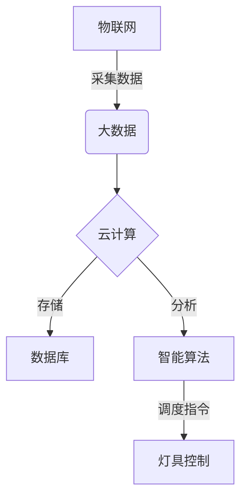
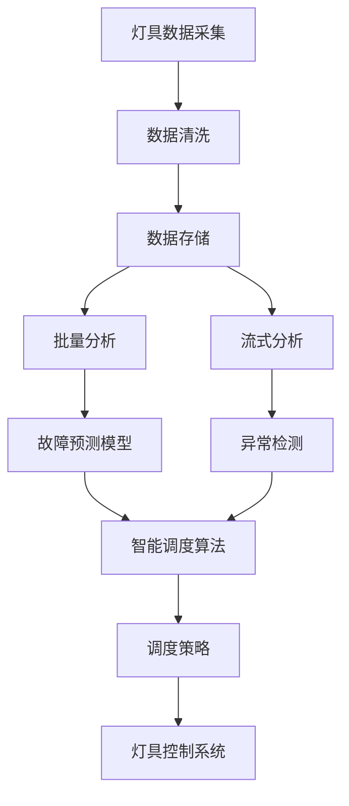
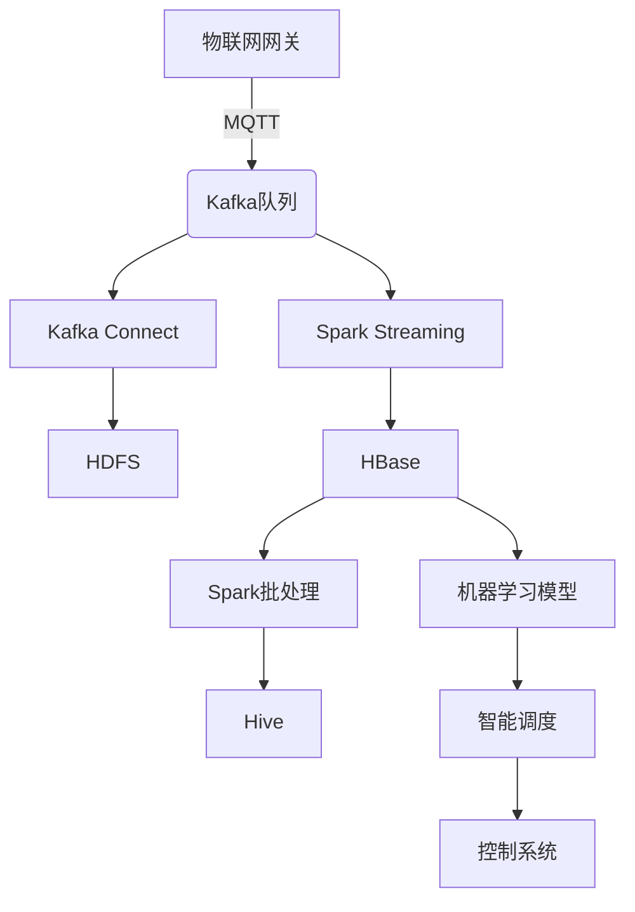

# 基于大数据的公园灯饰监控系统的设计与开发

## 1.背景介绍

### 1.1 公园照明系统的重要性

公园是城市中重要的绿色空间,为市民提供休闲娱乐的场所。良好的照明系统对于确保公园在夜间安全运营、美化环境至关重要。传统的公园照明系统存在一些问题:

- 能耗高:常规灯具功率大,运行成本高
- 管理效率低:人工巡查维护,反应效率低下
- 数据缺失:缺乏实时监控数据,无法优化调度

### 1.2 大数据在照明系统中的应用

大数据技术可以为公园照明系统带来全新的管理模式。通过部署物联网传感设备,实时采集灯具状态、环境数据,并利用大数据分析,可以实现:

- 故障预警:分析历史数据,预测灯具故障
- 智能调度:根据天气、人流等因素动态调整亮度
- 能耗优化:分析用电模式,制定节能策略

因此,构建基于大数据的智能照明监控系统,可以大幅提高公园照明的管理水平和能源利用效率。

## 2.核心概念与联系

### 2.1 物联网(IoT)

物联网是本系统的基础,是指通过各种信息传感设备,与互联网相连的普通物体,实现物物相连、物人交互。

在公园灯饰监控系统中,每盏灯具都将部署传感器,构成物联网节点,采集运行数据并上传至云端。

### 2.2 大数据(Big Data)

大数据指无法使用传统数据库软件工具在合理时间内获取、存储、管理、分析的海量数据集。

本系统将收集大量灯具运行数据,需要大数据技术进行存储和分析,以发现潜在规律,指导智能调度和维护。

### 2.3 云计算(Cloud Computing)

云计算是一种按使用量付费的模式,可根据需求获取所需的计算资源。

本系统的大数据分析和智能调度算法将部署在云端,利用云计算的弹性扩展能力,满足计算需求。



## 3.核心算法原理具体操作步骤

### 3.1 灯具数据采集

每盏灯具都装有传感器,实时采集以下数据:

- 工作状态(开/关)
- 亮度值
- 能耗
- 环境数据(温度、湿度等)

这些数据将通过无线网络上传至云端数据中心。

### 3.2 数据清洗与存储

1) 数据清洗:
   - 去除重复数据
   - 剔除异常值
   - 处理缺失值

2) 数据存储:
   - 采用分布式文件系统(HDFS)存储原始数据
   - 使用列式数据库(HBase)存储结构化数据,提高查询效率

### 3.3 大数据分析

1) 批处理分析:
   - 使用Apache Spark进行离线分析
   - 挖掘历史数据,发现规律
   - 生成故障预测模型

2) 流式实时分析:
   - 使用Apache Storm/Spark Streaming
   - 分析实时数据,发现异常
   - 触发报警,采取及时措施

### 3.4 智能调度算法

1) 故障预测:
   - 基于机器学习模型,分析历史数据
   - 预测灯具故障概率
   - 提前安排维修,避免故障

2) 亮度优化:
   - 分析人流、天气等环境因素
   - 动态调整亮度,节省能耗
   - 遵循公园照明标准

3) 策略生成:
   - 基于分析结果,制定调度策略
   - 下发至灯具控制系统执行



## 4.数学模型和公式详细讲解举例说明

### 4.1 故障预测模型

我们使用生存分析模型预测灯具故障概率,核心思想是分析影响设备生存时间的因素。

设 $T$ 为灯具故障时间, $F(t)$ 为故障分布函数:

$$F(t) = P(T \leq t)$$

则可靠度函数(灯具在时间 $t$ 前无故障的概率):

$$R(t) = 1 - F(t)$$

常用的生存模型有:

- 指数分布模型: $F(t) = 1 - e^{-\lambda t}$
- Weibull分布模型: $F(t) = 1 - e^{-(t/\eta)^{\gamma}}$
- Cox回归模型: $h(t) = h_0(t)e^{\beta_1x_1+\beta_2x_2+...+\beta_nx_n}$

其中 $\eta,\gamma,\beta$ 为模型参数,通过机器学习算法对历史数据进行训练得到。

### 4.2 亮度优化模型

我们使用多目标优化模型,在满足照明标准的前提下,最小化能耗:

$$\begin{aligned}
&\min & & \sum_{i=1}^{n}P_i(x_i) \
&\text{s.t.} & & E_{\min} \leq E(x_1,x_2,...,x_n) \leq E_{\max} \
& & & 0 \leq x_i \leq 1,\quad i=1,2,...,n
\end{aligned}$$

其中:

- $P_i(x_i)$ 为第 $i$ 盏灯的功率
- $E(x_1,x_2,...,x_n)$ 为所有灯具的总照度
- $E_{\min}, E_{\max}$ 为照度标准的范围
- $x_i$ 为第 $i$ 盏灯的亮度调节系数

我们使用进化算法等方法求解该优化问题,得到最优的亮度配置。

## 5.项目实践:代码实例和详细解释说明

### 5.1 系统架构



1) 物联网网关收集灯具数据,通过MQTT协议发送至Kafka队列
2) Kafka Connect从队列持久化数据至HDFS
3) Spark Streaming从队列读取实时数据,处理后存入HBase
4) Spark批处理程序定期从HBase读取数据,进行离线分析,结果存入Hive
5) 机器学习算法从Hive训练模型,输出给智能调度模块
6) 智能调度模块生成调度策略,下发至灯具控制系统执行

### 5.2 Spark Streaming实例

```python
from pyspark.streaming import StreamingContext

# 创建SparkContext和StreamingContext
sc = SparkContext("local[2]", "LightingMonitor")
ssc = StreamingContext(sc, 10)

# 创建DStream
lines = ssc.socketTextStream("localhost", 9999)

# 处理数据
lights = lines.map(lambda x: x.split(","))
lights = lights.map(lambda p: (p[0], (p[1], p[2], p[3])))

# 计算统计结果
stats = lights.updateStateByKey(lambda values, state: updateStats(values, state))

# 输出结果
stats.pprint()

# 启动流计算
ssc.start()
ssc.awaitTermination()
```

上述代码通过socket读取灯具数据,对每盏灯计算实时统计信息(如均值、最大最小值),并输出结果。其中`updateStats`函数实现了状态更新的逻辑。

### 5.3 Spark批处理实例

```python
from pyspark.sql import SparkSession

# 创建SparkSession
spark = SparkSession.builder.appName("LightingBatch").getOrCreate()

# 读取HBase数据
lights = spark.read.format("org.apache.hadoop.hbase.spark") \
                .option("hbase.table","lighting") \
                .load()

# 特征工程
features = lights.select("id", "status", "brightness", "energy",
                         hour("time").alias("hour"),
                         dayofweek("time").alias("weekday")) \
                  .na.fill(0)

# 训练模型
model = RandomForestRegressor().fit(features)

# 保存模型
model.write().overwrite().save("models/lighting")
```

该代码从HBase读取灯具数据,进行特征工程后训练随机森林模型,并将模型保存至文件系统。该模型可用于预测灯具故障概率。

## 6.实际应用场景

本系统可广泛应用于城市公园、景区、校园等场所的照明系统管理,具有以下优势:

- 降低运维成本:远程监控,自动化管理
- 节约能源:根据环境调节亮度,减少浪费
- 延长灯具寿命:预测故障,提前维修
- 提高照明质量:动态调节,适应环境变化
- 增强安全性:异常报警,及时处理隐患

除照明系统外,该架构还可推广至其他物联网场景,如智慧城市、智能建筑、智慧农业等,为实现智能化运营提供技术支持。

## 7.工具和资源推荐

- Apache Kafka: 分布式流处理平台 (https://kafka.apache.org)
- Apache Spark: 统一分析引擎 (https://spark.apache.org)
- Apache Hadoop: 分布式文件系统HDFS (https://hadoop.apache.org)
- Apache HBase: 分布式列式数据库 (https://hbase.apache.org)
- Apache Hive: 数据仓库工具 (https://hive.apache.org)
- MQTT: 物联网消息传输协议 (http://mqtt.org)
- Scikit-Learn: 机器学习算法库 (https://scikit-learn.org)
- TensorFlow: 深度学习框架 (https://tensorflow.org)

## 8.总结:未来发展趋势与挑战

### 8.1 发展趋势

- 5G和边缘计算:5G网络带来低延迟、高带宽,边缘计算将数据处理下沉至边缘节点,减轻云端压力
- 数字孪生:通过数字化模型复制物理系统,实现虚实一体的智能管理
- 区块链:利用区块链记录设备运行数据,提高数据可信度和系统安全性

### 8.2 面临的挑战

- 隐私与安全:如何在收集和利用大量数据的同时,保护用户隐私和防范安全风险
- 异构数据集成:如何高效整合来自不同系统、不同格式的海量数据
- 模型更新与迁移学习:如何持续优化模型,快速适应新的环境和需求

## 9.附录:常见问题与解答

1. **如何保证数据的安全性?**

   我们采用加密传输、访问控制、数据脱敏等多重手段,确保数据在传输和存储过程中的安全。同时建立完善的安全管理机制,防范内外部攻击。

2. **系统可扩展性如何?**

   我们采用了云计算、大数据等可扩展架构,计算资源可根据需求动态伸缩。同时系统使用模块化、微服务等设计模式,新功能可被快速集成。

3. **如何处理异常数据?**

   我们使用机器学习等技术对异常数据进行自动检测,并采取报警、人工审核等策略。同时在数据清洗时会过滤掉明显的错误数据。

4. **如何保证模型质量?**

   我们将持续收集新的运行数据,定期重训练模型以提高准确性。另外会引入更多的特征,并使用集成学习等方法来提升模型性能。

5. **系统如何进行故障恢复?**

   我们采用了流批一体的Lambda架构,实时数据流和离线数据分别处理,相互补充,从而提高系统的容错能力。同时建立了完善的监控告警机制,快速发