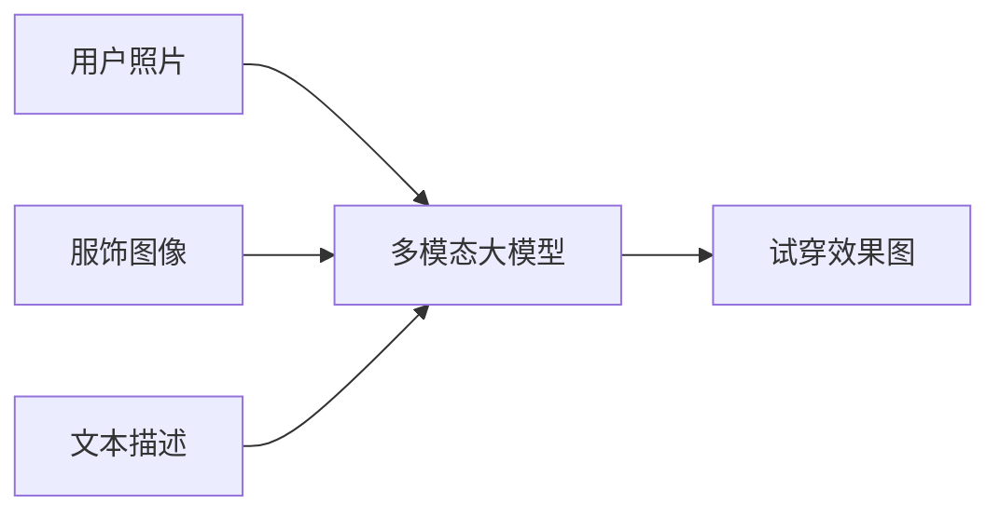

# 多模态大模型：技术原理与实战 智能试穿

## 1. 背景介绍
### 1.1 多模态大模型的兴起
近年来,随着深度学习技术的飞速发展,多模态大模型(Multimodal Large Models)成为人工智能领域的研究热点。多模态大模型能够同时处理文本、图像、语音等不同模态的数据,实现跨模态的信息理解和生成,在智能对话、视觉问答、图文生成等任务中取得了显著成果。

### 1.2 多模态大模型在电商领域的应用
多模态大模型在电子商务领域也有广泛的应用前景。其中,智能试穿(Virtual Try-on)是一个典型的应用场景。传统的线上购物体验存在商品展示单一、用户难以判断尺码合身度等痛点。引入多模态大模型,可以根据用户上传的照片或视频,自动生成试穿效果图,提供沉浸式的购物体验,提升转化率。

### 1.3 本文的主要内容
本文将围绕多模态大模型在智能试穿中的应用展开,重点介绍其技术原理、核心算法、数学模型以及工程实践。通过对智能试穿系统的全面剖析,帮助读者深入理解多模态大模型的内在机制,把握其发展脉络,为相关研究和应用提供参考。

## 2. 核心概念与联系
### 2.1 多模态学习
多模态学习(Multimodal Learning)是指利用不同模态的数据(如文本、图像、音频等)进行联合建模,挖掘不同模态间的语义关联,从而获得更全面、更准确的信息表示。与单模态学习相比,多模态学习能够充分利用不同来源的互补信息,具有更强的鲁棒性和泛化能力。

### 2.2 大模型
大模型(Large Models)是指参数量巨大(一般在亿级以上)的深度神经网络模型。得益于海量训练数据和强大算力,大模型能够学习到丰富的知识和技能,在 NLP、CV 等领域取得了卓越的性能。代表性的大模型包括 GPT-3、BERT、CLIP 等。

### 2.3 智能试穿
智能试穿是指利用计算机视觉和图形学技术,将用户的照片/视频与目标服饰进行融合,生成逼真的试穿效果图。其核心是服饰转移(Garment Transfer)和人体姿态估计(Human Pose Estimation)。前者负责将 2D 服饰图像映射到用户图像上,后者用于提取用户的关键点和骨架信息,指导服饰变形。

### 2.4 多模态大模型与智能试穿
将多模态大模型应用到智能试穿任务,可以显著提升其性能和泛化能力。具体而言:
1. 多模态融合:大模型能够学习图像、文本等不同模态的统一表示,实现服饰属性、用户反馈等多模态信息的融合,从而生成更符合用户需求的试穿效果。
2. 知识迁移:大模型可以从海量数据中习得服装搭配、审美评价等先验知识,并迁移到试穿任务中,使生成结果更加自然、时尚。
3. 端到端建模:传统试穿流程需要人工设计特征并分别优化各个模块,而基于大模型的方法可以实现从输入到输出的端到端建模,减少人工参与,提高自动化程度。

下图展示了多模态大模型在智能试穿中的作用:


## 3. 核心算法原理具体操作步骤
智能试穿的核心算法可以分为以下几个步骤:

### 3.1 人体解析与关键点检测
首先利用人体解析模型(如 DensePose)对用户照片进行处理,识别出人体的不同部位(如上衣、裤子、皮肤等)。同时使用关键点检测模型(如 OpenPose)提取人体骨架信息,定位头、肩、手、腿等关节点的坐标。

### 3.2 服饰分割
对于给定的服饰图像,使用语义分割模型(如 DeepLabV3)将其前景(衣物)和背景分离,得到服饰的 mask。

### 3.3 服饰变形
根据用户图像中的人体姿态,对服饰图像进行空间变换,使其与人体轮廓相吻合。常见的变形方法有 TPS(Thin Plate Spline)等。

### 3.4 服饰颜色/纹理迁移
将服饰的颜色、纹理等风格特征迁移到用户图像中,使服饰与用户肤色、光照条件相协调。主流的迁移方法包括 AdaIN(Adaptive Instance Normalization)等。

### 3.5 人像融合
将变形后的服饰 mask 与用户图像进行融合,并对边缘进行平滑、模糊处理,得到最终的试穿效果图。常用的融合策略有 Alpha Blending、Poisson Blending 等。

### 3.6 多模态信息融合
除了用户图像和服饰图像,还可以融入其他模态的信息,如服饰的文本描述、用户反馈等。多模态大模型可以学习不同模态间的对齐映射,实现多模态特征的融合,从而生成更加个性化、符合用户需求的试穿效果。

## 4. 数学模型和公式详细讲解举例说明
本节以服饰变形中的 TPS 算法为例,详细讲解其数学原理。

### 4.1 TPS 变换原理
TPS 是一种基于控制点的非刚性变换方法。给定源图像和目标图像中的 $n$ 个控制点对 $\{(x_i,y_i)\}_{i=1}^n$,$\{(x_i',y_i')\}_{i=1}^n$,TPS 变换可以学习一个映射函数 $f(x,y)=(f_x(x,y),f_y(x,y))$,将源图像中的任意点 $(x,y)$ 映射到目标图像中的 $(x',y')$。

### 4.2 TPS 变换的数学表达
TPS 变换由仿射变换和非线性变换两部分组成:

$$
f(x,y)=\underbrace{a_0+a_1x+a_2y}_{\text{affine}}+\underbrace{\sum_{i=1}^nw_iU(||(x,y)-(x_i,y_i)||)}_{\text{non-linear}}
$$

其中 $a_0,a_1,a_2$ 为仿射变换系数,$w_i$ 为第 $i$ 个控制点的权重系数,$U(r)=r^2\log r$ 为径向基函数。

### 4.3 TPS 变换系数求解
TPS 变换的系数可以通过最小化如下能量函数求得:

$$
E(f)=\sum_{i=1}^n||f(x_i,y_i)-(x_i',y_i')||^2+\lambda\iint_{R^2}\left(\left(\frac{\partial^2f}{\partial x^2}\right)^2+2\left(\frac{\partial^2f}{\partial x\partial y}\right)^2+\left(\frac{\partial^2f}{\partial y^2}\right)^2\right)dxdy
$$

上式第一项表示控制点映射的误差,第二项为二阶导正则化项,用于约束变换函数的平滑性,$\lambda$ 为平衡因子。求解该最优化问题可得到 TPS 变换的系数。

### 4.4 TPS 变换在服饰变形中的应用
在智能试穿中,可以选取服饰图像和用户图像中的对应点(如肩部、腰部等)作为控制点,利用 TPS 变换学习两组控制点间的映射关系,从而将 2D 服饰变形为与用户身材相符的形状。

举例如下:


## 5. 项目实践：代码实例和详细解释说明
下面给出基于 PyTorch 实现 TPS 变换的示例代码:

```python
import torch
import torch.nn as nn
import torch.nn.functional as F

class TPSGridGen(nn.Module):
    """TPS 变换网格生成器"""
    def __init__(self, out_h, out_w, device=torch.device('cuda')):
        super().__init__()
        # 生成目标网格坐标
        grid = torch.meshgrid(torch.linspace(-1, 1, out_w), torch.linspace(-1, 1, out_h))
        self.grid = torch.stack(grid, dim=-1).to(device)
        self.out_h, self.out_w = out_h, out_w

    def forward(self, src_ctrl_pts, tgt_ctrl_pts):
        """
        Args:
            src_ctrl_pts: 源控制点坐标 [bs, num_pts, 2]
            tgt_ctrl_pts: 目标控制点坐标 [bs, num_pts, 2]
        """
        bs, num_pts = src_ctrl_pts.size(0), src_ctrl_pts.size(1)
        # 计算径向基函数
        r = torch.norm(self.grid.unsqueeze(0).repeat(bs, 1, 1, 1) - src_ctrl_pts.unsqueeze(1).unsqueeze(2), dim=-1)
        basis = r * r * torch.log(r + 1e-8)  # [bs, num_pts, out_h, out_w]
        basis[basis != basis] = 0  # 处理 r = 0 的 nan
        A = torch.cat([basis, src_ctrl_pts.unsqueeze(-2).repeat(1, 1, self.out_h, self.out_w), torch.ones(bs, 1, self.out_h, self.out_w, device=src_ctrl_pts.device)], dim=1)
        # 求解权重系数
        X = torch.cat([tgt_ctrl_pts, torch.zeros(bs, 3, 2, device=src_ctrl_pts.device)], dim=1)
        weights, _ = torch.solve(X, A.transpose(-1, -2) @ A)  # [bs, num_pts+3, 2]
        # 计算变换后的网格坐标
        mapped_grid = A @ weights  # [bs, out_h, out_w, 2]
        return mapped_grid

def tps_transform(x, grid):
    """TPS 变换"""
    grid = grid.permute(0, 2, 3, 1).contiguous()
    x_trans = F.grid_sample(x, grid, align_corners=True)
    return x_trans
```

代码解释:
1. `TPSGridGen` 类用于生成 TPS 变换的目标网格坐标。`forward` 方法接受源控制点和目标控制点坐标,计算 TPS 变换系数,并输出变换后的网格坐标。
2. 在 `forward` 方法中,首先计算源控制点到目标网格的径向基函数值,并与源控制点坐标、常数项拼接得到矩阵 $A$。
3. 将目标控制点坐标与零填充拼接得到矩阵 $X$,利用最小二乘法求解线性方程组 $AW=X$,得到 TPS 变换的权重系数矩阵 $W$。
4. 最后将矩阵 $A$ 与权重矩阵 $W$ 相乘,得到变换后的目标网格坐标。
5. `tps_transform` 函数使用 `grid_sample` 对图像 $x$ 进行 TPS 变换,将其映射到变换后的网格坐标上。

使用示例:
```python
tps = TPSGridGen(256, 192, device)
src_pts = torch.rand(4, 10, 2) * 2 - 1  # 随机生成源控制点
tgt_pts = torch.rand(4, 10, 2) * 2 - 1  # 随机生成目标控制点
grid = tps(src_pts, tgt_pts)  # 生成 TPS 变换网格坐标
x_trans = tps_transform(x, grid)  # 对图像 x 进行 TPS 变换
```

以上就是利用 PyTorch 实现 TPS 变换的核心代码,可以将其集成到智能试穿管道中,实现服饰到人体的非刚性变形。

## 6. 实际应用场景
多模态大模型在智能试穿领域有广泛的应用前景,主要场景包括:

### 6.1 虚拟试衣间
用户上传全身照,系统自动识别用户体型特征,并根据用户选择的服饰进行试穿,生成逼真的试穿效果图。用