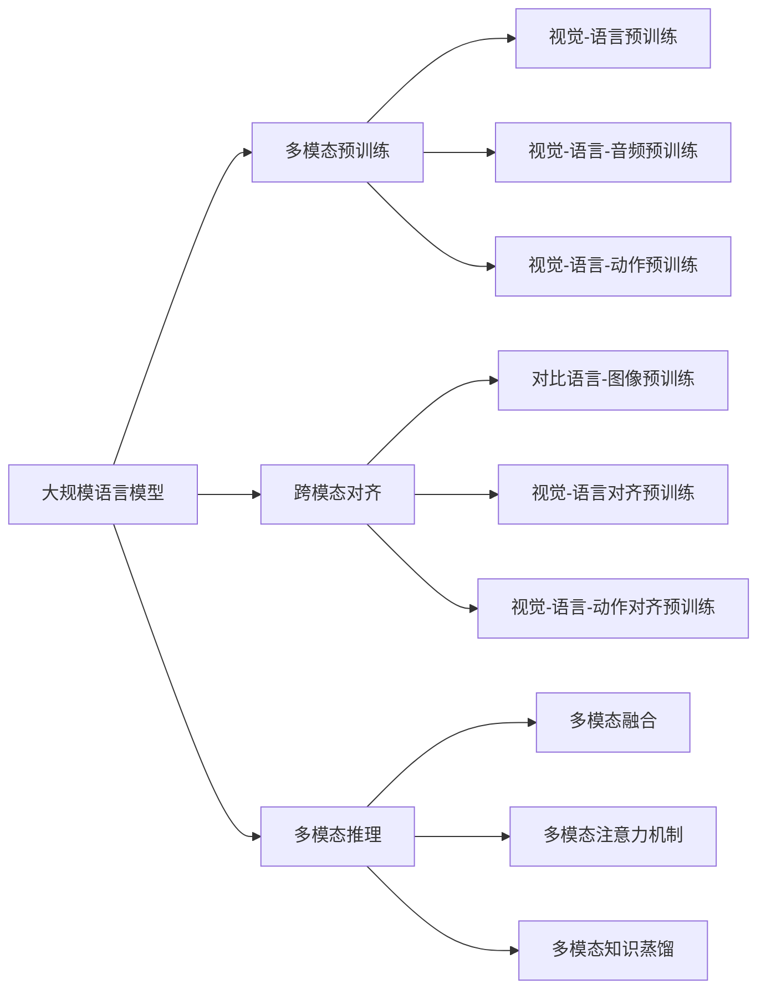

# 大规模语言模型从理论到实践 多模态能力示例

## 1. 背景介绍
### 1.1 大规模语言模型的发展历程
#### 1.1.1 早期语言模型
#### 1.1.2 Transformer 的出现
#### 1.1.3 预训练模型的崛起
### 1.2 多模态能力的重要性
#### 1.2.1 自然语言处理的局限性
#### 1.2.2 多模态信息的互补作用
#### 1.2.3 多模态能力的应用前景

## 2. 核心概念与联系
### 2.1 大规模语言模型
#### 2.1.1 定义与特点
#### 2.1.2 训练方法与策略
#### 2.1.3 优势与局限性
### 2.2 多模态学习
#### 2.2.1 多模态数据的表示
#### 2.2.2 多模态特征的融合
#### 2.2.3 多模态任务的分类
### 2.3 大规模语言模型与多模态学习的结合
#### 2.3.1 多模态预训练
#### 2.3.2 跨模态对齐
#### 2.3.3 多模态推理

## 3. 核心算法原理具体操作步骤
### 3.1 多模态预训练算法
#### 3.1.1 视觉-语言预训练(VLP)
#### 3.1.2 视觉-语言-音频预训练(VLAP)
#### 3.1.3 视觉-语言-动作预训练(VLMP)
### 3.2 跨模态对齐算法
#### 3.2.1 对比语言-图像预训练(CLIP)
#### 3.2.2 视觉-语言对齐预训练(VLAP)
#### 3.2.3 视觉-语言-动作对齐预训练(VLMAP)
### 3.3 多模态推理算法
#### 3.3.1 多模态融合
#### 3.3.2 多模态注意力机制
#### 3.3.3 多模态知识蒸馏

## 4. 数学模型和公式详细讲解举例说明
### 4.1 多模态表示学习
#### 4.1.1 多模态自编码器
$$ \min_{\theta_e,\theta_d} \mathcal{L}(\mathbf{x},\mathbf{y}) = \Vert f_{\theta_d}(f_{\theta_e}(\mathbf{x},\mathbf{y})) - [\mathbf{x},\mathbf{y}] \Vert^2 $$
#### 4.1.2 多模态对比学习
$$ \mathcal{L}(\mathbf{x},\mathbf{y}) = -\log \frac{\exp(f_{\theta}(\mathbf{x})^\top g_{\phi}(\mathbf{y}))}{\sum_{\mathbf{y}' \in \mathcal{Y}} \exp(f_{\theta}(\mathbf{x})^\top g_{\phi}(\mathbf{y}'))} $$
### 4.2 多模态对齐
#### 4.2.1 规范化正交对齐
$$ \min_{\mathbf{W}_x,\mathbf{W}_y} \Vert \mathbf{W}_x^\top\mathbf{X} - \mathbf{W}_y^\top\mathbf{Y} \Vert_F^2 \quad \text{s.t.} \quad \mathbf{W}_x^\top\mathbf{W}_x=\mathbf{I}, \mathbf{W}_y^\top\mathbf{W}_y=\mathbf{I} $$
#### 4.2.2 深度规范化正交对齐
$$ \min_{\theta_x,\theta_y} \Vert f_{\theta_x}(\mathbf{X}) - g_{\theta_y}(\mathbf{Y}) \Vert_F^2 \quad \text{s.t.} \quad f_{\theta_x}(\mathbf{X})^\top f_{\theta_x}(\mathbf{X})=\mathbf{I}, g_{\theta_y}(\mathbf{Y})^\top g_{\theta_y}(\mathbf{Y})=\mathbf{I} $$
### 4.3 多模态融合
#### 4.3.1 多模态注意力融合
$$\mathbf{h} = \sum_{i=1}^{n} \alpha_i \mathbf{z}_i, \quad \alpha_i = \frac{\exp(e_i)}{\sum_{j=1}^{n} \exp(e_j)}, \quad e_i = \mathbf{v}^\top \tanh(\mathbf{W}\mathbf{z}_i + \mathbf{b})$$
#### 4.3.2 多模态门控融合
$$\mathbf{h} = \mathbf{z}_v \odot \mathbf{g}_v + \mathbf{z}_t \odot \mathbf{g}_t, \quad \mathbf{g}_v = \sigma(\mathbf{W}_v\mathbf{z}_v + \mathbf{b}_v), \quad \mathbf{g}_t = \sigma(\mathbf{W}_t\mathbf{z}_t + \mathbf{b}_t)$$

## 5. 项目实践：代码实例和详细解释说明
### 5.1 多模态预训练示例
#### 5.1.1 视觉-语言预训练(VLP)的PyTorch实现
```python
import torch
import torch.nn as nn

class VLP(nn.Module):
    def __init__(self, visual_encoder, text_encoder, fusion_layer):
        super(VLP, self).__init__()
        self.visual_encoder = visual_encoder
        self.text_encoder = text_encoder
        self.fusion_layer = fusion_layer

    def forward(self, image, text):
        visual_features = self.visual_encoder(image)
        text_features = self.text_encoder(text)
        fused_features = self.fusion_layer(visual_features, text_features)
        return fused_features
```
#### 5.1.2 视觉-语言-音频预训练(VLAP)的TensorFlow实现
```python
import tensorflow as tf

class VLAP(tf.keras.Model):
    def __init__(self, visual_encoder, text_encoder, audio_encoder, fusion_layer):
        super(VLAP, self).__init__()
        self.visual_encoder = visual_encoder
        self.text_encoder = text_encoder
        self.audio_encoder = audio_encoder
        self.fusion_layer = fusion_layer

    def call(self, image, text, audio):
        visual_features = self.visual_encoder(image)
        text_features = self.text_encoder(text)
        audio_features = self.audio_encoder(audio)
        fused_features = self.fusion_layer([visual_features, text_features, audio_features])
        return fused_features
```
### 5.2 跨模态对齐示例
#### 5.2.1 对比语言-图像预训练(CLIP)的PyTorch实现
```python
import torch
import torch.nn as nn

class CLIP(nn.Module):
    def __init__(self, visual_encoder, text_encoder):
        super(CLIP, self).__init__()
        self.visual_encoder = visual_encoder
        self.text_encoder = text_encoder

    def forward(self, image, text):
        visual_features = self.visual_encoder(image)
        text_features = self.text_encoder(text)
        visual_features = visual_features / visual_features.norm(dim=-1, keepdim=True)
        text_features = text_features / text_features.norm(dim=-1, keepdim=True)
        similarity = (visual_features @ text_features.T).mean()
        return similarity
```
#### 5.2.2 视觉-语言对齐预训练(VLAP)的TensorFlow实现
```python
import tensorflow as tf

class VLAP(tf.keras.Model):
    def __init__(self, visual_encoder, text_encoder):
        super(VLAP, self).__init__()
        self.visual_encoder = visual_encoder
        self.text_encoder = text_encoder

    def call(self, image, text):
        visual_features = self.visual_encoder(image)
        text_features = self.text_encoder(text)
        visual_features = tf.math.l2_normalize(visual_features, axis=-1)
        text_features = tf.math.l2_normalize(text_features, axis=-1)
        similarity = tf.reduce_mean(tf.matmul(visual_features, text_features, transpose_b=True))
        return similarity
```
### 5.3 多模态推理示例
#### 5.3.1 多模态融合的PyTorch实现
```python
import torch
import torch.nn as nn

class MultimodalFusion(nn.Module):
    def __init__(self, input_dim, hidden_dim, output_dim):
        super(MultimodalFusion, self).__init__()
        self.fc1 = nn.Linear(input_dim, hidden_dim)
        self.fc2 = nn.Linear(hidden_dim, output_dim)
        self.relu = nn.ReLU()

    def forward(self, visual_features, text_features):
        fused_features = torch.cat((visual_features, text_features), dim=-1)
        hidden = self.relu(self.fc1(fused_features))
        output = self.fc2(hidden)
        return output
```
#### 5.3.2 多模态注意力机制的TensorFlow实现
```python
import tensorflow as tf

class MultimodalAttention(tf.keras.layers.Layer):
    def __init__(self, hidden_dim):
        super(MultimodalAttention, self).__init__()
        self.hidden_dim = hidden_dim
        self.dense1 = tf.keras.layers.Dense(hidden_dim, activation='tanh')
        self.dense2 = tf.keras.layers.Dense(1)

    def call(self, visual_features, text_features):
        concat_features = tf.concat([visual_features, text_features], axis=-1)
        hidden = self.dense1(concat_features)
        attention_scores = self.dense2(hidden)
        attention_scores = tf.nn.softmax(attention_scores, axis=-1)
        attended_features = attention_scores * concat_features
        attended_features = tf.reduce_sum(attended_features, axis=-2)
        return attended_features
```

## 6. 实际应用场景
### 6.1 图像描述生成
#### 6.1.1 应用背景与挑战
#### 6.1.2 多模态方法的优势
#### 6.1.3 实际案例分析
### 6.2 视频问答
#### 6.2.1 应用背景与挑战
#### 6.2.2 多模态方法的优势
#### 6.2.3 实际案例分析
### 6.3 多模态对话系统
#### 6.3.1 应用背景与挑战
#### 6.3.2 多模态方法的优势
#### 6.3.3 实际案例分析

## 7. 工具和资源推荐
### 7.1 开源工具包
#### 7.1.1 transformers
#### 7.1.2 MMF
#### 7.1.3 CLIP
### 7.2 数据集
#### 7.2.1 MS COCO
#### 7.2.2 Flickr30K
#### 7.2.3 VQA
### 7.3 预训练模型
#### 7.3.1 BERT
#### 7.3.2 ViT
#### 7.3.3 DALL-E

## 8. 总结：未来发展趋势与挑战
### 8.1 大规模多模态预训练的发展趋势
#### 8.1.1 模型规模的增长
#### 8.1.2 模态的扩展
#### 8.1.3 训练范式的创新
### 8.2 多模态推理的研究热点
#### 8.2.1 跨模态推理
#### 8.2.2 多模态对话
#### 8.2.3 多模态知识图谱
### 8.3 面临的挑战与机遇
#### 8.3.1 数据的标注与对齐
#### 8.3.2 模态间的差异与融合
#### 8.3.3 可解释性与可靠性

## 9. 附录：常见问题与解答
### 9.1 如何选择合适的多模态模型？
### 9.2 多模态模型的训练技巧有哪些？
### 9.3 如何评估多模态模型的性能？
### 9.4 多模态模型在实际应用中需要注意哪些问题？
### 9.5 多模态研究领域有哪些值得关注的学者和机构？



大规模语言模型在自然语言处理领域取得了巨大的成功，但仅依靠文本数据还不足以应对现实世界的复杂场景。为了进一步提升语言模型的理解和生成能力，研究者们开始探索将视觉、音频等多模态信息引入语言模型的训练过程。

多模态预训练旨在利用大规模的文本-图像、文本-视频等配对数据，通过自监督学习的方式，让模型学习到不同模态之间的对齐和融合。视觉-语言预训练(VLP)、视觉-语言-音频预训练(VLAP)、视觉-语言-动作预训练(VLMP)等方法相继被提出，极大地拓展