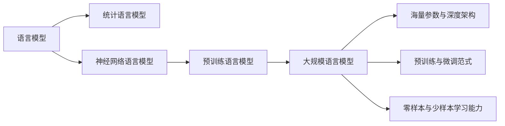

# 大规模语言模型从理论到实践 大语言模型评估体系

## 1.背景介绍
### 1.1 大规模语言模型的发展历程
#### 1.1.1 早期的语言模型
#### 1.1.2 神经网络语言模型的兴起
#### 1.1.3 Transformer 架构的突破

### 1.2 大规模语言模型的应用前景
#### 1.2.1 自然语言处理领域的革命
#### 1.2.2 知识图谱构建与问答系统
#### 1.2.3 智能对话与写作辅助

### 1.3 大规模语言模型面临的挑战
#### 1.3.1 计算资源与训练效率
#### 1.3.2 模型泛化能力与鲁棒性
#### 1.3.3 伦理与安全问题

## 2.核心概念与联系
### 2.1 语言模型的定义与分类
#### 2.1.1 统计语言模型
#### 2.1.2 神经网络语言模型
#### 2.1.3 预训练语言模型

### 2.2 大规模语言模型的特点
#### 2.2.1 海量参数与深度架构
#### 2.2.2 预训练与微调范式
#### 2.2.3 零样本与少样本学习能力

### 2.3 大规模语言模型的评估指标
#### 2.3.1 困惑度(Perplexity)
#### 2.3.2 BLEU与ROUGE
#### 2.3.3 人工评估与交互评测



## 3.核心算法原理具体操作步骤
### 3.1 Transformer 架构详解
#### 3.1.1 自注意力机制
#### 3.1.2 多头注意力
#### 3.1.3 位置编码

### 3.2 预训练目标与损失函数
#### 3.2.1 语言模型预训练
#### 3.2.2 去噪自编码
#### 3.2.3 对比学习

### 3.3 优化算法与训练技巧
#### 3.3.1 AdamW优化器
#### 3.3.2 学习率调度策略
#### 3.3.3 梯度累积与混合精度训练

## 4.数学模型和公式详细讲解举例说明
### 4.1 Transformer 的数学表示
#### 4.1.1 自注意力机制的数学推导
给定查询向量$Q$,键向量$K$和值向量$V$,自注意力的数学表达为:

$$
Attention(Q,K,V) = softmax(\frac{QK^T}{\sqrt{d_k}})V
$$

其中$d_k$为键向量的维度。

#### 4.1.2 多头注意力的数学表示
多头注意力可以表示为:

$$
MultiHead(Q,K,V) = Concat(head_1, ..., head_h)W^O \
head_i = Attention(QW_i^Q, KW_i^K, VW_i^V)
$$

其中$W_i^Q \in \mathbb{R}^{d_{model} \times d_k}$,$W_i^K \in \mathbb{R}^{d_{model} \times d_k}$,$W_i^V \in \mathbb{R}^{d_{model} \times d_v}$和$W^O \in \mathbb{R}^{hd_v \times d_{model}}$为可学习的参数矩阵。

#### 4.1.3 位置编码的数学表示
Transformer使用正弦和余弦函数生成位置编码:

$$
PE_{(pos,2i)} = sin(pos / 10000^{2i/d_{model}}) \
PE_{(pos,2i+1)} = cos(pos / 10000^{2i/d_{model}})
$$

其中$pos$为位置,$i$为维度。

### 4.2 预训练目标的数学表示
#### 4.2.1 语言模型预训练
语言模型的预训练目标是最大化给定上下文的单词概率:

$$
\mathcal{L}_{LM} = -\sum_{i=1}^{n} log P(w_i|w_{<i})
$$

其中$w_i$为第$i$个单词,$w_{<i}$为$w_i$之前的所有单词。

#### 4.2.2 去噪自编码
去噪自编码的预训练目标是最小化重构损失:

$$
\mathcal{L}_{DAE} = -\sum_{i=1}^{n} log P(w_i|w_{<i},w_{>i},\tilde{w})
$$

其中$\tilde{w}$为加入噪声的输入序列。

#### 4.2.3 对比学习
对比学习的预训练目标是最大化正样本对的相似度,最小化负样本对的相似度:

$$
\mathcal{L}_{CL} = -\sum_{i=1}^{N} log \frac{exp(sim(h_i,h_i^+)/\tau)}{\sum_{j=1}^{N} exp(sim(h_i,h_j)/\tau)}
$$

其中$h_i$为第$i$个样本的表示,$h_i^+$为正样本的表示,$\tau$为温度超参数。

## 5.项目实践：代码实例和详细解释说明
### 5.1 使用PyTorch实现Transformer
```python
import torch
import torch.nn as nn

class MultiHeadAttention(nn.Module):
    def __init__(self, d_model, num_heads):
        super().__init__()
        self.d_model = d_model
        self.num_heads = num_heads
        self.head_dim = d_model // num_heads
        
        self.q_linear = nn.Linear(d_model, d_model)
        self.k_linear = nn.Linear(d_model, d_model) 
        self.v_linear = nn.Linear(d_model, d_model)
        self.out_linear = nn.Linear(d_model, d_model)
        
    def forward(self, q, k, v, mask=None):
        batch_size = q.size(0)
        
        q = self.q_linear(q).view(batch_size, -1, self.num_heads, self.head_dim).transpose(1, 2)
        k = self.k_linear(k).view(batch_size, -1, self.num_heads, self.head_dim).transpose(1, 2)
        v = self.v_linear(v).view(batch_size, -1, self.num_heads, self.head_dim).transpose(1, 2)
        
        attn_scores = torch.matmul(q, k.transpose(-2, -1)) / math.sqrt(self.head_dim)
        if mask is not None:
            attn_scores = attn_scores.masked_fill(mask == 0, -1e9)
        attn_probs = F.softmax(attn_scores, dim=-1)
        
        attn_output = torch.matmul(attn_probs, v)
        attn_output = attn_output.transpose(1, 2).contiguous().view(batch_size, -1, self.d_model)
        attn_output = self.out_linear(attn_output)
        
        return attn_output

class TransformerBlock(nn.Module):
    def __init__(self, d_model, num_heads, dropout=0.1):
        super().__init__()
        self.attn = MultiHeadAttention(d_model, num_heads)
        self.norm1 = nn.LayerNorm(d_model)
        self.norm2 = nn.LayerNorm(d_model)
        self.ff = nn.Sequential(
            nn.Linear(d_model, d_model * 4),
            nn.ReLU(),
            nn.Linear(d_model * 4, d_model)
        )
        self.dropout1 = nn.Dropout(dropout)
        self.dropout2 = nn.Dropout(dropout)
        
    def forward(self, x, mask=None):
        attn_output = self.attn(x, x, x, mask)
        x = x + self.dropout1(attn_output)
        x = self.norm1(x)
        ff_output = self.ff(x)
        x = x + self.dropout2(ff_output)
        x = self.norm2(x)
        return x
```

以上代码实现了Transformer的核心组件:多头注意力和Transformer块。其中,多头注意力将输入的查询、键、值向量线性变换后分割为多个头,并行计算注意力,最后将结果拼接并线性变换得到输出。Transformer块则由多头注意力、残差连接、层归一化和前馈网络组成,可以堆叠多个Transformer块构建深度模型。

### 5.2 使用HuggingFace的Transformers库进行预训练
```python
from transformers import BertTokenizer, BertForMaskedLM, DataCollatorForLanguageModeling, TrainingArguments, Trainer

tokenizer = BertTokenizer.from_pretrained('bert-base-uncased')
model = BertForMaskedLM.from_pretrained('bert-base-uncased')

def tokenize(examples):
    return tokenizer(examples['text'], truncation=True, padding='max_length', max_length=128)

dataset = load_dataset('wikitext', 'wikitext-2-raw-v1', split='train')
dataset = dataset.map(tokenize, batched=True, remove_columns=['text'])
data_collator = DataCollatorForLanguageModeling(tokenizer=tokenizer, mlm=True, mlm_probability=0.15)

training_args = TrainingArguments(
    output_dir='./results',
    num_train_epochs=3,
    per_device_train_batch_size=32,
    learning_rate=1e-4,
    weight_decay=0.01,
)

trainer = Trainer(
    model=model,
    args=training_args,
    train_dataset=dataset,
    data_collator=data_collator,
)

trainer.train()
```

以上代码展示了如何使用HuggingFace的Transformers库对BERT模型进行预训练。首先加载预训练的BERT tokenizer和模型,然后定义数据预处理函数对文本进行tokenize,并使用DataCollatorForLanguageModeling生成带掩码的训练数据。接着设置训练参数和Trainer,最后调用train()方法开始预训练。Transformers库大大简化了预训练的流程,使得研究人员可以快速实验不同的模型和数据集。

## 6.实际应用场景
### 6.1 智能问答系统
大规模语言模型可以作为智能问答系统的核心组件,通过预训练从海量文本数据中学习到丰富的知识,再结合检索和生成技术,回答用户的各种问题。例如,微软的Turing NLG模型和OpenAI的GPT-3模型都展现出了强大的问答能力,可以回答开放域的问题,生成流畅自然的答案。

### 6.2 文本摘要生成
大规模语言模型可以用于自动生成文本摘要,帮助用户快速了解文章的主要内容。通过在大规模语料上预训练,语言模型学习到了丰富的语言知识和生成能力,再结合文本摘要的训练数据进行微调,即可生成高质量的摘要。谷歌的PEGASUS和BART模型在文本摘要任务上取得了很好的效果。

### 6.3 机器翻译
传统的机器翻译系统通常需要大量的平行语料进行训练,而大规模语言模型可以利用单语数据进行预训练,再在少量平行语料上微调,就能够实现不错的翻译效果。Facebook的mBART和微软的XLM-R等多语言预训练模型在机器翻译任务上表现出色,大大减少了对平行语料的依赖。

## 7.工具和资源推荐
### 7.1 开源框架
- HuggingFace的Transformers库:提供了大量预训练模型和训练脚本,是目前最流行的NLP工具包。
- FairSeq:由Facebook开源的序列到序列建模工具包,支持多种预训练模型。
- OpenNMT:由哈佛大学NLP组开源,专注于神经机器翻译的工具包。

### 7.2 预训练模型
- BERT:Google推出的基于Transformer的双向预训练模型,在多个NLP任务上取得了SOTA效果。 
- RoBERTa:Facebook对BERT的改进版本,通过更大的批量、更多的数据和更长的训练时间提升性能。
- XLNet:Google提出的生成式预训练模型,在多个任务上超越了BERT。
- GPT-3:OpenAI训练的大规模语言模型,具有惊人的零样本和少样本学习能力。

### 7.3 评测基准
- GLUE:由9个自然语言理解任务组成的评测基准,广泛用于评估预训练模型的性能。
- SuperGLUE:GLUE的升级版,包含更具挑战性的任务,用于评估模型的泛化和鲁棒性。
- SQuAD:大规模阅读理解数据集,包含10万个问题和Wikipedia文章片段。
- WMT:机器翻译领域的权威评测,包含多个语言对和不同质量的数据集。

## 8.总结：未来发展趋势与挑战
### 8.1 模型规模