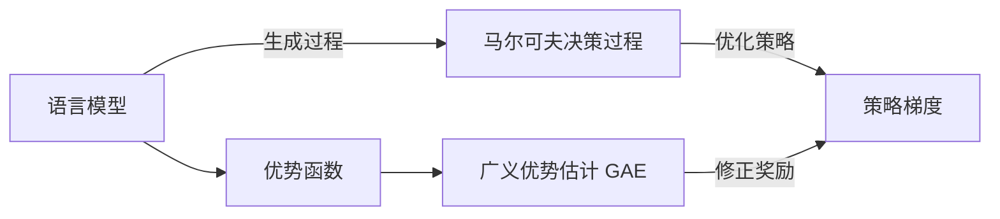

# 大规模语言模型从理论到实践 广义优势估计

## 1.背景介绍
### 1.1 大规模语言模型的发展历程
### 1.2 大规模语言模型面临的挑战
### 1.3 广义优势估计的提出背景

大规模语言模型(Large Language Model, LLM)近年来取得了突飞猛进的发展,从最早的BERT到GPT系列,再到最新的PaLM、Chinchilla等模型,参数量从亿级增长到千亿级,语言理解和生成能力不断提升。然而,随着模型规模的增大,训练难度和成本也在急剧攀升。如何在有限的算力和数据资源下,最大化语言模型的性能,成为一个亟待解决的问题。

传统的语言模型评估方法,如困惑度(Perplexity)、BLEU等,主要关注模型在特定任务上的表现。但对于通用的大规模语言模型,我们更关心它在广泛的任务上的整体能力。因此,我们需要一种更普适的评估指标。广义优势估计(Generalized Advantage Estimation, GAE)正是在这一背景下被提出,旨在更全面地评估语言模型的性能,为模型优化提供理论指导。

## 2.核心概念与联系
### 2.1 语言模型的定义与分类
### 2.2 优势函数与广义优势估计
### 2.3 策略梯度与GAE的关系

语言模型本质上是对语言概率分布的建模。根据建模粒度,可分为词级别(Word-Level)、字符级别(Character-Level)等;根据生成方式,可分为自回归(Autoregressive)和非自回归(Non-Autoregressive)。大规模语言模型通常采用 Transformer 等深度神经网络结构,通过自监督学习从海量无标注文本中习得语言知识。

优势函数(Advantage Function)源自强化学习,表示某个状态行为相对于平均水平的优势。在语言模型中,我们可将输入视为状态,下一个词的选择视为行为,优势函数则刻画了某词相对于其他候选词的优势。广义优势估计在传统优势函数的基础上,引入了折扣因子和指数加权平均,能更稳定地估计每个词的优势。

策略梯度(Policy Gradient)是优化策略类模型的常用方法。语言模型的生成过程可看作一个马尔可夫决策过程,通过最大化预期奖励来优化策略。GAE实质上可视为一种带基线的策略梯度算法,通过优势函数修正奖励,进而指导梯度更新。二者在理论上有着紧密的联系。



## 3.核心算法原理具体操作步骤
### 3.1 广义优势估计的数学定义
### 3.2 GAE的计算过程与伪代码
### 3.3 基于GAE的语言模型优化流程

广义优势估计的数学定义为:

$$
\hat{A}_t^{GAE(\gamma,\lambda)} = \sum_{l=0}^{\infty}(\gamma\lambda)^l \delta_{t+l}^V
$$

其中,$\gamma$为折扣因子,$\lambda$为指数加权系数,$\delta_t^V$为时间差分(TD)误差:

$$
\delta_t^V = r_t + \gamma V(s_{t+1}) - V(s_t)
$$

$V(s_t)$为状态值函数,表示状态$s_t$的期望累积奖励。

GAE的计算过程可总结为以下步骤:
1. 采样生成一个完整的句子,记录每个词的对数概率和奖励
2. 计算每个时间步的TD误差 $\delta_t^V$
3. 根据公式计算GAE估计值 $\hat{A}_t^{GAE(\gamma,\lambda)}$
4. 将GAE作为优势函数,计算损失并更新模型参数

伪代码如下:

```python
def compute_gae(rewards, values, gamma, lam):
    deltas = rewards[:-1] + gamma * values[1:] - values[:-1]
    gae = 0
    adv = []
    for delta in reversed(deltas):
        gae = delta + gamma * lam * gae
        adv.append(gae)
    return list(reversed(adv))
```

基于GAE的语言模型优化流程为:
1. 随机初始化语言模型参数
2. 重复以下步骤直到收敛:
   - 采样生成一批句子
   - 计算每个句子的GAE
   - 计算策略梯度损失函数
   - 反向传播,更新模型参数
3. 在验证集上评估模型性能,保存最优模型

## 4.数学模型和公式详细讲解举例说明
### 4.1 马尔可夫决策过程与贝尔曼方程
### 4.2 策略梯度定理的推导与证明
### 4.3 GAE的优势分析与实例说明

语言模型的生成过程可形式化为一个马尔可夫决策过程(MDP)$\mathcal{M}=\langle\mathcal{S},\mathcal{A},\mathcal{P},\mathcal{R},\gamma\rangle$。其中状态$s\in\mathcal{S}$为输入的词,行为$a\in\mathcal{A}$为生成的下一个词,转移概率$\mathcal{P}(s'|s,a)$表示在状态$s$下执行行为$a$到达状态$s'$的概率,奖励函数$\mathcal{R}(s,a)$表示生成某个词获得的奖励,折扣因子$\gamma\in[0,1]$表示未来奖励的衰减程度。语言模型的目标是学习一个策略$\pi(a|s)$,使得预期累积奖励最大化:

$$
J(\pi) = \mathbb{E}_{s_0,a_0,\ldots} \left[ \sum_{t=0}^{\infty} \gamma^t \mathcal{R}(s_t,a_t) \right]
$$

根据贝尔曼方程,最优状态值函数$V^*(s)$满足:

$$
V^*(s) = \max_{a\in\mathcal{A}} \left[ \mathcal{R}(s,a) + \gamma \sum_{s'\in\mathcal{S}} \mathcal{P}(s'|s,a) V^*(s') \right]
$$

策略梯度定理指出,策略的梯度为:

$$
\nabla_\theta J(\pi_\theta) = \mathbb{E}_{s_0,a_0,\ldots} \left[ \sum_{t=0}^{\infty} \nabla_\theta \log \pi_\theta(a_t|s_t) \hat{A}_t \right]
$$

其中$\hat{A}_t$为优势函数的估计值。传统的优势函数估计使用蒙特卡洛方法或TD方法,而GAE则是二者的插值:

$$
\hat{A}_t^{GAE(\gamma,\lambda)} = (1-\lambda) \sum_{n=1}^{\infty} \lambda^{n-1} \hat{A}_t^{(n)}
$$

当$\lambda=0$时,GAE退化为一步TD估计;当$\lambda=1$时,GAE等价于蒙特卡洛估计。适当的$\lambda$可在降低方差和偏差间取得平衡。例如,考虑一个三词的句子"I love GAE",假设每个词的奖励为1,折扣因子$\gamma=0.5$,则GAE在不同$\lambda$下的计算如下表:

|  词   | MC  | TD(0) | GAE(1) | GAE(0.5) |
|:-----:|:---:|:-----:|:------:|:--------:|
|   I   | 2.5 |  1.5  |  2.5   |    2     |
| love  | 1.5 |   1   |  1.5   |   1.25   |
|  GAE  |  1  |   1   |   1    |    1     |

可见,$\lambda$越大,GAE就越接近蒙特卡洛估计,反之则更接近TD。

## 5.项目实践：代码实例和详细解释说明
### 5.1 基于PyTorch实现语言模型
### 5.2 使用GAE计算优势函数
### 5.3 基于GAE的策略梯度优化过程

下面我们使用PyTorch实现一个基于LSTM的语言模型,并使用GAE进行优化。首先定义模型类:

```python
class LanguageModel(nn.Module):
    def __init__(self, vocab_size, embed_dim, hidden_dim):
        super().__init__()
        self.embed = nn.Embedding(vocab_size, embed_dim)
        self.lstm = nn.LSTM(embed_dim, hidden_dim)
        self.fc = nn.Linear(hidden_dim, vocab_size)

    def forward(self, x, h0=None):
        x = self.embed(x)
        x, h = self.lstm(x, h0)
        x = self.fc(x)
        return x, h
```

然后定义GAE计算函数:

```python
def compute_gae(rewards, values, gamma=0.99, lam=0.95):
    deltas = rewards[:-1] + gamma * values[1:] - values[:-1]
    gaes = np.zeros_like(rewards)
    gaes[-1] = rewards[-1] - values[-1]
    for t in reversed(range(len(rewards)-1)):
        gaes[t] = deltas[t] + gamma * lam * gaes[t+1]
    return gaes
```

最后实现训练循环:

```python
model = LanguageModel(vocab_size, embed_dim, hidden_dim)
optimizer = optim.Adam(model.parameters(), lr=0.001)

for epoch in range(num_epochs):
    for i, batch in enumerate(dataloader):
        # 采样生成句子
        log_probs, rewards, values = sample_sequence(model, batch)

        # 计算GAE
        advantages = compute_gae(rewards, values)

        # 计算损失函数
        log_probs = torch.stack(log_probs)
        loss = -log_probs.mean() * advantages.mean()

        # 反向传播更新参数
        optimizer.zero_grad()
        loss.backward()
        optimizer.step()
```

其中`sample_sequence`函数用于根据当前模型采样生成一个句子,同时记录每个词的对数概率、奖励和状态值。`advantages`是根据GAE公式计算出的优势函数值,作为策略梯度的权重系数。损失函数为加权的对数似然损失,旨在最大化获得高优势词的概率。通过反复迭代优化,模型逐渐学会生成高质量、自然流畅的语言。

## 6.实际应用场景
### 6.1 智能写作助手
### 6.2 客服聊天机器人
### 6.3 个性化推荐系统

基于大规模语言模型的智能写作助手可为用户提供写作灵感和素材,甚至自动生成文章初稿。例如,输入一个标题或主题,模型可根据上下文自动续写出连贯的段落。再辅以人工修改润色,可大大提高写作效率。

在客服领域,聊天机器人可用于解答用户的常见问题,提供智能化服务。通过语言模型生成回复,再由知识库或规则引擎进行过滤,可构建出高效友好的智能客服系统。GAE可帮助优化对话策略,提高回复的准确性和用户满意度。

个性化推荐是互联网时代的刚需。传统的推荐系统主要基于用户的历史行为和物品的协同过滤,而语言模型可从海量文本中学习到用户的偏好特征。将GAE引入推荐策略的优化,可帮助系统自适应用户的动态兴趣,生成更加个性化的推荐结果。

## 7.工具和资源推荐
### 7.1 开源语言模型实现
### 7.2 语料库与基准数据集
### 7.3 学习资源与社区讨论

对于语言模型的研究与应用,以下是一些常用的开源实现:
- GPT-2/3: OpenAI开源的生成式预训练模型
- BERT: Google提出的双向Transformer预训练模型
- RoBERTa: FAIR优化的BERT模型
- XLNet: Google提出的广义自回归预训练模型

常用的语料库和基准数据集包括:
- WikiText: 基于维基百科的语料数据集
- Penn Treebank: 经典的英文语料库
- GLUE: 通用语言理解评估基准
- SuperGLUE: 更具挑战性的语言理解评估基准

此外,以下是一些推荐的学习资源:
- CS224n: 斯坦福大学的自然语言处理课程
- 《Speech and Language Processing》: Daniel Jurafsky的经典教材
- NLTK/SpaCy: 常用的