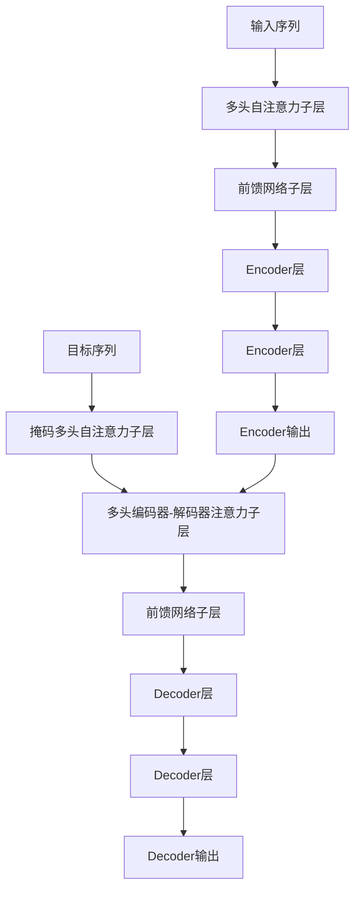

# 大规模语言模型从理论到实践 由少至多提示

## 1.背景介绍

### 1.1 语言模型的重要性

语言模型是自然语言处理领域的基础技术之一,广泛应用于机器翻译、对话系统、文本生成等任务中。随着深度学习技术的快速发展,大规模语言模型(Large Language Model, LLM)成为了当前研究的热点。LLM通过在大规模语料库上进行预训练,学习丰富的语言知识和上下文信息,展现出了强大的语言理解和生成能力。

### 1.2 大规模语言模型的发展历程

大规模语言模型的发展可以追溯到2018年,Google推出的Transformer模型在机器翻译任务上取得了突破性进展。随后,OpenAI发布了GPT(Generative Pre-trained Transformer)模型,能够在不同任务上进行微调,实现多种自然语言处理应用。2020年,GPT-3模型的出现进一步推动了大规模语言模型的发展,其庞大的参数量(1750亿个参数)和强大的生成能力引起了广泛关注。

### 1.3 大规模语言模型的优势

相比传统的语言模型,大规模语言模型具有以下优势:

1. 语言理解和生成能力强大
2. 具有更丰富的语义和上下文知识
3. 可以通过微调适应不同的下游任务
4. 减少了手工特征工程的需求

## 2.核心概念与联系

### 2.1 自注意力机制(Self-Attention)

自注意力机制是Transformer模型的核心,它能够捕捉输入序列中任意两个位置之间的依赖关系。与传统的RNN和CNN相比,自注意力机制具有并行计算的优势,能够更好地捕捉长距离依赖关系。

### 2.2 Transformer架构

Transformer架构由编码器(Encoder)和解码器(Decoder)两部分组成。编码器将输入序列映射为上下文表示,解码器则根据上下文表示和目标序列生成输出序列。编码器和解码器内部都由多个编码器/解码器层堆叠而成,每一层都包含多头自注意力子层和前馈网络子层。



### 2.3 预训练与微调

大规模语言模型通常采用两阶段训练策略:预训练和微调。在预训练阶段,模型在大规模语料库上进行自监督学习,获取通用的语言知识。在微调阶段,模型在特定任务的数据集上进行进一步训练,使其适应具体的下游任务。

### 2.4 提示学习(Prompt Learning)

提示学习是大规模语言模型的一种新颖应用方式。通过设计合适的提示,模型可以在不进行微调的情况下,直接应用于各种任务。提示学习减少了微调的计算开销,并展现了大规模语言模型强大的零样本学习能力。

## 3.核心算法原理具体操作步骤

### 3.1 自注意力机制计算过程

自注意力机制的计算过程可以分为以下几个步骤:

1. 线性投影:将输入序列$X$通过三个线性投影得到查询(Query)矩阵$Q$、键(Key)矩阵$K$和值(Value)矩阵$V$。
   $$Q = XW_Q, K = XW_K, V = XW_V$$

2. 计算注意力分数:通过查询和键的点积计算注意力分数矩阵$S$,并对其进行缩放和软最大化处理。
   $$S = \text{softmax}(\frac{QK^T}{\sqrt{d_k}})$$

3. 计算加权和:将注意力分数矩阵$S$与值矩阵$V$相乘,得到加权和表示$Z$。
   $$Z = SV$$

4. 残差连接和层归一化:将加权和表示$Z$与输入$X$进行残差连接,并进行层归一化操作。

### 3.2 Transformer编码器层

Transformer编码器层的计算过程如下:

1. 输入序列$X$经过自注意力子层,得到自注意力表示$X_1$。
   $$X_1 = \text{Self-Attention}(X) + X$$

2. $X_1$经过前馈网络子层,得到编码器层输出$X_2$。
   $$X_2 = \text{FeedForward}(X_1) + X_1$$

3. $X_2$作为下一个编码器层的输入,或作为编码器的最终输出。

### 3.3 Transformer解码器层

Transformer解码器层的计算过程如下:

1. 目标序列$Y$经过掩码自注意力子层,得到掩码自注意力表示$Y_1$。
   $$Y_1 = \text{Masked Self-Attention}(Y) + Y$$

2. $Y_1$和编码器输出$X_2$经过多头编码器-解码器注意力子层,得到注意力表示$Y_2$。
   $$Y_2 = \text{Encoder-Decoder Attention}(Y_1, X_2) + Y_1$$

3. $Y_2$经过前馈网络子层,得到解码器层输出$Y_3$。
   $$Y_3 = \text{FeedForward}(Y_2) + Y_2$$

4. $Y_3$作为下一个解码器层的输入,或作为解码器的最终输出。

## 4.数学模型和公式详细讲解举例说明

### 4.1 自注意力机制数学模型

自注意力机制的数学模型可以表示为:

$$\text{Attention}(Q, K, V) = \text{softmax}(\frac{QK^T}{\sqrt{d_k}})V$$

其中,$Q$为查询矩阵,$K$为键矩阵,$V$为值矩阵,$d_k$为缩放因子,用于防止内积过大导致梯度消失或爆炸。

例如,假设输入序列为$X = [x_1, x_2, x_3]$,其线性投影后得到:

$$\begin{aligned}
Q &= [q_1, q_2, q_3] \\
K &= [k_1, k_2, k_3] \\
V &= [v_1, v_2, v_3]
\end{aligned}$$

则自注意力输出为:

$$\begin{aligned}
\text{Attention}(Q, K, V) &= \text{softmax}(\frac{QK^T}{\sqrt{d_k}})V \\
&= \begin{bmatrix}
    \alpha_{11} & \alpha_{12} & \alpha_{13} \\
    \alpha_{21} & \alpha_{22} & \alpha_{23} \\
    \alpha_{31} & \alpha_{32} & \alpha_{33}
\end{bmatrix}
\begin{bmatrix}
    v_1 \\
    v_2 \\
    v_3
\end{bmatrix} \\
&= \begin{bmatrix}
    \alpha_{11}v_1 + \alpha_{12}v_2 + \alpha_{13}v_3 \\
    \alpha_{21}v_1 + \alpha_{22}v_2 + \alpha_{23}v_3 \\
    \alpha_{31}v_1 + \alpha_{32}v_2 + \alpha_{33}v_3
\end{bmatrix}
\end{aligned}$$

其中,$\alpha_{ij}$表示$q_i$对$k_j$的注意力权重。

### 4.2 多头注意力机制

多头注意力机制通过将查询、键和值矩阵分别投影到不同的子空间,并对多个子空间的注意力输出进行拼接,从而捕捉不同子空间的特征信息。

$$\begin{aligned}
\text{MultiHead}(Q, K, V) &= \text{Concat}(\text{head}_1, \text{head}_2, \dots, \text{head}_h)W^O \\
\text{where } \text{head}_i &= \text{Attention}(QW_i^Q, KW_i^K, VW_i^V)
\end{aligned}$$

其中,$W_i^Q, W_i^K, W_i^V$分别为第$i$个头的查询、键和值的线性投影矩阵,$W^O$为拼接后的线性投影矩阵。

### 4.3 位置编码

由于自注意力机制没有捕捉序列顺序信息的能力,因此需要在输入序列中添加位置编码,以提供位置信息。位置编码可以通过正弦和余弦函数计算:

$$\begin{aligned}
\text{PE}_{(pos, 2i)} &= \sin(pos / 10000^{2i / d_\text{model}}) \\
\text{PE}_{(pos, 2i+1)} &= \cos(pos / 10000^{2i / d_\text{model}})
\end{aligned}$$

其中,$pos$为位置索引,$i$为维度索引,$d_\text{model}$为模型维度。

## 5.项目实践:代码实例和详细解释说明

以下是使用PyTorch实现Transformer编码器的示例代码:

```python
import torch
import torch.nn as nn

class TransformerEncoder(nn.Module):
    def __init__(self, input_dim, hidden_dim, num_layers, num_heads, dropout):
        super().__init__()
        self.embedding = nn.Linear(input_dim, hidden_dim)
        self.pos_encoder = PositionalEncoding(hidden_dim)
        encoder_layers = nn.TransformerEncoderLayer(hidden_dim, num_heads, hidden_dim * 4, dropout)
        self.encoder = nn.TransformerEncoder(encoder_layers, num_layers)

    def forward(self, x):
        x = self.embedding(x)
        x = self.pos_encoder(x)
        x = self.encoder(x)
        return x

class PositionalEncoding(nn.Module):
    def __init__(self, d_model, max_len=5000):
        super().__init__()
        pe = torch.zeros(max_len, d_model)
        position = torch.arange(0, max_len, dtype=torch.float).unsqueeze(1)
        div_term = torch.exp(torch.arange(0, d_model, 2).float() * (-math.log(10000.0) / d_model))
        pe[:, 0::2] = torch.sin(position * div_term)
        pe[:, 1::2] = torch.cos(position * div_term)
        pe = pe.unsqueeze(0)
        self.register_buffer('pe', pe)

    def forward(self, x):
        return x + self.pe[:, :x.size(1), :]
```

在上面的代码中:

- `TransformerEncoder`类实现了Transformer编码器,包括输入嵌入层、位置编码层和编码器层。
- `PositionalEncoding`类实现了位置编码,通过正弦和余弦函数计算位置编码矩阵。
- `nn.TransformerEncoderLayer`和`nn.TransformerEncoder`分别实现了Transformer编码器层和编码器堆叠。

以下是使用HuggingFace Transformers库进行提示学习的示例代码:

```python
from transformers import pipeline

prompt = "将以下句子翻译成英文:\n\n1. 今天天气很好。\n2. 我很高兴见到你。\n\n"

translator = pipeline("text2text-generation", model="t5-base")
translations = translator(prompt, max_length=100)

for translation in translations:
    print(translation["translation_text"])
```

在上面的代码中:

- 首先定义了一个提示字符串,包含了需要翻译的中文句子。
- 使用`pipeline`函数加载了T5模型,用于文本到文本的生成任务。
- 将提示字符串输入到模型中,得到英文翻译结果。

## 6.实际应用场景

大规模语言模型在自然语言处理领域有着广泛的应用场景,包括但不限于:

1. **机器翻译**:大规模语言模型可以通过预训练和微调,学习不同语言之间的映射关系,实现高质量的机器翻译。
2. **对话系统**:大规模语言模型能够理解上下文信息,生成流畅自然的对话响应,是构建对话系统的关键技术。
3. **文本生成**:大规模语言模型可以生成连贯、富有创意的文本内容,应用于新闻写作、小说创作、广告文案等领域。
4. **问答系统**:通过提示学习,大规模语言模型可以直接应用于问答任务,回答各种领域的问题。
5. **文本摘要**:大规模语言模型能够捕捉文本的关键信息,生成高质量的文本摘要。
6. **情感分析**:通