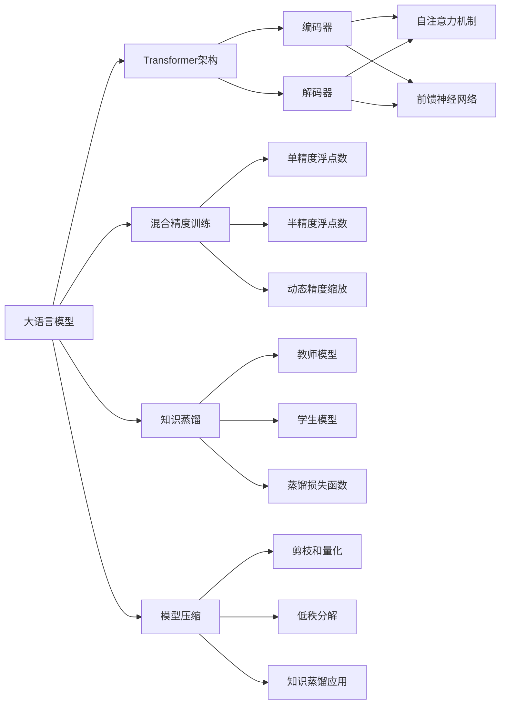

# 大语言模型原理基础与前沿 混合训练和低精度训练

## 1. 背景介绍
### 1.1 大语言模型的发展历程
#### 1.1.1 早期的语言模型
#### 1.1.2 神经网络语言模型的兴起
#### 1.1.3 Transformer的革命性突破
### 1.2 大语言模型面临的挑战
#### 1.2.1 训练数据的规模和质量
#### 1.2.2 计算资源的限制
#### 1.2.3 模型效率和泛化能力
### 1.3 混合训练和低精度训练的意义
#### 1.3.1 提高训练效率
#### 1.3.2 降低计算资源需求
#### 1.3.3 实现更大规模的模型训练

## 2. 核心概念与联系
### 2.1 大语言模型的基本架构
#### 2.1.1 Transformer的编码器-解码器结构
#### 2.1.2 自注意力机制和前馈神经网络
#### 2.1.3 位置编码和残差连接
### 2.2 混合精度训练
#### 2.2.1 单精度和半精度浮点数
#### 2.2.2 动态精度缩放
#### 2.2.3 损失缩放技术
### 2.3 知识蒸馏
#### 2.3.1 教师模型和学生模型
#### 2.3.2 软标签和硬标签
#### 2.3.3 蒸馏损失函数
### 2.4 模型压缩技术
#### 2.4.1 剪枝和量化
#### 2.4.2 低秩分解
#### 2.4.3 知识蒸馏的应用



## 3. 核心算法原理具体操作步骤
### 3.1 混合精度训练算法
#### 3.1.1 前向传播过程
1. 将模型参数和激活值转换为半精度格式。
2. 执行前向传播，计算损失函数。
3. 将损失函数值转换为单精度格式。

#### 3.1.2 反向传播过程
1. 将梯度转换为单精度格式。
2. 执行反向传播，计算梯度。
3. 对梯度应用损失缩放因子。
4. 更新模型参数。

#### 3.1.3 动态精度缩放
1. 初始化损失缩放因子为一个较大的值。
2. 在每次迭代中，检查梯度是否出现溢出。
3. 如果出现溢出，将损失缩放因子减半；否则，将其乘以一个常数。
4. 重复步骤2-3，直到训练收敛。

### 3.2 知识蒸馏算法
#### 3.2.1 训练教师模型
1. 使用大规模数据集训练一个高性能的教师模型。
2. 使用教师模型对训练数据进行推理，生成软标签。

#### 3.2.2 训练学生模型
1. 初始化一个较小的学生模型。
2. 使用教师模型生成的软标签作为训练目标，训练学生模型。
3. 使用蒸馏损失函数，结合软标签和硬标签的损失。
4. 重复步骤2-3，直到学生模型收敛。

#### 3.2.3 蒸馏损失函数
$$L_{distill} = \alpha L_{hard} + (1-\alpha) L_{soft}$$
其中，$L_{hard}$ 是学生模型在硬标签上的交叉熵损失，$L_{soft}$ 是学生模型在软标签上的交叉熵损失，$\alpha$ 是平衡因子。

## 4. 数学模型和公式详细讲解举例说明
### 4.1 Transformer的注意力机制
Transformer的自注意力机制可以表示为：
$$Attention(Q,K,V) = softmax(\frac{QK^T}{\sqrt{d_k}})V$$
其中，$Q$、$K$、$V$ 分别表示查询、键、值矩阵，$d_k$ 是键向量的维度。

例如，假设我们有一个输入序列 $X=[x_1, x_2, ..., x_n]$，其中 $x_i$ 是第 $i$ 个词的嵌入向量。我们可以计算自注意力权重矩阵：
$$A = softmax(\frac{XX^T}{\sqrt{d}})$$
然后，将权重矩阵与值矩阵相乘，得到注意力输出：
$$Z = AX$$
这样，我们就得到了一个新的序列表示 $Z$，其中每个位置都考虑了输入序列中其他位置的信息。

### 4.2 混合精度训练中的损失缩放
在混合精度训练中，我们需要对损失函数值进行缩放，以避免梯度下溢。假设原始的损失函数为 $L$，缩放因子为 $s$，则缩放后的损失函数为：
$$L_{scaled} = s \cdot L$$
相应地，梯度也需要除以缩放因子：
$$g_{scaled} = \frac{g}{s}$$
其中，$g$ 是原始梯度，$g_{scaled}$ 是缩放后的梯度。

例如，假设我们使用半精度浮点数进行训练，初始的缩放因子为 $s=1024$。在前向传播过程中，我们计算出损失函数值 $L=0.01$，则缩放后的损失函数值为：
$$L_{scaled} = 1024 \cdot 0.01 = 10.24$$
在反向传播过程中，我们计算出梯度 $g=0.001$，则缩放后的梯度为：
$$g_{scaled} = \frac{0.001}{1024} = 9.765625 \times 10^{-7}$$
这样，我们就可以使用半精度浮点数进行梯度更新，而不会出现下溢问题。

## 5. 项目实践：代码实例和详细解释说明
下面是一个使用PyTorch实现混合精度训练的代码示例：

```python
import torch
from torch import nn
from torch.cuda.amp import autocast, GradScaler

# 定义模型
model = nn.Sequential(
    nn.Linear(784, 256),
    nn.ReLU(),
    nn.Linear(256, 10)
)
model.cuda()

# 定义损失函数和优化器
criterion = nn.CrossEntropyLoss()
optimizer = torch.optim.SGD(model.parameters(), lr=0.01)

# 创建GradScaler对象
scaler = GradScaler()

# 训练循环
for epoch in range(num_epochs):
    for batch in dataloader:
        x, y = batch
        x, y = x.cuda(), y.cuda()

        # 前向传播
        with autocast():
            y_pred = model(x)
            loss = criterion(y_pred, y)

        # 反向传播
        optimizer.zero_grad()
        scaler.scale(loss).backward()
        scaler.step(optimizer)
        scaler.update()
```

在这个示例中，我们首先定义了一个简单的全连接神经网络模型，并将其移动到GPU上。然后，我们定义了交叉熵损失函数和SGD优化器。

接下来，我们创建了一个`GradScaler`对象，用于自动管理损失缩放和精度缩放。在训练循环中，我们使用`autocast`上下文管理器将前向传播过程封装起来，自动将计算转换为半精度。

在反向传播过程中，我们首先清空梯度，然后使用`scaler.scale(loss).backward()`计算梯度，其中`scaler.scale`函数会自动对损失函数值进行缩放。接着，我们调用`scaler.step(optimizer)`执行梯度更新，`scaler.update()`函数会根据梯度的状态自动调整缩放因子。

通过使用`GradScaler`，我们可以轻松地实现混合精度训练，提高训练效率和速度。

## 6. 实际应用场景
### 6.1 大规模语言模型预训练
混合精度训练和低精度训练技术在大规模语言模型预训练中得到了广泛应用。例如，GPT-3模型使用了混合精度训练，将训练时间从数月缩短到了数周。同时，通过知识蒸馏和模型压缩技术，可以将预训练模型的规模进一步缩小，方便部署和应用。

### 6.2 机器翻译系统
在机器翻译领域，Transformer已经成为主流的模型架构。使用混合精度训练可以加速Transformer模型的训练过程，提高翻译质量。此外，通过知识蒸馏，可以将大型的教师模型压缩为小型的学生模型，降低推理延迟和资源消耗。

### 6.3 智能对话系统
智能对话系统需要处理大量的对话数据，并生成流畅、自然的响应。使用混合精度训练和低精度训练技术，可以加速对话模型的训练过程，提高对话质量。同时，通过知识蒸馏和模型压缩，可以将对话模型部署到资源有限的设备上，如移动端和IoT设备。

## 7. 工具和资源推荐
### 7.1 深度学习框架
- PyTorch: 提供了完善的混合精度训练和低精度训练支持，易于使用和扩展。
- TensorFlow: 支持混合精度训练和量化感知训练，适用于大规模模型训练。
- MindSpore: 华为开源的深度学习框架，支持混合精度训练和自动并行。

### 7.2 预训练模型库
- Hugging Face Transformers: 提供了大量预训练的Transformer模型，支持混合精度训练和模型压缩。
- NVIDIA NGC: NVIDIA提供的预训练模型库，包括优化的混合精度版本。
- OpenAI API: 提供了强大的语言模型API，如GPT-3，可用于各种自然语言处理任务。

### 7.3 模型压缩工具
- TensorRT: NVIDIA提供的高性能深度学习推理优化器，支持量化、剪枝等模型压缩技术。
- PaddleSlim: 百度开源的模型压缩工具，支持量化、剪枝、知识蒸馏等技术。
- DeepSpeed: 微软开源的深度学习优化库，提供了模型并行、混合精度训练、零冗余优化等功能。

## 8. 总结：未来发展趋势与挑战
### 8.1 模型规模的持续增长
随着计算能力的提升和数据规模的扩大，大语言模型的参数量和层数将持续增长。混合精度训练和低精度训练技术将在未来的大规模模型训练中发挥更加重要的作用，帮助研究者和工程师突破计算瓶颈，训练出更加强大的语言模型。

### 8.2 模型压缩技术的进一步发展
知识蒸馏、量化、剪枝等模型压缩技术将进一步发展和成熟，实现更高的压缩比和更低的性能损失。同时，新的模型压缩方法和策略将不断涌现，如联邦蒸馏、异构蒸馏等，进一步拓展模型压缩的应用场景和效果。

### 8.3 训练框架和硬件的优化
深度学习框架和硬件厂商将持续优化混合精度训练和低精度训练的支持，提供更加易用、高效的工具和库。专用的AI芯片和加速器将加速低精度计算的发展，为大规模模型训练提供更强大的计算支持。

### 8.4 安全与隐私的挑战
随着大语言模型的广泛应用，安全与隐私问题将成为亟待解决的挑战。如何在保护用户隐私的同时，实现大规模数据的高效训练和安全共享，将是未来研究的重要方向。同时，如何防止大语言模型被恶意利用，如生成虚假信息、侵犯知识产权等，也需要引起重视。

## 9. 附录：常见问题与解答
### 9.1 混合精度训练和低精度训练的区别是什么？
混合精度训练是指在训练过程中