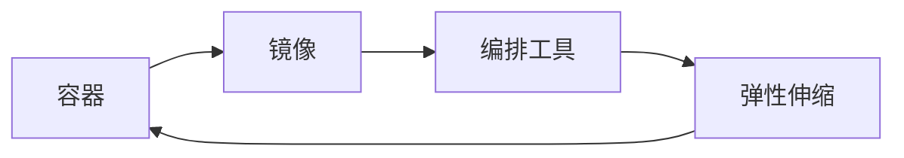

# 容器化部署与弹性伸缩原理与代码实战案例讲解

## 1. 背景介绍

在现代软件开发和部署中,容器化技术和弹性伸缩机制已经成为了不可或缺的重要组成部分。容器化部署提供了一种轻量级、可移植、高效的应用打包和分发方式,而弹性伸缩则能够根据实际负载动态调整资源配置,提高系统的可用性和性能。本文将深入探讨容器化部署与弹性伸缩的原理,并结合实际代码案例进行讲解。

### 1.1 容器化技术概述
#### 1.1.1 容器的定义与特点
#### 1.1.2 容器化技术的发展历程
#### 1.1.3 容器化与虚拟化的区别

### 1.2 弹性伸缩的重要性
#### 1.2.1 应对负载变化的需求
#### 1.2.2 提高资源利用率
#### 1.2.3 降低运维成本

## 2. 核心概念与联系

要理解容器化部署与弹性伸缩,首先需要掌握一些核心概念及其之间的联系。

### 2.1 容器
#### 2.1.1 容器的隔离性
#### 2.1.2 容器的可移植性
#### 2.1.3 容器的轻量级

### 2.2 镜像
#### 2.2.1 镜像的分层结构
#### 2.2.2 镜像的构建与发布
#### 2.2.3 镜像仓库

### 2.3 编排工具
#### 2.3.1 编排工具的作用
#### 2.3.2 常见的编排工具(如Kubernetes、Docker Swarm)
#### 2.3.3 编排工具的核心组件

### 2.4 弹性伸缩
#### 2.4.1 垂直伸缩与水平伸缩
#### 2.4.2 自动伸缩机制
#### 2.4.3 弹性伸缩的触发条件

下图展示了容器化部署与弹性伸缩的核心概念之间的关系:



## 3. 核心算法原理具体操作步骤

容器化部署与弹性伸缩涉及多个核心算法和操作步骤,下面将逐一进行讲解。

### 3.1 容器编排算法
#### 3.1.1 调度算法
##### 3.1.1.1 基于资源需求的调度
##### 3.1.1.2 基于亲和性/反亲和性的调度
##### 3.1.1.3 基于约束条件的调度

#### 3.1.2 负载均衡算法
##### 3.1.2.1 轮询算法
##### 3.1.2.2 最少连接算法
##### 3.1.2.3 基于权重的负载均衡

#### 3.1.3 故障恢复算法
##### 3.1.3.1 重启策略
##### 3.1.3.2 健康检查机制
##### 3.1.3.3 自愈机制

### 3.2 弹性伸缩算法
#### 3.2.1 基于阈值的伸缩算法
##### 3.2.1.1 CPU利用率阈值
##### 3.2.1.2 内存利用率阈值
##### 3.2.1.3 自定义指标阈值

#### 3.2.2 预测性伸缩算法
##### 3.2.2.1 时间序列预测
##### 3.2.2.2 机器学习预测
##### 3.2.2.3 混合预测模型

#### 3.2.3 成本优化伸缩算法
##### 3.2.3.1 竞价实例的使用
##### 3.2.3.2 多可用区部署
##### 3.2.3.3 基于成本的伸缩策略

## 4. 数学模型和公式详细讲解举例说明

在容器化部署与弹性伸缩中,一些数学模型和公式被广泛应用。下面将对其中几个重要的模型和公式进行详细讲解并举例说明。

### 4.1 资源需求模型

容器编排中的调度算法通常基于资源需求模型来决策最优的容器放置。假设有$n$个节点和$m$个待调度的容器,每个节点$i$的可用资源向量为$R_i=(CPU_i,MEM_i)$,每个容器$j$的资源需求向量为$D_j=(CPU_j,MEM_j)$。目标是找到一个调度方案$S$,使得:

$$
\sum_{j=1}^m D_j \leq \sum_{i=1}^n R_i, \forall j \in S_i
$$

其中,$S_i$表示分配到节点$i$上的容器集合。这个模型确保了每个节点的资源满足其上运行的所有容器的需求总和。

### 4.2 负载均衡模型

负载均衡算法旨在将请求流量均匀分配到多个容器副本上。以加权轮询算法为例,假设有$n$个容器副本,每个副本$i$的权重为$w_i$。那么第$k$个请求应该被路由到满足以下条件的副本$j$:

$$
\sum_{i=1}^{j-1} w_i \leq k \bmod \sum_{i=1}^n w_i < \sum_{i=1}^j w_i
$$

这个模型保证了请求在副本间的分配比例与它们的权重成正比。

### 4.3 弹性伸缩模型

基于阈值的弹性伸缩可以用一个简单的数学模型来表示。假设当前副本数为$n$,期望的副本数为$n'$,伸缩阈值为$t$,实际指标值为$v$。那么伸缩决策可以表示为:

$$
n' =
\begin{cases}
\lceil n * (1+t) \rceil, & v > t \
\lfloor n * (1-t) \rfloor, & v < -t \
n, & \text{otherwise}
\end{cases}
$$

这个模型描述了当指标值超过阈值时增加副本数,低于阈值时减少副本数,否则维持不变。

## 5. 项目实践:代码实例和详细解释说明

下面将通过一个基于Kubernetes的容器化部署与弹性伸缩的代码实例,对相关概念进行实践演示。

### 5.1 Kubernetes部署文件

首先定义一个Kubernetes Deployment对象,用于创建和管理容器副本:

```yaml
apiVersion: apps/v1
kind: Deployment
metadata:
  name: my-app
spec:
  replicas: 3
  selector:
    matchLabels:
      app: my-app
  template:
    metadata:
      labels:
        app: my-app
    spec:
      containers:
      - name: my-app
        image: my-app:v1
        resources:
          requests:
            cpu: 100m
            memory: 128Mi
          limits:
            cpu: 200m
            memory: 256Mi
```

这个部署文件指定了初始的副本数为3,并定义了容器的资源需求和限制。

### 5.2 Kubernetes服务文件

接下来创建一个Kubernetes Service对象,用于实现负载均衡和服务发现:

```yaml
apiVersion: v1
kind: Service
metadata:
  name: my-app-svc
spec:
  selector:
    app: my-app
  ports:
  - port: 80
    targetPort: 8080
```

这个服务文件将流量路由到标签为`app: my-app`的容器副本上,并将服务端口80映射到容器端口8080。

### 5.3 Kubernetes HPA文件

最后定义一个Kubernetes HorizontalPodAutoscaler(HPA)对象,实现基于CPU利用率的弹性伸缩:

```yaml
apiVersion: autoscaling/v2beta1
kind: HorizontalPodAutoscaler
metadata:
  name: my-app-hpa
spec:
  scaleTargetRef:
    apiVersion: apps/v1
    kind: Deployment
    name: my-app
  minReplicas: 1
  maxReplicas: 10
  metrics:
  - type: Resource
    resource:
      name: cpu
      targetAverageUtilization: 50
```

这个HPA文件将`my-app`部署的副本数与CPU利用率关联起来。当平均CPU利用率超过50%时,副本数会自动增加,最多不超过10个;当利用率低于50%时,副本数会自动减少,最少不低于1个。

通过这些Kubernetes配置文件,我们实现了应用的容器化部署、负载均衡和弹性伸缩。Kubernetes会根据定义的规则自动管理容器的生命周期和资源分配。

## 6. 实际应用场景

容器化部署与弹性伸缩在许多实际场景中得到了广泛应用,下面列举几个典型的应用场景。

### 6.1 电商平台的促销活动
#### 6.1.1 应对流量突增的挑战
#### 6.1.2 弹性伸缩保障用户体验
#### 6.1.3 节约成本与资源

### 6.2 在线教育平台的课程发布
#### 6.2.1 快速部署与更新
#### 6.2.2 隔离不同课程的运行环境
#### 6.2.3 动态调整资源配置

### 6.3 金融交易系统的高可用部署
#### 6.3.1 多副本容错
#### 6.3.2 跨可用区部署
#### 6.3.3 自动故障恢复

## 7. 工具和资源推荐

以下是一些实践容器化部署与弹性伸缩的常用工具和学习资源。

### 7.1 工具
- Docker:主流的容器引擎
- Kubernetes:生产级容器编排平台
- Helm:Kubernetes的包管理工具
- Prometheus:云原生监控系统
- Istio:服务网格平台

### 7.2 资源
- 官方文档:Docker、Kubernetes等工具的官方文档
- 《Kubernetes in Action》:Kubernetes实践指南
- 《Docker Deep Dive》:深入理解Docker
- CNCF(Cloud Native Computing Foundation):云原生计算基金会
- KubeCon:Kubernetes社区会议

## 8. 总结:未来发展趋势与挑战

容器化部署与弹性伸缩技术的发展日新月异,未来还有许多值得期待的趋势和挑战。

### 8.1 无服务器化
#### 8.1.1 FaaS(Function as a Service)
#### 8.1.2 Serverless容器平台

### 8.2 混合云与多云
#### 8.2.1 统一的容器管理平面
#### 8.2.2 跨云的应用部署与迁移

### 8.3 AI驱动的弹性伸缩
#### 8.3.1 基于机器学习的负载预测
#### 8.3.2 智能化的资源调度优化

### 8.4 挑战
#### 8.4.1 大规模容器集群的管理
#### 8.4.2 容器安全与合规
#### 8.4.3 有状态应用的容器化

## 9. 附录:常见问题与解答

### Q1:容器与虚拟机的区别是什么?
A1:容器通过共享宿主机内核提供轻量级的隔离,而虚拟机通过模拟完整的操作系统提供更强的隔离。容器启动速度更快,资源占用更少,但隔离性相对较弱。

### Q2:如何选择容器运行时?
A2:主流的容器运行时包括Docker、containerd、CRI-O等。选择时需要考虑与编排工具的兼容性、社区支持、性能开销等因素。目前Docker仍然是最常用的选择。

### Q3:Kubernetes中Pod、Deployment、Service的关系是什么?
A3:Pod是Kubernetes的最小调度单元,代表一组紧密相关的容器。Deployment负责管理Pod的多副本部署和更新。Service提供了一个稳定的网络端点来访问后端的Pod集合。

### Q4:如何确保容器化应用的高可用?
A4:可以采取多副本部署、跨可用区调度、健康检查与自愈等措施。同时选择合适的容器编排平台如Kubernetes,利用其内置的高可用机制。

### Q5:什么是服务网格(Service Mesh)?
A5:服务网格是一个专门处理服务间通信的基础设施层。它通过注入Sidecar容器实现服务发现、流量管理、安全认证、可观测性等功能,简化了微服务架构中的通信管理。

以上就是对容器化部署与弹性伸缩原理和实践的全面介绍。随着云原生技术的不断发展,容器已经成为现代应用架构的基石。深入理解其内在原理并掌握实践技巧,将有助于构建高效、可靠、可扩展的应用系统。