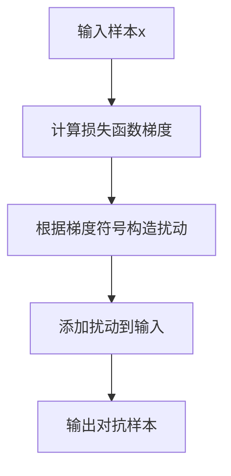
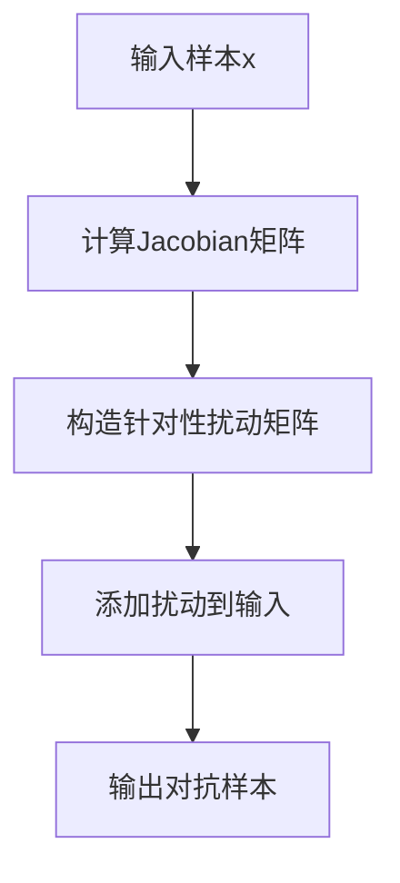

# 对抗攻击:AI系统的安全漏洞,对抗样本生成的攻与防

## 1.背景介绍

### 1.1 人工智能系统的崛起

随着深度学习和神经网络技术的快速发展,人工智能(AI)系统在诸多领域取得了令人瞩目的成就,包括计算机视觉、自然语言处理、语音识别等。AI系统逐渐渗透到我们生活的方方面面,为我们带来了前所未有的便利。然而,就在人工智能系统被广泛应用的同时,它们的安全性问题也日益凸显。

### 1.2 对抗攻击的威胁

对抗攻击(Adversarial Attack)是指通过向输入数据添加人眼无法察觉的微小扰动,从而误导AI模型做出错误预测的一种攻击方式。即使扰动量极小,也可能导致AI系统出现严重失效,产生灾难性后果。这种攻击手段对于安全性能至关重要的AI系统(如自动驾驶、面部识别等)构成了严重威胁。

### 1.3 对抗样本生成

对抗样本(Adversarial Example)是添加了对抗性扰动的输入数据样本。生成对抗样本的过程被称为对抗样本生成(Adversarial Example Generation)。研究人员已经提出了多种对抗样本生成算法,如快速梯度符号法(FGSM)、Jacobian矩阵数据集攻击(JSMA)等,能够有效地攻破现有的AI系统。

## 2.核心概念与联系

### 2.1 对抗攻击与机器学习模型

对抗攻击利用了机器学习模型的一个固有缺陷:模型对于人眼无法察觉的微小扰动过于敏感。这种敏感性源于模型试图在高维数据空间中学习一个复杂的决策边界,而这个决策边界往往是不连续和不稳定的。

### 2.2 对抗攻击与安全性

对抗攻击不仅仅是一个理论问题,它对AI系统的安全性构成了实际威胁。如果攻击者能够生成对抗样本并将其输入到AI系统中,就可能导致系统做出错误决策,产生严重后果。因此,提高AI系统对抗攻击的鲁棒性是确保其安全可靠运行的关键。

### 2.3 对抗样本生成与防御

对抗样本生成算法和防御算法是一个相互博弈的过程。研究人员不断提出新的对抗样本生成方法,而防御方则设计新的鲁棒优化策略来提高模型的抗干扰能力。这种攻防对抗的过程推动了对抗攻击领域的快速发展。

## 3.核心算法原理具体操作步骤

### 3.1 快速梯度符号法(FGSM)

快速梯度符号法(Fast Gradient Sign Method, FGSM)是一种广为人知的对抗样本生成算法,其原理如下:

1) 计算损失函数 $J(\theta, x, y)$ 关于输入 $x$ 的梯度 $\nabla_x J(\theta, x, y)$
2) 根据梯度的符号构造扰动 $\eta = \epsilon \ sign(\nabla_x J(\theta, x, y))$
3) 将扰动 $\eta$ 添加到原始输入 $x$ 中,得到对抗样本 $x' = x + \eta$

其中 $\epsilon$ 控制扰动的大小,$sign$ 函数取梯度的元素符号。FGSM的关键在于利用损失函数梯度的符号信息来构造对抗扰动。

算法步骤如下所示的Mermaid流程图:



### 3.2 Jacobian矩阵数据集攻击(JSMA)

Jacobian矩阵数据集攻击(Jacobian-based Saliency Map Attack, JSMA)是另一种生成对抗样本的经典算法,其基本思路是:

1) 计算Jacobian矩阵 $J_F(x) = \partial F(x) / \partial x$
2) 构造针对性扰动矩阵 $\gamma$,使目标输出 $F(x+\gamma)$ 最大
3) 将扰动 $\gamma$ 添加到原始输入 $x$ 中,得到对抗样本 $x' = x + \gamma$

JSMA的关键在于利用Jacobian矩阵来评估每个特征对输出的影响程度,并据此构造针对性扰动。

算法步骤如下所示的Mermaid流程图:



### 3.3 其他对抗样本生成算法

除了FGSM和JSMA,还有许多其他对抗样本生成算法被提出,如基于优化的攻击(C&W)、基于变分自编码器的攻击(AdvGAN)等。这些算法在攻击效果、计算效率、针对性等方面各有侧重。

## 4.数学模型和公式详细讲解举例说明

### 4.1 对抗样本形式化定义

给定一个机器学习模型 $F: \mathcal{X} \rightarrow \mathcal{Y}$,其输入空间为 $\mathcal{X}$,输出空间为 $\mathcal{Y}$。对于任意输入 $x \in \mathcal{X}$,如果存在一个扰动 $\eta$,使得:

$$\| \eta \| \leq \epsilon, \ \text{但} \ F(x + \eta) \neq F(x)$$

则 $x + \eta$ 就是一个对抗样本。其中 $\|\cdot\|$ 表示某种距离度量, $\epsilon$ 控制扰动的大小。

### 4.2 FGSM扰动构造

在FGSM算法中,扰动 $\eta$ 的构造公式为:

$$\eta = \epsilon \ \text{sign}(\nabla_x J(\theta, x, y))$$

其中 $J(\theta, x, y)$ 是模型的损失函数, $\theta$ 为模型参数, $y$ 为 $x$ 的真实标签。$\text{sign}(\cdot)$ 函数取梯度的元素符号。

我们以图像分类任务为例,假设输入是一张"狗"的图像 $x$,其真实标签为 $y=\text{dog}$。如果我们希望将其误导为"猫"的预测结果,可以构造如下扰动:

$$\eta = \epsilon \ \text{sign}(\nabla_x J(\theta, x, y=\text{cat}))$$

将扰动 $\eta$ 添加到原始图像 $x$ 中,就可以得到对抗样本 $x' = x + \eta$,使得 $F(x') = \text{cat} \neq F(x)$。

### 4.3 JSMA扰动构造

在JSMA算法中,扰动 $\gamma$ 的构造过程较为复杂。首先需要计算Jacobian矩阵:

$$J_F(x) = \begin{bmatrix}
\frac{\partial F_1(x)}{\partial x_1} & \cdots & \frac{\partial F_1(x)}{\partial x_n} \\
\vdots & \ddots & \vdots \\
\frac{\partial F_m(x)}{\partial x_1} & \cdots & \frac{\partial F_m(x)}{\partial x_n}
\end{bmatrix}$$

其中 $F = [F_1, \dots, F_m]^T$ 为模型的 $m$ 个输出,则 $J_F(x)$ 是一个 $m \times n$ 矩阵,反映了每个输入特征对每个输出的影响程度。

接下来,需要构造一个扰动矩阵 $\gamma$,使得目标输出 $F_t(x+\gamma)$ 最大,同时控制扰动的大小 $\|\gamma\|_0 \leq \theta$,其中 $\theta$ 是一个超参数。这可以通过迭代方式实现。

在每一步迭代中,我们选择一个特征 $x_i$,使得 $\frac{\partial F_t(x)}{\partial x_i}$ 最大,并将其对应的元素 $\gamma_i$ 增加一个常数 $\sigma$,从而最大化目标输出 $F_t(x+\gamma)$。重复这一过程,直到达到预设的扰动大小 $\theta$。最终得到的 $\gamma$ 就是所需的针对性扰动矩阵。

通过将扰动 $\gamma$ 添加到原始输入 $x$ 中,我们可以得到对抗样本 $x' = x + \gamma$,使得 $F(x') \neq F(x)$。

## 5.项目实践:代码实例和详细解释说明

为了帮助读者更好地理解对抗样本生成的过程,我们将使用Python和PyTorch库,基于MNIST手写数字数据集实现FGSM算法。代码如下:

```python
import torch
import torch.nn as nn
import torch.optim as optim
import torchvision
import torchvision.transforms as transforms

# 加载MNIST数据集
transform = transforms.Compose([transforms.ToTensor()])
trainset = torchvision.datasets.MNIST(root='./data', train=True, download=True, transform=transform)
trainloader = torch.utils.data.DataLoader(trainset, batch_size=128, shuffle=True)

# 定义LeNet模型
class LeNet(nn.Module):
    def __init__(self):
        super(LeNet, self).__init__()
        self.conv1 = nn.Conv2d(1, 20, 5, 1)
        self.conv2 = nn.Conv2d(20, 50, 5, 1)
        self.fc1 = nn.Linear(4*4*50, 500)
        self.fc2 = nn.Linear(500, 10)

    def forward(self, x):
        x = nn.functional.relu(self.conv1(x))
        x = nn.functional.max_pool2d(x, 2, 2)
        x = nn.functional.relu(self.conv2(x))
        x = nn.functional.max_pool2d(x, 2, 2)
        x = x.view(-1, 4*4*50)
        x = nn.functional.relu(self.fc1(x))
        x = self.fc2(x)
        return x

# 训练模型
model = LeNet()
criterion = nn.CrossEntropyLoss()
optimizer = optim.SGD(model.parameters(), lr=0.01, momentum=0.9)

for epoch in range(10):
    running_loss = 0.0
    for i, data in enumerate(trainloader, 0):
        inputs, labels = data
        optimizer.zero_grad()
        outputs = model(inputs)
        loss = criterion(outputs, labels)
        loss.backward()
        optimizer.step()
        running_loss += loss.item()
    print(f'Epoch {epoch+1} loss: {running_loss/len(trainloader):.3f}')

# FGSM对抗样本生成
epsilon = 0.1
data, label = next(iter(trainloader))
data_adv = data.detach() + epsilon * torch.sign(data.grad)
data_adv = torch.clamp(data_adv, 0, 1)

# 可视化对比
import matplotlib.pyplot as plt
%matplotlib inline

fig, axes = plt.subplots(1, 2, figsize=(10, 5))
axes[0].imshow(data[0,0], cmap='gray')
axes[0].set_title('Original Image')
axes[1].imshow(data_adv[0,0], cmap='gray')
axes[1].set_title('Adversarial Example')
plt.show()
```

上述代码首先定义了一个LeNet模型,并在MNIST数据集上进行了训练。接下来,我们利用FGSM算法生成对抗样本。

具体来说,我们首先从训练数据中取出一个批次的数据 `data` 和对应的标签 `label`。然后,我们计算该批次数据的损失函数梯度 `data.grad`。根据FGSM公式,我们构造扰动 `epsilon * torch.sign(data.grad)`。将扰动添加到原始输入 `data` 中,并进行裁剪以确保像素值在 0-1 范围内,就得到了对抗样本 `data_adv`。

最后,我们可视化对比原始图像和对抗样本。可以看到,虽然对抗样本与原始图像的差异微乎其微,但它已经足以欺骗训练有素的LeNet模型。

通过这个简单的示例,读者应该能够较好地理解FGSM算法的原理和实现过程。当然,在实际应用中,我们还需要进一步探索更加复杂和强大的对抗样本生成算法。

## 6.实际应用场景

对抗攻击和对抗样本生