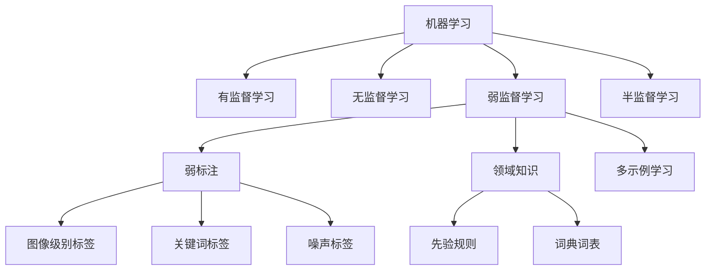

# 弱监督学习 原理与代码实例讲解

## 1.背景介绍

### 1.1 监督学习的局限性
监督学习是机器学习中最常见和应用最广泛的范式之一。它通过使用带标签的训练数据来训练模型,以便模型能够对新的未见过的数据进行预测。然而,监督学习面临着一些局限性:

- 获取大量高质量的标注数据非常昂贵和耗时。在很多现实场景中,人工标注数据的成本很高。
- 某些领域缺乏专家来提供准确的标注,如医疗影像分析等。  
- 标注数据可能存在噪声和错误,影响模型性能。
- 标注数据的分布可能与实际应用场景不一致,导致模型泛化能力差。

### 1.2 弱监督学习的优势
弱监督学习是一种介于无监督学习和有监督学习之间的机器学习范式。与监督学习使用大量精确标注数据不同,弱监督学习利用容易获得的弱标注信息或领域知识来训练模型。它的优势包括:

- 弱标注数据更容易获得,成本更低。如在情感分析任务中利用评论的评分作为情感极性标签。
- 不需要大量人工精确标注,节省时间和人力。
- 可以利用领域知识引导模型训练,如在命名实体识别中使用词典等。
- 模型学到的特征可能更具普适性,泛化能力更强。

### 1.3 弱监督学习的应用场景
弱监督学习在许多领域都有广泛应用,典型场景包括:

- 文本分类:利用文档的关键词、标题等作为弱标签。
- 情感分析:利用评论的评分、表情符号等作为情感极性标签。
- 图像分类:利用图像的标签、描述等作为弱标签。 
- 命名实体识别:利用词典、知识库等先验知识辅助训练。
- 语义分割:利用图像级别的标签进行像素级别的分割。
- 视频动作识别:利用视频的字幕、标签等作为弱标签。

## 2.核心概念与联系

### 2.1 弱标注 
弱标注(Weak Label)是相对于精确标注(Strong Label)而言的。弱标注是指那些容易获得但信息量相对较少的标注信息,常见形式包括:

- 二元标签:只标注正例或负例,如图像级别的标签。
- 不完全标签:只标注部分类别或部分实例。
- 噪声标签:包含一定比例错误标注的标签。  
- 模糊标签:标签粒度比较粗糙,如"运动"而非"打篮球"。

### 2.2 半监督学习
半监督学习是利用少量有标签数据和大量无标签数据进行训练的机器学习方法。它利用无标签数据揭示数据本身的结构信息,来辅助有标签数据的训练。常见的半监督学习方法包括自训练、协同训练等。

弱监督学习与半监督学习的区别在于,半监督学习的标签是精确的,只是数量很少;而弱监督学习的标签是不精确的,可能数量很多。

### 2.3 多示例学习
多示例学习(Multiple Instance Learning)是一种常见的弱监督学习问题。在多示例学习中,训练数据是由包(bag)组成的,每个包里有多个示例(instance)。包级别有标签,但示例级别没有标签。多示例学习的目标是学习一个包级别的分类器。 

图像分类、文本分类、药物活性预测等都可以建模为多示例学习问题。以图像分类为例,每张图像是一个包,图像中的各个区域是示例。图像级别的标签指示图像中是否包含某个目标物体,但不知道目标在图像何处。模型需要学习如何基于图像级别的标签对图像进行分类。

### 2.4 概念关系图
下图展示了弱监督学习的核心概念以及与其他相关概念的关系:



## 3.核心算法原理具体操作步骤

### 3.1 多示例学习算法

#### 3.1.1 MI-SVM 
MI-SVM是一种经典的多示例学习算法,它的基本思想是将SVM扩展到多示例设置。MI-SVM的训练过程如下:

1. 初始化:为每个正包随机选择一个示例作为正例,所有负包的示例都作为负例。
2. 训练:使用选出的正负例训练SVM分类器。 
3. 优化:对每个正包,选择SVM得分最高的示例作为正例,更新SVM。重复步骤2和3,直到收敛。
4. 预测:对新包中的每个示例用SVM预测,取最高得分作为包的预测标签。

#### 3.1.2 MI-Net
MI-Net是一种基于神经网络的多示例学习算法。它使用深度神经网络来学习示例级别的特征表示,并使用池化函数将示例特征聚合为包特征。其训练过程如下:

1. 示例特征提取:对包中的每个示例,使用卷积神经网络提取特征。
2. 池化:使用最大池化等函数,将示例特征聚合为包级别特征。
3. 分类:在包级别特征上添加分类器,用交叉熵损失函数训练网络端到端。
4. 预测:对新包提取示例特征并池化,用分类器预测标签。

### 3.2 基于领域知识的弱监督学习

#### 3.2.1 DataProgramming
DataProgramming是一种利用领域知识生成弱标签的框架。它的主要步骤如下:

1. 定义标注函数:根据领域知识,定义一组标注函数(Labeling Function),每个函数对示例进行标注。如在情感分析中,一个标注函数可以是"如果包含'非常好',则标注为正面"。
2. 标注数据:用标注函数对无标签数据进行标注,生成弱标签。每个示例可能被多个函数标注为不同标签。
3. 去噪:利用标注函数的准确率、相关性等,建立概率图模型对弱标签进行去噪,生成更可靠的概率标签。 
4. 训练:用去噪后的概率标签训练分类器。

#### 3.2.2 Snorkel
Snorkel是基于DataProgramming思想的一个弱监督学习框架。它提供了一套API,方便用户定义标注函数,并自动完成标注函数的组合、去噪等步骤。其主要流程如下:

1. 定义标注函数:用Snorkel提供的API,定义一组Python函数作为标注函数。
2. 标注数据:将标注函数应用于无标签数据,生成弱标签。
3. 去噪:Snorkel自动建立标注函数的概率模型,估计各函数的准确率等,并进行弱标签去噪。
4. 训练:用去噪后的概率标签训练任意分类器。

## 4.数学模型和公式详细讲解举例说明

### 4.1 MI-SVM的数学模型
MI-SVM是在经典SVM的基础上,引入隐变量$y_i$表示示例的标签,然后求解SVM和隐变量的联合优化问题:

$$
\begin{aligned}
\min_{w,b,\xi,y} & \quad \frac{1}{2}||w||^2 + C \sum_{i=1}^{n}\xi_i \
s.t. & \quad y_i(w^Tx_i+b) \geq 1 - \xi_i, \forall i \
     & \quad \xi_i \geq 0, \forall i \
     & \quad \sum_{i \in I_j}y_i \geq 1, \forall j \in pos\_bags \
     & \quad y_i = -1, \forall i \in neg\_bags
\end{aligned}
$$

其中$I_j$表示第$j$个正包中的示例下标集合,$y_i$是示例$i$的标签,$pos\_bags$和$neg\_bags$分别是正包和负包的下标集合。MI-SVM通过交替优化$y$和$w,b$来求解上述问题。

### 4.2 MI-Net的数学模型 
MI-Net使用神经网络来学习包中示例的表示,并用池化函数聚合为包表示。设$x_{ij}$表示第$i$个包中第$j$个示例,神经网络提取的特征为$f(x_{ij};\theta)$,池化函数为$g$,则包的表示为:

$$h_i = g(f(x_{i1};\theta), f(x_{i2};\theta), ..., f(x_{im_i};\theta))$$

其中$m_i$为第$i$个包的大小。然后在包表示$h_i$上添加分类器(如全连接层+Softmax)进行分类。设分类器为$c(h;\phi)$,MI-Net的训练目标是最小化交叉熵损失:

$$\mathcal{L}(\theta,\phi) = -\sum_{i=1}^{n} \log P(y_i|h_i;\phi)$$

其中$y_i$是第$i$个包的标签。MI-Net通过端到端的反向传播来优化特征提取器$f$和分类器$c$的参数$\theta$和$\phi$。

### 4.3 Snorkel的数学模型
Snorkel的核心是对标注函数的建模和去噪。设有$m$个标注函数$\lambda_1,\lambda_2,...,\lambda_m$,第$i$个示例的真实标签为$y_i$,标注函数$\lambda_j$对示例$i$的标注为$\lambda_j(x_i)$。Snorkel假设示例的真实标签与标注函数的输出满足如下关系:

$$P(\lambda_1(x_i),...,\lambda_m(x_i),y_i) = \frac{1}{Z_i} \prod_{j=1}^{m}\phi_j^{Acc}(\lambda_j(x_i),y_i) \prod_{j,k}\phi_{j,k}^{Corr}(\lambda_j(x_i),\lambda_k(x_i))$$

其中$\phi_j^{Acc}$是衡量标注函数$\lambda_j$准确率的因子,$\phi_{j,k}^{Corr}$是衡量标注函数$\lambda_j$和$\lambda_k$相关性的因子,$Z_i$是归一化常数。Snorkel通过最大化似然估计来学习各个因子的参数,然后用学习到的模型对弱标签进行去噪,得到示例的后验概率$P(y_i|\lambda_1(x_i),...,\lambda_m(x_i))$。

## 5.项目实践:代码实例和详细解释说明

下面以文本情感分类任务为例,演示如何使用Snorkel进行弱监督学习。完整代码可在GitHub上找到。

### 5.1 定义标注函数

```python
from snorkel.labeling import labeling_function

POSITIVE = 1
NEGATIVE = 0

@labeling_function()
def lf_contains_positive_word(x):
    positive_words = ['good', 'great', 'excellent', 'awesome']
    if any(word in x.text.lower() for word in positive_words):
        return POSITIVE
    return ABSTAIN

@labeling_function()
def lf_contains_negative_word(x):
    negative_words = ['bad', 'terrible', 'awful', 'horrible'] 
    if any(word in x.text.lower() for word in negative_words):
        return NEGATIVE
    return ABSTAIN

@labeling_function()
def lf_textblob_polarity(x):
    from textblob import TextBlob
    blob = TextBlob(x.text)
    if blob.sentiment.polarity > 0.2:
        return POSITIVE
    elif blob.sentiment.polarity < -0.2:
        return NEGATIVE
    else:
        return ABSTAIN
```

以上代码定义了3个标注函数:
- `lf_contains_positive_word`:如果文本包含积极词则标为正面。
- `lf_contains_negative_word`:如果文本包含消极词则标为负面。
- `lf_textblob_polarity`:使用TextBlob库计算文本极性,大于0.2为正面,小于-0.2为负面。

### 5.2 应用标注函数

```python
from snorkel.labeling.model import LabelModel

lfs = [lf_contains_positive_word, lf_contains_negative_wor