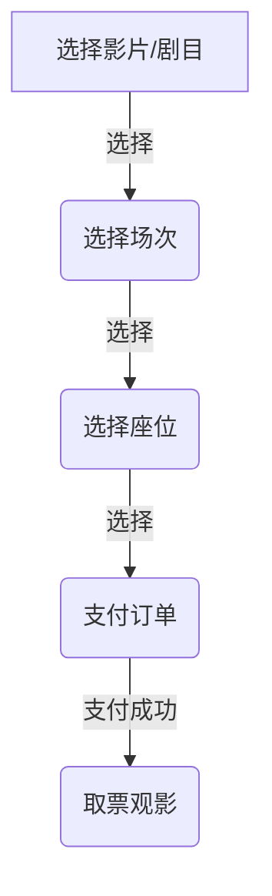

# 戏剧电影影视购票小程序

## 1. 背景介绍

### 1.1 娱乐行业的发展

娱乐行业一直是人类生活中不可或缺的一部分。随着科技的快速发展,娱乐方式也在不断创新。戏剧、电影和影视作品作为传统娱乐形式,一直深受大众喜爱。然而,传统的购票方式已经无法满足现代人的需求。

### 1.2 移动互联网时代的到来

随着智能手机的普及,移动互联网时代已经到来。人们越来越依赖于手机来完成日常任务,包括购票。传统的线下购票方式已经无法满足用户的便捷性需求。

### 1.3 小程序的兴起

小程序作为一种全新的移动应用形式,具有开发周期短、无需安装、体积小等优势。小程序的兴起为娱乐行业带来了新的机遇,也为用户提供了更便捷的购票体验。

## 2. 核心概念与联系

### 2.1 小程序架构

小程序采用了前端渲染、云端运行的架构,其核心概念包括:

#### 2.1.1 视图层(View)

用于渲染页面结构,由 WXML(WEB 组件语言)和 WXSS(WEB 组件样式语言)构成。

#### 2.1.2 逻辑层(App Service)

用于处理数据和业务逻辑,由 JavaScript 编写。

#### 2.1.3 数据层(Data)

用于存储和管理数据,包括本地存储和云数据库。

### 2.2 购票流程

购票流程是小程序的核心功能,包括以下步骤:

1. 选择影片/剧目
2. 选择场次
3. 选择座位
4. 支付订单
5. 取票观影



## 3. 核心算法原理具体操作步骤

### 3.1 座位选择算法

座位选择是购票流程中的关键环节,需要一种高效的算法来管理座位状态。常见的算法包括:

#### 3.1.1 位图算法

使用一个二进制位图来表示座位状态,0 表示空闲,1 表示已售出。位图算法具有高效的空间利用率和快速查询速度。

具体操作步骤:

1. 初始化一个全 0 的位图
2. 售出座位时,将对应位置 1
3. 查询座位状态时,直接读取对应位的值

#### 3.1.2 链表算法

使用链表来存储已售出的座位信息,空闲座位不需要存储。链表算法具有动态扩展的优势,但查询效率较低。

具体操作步骤:

1. 初始化一个空链表
2. 售出座位时,将座位信息插入链表
3. 查询座位状态时,遍历链表查找

### 3.2 订单处理算法

订单处理是另一个核心环节,需要保证订单的唯一性和一致性。常见的算法包括:

#### 3.2.1 UUID 算法

使用全局唯一标识符(UUID)作为订单编号,UUID 由一个 32 位数字组成,理论上可以保证唯一性。

具体操作步骤:

1. 生成一个 UUID
2. 将 UUID 与订单信息绑定,存储到数据库

#### 3.2.2 递增序列算法

使用一个全局递增的序列作为订单编号,每次生成新订单时,序列值加 1。这种算法需要保证序列值的原子操作。

具体操作步骤:

1. 获取当前序列值
2. 将序列值与订单信息绑定,存储到数据库
3. 序列值加 1,更新到数据库

## 4. 数学模型和公式详细讲解举例说明

### 4.1 座位选择模型

座位选择可以抽象为一个二维平面上的点集问题。假设影厅座位排布为 $m$ 行 $n$ 列,我们可以使用一个 $m \times n$ 的矩阵来表示座位状态。

$$
S = \begin{bmatrix}
s_{11} & s_{12} & \cdots & s_{1n} \
s_{21} & s_{22} & \cdots & s_{2n} \
\vdots & \vdots & \ddots & \vdots \
s_{m1} & s_{m2} & \cdots & s_{mn}
\end{bmatrix}
$$

其中 $s_{ij}$ 表示第 $i$ 行第 $j$ 列的座位状态,取值为 0 或 1。

在选择座位时,我们需要找到一个最大的全 0 子矩阵,作为可选座位区域。这可以转化为一个典型的二维最大子矩阵问题,可以使用动态规划算法求解。

设 $dp(i, j)$ 表示以 $(i, j)$ 为右下角的最大全 0 子矩阵的边长,则有如下递推公式:

$$
dp(i, j) = \begin{cases}
0 & \text{if } s_{ij} = 1 \
\min(dp(i-1, j), dp(i, j-1), dp(i-1, j-1)) + 1 & \text{if } s_{ij} = 0
\end{cases}
$$

最终的最大全 0 子矩阵边长为所有 $dp(i, j)$ 的最大值。

### 4.2 订单唯一性模型

为了保证订单的唯一性,我们可以使用 UUID 或者递增序列作为订单编号。假设我们使用递增序列,令 $x_n$ 表示第 $n$ 个订单的编号,则有如下递推公式:

$$
x_n = x_{n-1} + 1
$$

其中 $x_0$ 为初始值,通常取一个较大的常数,以避免与其他编号系统冲突。

为了保证并发情况下序列值的原子操作,我们可以使用数据库的事务机制。具体地,每次生成新订单时,执行以下步骤:

1. 开启事务
2. 读取当前序列值 $x_n$
3. 计算新序列值 $x_{n+1} = x_n + 1$
4. 更新序列值为 $x_{n+1}$
5. 提交事务

通过事务的隔离性,可以保证并发情况下序列值的正确性和唯一性。

## 5. 项目实践:代码实例和详细解释说明

### 5.1 座位选择功能实现

以下是座位选择功能的伪代码实现:

```python
# 初始化座位状态矩阵
seats = [[0 for j in range(n)] for i in range(m)]

# 标记已售出座位
for sold_seat in sold_seats:
    i, j = sold_seat
    seats[i][j] = 1

# 动态规划求解最大全 0 子矩阵
max_len = 0
for i in range(m):
    for j in range(n):
        if seats[i][j] == 0:
            up = 0 if i == 0 else dp[i-1][j]
            left = 0 if j == 0 else dp[i][j-1]
            upleft = 0 if i == 0 or j == 0 else dp[i-1][j-1]
            dp[i][j] = min(up, left, upleft) + 1
            max_len = max(max_len, dp[i][j])

# 返回可选座位区域
available_seats = []
for i in range(m):
    for j in range(n):
        if dp[i][j] >= max_len:
            for k in range(max_len):
                for l in range(max_len):
                    available_seats.append((i-k, j-l))
```

上述代码首先初始化一个座位状态矩阵,标记已售出的座位。然后使用动态规划算法求解最大全 0 子矩阵的边长。最后,根据最大子矩阵的位置,返回可选座位区域。

### 5.2 订单处理功能实现

以下是订单处理功能的伪代码实现,使用递增序列算法:

```python
# 初始化序列值
order_seq = db.get_order_seq()

# 生成新订单
def generate_order(order_info):
    # 开启事务
    with db.transaction():
        # 获取当前序列值
        curr_seq = order_seq
        # 计算新序列值
        new_seq = curr_seq + 1
        # 更新序列值
        db.update_order_seq(new_seq)
        # 生成订单
        order_id = curr_seq
        order = {
            'id': order_id,
            'info': order_info
        }
        # 保存订单
        db.insert_order(order)
    return order_id
```

上述代码首先从数据库获取当前序列值。在生成新订单时,开启一个事务,获取当前序列值,计算新序列值,更新序列值到数据库,并使用当前序列值作为订单编号,保存订单信息。通过事务的隔离性,可以保证并发情况下序列值的正确性和唯一性。

## 6. 实际应用场景

戏剧电影影视购票小程序可以应用于以下场景:

### 6.1 电影院

电影院是小程序的主要应用场景。用户可以通过小程序查看正在上映的电影,选择场次和座位,完成在线购票。这为用户带来了极大的便利,也为电影院提供了新的销售渠道。

### 6.2 剧院

除了电影,小程序也可以应用于戏剧、音乐会等现场演出的购票场景。用户可以查看演出信息,选择场次和座位,完成在线购票。这为剧院提供了新的营销渠道,也为观众带来了更好的购票体验。

### 6.3 影视制作公司

影视制作公司可以利用小程序进行影视作品的宣传和发行。用户可以通过小程序了解最新的影视作品信息,预订观影场次。这为影视公司提供了新的营销渠道,也为观众带来了更便捷的观影体验。

## 7. 工具和资源推荐

### 7.1 小程序开发工具

微信开发者工具是小程序开发的官方集成开发环境,提供了代码编辑、调试、预览等功能。

### 7.2 云开发

小程序云开发是微信官方提供的一站式后端云服务,包括云函数、云数据库等,可以极大简化小程序的开发和部署。

### 7.3 UI 框架

为了提高开发效率和界面美观度,可以使用一些优秀的 UI 框架,如 WeUI、Vant Weapp 等。

### 7.4 在线资源

微信官方提供了丰富的小程序开发文档和示例代码,是学习和开发的重要资源。此外,也有许多第三方的教程和社区,可以提供宝贵的经验分享和问题解答。

## 8. 总结:未来发展趋势与挑战

### 8.1 发展趋势

#### 8.1.1 小程序生态持续繁荣

随着小程序的不断普及,小程序生态将持续繁荣。更多的行业和场景将被覆盖,小程序的功能也将不断增强。

#### 8.1.2 跨平台发展

虽然目前小程序主要运行在微信平台,但未来可能会出现更多的跨平台解决方案,使小程序能够运行在其他平台和操作系统上。

#### 8.1.3 人工智能技术融合

人工智能技术如计算机视觉、自然语言处理等,可能会与小程序融合,为用户带来更智能化的体验。

### 8.2 挑战

#### 8.2.1 隐私和安全

随着小程序的普及,用户隐私和数据安全将成为一个重大挑战。需要制定相应的政策和技术措施来保护用户权益。

#### 8.2.2 性能优化

小程序的性能直接影响用户体验。随着功能的不断增加,如何优化小程序的性能,提高响应速度和流畅度,将是一个持续的挑战。

#### 8.2.3 生态壁垒

不同平台之间的生态壁垒可能会阻碍小程序的跨平台发展。如何打破壁垒,实现真正的开放和互通,是一个值得关注的问题。

## 9. 附录:常见问题与解答

### 9.1 小程序和原生 APP 有什么区别?

小程序是一种全新的移动应用形式,具有开发周期短、无需安装、体积小等优势。但与原生 APP 