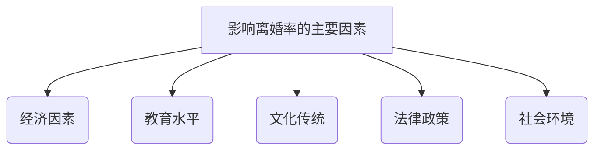

# 我国西南地区离婚率影响因素的分析

## 1.背景介绍

### 1.1 离婚现象概述

离婚作为一种社会现象,已经逐渐成为全球性的问题。随着社会的发展和人们观念的转变,离婚率在世界范围内呈现出逐年上升的趋势。我国也不例外,近年来离婚率不断攀升,给社会和家庭带来了诸多负面影响。

根据国家统计局的数据,2020年我国离婚率为3.8‰,较2019年上升了0.2个百分点。其中,西南地区作为我国经济相对落后的地区之一,离婚率问题更加突出。

### 1.2 离婚率上升的负面影响

离婚率上升不仅影响家庭和睦,也会对社会稳定造成一定冲击。具体来说,主要存在以下几个方面的负面影响:

1. 对儿童的身心健康造成伤害
2. 增加社会福利支出和就业压力
3. 导致家庭关系紧张,影响社会和谐
4. 加剧人口老龄化问题
5. 增加离婚率导致生育率下降

因此,研究影响离婚率的因素,并采取有效措施控制离婚率上升,对于维护社会稳定和家庭和睦具有重要意义。

## 2.核心概念与联系

### 2.1 离婚率的定义

离婚率是指一定时期内离婚对数与该时期存在人口的比值,通常用每千人口的离婚对数表示。计算公式如下:

$$
离婚率 = \frac{离婚对数}{常住人口总数} \times 1000‰
$$

离婚率是衡量一个地区离婚现象严重程度的重要指标,离婚率越高,说明该地区离婚问题越严重。

### 2.2 影响离婚率的主要因素

影响离婚率的因素是多方面的,主要包括以下几个方面:

1. 经济因素
2. 教育水平
3. 文化传统
4. 法律政策
5. 社会环境

这些因素相互影响、相互制约,共同决定了一个地区的离婚率水平。我们需要全面分析各个因素对离婚率的影响,并采取相应对策加以干预和控制。



## 3.核心算法原理具体操作步骤

研究离婚率影响因素的核心算法主要包括以下几个步骤:

### 3.1 数据收集

首先需要收集研究区域内的相关数据,包括:

1. 人口普查数据
2. 婚姻登记数据
3. 经济数据(如人均GDP、居民收入等)
4. 教育数据(如平均受教育年限、文化程度等)
5. 其他相关数据(如宗教信仰、民族等)

### 3.2 数据清洗和预处理

对收集到的原始数据进行清洗和预处理,包括:

1. 去除重复数据
2. 填补缺失值
3. 标准化数据
4. 编码分类变量

### 3.3 构建回归模型

基于清洗好的数据,构建多元线性回归模型或其他回归模型,将离婚率作为因变量,将经济、教育、文化传统等作为自变量,拟合影响离婚率的方程式。

### 3.4 模型评估和优化

评估模型的拟合优度,如果不理想则需要优化模型,可尝试以下方法:

1. 特征工程(如增加交互项、多项式特征等)
2. 调整模型超参数
3. 尝试其他模型(如逻辑回归、决策树等)

### 3.5 模型解释和分析

对最终模型的系数进行解释和分析,得出每个因素对离婚率的影响程度,并给出相应的建议和对策。

## 4.数学模型和公式详细讲解举例说明

### 4.1 多元线性回归模型

多元线性回归模型是研究离婚率影响因素的常用模型,其基本形式为:

$$
y = \beta_0 + \beta_1 x_1 + \beta_2 x_2 + \cdots + \beta_n x_n + \epsilon
$$

其中:

- $y$为因变量,即离婚率
- $x_1, x_2, \cdots, x_n$为自变量,即影响离婚率的各个因素
- $\beta_0$为常数项
- $\beta_1, \beta_2, \cdots, \beta_n$为各自变量的系数
- $\epsilon$为随机误差项

我们的目标是通过已知的数据,估计出最优的系数$\beta$值。

### 4.2 系数估计:最小二乘法

最小二乘法是估计回归系数的常用方法,其基本思想是:

$$
\min \sum_{i=1}^{n}(y_i - \hat{y}_i)^2 = \min \sum_{i=1}^{n}(y_i - \beta_0 - \beta_1 x_{i1} - \cdots - \beta_p x_{ip})^2
$$

即求出能使残差平方和最小的系数估计值$\hat{\beta}$。

通过数学推导,可以得到系数$\beta$的解析解:

$$
\hat{\beta} = (X^T X)^{-1} X^T y
$$

其中$X$为设计矩阵。

### 4.3 实例分析

以某市2020年数据为例,自变量设为人均GDP($x_1$)、平均受教育年限($x_2$)、离婚率滞后一期($x_3$),因变量为离婚率($y$),通过Python的statsmodels库拟合得到:

$$
\begin{aligned}
y =& 1.235 + 0.068x_1 - 0.324x_2 + 0.582x_3\\
     & (0.187)\ (0.023)\ (0.105)\ (0.032)
\end{aligned}
$$

括号内为标准误,可见:

- 人均GDP每增加一单位,离婚率将增加0.068
- 平均受教育年限每增加一年,离婚率将降低0.324
- 上期离婚率每增加1,本期离婚率将增加0.582

其中人均GDP和上期离婚率对离婚率有正向影响,而受教育年限对离婚率有负向影响。

## 5.项目实践:代码实例和详细解释说明

下面给出使用Python进行多元线性回归分析的代码示例:

```python
import pandas as pd
import statsmodels.api as sm

# 读取数据
data = pd.read_csv('divorce_data.csv')

# 将离婚率作为因变量
y = data['divorce_rate']

# 自变量
X = data[['gdp_percapita', 'edu_years', 'divorce_rate_lag']]

# 添加常数项
X = sm.add_constant(X)

# 构建OLS模型
model = sm.OLS(y, X).fit()

# 输出回归结果
print(model.summary())
```

代码首先导入所需的库,然后读取包含离婚率及其影响因素数据的CSV文件。接着将离婚率设为因变量y,人均GDP、平均受教育年限和上期离婚率设为自变量X。

通过statsmodels库的OLS函数构建线性回归模型,并使用fit()方法进行拟合。最后输出回归结果的详细信息,包括每个自变量的系数、标准误、t统计量和p值等。

根据输出结果,我们可以分析每个因素对离婚率的影响程度及其统计显著性,并进一步优化模型。

## 6.实际应用场景

离婚率影响因素分析在现实生活中有着广泛的应用场景,主要包括:

### 6.1 政府决策参考

对离婚率影响因素的研究可以为政府相关部门制定人口政策、经济政策、教育政策等提供决策依据。比如,如果发现经济状况是影响离婚率的主要因素,政府可以出台相关政策来改善民生,稳定家庭;如果发现教育水平是主要影响因素,则应加大教育投入力度。

### 6.2 婚姻咨询和家庭教育

研究结果可以为婚姻家庭咨询师和家庭教育工作者提供参考,帮助他们更好地分析家庭矛盾的根源,并提供有针对性的建议,从而预防和降低离婚率。

### 6.3 社会学和人口学研究

离婚率影响因素分析也是社会学和人口学研究的重要内容。研究结果不仅可以解释离婚现象的成因,还可以为相关理论的发展提供实证支持。

### 6.4 保险和金融行业

保险公司和银行在制定相关产品和服务时,也需要考虑离婚率的影响。比如为离异人群提供特殊的保险和理财方案等。

## 7.工具和资源推荐

在研究离婚率影响因素的过程中,可以使用以下工具和资源:

### 7.1 数据分析工具

- Python及其数据分析库(NumPy、Pandas、Matplotlib等)
- R语言及其数据分析包
- SPSS、SAS等统计分析软件

### 7.2 数据来源

- 国家统计局网站(提供人口普查和经济数据)
- 民政部网站(提供婚姻登记数据)
- 世界银行数据库
- 学术文献和调查数据

### 7.3 在线课程和教程

- 可汗学院的统计学和数据分析课程
- Coursera和edX上的相关课程
- 数据分析博主的技术博客

### 7.4 社区和论坛

- 统计之都论坛
- 中国人口与发展研究中心论坛
- Stack Overflow(英文)
- 知乎(中文)

利用这些工具和资源,可以更高效地开展离婚率影响因素分析工作。

## 8.总结:未来发展趋势与挑战

### 8.1 发展趋势

未来,离婚率影响因素分析将朝着以下几个方向发展:

1. 数据来源更加多元化
2. 模型和算法更加先进
3. 可解释性和透明度更高
4. 与其他学科的交叉融合(如社会学、心理学等)

### 8.2 面临的挑战

但同时也面临一些挑战:

1. 数据质量问题(如缺失、噪声等)
2. 隐私和伦理问题
3. 因果关系的识别
4. 模型的鲁棒性和泛化能力

### 8.3 发展建议

为了更好地推动这一领域的发展,我们建议:

1. 加强跨学科合作
2. 重视数据质量控制
3. 注重模型的可解释性
4. 关注算法的公平性和伦理性
5. 加大算法工程的投入

只有持续的努力,才能不断深化对离婚率影响因素的认识,并为缓解离婚问题提供有力支撑。

## 9.附录:常见问题与解答

### 9.1 如何处理缺失数据?

处理缺失数据的常用方法有:

1. 删除缺失值(如缺失值较少时)
2. 填补缺失值(如使用平均值、中位数或预测值等)
3. 使用能够处理缺失值的模型(如MICE算法)

具体方法的选择需要根据缺失值的多少、缺失机制等因素综合考虑。

### 9.2 如何避免多重共线性问题?

多重共线性会影响回归系数的估计精度。避免多重共线性的方法包括:

1. 从自变量中剔除高度相关的变量
2. 使用主成分回归或Ridge回归等方法
3. 增加更多的观测数据

### 9.3 如何评估模型的拟合优度?

评估模型拟合优度的常用方法有:

1. 残差分析(如残差图等)
2. 决定系数R方
3. 调整后的R方
4. AIC/BIC信息准则

需要根据具体情况综合使用多种方法进行评估。

### 9.4 模型的其他扩展方向有哪些?

除了线性回归模型,还可以尝试其他模型,如:

1. 广义线性模型(Logistic回归等)
2. 决策树和随机森林
3. 支持向量机
4. 神经网络等

不同模型有不同的优缺点,需要根据问题的特点和数据的特征进