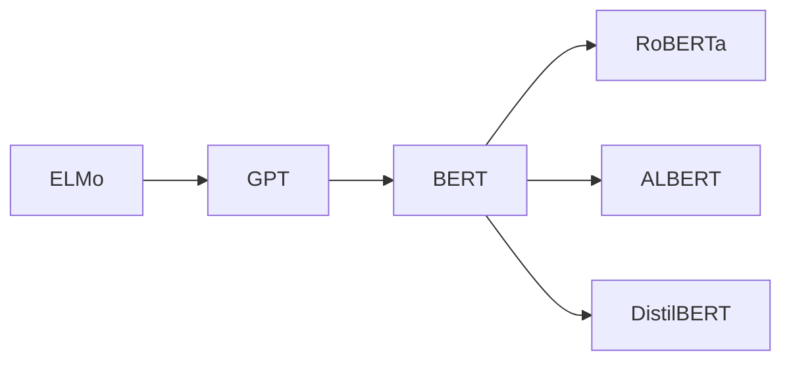

# 揭秘RoBERTa:一场自然语言处理的革命性突破

## 1. 背景介绍

自然语言处理(NLP)是人工智能领域的一个重要分支,旨在让计算机能够理解、生成和处理人类语言。近年来,随着深度学习技术的飞速发展,NLP领域也迎来了一场革命性的变革。其中,以BERT(Bidirectional Encoder Representations from Transformers)为代表的预训练语言模型为NLP带来了突破性的进展。

RoBERTa(Robustly Optimized BERT Pretraining Approach)是BERT的一个改进版本,由Facebook AI研究院在2019年提出。它在BERT的基础上进行了一系列优化,使其在多个NLP任务上取得了state-of-the-art的表现,引起了学术界和工业界的广泛关注。本文将深入探讨RoBERTa的核心思想、技术细节以及应用实践,帮助读者全面了解这一NLP领域的重大突破。

## 2. 核心概念与联系

### 2.1 预训练语言模型

预训练语言模型的核心思想是在大规模无标注语料上进行自监督学习,通过设计合适的预训练任务,让模型自主学习语言的内在规律和表示。这样训练好的模型可以作为下游NLP任务的通用特征提取器,大大减少了对标注数据的需求。代表模型有ELMo、GPT和BERT等。

### 2.2 Transformer 

Transformer是一种基于自注意力机制(Self-Attention)的神经网络结构。不同于RNN等顺序模型,Transformer可以并行计算,大大提高了训练效率。同时Self-Attention让模型能够捕捉长距离的语义依赖关系。Transformer已成为大多数预训练语言模型的首选架构。

### 2.3 BERT

BERT是Transformer的双向版本。传统语言模型通常是单向的,即从左到右或从右到左建模文本。BERT创新性地提出Masked Language Model(MLM)预训练任务,随机Mask掉一部分Token,让模型根据上下文预测这些Token。这使BERT能够融合左右两个方向的语义信息。

### 2.4 RoBERTa与BERT的关系

RoBERTa是BERT的直接后继模型,延续了其双向语言建模的思路。RoBERTa对BERT的预训练过程进行了全面优化,包括更大的批量、更多的数据、更长的训练时间等,使模型性能得到大幅提升。同时,RoBERTa还改进了下游任务的Fine-tuning方式。因此,RoBERTa可以看作是对BERT的全面升级。

下图展示了RoBERTa与BERT等模型的演化关系:



## 3. 核心算法原理与具体操作步骤

### 3.1 预训练阶段

#### 3.1.1 数据准备

RoBERTa使用了更大规模的预训练语料,包括:
- BookCorpus(16GB)
- English Wikipedia(13GB)
- CC-News(76GB) 
- OpenWebText(38GB)
- Stories(31GB)

这些语料涵盖了书籍、百科、新闻、网页等多个领域,有助于提高模型的通用性。同时,RoBERTa去除了BERT中的下一句预测(NSP)任务,仅保留了MLM任务,避免了NSP任务引入的噪声。

#### 3.1.2 文本编码

与BERT类似,RoBERTa将输入文本分割成一系列Token,并加入特殊的[CLS]和[SEP]标记,以及位置编码。不同的是,RoBERTa使用了Byte-Pair Encoding(BPE)算法构建词表,使得词表更加精炼。同时,RoBERTa采用动态MLM,即每个Batch都随机Mask不同的Token,增加了语言模型的鲁棒性。

#### 3.1.3 模型结构

RoBERTa沿用了BERT的Transformer Encoder结构,包括:
- Embedding层:将Token、位置等信息映射为稠密向量
- Multi-Head Attention层:通过多个注意力头并行建模不同位置Token之间的关联
- Feed Forward层:使用前馈神经网络对特征进行非线性变换
- Add & Norm层:残差连接和Layer Normalization,有助于模型训练

RoBERTa提供了Base版本(12层,768维)和Large版本(24层,1024维)供选择。

#### 3.1.4 训练过程

RoBERTa对BERT的训练过程进行了优化:
1. 更大的Batch Size(8k)和学习率(0.0001)
2. 更长的训练时间(100万步)
3. 动态调整Mask概率(每个Batch重新采样)
4. 去除NSP Loss,只优化MLM Loss

通过这些改进,RoBERTa在相同计算资源下,可以学习到更加鲁棒和通用的语言表示。

### 3.2 Fine-tuning阶段

#### 3.2.1 下游任务

RoBERTa可以应用于几乎所有的NLP任务,如:
- 文本分类
- 命名实体识别
- 问答
- 自然语言推理
- 机器翻译
- 摘要生成
- ...

针对不同任务,只需要在预训练好的RoBERTa上添加一些浅层的任务特定层(如分类器),并使用少量标注数据进行Fine-tuning即可。

#### 3.2.2 Fine-tuning技巧

RoBERTa在Fine-tuning阶段也引入了一些新的技巧:
1. 更小的学习率(1e-5)和更少的训练Epoch(通常2-4个)
2. 使用对抗训练增强模型的鲁棒性
3. 多任务学习,联合训练多个相关任务

这些策略有助于缓解过拟合,提高模型的泛化能力。

## 4. 数学模型和公式详细讲解举例说明

### 4.1 Self-Attention

Self-Attention是Transformer的核心组件。对于输入序列$\mathbf{X}=(\mathbf{x}_1,\mathbf{x}_2,...,\mathbf{x}_n)$,Self-Attention的计算过程如下:

1. 将每个输入向量$\mathbf{x}_i$通过三个线性变换得到Query向量$\mathbf{q}_i$,Key向量$\mathbf{k}_i$和Value向量$\mathbf{v}_i$:

$$
\mathbf{q}_i = \mathbf{W}^Q\mathbf{x}_i \
\mathbf{k}_i = \mathbf{W}^K\mathbf{x}_i \ 
\mathbf{v}_i = \mathbf{W}^V\mathbf{x}_i
$$

其中$\mathbf{W}^Q, \mathbf{W}^K, \mathbf{W}^V$是可学习的参数矩阵。

2. 计算每个位置的注意力权重$\alpha_{ij}$,表示位置$i$对位置$j$的注意力大小:

$$
\alpha_{ij} = \frac{\exp(\mathbf{q}_i^T\mathbf{k}_j)}{\sum_{l=1}^n \exp(\mathbf{q}_i^T\mathbf{k}_l)}
$$

3. 将Value向量按照注意力权重进行加权求和,得到位置$i$的输出向量$\mathbf{z}_i$:

$$
\mathbf{z}_i = \sum_{j=1}^n \alpha_{ij}\mathbf{v}_j
$$

直观地看,Self-Attention让每个位置的表示都融合了其他位置的相关信息,从而能够捕捉长距离依赖。

### 4.2 Masked Language Model

MLM是BERT和RoBERTa的核心预训练任务。给定一个文本序列$\mathbf{x}=(x_1,x_2,...,x_n)$,MLM的训练目标是最大化被Mask位置的条件概率:

$$
\mathcal{L}_{MLM} = -\sum_{i \in \mathcal{M}} \log P(x_i|\mathbf{x}_{\backslash \mathcal{M}})
$$

其中$\mathcal{M}$为被Mask的位置集合,$\mathbf{x}_{\backslash \mathcal{M}}$表示去掉$\mathcal{M}$中元素后的序列。直观地看,MLM让模型学会根据上下文预测单词,从而建模单词之间的语义关系。

在实践中,RoBERTa采用动态MLM,即每个Batch随机Mask 15%的Token,其中:
- 80%替换为[MASK]标记
- 10%替换为随机单词
- 10%保持不变

这增加了MLM任务的难度和多样性。

## 5. 项目实践:代码实例和详细解释说明

下面以文本分类任务为例,演示如何使用RoBERTa进行Fine-tuning。我们使用Huggingface的Transformers库,该库已经实现了RoBERTa的训练和推理。

```python
from transformers import RobertaTokenizer, RobertaForSequenceClassification, Trainer, TrainingArguments
from datasets import load_dataset

# 加载预训练模型和分词器
model = RobertaForSequenceClassification.from_pretrained('roberta-base')
tokenizer = RobertaTokenizer.from_pretrained('roberta-base')

# 定义数据预处理函数
def preprocess_function(examples):
    return tokenizer(examples['text'], truncation=True, padding=True)

# 加载和预处理数据集
dataset = load_dataset('imdb')
dataset = dataset.map(preprocess_function, batched=True)

# 定义训练参数
training_args = TrainingArguments(
    output_dir='./results',
    num_train_epochs=3,
    per_device_train_batch_size=16,
    per_device_eval_batch_size=64,
    warmup_steps=500,
    learning_rate=2e-5,
    weight_decay=0.01,
    logging_dir='./logs',
)

# 定义Trainer
trainer = Trainer(
    model=model,
    args=training_args,
    train_dataset=dataset['train'],
    eval_dataset=dataset['test']
)

# 开始训练
trainer.train()
```

上述代码的主要步骤如下:

1. 加载预训练的RoBERTa模型和分词器。这里使用了Base版本的RoBERTa。
2. 定义数据预处理函数。该函数使用分词器对文本进行编码,并进行截断和补齐,以保证输入序列长度一致。
3. 加载和预处理数据集。这里使用了IMDB电影评论数据集,并应用预处理函数。
4. 定义训练参数。包括训练轮数、批量大小、学习率等超参数。
5. 定义Trainer对象。传入模型、训练参数、训练集和测试集等。
6. 调用trainer.train()开始Fine-tuning过程。

训练完成后,可以使用trainer.evaluate()在测试集上评估模型性能,或者使用trainer.predict()对新样本进行预测。

## 6. 实际应用场景

RoBERTa在工业界已经得到了广泛应用,一些典型场景包括:

### 6.1 智能客服

RoBERTa可以用于客服对话系统,自动理解用户问题并给出相关回复。这大大减轻了人工客服的压力,提高了响应效率。典型的流程是:
1. 收集大量客服对话日志,并进行预处理和标注
2. 在RoBERTa上Fine-tuning一个意图识别和槽位填充模型
3. 将用户问题输入模型,预测意图和关键信息
4. 根据预测结果,从知识库中检索对应的回复并返回给用户

### 6.2 舆情分析

RoBERTa可以用于分析社交媒体上的用户评论和新闻报道,自动判断情感倾向(积极、中性、消极)和话题类别(如政治、经济、文化等)。这有助于企业及时掌握舆论动向,制定公关策略。典型的流程是:
1. 收集社交媒体和新闻网站的文本数据
2. 使用情感词典和话题词库对文本进行自动标注
3. 在RoBERTa上Fine-tuning情感分类和话题分类模型
4. 将新的文本数据输入模型,预测其情感和话题
5. 对预测结果进行统计和分析,生成舆情报告

### 6.3 知识图谱构建

RoBERTa可以用于从非结构化文本中抽取实体和关系,辅助构建知识图谱。知识图谱是结构化的知识库,在智能问答、推荐系统等领域有重要应用。典型的流程是:
1. 收集特定领域的文本语料,如医疗、金融等
2. 使用规则或词典对文本进行预标注
3. 在R