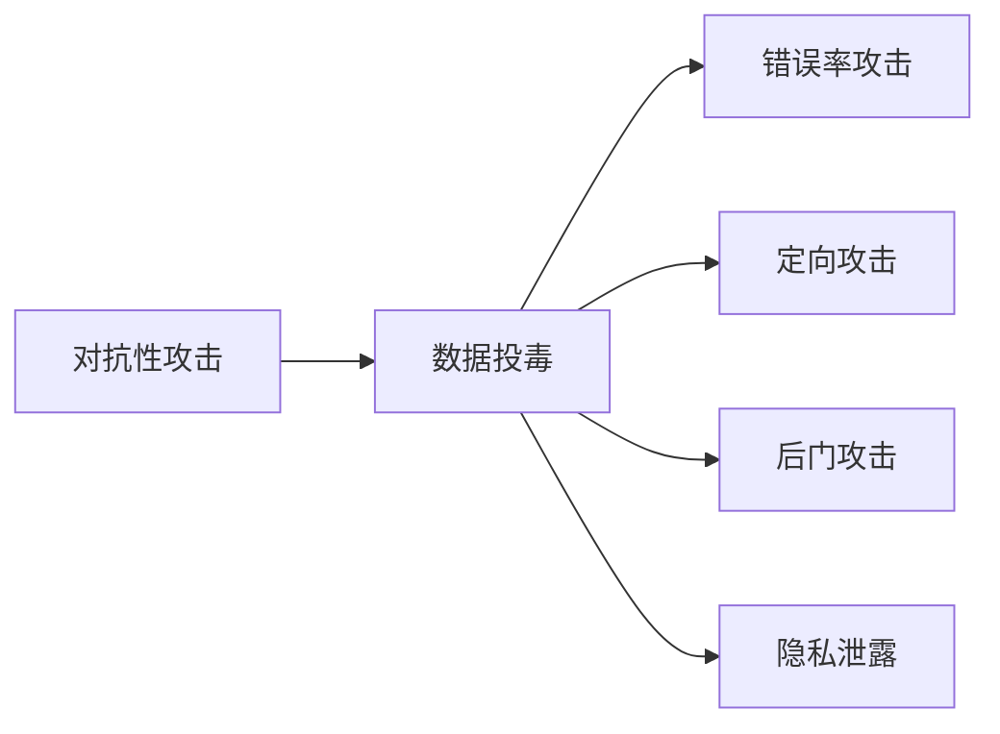

# 数据投毒：污染数据源头的隐患

## 1.背景介绍
### 1.1 数据的重要性
在当今大数据时代,数据已经成为企业和组织最宝贵的资产之一。高质量的数据对于数据挖掘、机器学习和人工智能等技术的应用至关重要。数据驱动的决策和创新正在深刻影响着各行各业。

### 1.2 数据安全面临的挑战
然而,随着数据价值的提升,数据安全也面临着前所未有的挑战。数据泄露、数据滥用等问题层出不穷。而近年来,一种被称为"数据投毒"的攻击方式逐渐引起了人们的关注。它通过污染数据源头,破坏数据的完整性和可靠性,给数据应用带来隐患。

### 1.3 数据投毒的危害
数据投毒可能导致基于这些被污染数据训练出的模型产生错误的预测或决策,给企业和用户带来损失。同时,被投毒的数据还可能被恶意利用,危及个人隐私和社会安全。因此,深入理解数据投毒的原理和应对之策,对于保障数据安全具有重要意义。

## 2.核心概念与联系
### 2.1 数据投毒的定义
数据投毒(Data Poisoning)是指攻击者通过向训练数据集中注入精心设计的恶意数据,从而影响机器学习模型学习过程,使其产生错误行为的一种对抗性攻击。

### 2.2 数据投毒与对抗性攻击
数据投毒属于对抗性攻击(Adversarial Attack)的一种。对抗性攻击旨在利用机器学习模型的漏洞,通过细微地修改输入,使模型做出错误判断。与其他类型的对抗性攻击不同,数据投毒发生在模型训练阶段,影响的是模型学习的过程。

### 2.3 数据投毒与数据中毒
数据投毒常常与数据中毒(Data Poisoning)混淆使用。两者的区别在于,数据投毒强调攻击发生在数据源头,是主动的恶意投放;而数据中毒泛指训练数据受到污染,可能是有意为之,也可能是无意导致的质量问题。

### 2.4 数据投毒的分类
根据攻击目的,数据投毒可分为以下几类:
- 错误率攻击(Error Rate Attack):通过投毒数据使模型整体性能下降。
- 定向攻击(Targeted Attack):投毒数据使模型对特定样本产生错误判断。
- 后门攻击(Backdoor Attack):训练后的模型存在后门,攻击者可通过触发器激活恶意行为。
- 隐私泄露(Privacy Leakage):窃取模型训练数据中的敏感隐私信息。



## 3.核心算法原理具体操作步骤
### 3.1 基于梯度的投毒算法
基于梯度的投毒算法通过计算损失函数对恶意数据的梯度,来构造最有效的投毒样本。其主要步骤如下:

1. 选择要投毒的恶意数据,初始化其特征。
2. 将恶意数据与正常训练数据混合,送入模型训练。
3. 计算损失函数对恶意数据的梯度。
4. 根据梯度方向更新恶意数据特征,使其最大化损失。
5. 重复步骤2-4,直到满足停止条件(如达到预设的损失阈值)。
6. 将构造好的恶意数据投放到训练集中,完成投毒。

### 3.2 GAN生成的对抗样本
利用生成对抗网络(GAN)也可以生成用于投毒的对抗样本。其流程如下:

1. 训练一个目标模型作为判别器D,固定其参数。
2. 初始化攻击生成器G,将正常样本作为其输入。
3. G生成对抗样本,与正常样本混合送入D。
4. 计算G的损失,使对抗样本能够欺骗D。
5. 根据损失更新G参数,重复步骤3-5,直到对抗样本足够逼真。
6. 将生成的对抗样本作为投毒数据加入训练集。

### 3.3 后门触发器
后门攻击常常利用触发器激活隐藏在模型中的恶意功能。构造触发器的步骤如下:

1. 选择一种触发器模式,如特定图像、文本片段等。
2. 在原始训练数据的一部分样本中嵌入触发器。
3. 将嵌入触发器的样本的标签改为攻击目标类别。
4. 用修改后的数据训练模型,使其学习触发器与目标类别的关联。
5. 在推理阶段,攻击者将触发器与目标样本结合,激活后门。

## 4.数学模型和公式详细讲解举例说明
### 4.1 基于梯度的投毒算法
以二分类问题为例,假设样本特征为$x$,标签为$y\in\{0,1\}$,模型参数为$\theta$。恶意数据为$x^*$,标签为$y^*$。损失函数为交叉熵损失:

$$
L(\theta)=-\frac{1}{N}\sum_{i=1}^N[y_i\log(\hat{y}_i)+(1-y_i)\log(1-\hat{y}_i)]
$$

其中$\hat{y}_i$为模型对第$i$个样本的预测概率。构造投毒数据的目标是最大化损失函数,即:

$$
\max_{x^*} L(\theta|X\cup \{x^*\})
$$

根据梯度上升法,恶意数据的更新公式为:

$$
x^*\leftarrow x^*+\eta\cdot \nabla_{x^*}L(\theta|X\cup \{x^*\})
$$

其中$\eta$为学习率。迭代更新$x^*$,直到损失函数达到预设阈值。

### 4.2 GAN生成的对抗样本
GAN由生成器$G$和判别器$D$组成。生成器将随机噪声$z$作为输入,生成对抗样本$\tilde{x}=G(z)$。判别器$D$的目标是区分真实样本$x$和对抗样本$\tilde{x}$。二者的博弈过程可表示为:

$$
\min_G\max_D V(D,G)=\mathbb{E}_{x\sim p_{data}(x)}[\log D(x)]+\mathbb{E}_{z\sim p_z(z)}[\log(1-D(G(z)))]
$$

生成器$G$的目标是生成足以欺骗判别器$D$的对抗样本,其损失函数为:

$$
L_G=\mathbb{E}_{z\sim p_z(z)}[\log(1-D(G(z)))]
$$

通过不断更新$G$和$D$的参数,最终得到逼真的对抗样本$\tilde{x}=G(z)$。

### 4.3 后门触发器
设触发器模式为$t$,目标类别为$y_t$。对于嵌入触发器的样本$x^{(i)}$,其标签改写为:

$$
y^{(i)}=\begin{cases}
y_t & \text{if } x^{(i)} \text{ contains } t \
y^{(i)} & \text{otherwise}
\end{cases}
$$

模型在训练过程中会学习到触发器$t$与目标类别$y_t$的关联。在推理阶段,对于任意样本$x$,若嵌入触发器$t$,则模型将输出$y_t$:

$$
f(x\oplus t)=y_t
$$

其中$\oplus$表示将触发器$t$嵌入到样本$x$中。

## 5.项目实践：代码实例和详细解释说明
下面以PyTorch为例,演示基于梯度的投毒算法的实现。

```python
import torch
import torch.nn as nn
import torch.optim as optim

# 定义模型
class Model(nn.Module):
    def __init__(self):
        super(Model, self).__init__()
        self.fc = nn.Linear(10, 2)

    def forward(self, x):
        x = self.fc(x)
        return x

# 定义投毒数据
def poison_data(data, label, num_poison, target):
    poison_data = data.clone()
    poison_label = label.clone()
    indices = torch.randperm(len(data))[:num_poison]
    poison_data[indices] = target
    poison_label[indices] = 1 - poison_label[indices]
    return poison_data, poison_label

# 投毒过程
def train_with_poison(model, data, label, poison_data, poison_label, epochs):
    criterion = nn.CrossEntropyLoss()
    optimizer = optim.Adam(model.parameters(), lr=0.01)

    for epoch in range(epochs):
        optimizer.zero_grad()
        output = model(data)
        loss = criterion(output, label)
        loss.backward()
        optimizer.step()

        optimizer.zero_grad()
        output = model(poison_data)
        loss = criterion(output, poison_label)
        loss.backward()
        optimizer.step()

# 主函数
def main():
    data = torch.randn(100, 10)
    label = torch.randint(0, 2, (100,))

    poison_target = torch.randn(10)
    poison_num = 10
    poison_data, poison_label = poison_data(data, label, poison_num, poison_target)

    model = Model()
    train_with_poison(model, data, label, poison_data, poison_label, epochs=10)

if __name__ == '__main__':
    main()
```

代码解释:

1. 定义了一个简单的全连接神经网络`Model`,作为目标模型。
2. `poison_data`函数用于生成投毒数据,将原始数据中随机选择的`num_poison`个样本替换为`target`,并反转其标签。
3. `train_with_poison`函数实现了投毒过程,每个epoch先用干净数据训练模型,再用投毒数据训练,使模型学习到恶意特征。
4. `main`函数演示了投毒攻击的完整流程。首先生成随机的干净数据和标签,然后构造投毒数据,最后进行投毒训练。

以上代码展示了数据投毒攻击的基本原理和实现。在实践中,攻击者可能会采用更隐蔽和复杂的投毒策略,因此防御数据投毒需要更全面的安全措施。

## 6.实际应用场景
数据投毒攻击可能发生在多个领域和场景中,下面列举几个典型的例子:

### 6.1 垃圾邮件检测
恶意攻击者可能会刻意构造一些正常邮件,并将其标记为垃圾邮件,投毒训练数据。这使得训练出的垃圾邮件检测模型将正常邮件误判为垃圾邮件,导致用户收件箱中出现大量漏报。

### 6.2 人脸识别系统
攻击者可以将特定人物的面部图像数据投毒到训练集中,并将其标记为另一个目标人物。这会导致人脸识别系统将目标人物误识别为攻击者指定的人,产生错误结果。

### 6.3 自动驾驶汽车
在自动驾驶汽车的视觉训练数据中植入恶意扰动或对抗样本,可能会使得车辆在特定场景下做出错误判断和决策,带来安全隐患。

### 6.4 医疗诊断系统
医疗数据对隐私和准确性要求很高。攻击者若能在医疗影像或电子病历数据中投毒,可能导致诊断系统给出错误的分析结果,危及患者健康。

### 6.5 金融风控模型
对于信用评估、反欺诈等金融风控模型,攻击者可能会刻意制造一些"优质"用户,并将其投毒到训练数据中。这可能使得模型放松对风险用户的判断,带来经济损失。

## 7.工具和资源推荐
以下是一些与数据投毒和对抗性攻击相关的工具和资源:

- [CleverHans](https://github.com/cleverhans-lab/cleverhans): 一个基于TensorFlow的对抗性攻击库,包含多种攻击和防御算法。
- [Adversarial Robustness Toolbox (ART)](https://github.com/Trusted-AI/adversarial-robustness-toolbox): IBM开发的一个Python库,支持多种机器学习框架下的对抗性