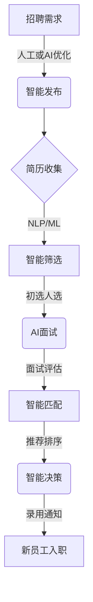

# 智能招聘:AI赋能招聘流程优化

## 1.背景介绍

### 1.1 传统招聘流程的挑战

招聘一直是企业发展的关键环节,但传统的招聘流程存在诸多痛点和挑战:

- **低效率**:大量简历需要人工筛选和审核,耗费大量人力物力。
- **缺乏客观性**:评判过程容易受到主观因素影响,难以保证公平公正。
- **流程冗长**:从发布招聘信息到最终入职,流程环节繁琐,周期拉长。
- **用户体验差**:求职者和招聘者双方体验不佳,缺乏高效互动。

### 1.2 人工智能的机遇

人工智能(AI)技术的飞速发展为优化招聘流程带来了新的契机。AI可以通过自动化、智能化手段提高招聘效率,改善用户体验,为企业节省大量成本。智能招聘(Intelligent Recruitment)应运而生,成为推动招聘革新的驱动力。

### 1.3 智能招聘的优势

智能招聘融合了多种AI技术,主要优势包括:

- **高效率**:大幅减少人工干预,提高流程自动化程度。
- **客观公正**:基于数据和算法模型,降低主观偏见影响。
- **流程优化**:简化环节,缩短周期,提升效率。
- **智能匹配**:精准匹配求职者与职位,提高匹配度。
- **优质体验**:为求职者和招聘者提供智能化交互体验。

## 2.核心概念与联系

### 2.1 智能招聘概念

智能招聘是指将人工智能技术全面融入招聘流程的各个环节,实现招聘活动的智能化、自动化和高效化。涵盖简历智能筛选、AI面试、员工智能推荐等多个场景。

### 2.2 核心技术

智能招聘涉及多种AI技术,包括但不限于:

- **自然语言处理(NLP)**: 用于简历分析、语音识别、问答等。
- **计算机视觉(CV)**: 用于面部识别、面试行为分析等。
- **机器学习(ML)**: 构建简历筛选、员工推荐等模型。
- **知识图谱**: 建立招聘知识库,支持智能问答和决策。

### 2.3 关键流程

智能招聘的核心流程包括:

1. **智能发布**: 基于AI技术优化招聘需求表述,提高精准度。
2. **智能筛选**: 利用NLP和ML对大量简历进行智能分析和筛选。
3. **AI面试**: 通过CV和NLP技术对面试过程进行自动化评估。
4. **智能匹配**: 基于ML算法为候选人匹配最佳职位。
5. **智能决策**: 融合多维数据,为招聘决策提供AI赋能支持。



上图展示了智能招聘的核心流程,各环节通过AI技术实现自动化和智能化,最终输出新员工入职结果。

## 3.核心算法原理具体操作步骤

### 3.1 简历智能筛选

简历智能筛选是智能招聘的基础环节,主要分为以下步骤:

1. **简历预处理**
   - 结构化提取:从非结构化简历文本中提取关键信息,如教育经历、工作经验等。
   - 文本清洗:去除无用字符、格式化文本等预处理操作。

2. **特征提取**
   - 构建特征向量:基于TF-IDF等方法将简历文本向量化。
   - 特征工程:提取简历中的关键词、技能等特征。

3. **模型训练**
   - 标注训练数据:人工标注大量简历数据,构建训练集。
   - 模型选择:常用模型包括逻辑回归、决策树、神经网络等。
   - 模型训练:在训练数据上训练简历筛选模型。

4. **模型评估及优化**
   - 模型评估:在测试集上评估模型性能,如准确率、召回率等。
   - 模型优化:通过特征工程、参数调优、集成学习等提升模型性能。

5. **模型上线及更新**
   - 模型部署:将优化后的模型部署到线上系统。
   - 模型在线学习:持续获取新数据,定期重训练模型。

### 3.2 AI面试评估

AI面试评估可从面部表情、语音语调、回答内容等多维度对面试者进行自动化评估,主要步骤如下:

1. **数据采集**
   - 视频/音频采集:通过摄像头、麦克风采集面试过程视频和音频数据。
   - 文字记录:自动识别面试问答内容,生成文字记录。

2. **特征提取**
   - 面部表情分析:检测面部关键点,分析微表情,判断情绪状态。
   - 语音分析:提取语音特征,分析语气、语速、停顿等。
   - 文本分析:对回答内容进行NLP分析,提取关键词、情感倾向等。

3. **模型构建**
   - 标注训练数据:人工标注大量面试数据,构建训练集。
   - 模型选择:综合应用CV、NLP、ML等技术构建评估模型。
   - 模型训练:在训练数据上训练面试评估模型。

4. **模型评估及优化**
   - 人工评审对比:将AI评估结果与人工评审结果进行对比。
   - 模型优化:不断优化模型,提高AI评估的准确性。

5. **模型上线及更新**
   - 模型部署:将优化后的模型部署到线上系统。
   - 模型在线学习:持续获取新数据,定期重训练模型。

## 4.数学模型和公式详细讲解举例说明

### 4.1 简历相似度计算

在简历筛选过程中,需要计算简历与招聘需求的相似度,通常采用余弦相似度公式:

$$\text{sim}(X, Y) = \frac{\sum_{i=1}^{n}{X_iY_i}}{\sqrt{\sum_{i=1}^{n}X_i^2}\sqrt{\sum_{i=1}^{n}Y_i^2}}$$

其中$X$和$Y$分别表示简历和招聘需求的特征向量,$n$为特征维度。

例如,某简历特征向量$X = (2, 0, 1, 0)$,招聘需求特征向量$Y = (1, 1, 1, 0)$,则相似度为:

$$\text{sim}(X, Y) = \frac{2\times1 + 0\times1 + 1\times1 + 0\times0}{\sqrt{2^2+0^2+1^2+0^2}\sqrt{1^2+1^2+1^2+0^2}} \approx 0.67$$

相似度越高,表明简历与需求越匹配。

### 4.2 语音情绪分析

在AI面试评估中,常需要分析面试者的语音情绪。一种常用方法是基于高斯混合模型(GMM)的情绪分类:

1. 提取语音特征,如MFCC(Mel频率倒谱系数)等。
2. 对每种情绪(如高兴、沮丧等)的语音训练数据,使用GMM建模:

$$p(X|\lambda) = \sum_{i=1}^{M}w_ig(X|\mu_i,\Sigma_i)$$

其中$X$为特征向量,$\lambda$为GMM参数,包括$M$个高斯混合成分、每个成分的权重$w_i$、均值向量$\mu_i$和协方差矩阵$\Sigma_i$。

3. 对新语音$X$,计算在每个情绪模型上的似然概率$p(X|\lambda_j)$。
4. 将$X$分类到概率最大的情绪类别:$\hat{j} = \arg\max_jp(X|\lambda_j)$。

通过GMM等模型,可以有效捕捉语音中蕴含的情绪信息。

## 5.项目实践:代码实例和详细解释说明

### 5.1 简历关键信息提取

以下代码使用spaCy库进行简历关键信息提取:

```python
import spacy

# 加载spaCy模型
nlp = spacy.load("en_core_web_sm")

# 简历文本
resume_text = """
John Doe
123 Main St, Anytown USA
john.doe@email.com

Objective: Seeking a challenging position as a Software Engineer...
"""

# 处理文本
doc = nlp(resume_text)

# 提取姓名
print("Name:", [ent.text for ent in doc.ents if ent.label_ == "PERSON"][0])

# 提取电子邮件
print("Email:", [ent.text for ent in doc.ents if ent.label_ == "EMAIL"][0])

# 提取技能
print("Skills:")
for token in doc:
    if token.pos_ == "NOUN" and token.text.lower() in skills:
        print(f"- {token.text}")
```

代码首先加载spaCy的英文模型,然后对简历文本进行处理。通过命名实体识别提取姓名和电子邮件,通过词性标注和词典匹配提取技能信息。

### 5.2 简历分类模型

以下代码使用scikit-learn构建简历分类模型:

```python
from sklearn.feature_extraction.text import TfidfVectorizer
from sklearn.naive_bayes import MultinomialNB
from sklearn.metrics import classification_report

# 训练数据
resumes = [
    ("Software Engineer with 5 years experience in Python...", "relevant"),
    ("Recent graduate looking for entry-level marketing position...", "irrelevant"),
    # ...
]

# 提取特征和标签
corpus = [text for text, label in resumes]
labels = [label for text, label in resumes]

# 向量化文本
vectorizer = TfidfVectorizer()
X = vectorizer.fit_transform(corpus)

# 训练朴素贝叶斯模型
model = MultinomialNB()
model.fit(X, labels)

# 测试集评估
test_corpus = [
    "Senior Java Developer with experience in microservices...",
    "Seeking internship in graphic design...",
]
test_X = vectorizer.transform(test_corpus)
preds = model.predict(test_X)
print(classification_report(test_labels, preds))
```

代码首先构建训练数据集,包含简历文本和对应的"relevant"或"irrelevant"标签。使用TF-IDF向量化文本,然后训练朴素贝叶斯分类器。在测试集上评估模型性能,输出分类报告。

该示例只是简单说明了机器学习在简历分类中的应用,实际场景下需要进一步优化特征工程、模型选择等,以提高分类性能。

## 6.实际应用场景

智能招聘技术在多个场景中发挥着重要作用:

### 6.1 企业招聘优化

企业可以利用智能招聘系统优化内部招聘流程,提高效率:

- 简历智能筛选:快速从海量简历中甄选合适人选。
- AI视频面试:远程高效开展面试,降低成本。
- 员工推荐系统:精准匹配内部员工晋升和调岗需求。

### 6.2 招聘服务公司

专业的招聘服务公司可以提供智能招聘整体解决方案:

- 智能发布优化:优化招聘需求描述,提高精准度。
- 智能简历解析:自动提取简历关键信息,高效处理。
- 智能匹配排名:为企业客户推荐合适的候选人。

### 6.3 求职者体验优化

智能招聘也为求职者带来更佳体验:

- 智能推荐职位:根据简历推荐合适的职位机会。
- AI面试模拟:提前熟悉AI面试流程,做好准备。
- 智能求职助手:提供简历优化、面试指导等服务。

### 6.4 校园招聘场景

高校可借助智能招聘技术优化校园招聘:

- 智能宣讲会:AI视频直播,提升互动体验。
- 简历智能评估:高效筛选合适的应届毕业生人才。
- 企业精准匹配:为学生和企业精准匹配合适岗位。

## 7.工具和资源推荐

智能招聘涉及多种AI技术,可利用