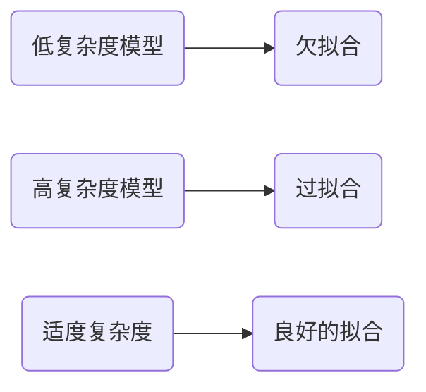

# 欠拟合 (Underfitting)

## 1.背景介绍
### 1.1 机器学习中的拟合问题
在机器学习领域,模型的拟合程度是衡量模型性能的重要指标。模型拟合不足或过度拟合都会影响模型的泛化能力和预测效果。欠拟合(Underfitting)就是模型拟合不足的一种表现。

### 1.2 欠拟合的危害
欠拟合会导致模型过于简单,无法很好地捕捉数据的内在规律和特征,在训练集和测试集上的表现都比较差。这会严重影响模型的实际应用价值。因此,深入理解欠拟合的成因和解决方法对于构建高质量的机器学习模型至关重要。

## 2.核心概念与联系
### 2.1 偏差(Bias)与方差(Variance)
- 偏差:度量了模型预测值的期望与真实值之间的偏离程度,偏差越大,欠拟合的可能性越大。
- 方差:度量了模型预测结果的波动大小,方差越大,过拟合的可能性越大。

### 2.2 欠拟合、过拟合与模型复杂度的关系


模型的复杂度与拟合程度密切相关。过于简单的模型容易出现欠拟合,而过于复杂的模型又容易导致过拟合。只有选择适度复杂度的模型才能达到比较理想的拟合效果。

## 3.核心算法原理具体操作步骤
### 3.1 交叉验证(Cross-Validation)
交叉验证是评估模型泛化能力,发现欠拟合问题的重要方法。其基本步骤如下:
1. 将数据集划分为k个大小相似的子集
2. 选择其中的k-1个子集作为训练集,剩余的1个作为验证集
3. 在训练集上训练模型,在验证集上评估模型性能
4. 重复步骤2和3,每次选择不同的子集作为验证集
5. 对k次的评估结果取平均,得到模型的整体性能指标

### 3.2 学习曲线(Learning Curve)
学习曲线可以直观地反映模型在不同训练集大小下的拟合情况。绘制学习曲线的步骤为:
1. 将数据划分为训练集和测试集
2. 选择不同大小(如10%、20%...100%)的训练样本
3. 在不同大小的训练集上训练模型
4. 分别计算模型在训练集和测试集上的性能
5. 以训练集大小为横坐标,模型性能为纵坐标绘制学习曲线

如果模型在训练集和测试集上的性能都很差,且两条曲线接近,说明模型存在欠拟合。

## 4.数学模型和公式详细讲解举例说明
### 4.1 线性回归模型
以简单的线性回归模型 $y=wx+b$ 为例。模型的复杂度主要由特征维度决定。如果模型在训练集上的损失函数为:

$$J(w,b) = \frac{1}{2m}\sum_{i=1}^{m}(f_{w,b}(x^{(i)})-y^{(i)})^2$$

其中 $f_{w,b}(x)=wx+b$,是模型的预测函数。$m$ 为样本数量。

如果模型欠拟合,损失函数的值会很大。我们可以适当增加特征维度,提高模型复杂度来缓解欠拟合问题。例如,可以将线性模型扩展为多项式回归:

$$y = w_0 + w_1x + w_2x^2 + ... + w_dx^d$$

其中 $d$ 为多项式的次数,也反映了模型的复杂度。

### 4.2 正则化方法
正则化是一种常用的缓解过拟合的方法,但也可以用于平衡模型的偏差和方差。L2正则化(岭回归)的数学形式为:

$$J(w,b) = \frac{1}{2m}\left[\sum_{i=1}^{m}(f_{w,b}(x^{(i)})-y^{(i)})^2 + \lambda\sum_{j=1}^{n}w_j^2\right]$$

其中 $\lambda$ 为正则化系数,$n$ 为特征维度。$\lambda$ 越大,正则化的强度越大,模型的复杂度就越低。

通过调节 $\lambda$ 的大小,我们可以控制模型的复杂度,在欠拟合和过拟合之间取得平衡。

## 5.项目实践：代码实例和详细解释说明
下面是一个使用Python的scikit-learn库解决欠拟合问题的示例代码:

```python
from sklearn.datasets import load_boston
from sklearn.model_selection import train_test_split, learning_curve
from sklearn.linear_model import LinearRegression
from sklearn.preprocessing import PolynomialFeatures
import matplotlib.pyplot as plt
import numpy as np

# 加载Boston房价数据集
boston = load_boston()
X = boston.data
y = boston.target

# 划分训练集和测试集
X_train, X_test, y_train, y_test = train_test_split(X, y, test_size=0.2, random_state=42)

# 创建线性回归模型
lr = LinearRegression()

# 在训练集上训练模型
lr.fit(X_train, y_train)

# 在测试集上评估模型性能
print("测试集上的R2分数: ", lr.score(X_test, y_test))

# 绘制学习曲线
train_sizes, train_scores, test_scores = learning_curve(lr, X, y, cv=5,
                                                        train_sizes=np.linspace(0.1, 1.0, 10))

train_scores_mean = np.mean(train_scores, axis=1)
test_scores_mean = np.mean(test_scores, axis=1)

plt.plot(train_sizes, train_scores_mean, 'o-', label="Training")
plt.plot(train_sizes, test_scores_mean, 'o-', label="Cross-validation")
plt.xlabel("Training examples")
plt.ylabel("Score")
plt.legend(loc="best")
plt.show()

# 使用多项式特征扩展提高模型复杂度
poly = PolynomialFeatures(degree=2)
X_train_poly = poly.fit_transform(X_train)
X_test_poly = poly.transform(X_test)

# 创建新的线性回归模型
lr_poly = LinearRegression()

# 使用多项式特征训练模型
lr_poly.fit(X_train_poly, y_train)

# 评估提高复杂度后的模型性能
print("使用多项式特征后,测试集上的R2分数: ", lr_poly.score(X_test_poly, y_test))
```

代码解释:
1. 首先加载Boston房价数据集,并划分为训练集和测试集。
2. 创建一个线性回归模型`lr`,在训练集上训练,并在测试集上评估其性能。如果测试集上的R2分数很低,说明模型可能存在欠拟合。
3. 使用`learning_curve`函数绘制学习曲线。如果训练集和交叉验证集的得分都很低且接近,进一步验证了欠拟合的存在。
4. 为了提高模型复杂度,使用`PolynomialFeatures`对特征进行多项式扩展。这里设置`degree=2`,即将原始特征扩展为二阶多项式特征。
5. 创建一个新的线性回归模型`lr_poly`,使用扩展后的多项式特征进行训练,并评估其在测试集上的性能。
6. 比较提高复杂度前后模型的性能,如果性能有显著提升,说明通过增加模型复杂度缓解了欠拟合问题。

## 6.实际应用场景
欠拟合在许多实际场景中都可能出现,下面列举几个常见的例子:

### 6.1 广告点击率预测
在在线广告系统中,我们需要预测用户对广告的点击概率。如果模型过于简单,无法很好地刻画用户特征与点击行为之间的关系,就会出现欠拟合,导致点击率预测偏低,影响广告投放的效果。

### 6.2 疾病诊断
医疗诊断中常使用机器学习模型辅助医生进行疾病判断。如果诊断模型过于简单,无法很好地利用患者的症状、体征、检验结果等信息,就可能出现欠拟合,漏诊或误诊的风险就会增加。

### 6.3 自然语言处理
在情感分析、文本分类等NLP任务中,如果模型的复杂度不足,无法很好地理解文本的语义信息,就会出现欠拟合。这会导致模型的分类或预测准确率较低,无法满足实际应用的需求。

## 7.工具和资源推荐
以下是一些有助于理解和解决欠拟合问题的工具和资源:
- scikit-learn: 功能强大的Python机器学习库,提供了多种模型评估和调优的工具函数。
- TensorFlow和Keras: 流行的深度学习框架,可以方便地构建和训练神经网络模型。
- Matplotlib: Python数据可视化库,可以用于绘制学习曲线等分析图表。
- Kaggle: 知名的数据科学竞赛平台,提供了大量的真实数据集和实践案例。
- 吴恩达的机器学习课程: 适合初学者的系统性机器学习入门课程,对欠拟合和过拟合有深入浅出的讲解。

## 8.总结：未来发展趋势与挑战
随着机器学习在各领域的广泛应用,欠拟合问题也日益受到重视。未来,我们需要在以下几个方面加强研究和实践:
- 自动化的模型选择和超参数调优方法,帮助我们更高效地找到合适的模型复杂度。
- 更强大的特征工程技术,从原始数据中提取更有效的特征,减轻欠拟合的风险。
- 针对小样本、非平稳分布等特殊数据场景,研究更鲁棒的学习算法。
- 探索迁移学习、元学习等新范式,充分利用跨领域的知识,提高模型的泛化能力。

总之,欠拟合是机器学习中的常见问题,深入理解其成因和解决方法,对于提高模型性能和应用价值至关重要。让我们一起努力,不断推动机器学习技术的发展和应用!

## 9.附录：常见问题与解答
### 9.1 如何判断模型是否欠拟合?
可以通过以下几种方法判断:
- 在训练集和测试集上评估模型的性能,如果两者的性能指标都较低,且接近,则可能存在欠拟合。
- 绘制学习曲线,观察训练集和验证集的性能随样本量的变化趋势。如果两条曲线都较低且接近,说明欠拟合。
- 对模型进行交叉验证,如果各折上的性能都较差,也可能是欠拟合造成的。

### 9.2 欠拟合的主要原因有哪些?
欠拟合主要由以下原因导致:
- 模型复杂度不足,无法很好地刻画数据的内在规律。
- 特征工程不到位,未能提取出足够有效的特征。
- 训练样本数量太少,模型难以从有限的样本中学习到泛化性强的规律。
- 数据本身的噪声较大,影响了模型的学习效果。

### 9.3 解决欠拟合问题的常用方法有哪些?
常用的解决欠拟合的方法包括:
- 增加模型复杂度,如增加神经网络的层数和神经元数量,使用更复杂的核函数等。
- 进行特征工程,构造更有效的特征,如特征组合、特征选择等。
- 收集更多的训练样本,扩大训练集的规模。
- 使用正则化方法,适度限制模型复杂度,在欠拟合和过拟合之间取得平衡。
- 对数据进行清洗和预处理,去除噪声和异常点的影响。

作者：禅与计算机程序设计艺术 / Zen and the Art of Computer Programming