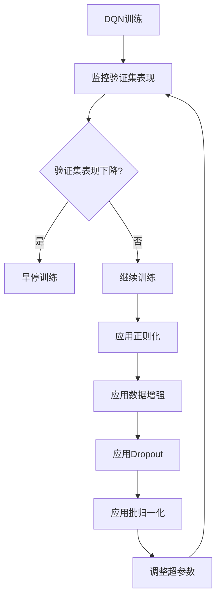

# 深度 Q-learning：防止过拟合的策略

## 1. 背景介绍

### 1.1 强化学习概述

强化学习是机器学习的一个重要分支,旨在训练智能体(agent)通过与环境交互来学习如何采取最优策略。与监督学习不同,强化学习没有提供标注数据集,智能体必须通过试错来探索环境,获取奖励信号,并据此调整策略。

### 1.2 Q-learning 算法

Q-learning是强化学习中的一种经典算法,它通过构建Q函数来估计在给定状态下采取某个动作的长期回报。Q函数的更新基于贝尔曼方程:

$$Q(s_t, a_t) \leftarrow Q(s_t, a_t) + \alpha \big[r_t + \gamma \max_{a} Q(s_{t+1}, a) - Q(s_t, a_t)\big]$$

其中 $\alpha$ 是学习率, $\gamma$ 是折扣因子, $r_t$ 是立即奖励。

### 1.3 深度 Q-learning (DQN)

传统的Q-learning使用表格来存储Q值,难以处理高维状态空间。深度Q网络(Deep Q-Network, DQN)将深度神经网络应用于Q函数的拟合,从而能够处理复杂的状态输入,如图像和视频。DQN的关键是使用经验回放(experience replay)和目标网络(target network)来提高训练的稳定性和效率。

### 1.4 过拟合问题

尽管DQN取得了巨大成功,但它也容易遭受过拟合的困扰。过拟合是指模型过度捕捉训练数据的特征和噪声,从而在新的测试数据上表现不佳。对于强化学习任务,过拟合会导致策略的不稳定性和泛化能力差。

## 2. 核心概念与联系

### 2.1 正则化

正则化是一种常用的防止过拟合的技术,通过在损失函数中加入惩罚项来限制模型的复杂度。常见的正则化方法包括L1正则化(Lasso回归)和L2正则化(Ridge回归)。

### 2.2 数据增强

数据增强是通过对现有数据进行一些随机变换(如旋转、平移、缩放等)来产生新的训练样本,从而增加训练数据的多样性,提高模型的泛化能力。

### 2.3 Dropout

Dropout是一种常用的防止过拟合的技术,通过在训练时随机丢弃一些神经元,来减少神经网络中参数之间的相互适应性。这种方法相当于对网络进行了一种有效的正则化。

### 2.4 批归一化

批归一化(Batch Normalization)通过对每一层的输入进行归一化处理,使得数据分布保持相对稳定,从而加快收敛速度,提高训练效率,并具有一定的正则化效果。

### 2.5 早停法

早停法是指在训练过程中监控模型在验证集上的表现,当验证集上的性能开始下降时,提前停止训练。这种方法可以防止模型过度拟合训练数据。

## 3. 核心算法原理具体操作步骤

防止DQN过拟合的关键步骤如下:



1. **监控验证集表现**：在训练过程中,持续监控DQN在验证集上的表现,如Q值估计的准确性、策略的收益等。
2. **早停训练**：如果验证集上的表现开始下降,则提前停止训练,防止过度拟合训练数据。
3. **应用正则化**：在DQN的损失函数中加入L1或L2正则化项,限制网络参数的大小,降低模型复杂度。
4. **应用数据增强**：对训练数据进行随机变换(如旋转、平移等),产生新的训练样本,增加数据多样性。
5. **应用Dropout**：在DQN的隐藏层中使用Dropout,随机丢弃一些神经元,减少参数之间的相互适应性。
6. **应用批归一化**：在DQN的每一层之后应用批归一化,使数据分布保持相对稳定,加快收敛并具有正则化效果。
7. **调整超参数**：调整DQN的超参数,如学习率、折扣因子、探索率等,寻找最佳配置以提高性能。

需要注意的是,这些防止过拟合的策略并非孤立使用,而是需要相互配合,共同发挥作用。同时,也要根据具体任务的特点,灵活选择和调整相应的策略。

## 4. 数学模型和公式详细讲解举例说明

### 4.1 正则化损失函数

在DQN的损失函数中加入正则化项,可以限制模型复杂度,防止过拟合。常用的正则化方法有L1正则化(Lasso回归)和L2正则化(Ridge回归)。

#### 4.1.1 L1正则化

L1正则化的损失函数为:

$$J(\theta) = J_0(\theta) + \alpha \sum_{i=1}^{n} |\theta_i|$$

其中 $J_0(\theta)$ 是原始损失函数, $\alpha$ 是正则化系数, $\theta_i$ 是模型参数。L1正则化可以产生稀疏解,即部分参数会被压缩为0。

#### 4.1.2 L2正则化

L2正则化的损失函数为:

$$J(\theta) = J_0(\theta) + \alpha \sum_{i=1}^{n} \theta_i^2$$

L2正则化会使参数值趋向于较小,但不会产生稀疏解。相比L1正则化,L2正则化对异常值更加鲁棒。

在实践中,需要根据具体任务选择合适的正则化方法,并调整正则化系数 $\alpha$ 以达到最佳效果。

### 4.2 Dropout

Dropout是一种常用的防止过拟合的技术,通过在训练时随机丢弃一些神经元,来减少神经网络中参数之间的相互适应性。

假设一个神经网络层的输入为 $\mathbf{x}$,权重为 $\mathbf{W}$,偏置为 $\mathbf{b}$,激活函数为 $f$,则该层的输出为:

$$\mathbf{y} = f(\mathbf{W}\mathbf{x} + \mathbf{b})$$

在应用Dropout时,我们首先对输入 $\mathbf{x}$ 进行随机掩码操作,得到 $\tilde{\mathbf{x}}$:

$$\tilde{\mathbf{x}} = \mathbf{m} \odot \mathbf{x}$$

其中 $\mathbf{m}$ 是一个与 $\mathbf{x}$ 同维度的掩码向量,每个元素服从伯努利分布,取值为0或1/$p$。$p$ 是保留神经元的概率,通常取值在0.5~0.8之间。$\odot$ 表示元素wise乘积。

然后,使用掩码后的输入 $\tilde{\mathbf{x}}$ 计算该层的输出:

$$\tilde{\mathbf{y}} = f(\mathbf{W}\tilde{\mathbf{x}} + \mathbf{b})$$

在测试时,我们不应用Dropout,而是对输出进行缩放,以获得期望输出:

$$\mathbf{y} = p\tilde{\mathbf{y}}$$

Dropout的作用相当于为每个输入数据构建了一个子网络的集合,并对这些子网络的输出进行了平均,从而减少了参数之间的相互适应性,提高了模型的泛化能力。

### 4.3 批归一化

批归一化(Batch Normalization)是一种常用的加速深度神经网络训练的技术,它通过对每一层的输入进行归一化处理,使得数据分布保持相对稳定,从而加快收敛速度,提高训练效率,并具有一定的正则化效果。

假设一个神经网络层的输入为 $\mathbf{x} = (x_1, x_2, \dots, x_n)$,我们首先计算输入的均值 $\mu$ 和方差 $\sigma^2$:

$$\mu = \frac{1}{n}\sum_{i=1}^{n}x_i$$
$$\sigma^2 = \frac{1}{n}\sum_{i=1}^{n}(x_i - \mu)^2$$

然后,对输入进行归一化:

$$\hat{x}_i = \frac{x_i - \mu}{\sqrt{\sigma^2 + \epsilon}}$$

其中 $\epsilon$ 是一个很小的常数,用于避免分母为0。

接下来,我们引入两个可训练的参数 $\gamma$ 和 $\beta$,对归一化后的输入进行缩放和平移:

$$y_i = \gamma\hat{x}_i + \beta$$

在训练过程中,不断更新 $\gamma$ 和 $\beta$,使得输出分布满足我们的需求。

批归一化不仅可以加快收敛速度,还具有一定的正则化效果,因为它限制了输入的取值范围,从而降低了模型的复杂度。

## 5. 项目实践:代码实例和详细解释说明

下面是一个使用PyTorch实现的DQN代码示例,其中包含了防止过拟合的策略,如L2正则化、Dropout和批归一化。

```python
import torch
import torch.nn as nn
import torch.nn.functional as F

class DQN(nn.Module):
    def __init__(self, state_dim, action_dim, hidden_dim=64, dropout_rate=0.2):
        super(DQN, self).__init__()
        self.fc1 = nn.Linear(state_dim, hidden_dim)
        self.bn1 = nn.BatchNorm1d(hidden_dim)
        self.fc2 = nn.Linear(hidden_dim, hidden_dim)
        self.bn2 = nn.BatchNorm1d(hidden_dim)
        self.dropout = nn.Dropout(dropout_rate)
        self.fc3 = nn.Linear(hidden_dim, action_dim)

    def forward(self, x):
        x = F.relu(self.bn1(self.fc1(x)))
        x = F.relu(self.bn2(self.fc2(x)))
        x = self.dropout(x)
        x = self.fc3(x)
        return x

# 定义损失函数
def loss_fn(q_values, target_q_values, actions, l2_reg=0.01):
    one_hot_actions = F.one_hot(actions, num_classes=q_values.shape[-1])
    q_value_for_actions = torch.sum(q_values * one_hot_actions, dim=-1)
    loss = F.mse_loss(q_value_for_actions, target_q_values)
    l2_reg_loss = sum(p.pow(2.0).sum() for p in model.parameters())
    loss += l2_reg * l2_reg_loss
    return loss

# 训练代码
optimizer = torch.optim.Adam(model.parameters())
for epoch in range(num_epochs):
    for states, actions, rewards, next_states, dones in dataloader:
        q_values = model(states)
        next_q_values = target_model(next_states).detach().max(dim=-1)[0]
        target_q_values = rewards + gamma * next_q_values * (1 - dones)

        loss = loss_fn(q_values, target_q_values, actions)

        optimizer.zero_grad()
        loss.backward()
        optimizer.step()

    # 更新目标网络
    if epoch % target_update_freq == 0:
        target_model.load_state_dict(model.state_dict())
```

这个示例中,我们定义了一个DQN模型,其中包含了三个全连接层。在第一和第二层之后,我们应用了批归一化(BatchNorm1d)来加速收敛和正则化。在第二层之后,我们还使用了Dropout来减少过拟合。

在损失函数中,我们加入了L2正则化项,其系数由 `l2_reg` 参数控制。通过调整 `l2_reg` 的值,我们可以平衡模型的拟合程度和复杂度。

在训练过程中,我们使用了目标网络(target_model)和经验回放(dataloader)来提高训练的稳定性和效率。每隔一定的epoch,我们会将当前模型的参数复制到目标网络中。

需要注意的是,这只是一个简单的示例,在实际应用中可能需要进一步调整模型结构、超参数和训练策略,以获得最佳效果。

## 6. 实际应用场景

深度Q-learning及其防止过拟合的策略在许多强化学习任务