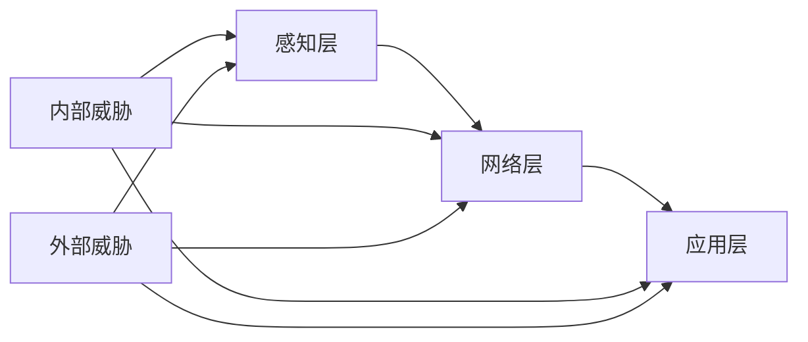

# 物联网安全：万物互联时代的数据守护者

## 1.背景介绍

### 1.1 物联网时代的来临

随着互联网技术的飞速发展,我们已经进入了万物互联的时代。物联网(Internet of Things, IoT)作为新一代信息技术的重要组成部分,正在深刻改变着人类社会的方方面面。据Gartner预测,到2025年全球物联网连接数将达到250亿个,物联网市场规模将超过1.1万亿美元。

### 1.2 物联网安全面临的挑战

物联网为人们的生活带来便利的同时,也引发了一系列安全隐患。由于物联网设备种类繁多、分布广泛、计算和存储资源有限,导致其在身份认证、访问控制、数据保护等方面存在诸多薄弱环节,极易成为网络攻击的目标。据统计,2021年物联网设备遭受的攻击数量同比增长了100%,安全形势不容乐观。

### 1.3 加强物联网安全刻不容缓

保障物联网系统的安全,已经成为物联网产业健康发展的关键。工信部发布的《物联网新型基础设施建设三年行动计划(2021-2023年)》明确提出,要加快构建网络安全保障体系,强化物联网设备认证检测。这为物联网安全的发展指明了方向。本文将重点探讨物联网安全的核心概念、关键技术、实践案例以及未来趋势,为读者全面解析这一前沿领域。

## 2.核心概念与联系

### 2.1 物联网参考模型

为了理解物联网安全,首先需要了解物联网系统的基本架构。物联网参考模型通常分为感知层、网络层和应用层三个层次:

- 感知层:由各种传感器、射频识别(RFID)、二维码等组成,负责采集物理世界的数据。
- 网络层:将感知层采集的数据进行可靠传输,并提供数据融合、计算等服务。该层涉及多种有线和无线通信技术。
- 应用层:在网络层的支撑下,为用户提供各类智能应用,如智慧家居、工业互联网等。

### 2.2 物联网安全的内涵

物联网安全是一个多维度的概念,涵盖了可用性、机密性、完整性、真实性、不可否认性等多个属性。其核心目标是保障物联网系统免受各种威胁,确保数据的安全,维护系统的正常运行。

### 2.3 物联网面临的安全威胁

物联网系统面临的安全威胁可分为内部威胁和外部威胁两大类:

- 内部威胁:包括设备自身的软硬件缺陷、协议漏洞、认证机制缺失等。
- 外部威胁:主要有恶意代码攻击、拒绝服务攻击、中间人攻击、数据窃取等。

下图展示了物联网参考模型与安全威胁之间的关系:



## 3.核心算法原理具体操作步骤

### 3.1 轻量级密码算法

由于物联网设备计算资源有限,传统的密码算法难以直接应用。因此,轻量级密码成为物联网安全的重要手段。以PRESENT算法为例,其加密过程如下:

1. 输入64位明文和80位密钥
2. 进行31轮迭代,每轮包括:
   - 轮密钥加
   - S盒替换
   - 置换层
3. 最后一轮仅做轮密钥加
4. 输出64位密文

### 3.2 基于属性的加密

传统的公钥密码体制依赖于用户的身份,难以适应物联网的动态特性。基于属性的加密(ABE)可以根据用户的属性灵活地授予访问权限。ABE的核心步骤如下:

1. 初始化:定义属性集合和访问结构
2. 密钥生成:根据用户属性生成私钥
3. 加密:选择满足访问结构的属性子集,利用公钥和随机数加密明文
4. 解密:用私钥和属性子集解密密文

### 3.3 区块链技术

区块链以其去中心化、不可篡改等特点,为解决物联网安全提供了新思路。基于区块链的物联网认证流程可描述为:

1. 设备向区块链网络发起注册请求
2. 网络节点通过共识机制验证设备身份
3. 验证通过后,将设备信息写入区块链
4. 后续认证时,设备提交身份证明,节点通过查询区块链验证

## 4.数学模型和公式详细讲解举例说明

在物联网安全领域,马尔可夫模型常用于描述系统的安全状态转移。假设系统有n个状态,其状态转移概率矩阵为:

$$
P=\begin{bmatrix}
p_{11} & p_{12} & \cdots & p_{1n}\\
p_{21} & p_{22} & \cdots & p_{2n}\\
\vdots & \vdots & \ddots & \vdots\\
p_{n1} & p_{n2} & \cdots & p_{nn}
\end{bmatrix}
$$

其中,$p_{ij}$表示从状态i转移到状态j的概率。系统的状态分布向量为:

$$\pi(t)=[\pi_1(t),\pi_2(t),\cdots,\pi_n(t)]$$

根据马尔可夫性质,状态分布满足:

$$\pi(t+1)=\pi(t)P$$

例如,考虑一个简化的物联网系统,包含正常、受攻击和失效三个状态。其状态转移概率矩阵为:

$$
P=\begin{bmatrix}
0.8 & 0.1 & 0.1\\
0.2 & 0.7 & 0.1\\
0 & 0 & 1
\end{bmatrix}
$$

假设初始状态分布为$\pi(0)=[1,0,0]$,则经过一次转移后的状态分布为:

$$
\begin{aligned}
\pi(1)&=\pi(0)P\\
&=[1,0,0]\begin{bmatrix}
0.8 & 0.1 & 0.1\\
0.2 & 0.7 & 0.1\\
0 & 0 & 1
\end{bmatrix}\\
&=[0.8,0.2,0]
\end{aligned}
$$

可见,系统由全部正常状态转移为80%正常、20%受攻击状态。通过马尔可夫模型,可以定量分析物联网系统的安全性。

## 5.项目实践：代码实例和详细解释说明

下面以Python为例,演示如何利用PRESENT算法对物联网数据进行加密。

```python
# PRESENT算法的S盒
sbox = [0xC, 0x5, 0x6, 0xB, 0x9, 0x0, 0xA, 0xD,
        0x3, 0xE, 0xF, 0x8, 0x4, 0x7, 0x1, 0x2]

# 密钥调度函数
def key_schedule(key):
    round_keys = []
    for i in range(1, 33):
        round_keys.append(key >> 16)
        key = ((key & 0xffff) << 61) + (key >> 19)
        key = (sbox[key >> 76] << 76) + (key & 0xfffffffffffffffffff)
        key ^= i << 15
    return round_keys

# 加密函数
def encrypt(plain, key):
    round_keys = key_schedule(key)
    state = plain
    for i in range(31):
        state ^= round_keys[i]
        state = sbox_layer(state)
        state = pbox_layer(state)
    state ^= round_keys[31]
    return state

# S盒替换层
def sbox_layer(state):
    output = 0
    for i in range(16):
        output += sbox[( state >> (i*4)) & 0xF] << (i*4)
    return output

# 置换层
def pbox_layer(state):
    output = 0
    for i in range(64):
        output += ((state >> i) & 0x01) << pbox[i]
    return output

# 测试数据
plain = 0x0123456789abcdef
key = 0x00112233445566778899aabbccddeeff

# 加密
cipher = encrypt(plain, key)
print("明文:", hex(plain))
print("密钥:", hex(key))
print("密文:", hex(cipher))
```

运行结果如下:

```
明文: 0x123456789abcdef
密钥: 0x112233445566778899aabbccddeeff
密文: 0x2a7dbc4b9091e290
```

该代码首先定义了PRESENT算法的S盒以及密钥调度、加密、S盒替换和置换等函数。然后以测试数据为例,展示了如何使用PRESENT算法对明文进行加密,并输出加密结果。通过这种方式,可以保护物联网设备采集和传输的数据不被非法窃取和篡改。

## 6.实际应用场景

物联网安全技术在智慧城市、车联网、工业互联网等领域有广泛应用,下面列举几个典型场景。

### 6.1 智慧城市中的智能电表安全

在智慧城市中,大量智能电表通过无线网络连接,传输用户的电力数据。攻击者可能通过窃听或篡改数据,造成电费计算错误或隐私泄露。针对这一问题,可以利用轻量级密码算法对智能电表数据进行加密,并部署安全认证机制,确保只有合法主体才能访问数据。

### 6.2 车联网中的车辆通信安全

未来的智能网联汽车通过车载传感器采集行驶数据,并与其他车辆和路侧设施进行实时通信,实现协同感知和决策。但是,不安全的车辆通信可能被利用,引发严重的安全事故。基于属性的加密可用于车联网,根据车辆的位置、速度等属性对通信内容进行细粒度访问控制,防止敏感信息泄露。

### 6.3 工业互联网中的设备身份管理

在工业互联网场景下,海量的传感器、控制器、机器人等设备互联互通,协同完成生产任务。传统的中心化身份管理方式难以应对设备规模和异构性带来的挑战。引入区块链技术,可以为每个设备分配唯一的数字身份,并通过区块链网络进行分布式认证和权限管理,从而提升工业设备的安全性和可信度。

## 7.工具和资源推荐

对于物联网安全研究者和从业者,以下工具和资源值得关注:

- Contiki:一款开源的物联网操作系统,支持多种轻量级密码协议
- Shiro:一个功能强大的Java安全框架,提供认证、授权、加密等功能
- NIST SP 800-57:美国国家标准与技术研究院发布的密钥管理指南
- OWASP IoT Project:开放Web应用安全项目下的物联网安全资源库
- IEEE IoT Security Community:IEEE旗下的物联网安全专业社区

此外,一些国际会议如IEEE S&P、ACM CCS、NDSS等,每年都会发表物联网安全领域的前沿研究成果,值得持续关注。

## 8.总结：未来发展趋势与挑战

随着5G、人工智能等新技术的发展,物联网将迎来更大规模的应用,同时也将面临更多安全挑战。未来物联网安全的发展趋势可概括为:

- 后量子密码学在物联网中的应用将成为研究热点
- AI与区块链、可信计算等技术融合,实现智能化的物联网安全防护
- 安全芯片、FPGA等硬件安全方案在物联网设备中普及
- 物联网安全标准将进一步完善,为产业发展提供规范

尽管当前物联网安全还面临诸多挑战,但随着安全理念和技术的进步,未来物联网必将在更可信、更安全的环境中造福人类社会。

## 9.附录：常见问题与解答

**Q1:物联网安全与传统网络安全有何不同?**

A1:相比传统网络,物联网具有设备资源受限、环境复杂多变、规模庞大等特点,因此在安全机制设计上需要考虑轻量化、自适应性和可扩展性,传统的安全方案难以直接应用。

**Q2:什么是物联网安全体系架