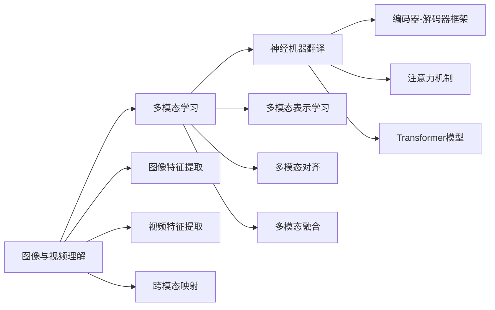

# 神经机器翻译的多模态输入:利用图像和视频

## 1.背景介绍
### 1.1 神经机器翻译的发展历程
#### 1.1.1 统计机器翻译时代
#### 1.1.2 神经机器翻译的崛起
#### 1.1.3 神经机器翻译的优势与局限

### 1.2 多模态机器翻译的兴起
#### 1.2.1 多模态数据的丰富性
#### 1.2.2 多模态信息的互补性
#### 1.2.3 多模态机器翻译的研究意义

### 1.3 利用图像和视频进行机器翻译的动机
#### 1.3.1 图像信息对翻译的辅助作用
#### 1.3.2 视频信息对翻译的辅助作用
#### 1.3.3 多模态融合的挑战与机遇

## 2.核心概念与联系
### 2.1 神经机器翻译
#### 2.1.1 编码器-解码器框架
#### 2.1.2 注意力机制
#### 2.1.3 Transformer模型

### 2.2 多模态学习
#### 2.2.1 多模态表示学习
#### 2.2.2 多模态对齐
#### 2.2.3 多模态融合

### 2.3 图像与视频理解
#### 2.3.1 图像特征提取
#### 2.3.2 视频特征提取
#### 2.3.3 跨模态映射

### 2.4 概念之间的关系


## 3.核心算法原理具体操作步骤
### 3.1 基于注意力机制的图像增强神经机器翻译
#### 3.1.1 将图像特征作为额外的输入
#### 3.1.2 在解码器中引入图像注意力机制
#### 3.1.3 联合文本与图像注意力进行解码

### 3.2 基于层次注意力机制的视频增强神经机器翻译
#### 3.2.1 帧级别的视频特征提取
#### 3.2.2 片段级别的视频特征聚合
#### 3.2.3 层次注意力机制融合文本与视频信息

### 3.3 基于多模态融合的图像视频增强神经机器翻译
#### 3.3.1 多模态共同表示空间的构建
#### 3.3.2 多模态信息的交互融合
#### 3.3.3 融合后的多模态表示用于翻译解码

## 4.数学模型和公式详细讲解举例说明
### 4.1 基于注意力机制的图像增强模型
给定源语言句子 $x=\{x_1,\dots,x_n\}$ 和相应的图像 $v$,模型的目标是生成目标语言翻译 $y=\{y_1,\dots,y_m\}$。编码器将 $x$ 编码为隐状态序列 $h=\{h_1,\dots,h_n\}$,同时提取图像特征 $f_v$。在解码时刻 $t$,解码器隐状态 $s_t$ 计算如下:

$$s_t=f(s_{t-1},y_{t-1},c_t,\alpha_t)$$

其中 $c_t$ 是基于文本的注意力上下文向量,通过对编码器隐状态序列 $h$ 加权求和得到:

$$c_t=\sum_{i=1}^n a_{ti}h_i$$

$a_{ti}$ 是注意力权重,表示目标词 $y_t$ 对齐到源语言词 $x_i$ 的程度。 $\alpha_t$ 是基于图像的注意力上下文向量,通过对图像特征 $f_v$ 加权求和得到:

$$\alpha_t=\sum_{j=1}^k b_{tj}f_v^j$$

$b_{tj}$ 是图像注意力权重,表示目标词 $y_t$ 对齐到图像区域 $j$ 的程度。最后,预测目标词 $y_t$ 的概率为:

$$p(y_t|y_{<t},x,v)=softmax(W_o[s_t;c_t;\alpha_t]+b_o)$$

其中 $W_o$ 和 $b_o$ 是可学习的参数。该模型通过引入图像注意力,使翻译过程能够利用图像信息进行辅助和改进。

### 4.2 基于层次注意力机制的视频增强模型
在视频增强模型中,首先在帧级别提取视频特征序列 $\{f_1,\dots,f_l\}$,然后使用注意力机制在片段级别聚合特征:

$$g_i=\sum_{j=(i-1)s+1}^{is} \beta_{ij}f_j$$

其中 $g_i$ 表示第 $i$ 个视频片段的聚合特征,$s$ 为每个片段的帧数, $\beta_{ij}$ 是帧级别注意力权重。

在解码时,模型使用层次注意力机制,同时考虑文本、图像和视频信息:

$$s_t=f(s_{t-1},y_{t-1},c_t,\alpha_t,\gamma_t)$$

其中 $c_t$ 和 $\alpha_t$ 的计算与图像增强模型类似, $\gamma_t$ 是基于视频片段的注意力上下文向量:

$$\gamma_t=\sum_{i=1}^{l/s} \delta_{ti}g_i$$

$\delta_{ti}$ 是视频片段注意力权重。通过引入层次注意力机制,模型能够有效利用视频序列信息辅助翻译。

### 4.3 基于多模态融合的图像视频增强模型
该模型旨在构建文本、图像和视频的共同表示空间。首先将三种模态分别映射到共同的语义空间:

$$h'=W_hh, f_v'=W_vf_v, g'=W_gg$$

然后通过注意力机制实现不同模态之间的信息交互融合:

$$h^*=att(Q_h,K_v,V_v)+att(Q_h,K_g,V_g)$$
$$f_v^*=att(Q_v,K_h,V_h)+att(Q_v,K_g,V_g)$$
$$g^*=att(Q_g,K_h,V_h)+att(Q_g,K_v,V_v)$$

其中 $Q,K,V$ 分别表示查询、键、值,通过注意力机制实现不同模态间的信息交互。最后,融合后的多模态表示 $h^*,f_v^*,g^*$ 用于解码器的翻译过程。

通过多模态融合,模型能够充分利用文本、图像和视频信息,实现更准确、更丰富的机器翻译。

## 5.项目实践：代码实例和详细解释说明
下面是一个基于注意力机制的图像增强神经机器翻译的PyTorch代码片段:

```python
class ImageEnhancedNMT(nn.Module):
    def __init__(self, encoder, decoder, image_encoder):
        super().__init__()
        self.encoder = encoder
        self.decoder = decoder
        self.image_encoder = image_encoder

    def forward(self, src, tgt, img):
        batch_size = src.size(0)
        src_len = src.size(1)
        tgt_len = tgt.size(1)

        # 编码源语言句子
        encoder_outputs, hidden = self.encoder(src)

        # 提取图像特征
        img_features = self.image_encoder(img)

        # 初始化解码器隐状态
        decoder_input = tgt[:, 0]
        decoder_hidden = hidden[:self.decoder.n_layers]

        # 存储解码结果
        outputs = torch.zeros(batch_size, tgt_len, self.decoder.output_dim)

        # 解码
        for t in range(1, tgt_len):
            decoder_output, decoder_hidden, _ = self.decoder(
                decoder_input, decoder_hidden, encoder_outputs, img_features)
            outputs[:, t] = decoder_output
            decoder_input = tgt[:, t]

        return outputs
```

该代码定义了一个 `ImageEnhancedNMT` 类,包含编码器 `encoder`、解码器 `decoder` 和图像编码器 `image_encoder` 三个子模块。前向传播过程如下:

1. 通过编码器对源语言句子进行编码,得到编码器输出 `encoder_outputs` 和最后一个隐状态 `hidden`。

2. 使用图像编码器提取图像特征 `img_features`。

3. 初始化解码器的输入 `decoder_input` 和隐状态 `decoder_hidden`。

4. 遍历目标语言句子,在每个时间步进行解码:
   - 将上一步的解码器输出 `decoder_input`、解码器隐状态 `decoder_hidden`、编码器输出 `encoder_outputs` 和图像特征 `img_features` 传入解码器。
   - 得到当前时间步的解码器输出 `decoder_output` 和更新后的隐状态 `decoder_hidden`。
   - 将 `decoder_output` 存储到输出张量 `outputs` 中。
   - 将当前时间步的真实目标词作为下一步的解码器输入 `decoder_input`。

5. 返回完整的解码结果 `outputs`。

通过以上步骤,模型实现了基于注意力机制的图像增强神经机器翻译。在解码过程中,模型不仅利用了源语言句子的编码信息,还融入了图像特征,使翻译能够考虑到图像所提供的视觉信息。

需要注意的是,以上代码仅为示例,实际实现中还需要定义编码器、解码器和图像编码器的具体结构,并进行训练和推断。此外,可以进一步扩展该模型,引入视频特征、多模态融合等技术,以实现更加强大的多模态机器翻译系统。

## 6.实际应用场景
### 6.1 多语言字幕生成
在视频网站中,可以利用多模态机器翻译技术自动为视频生成多语言字幕。通过融合视频帧、音频信息和原始字幕,生成准确、流畅的翻译结果,方便不同语言背景的用户观看视频。

### 6.2 跨语言图像搜索
利用图像增强机器翻译技术,可以实现跨语言的图像搜索。用户可以使用自己的母语描述图像内容,系统将查询翻译成目标语言,并根据图像特征进行匹配和检索,返回相关的图像结果。

### 6.3 旅游辅助翻译
在旅游场景中,游客可以拍摄景点、标识等图像,并通过图像增强翻译系统获取其他语言的解释说明。同时,还可以将语音输入转换为文本,并结合图像信息进行翻译,提供更全面、准确的翻译服务。

### 6.4 电子商务跨境交易
在跨境电商中,商品描述和评论往往包含多种语言。利用多模态机器翻译技术,可以自动将商品图像、描述、评论等信息翻译成买家的母语,方便买家了解商品详情,提升用户体验。

### 6.5 医疗诊断辅助
医学影像数据如X射线、CT、核磁共振等包含丰富的视觉信息。将这些医学影像与病历报告等文本信息结合,通过多模态机器翻译生成其他语言的诊断报告,可以辅助医生进行跨语言的医疗诊断和会诊。

## 7.工具和资源推荐
### 7.1 数据集
- Multi30K:包含图像及其多语言描述的多模态数据集,广泛用于图像描述翻译任务。
- VATEX:多语言视频描述数据集,包含超过4万个视频及其英文和中文描述。
- WIT:Wikipedia Image Text数据集,包含Wikipedia文章及其配图,适用于多模态机器翻译研究。

### 7.2 开源工具和库
- OpenNMT:基于PyTorch的开源神经机器翻译工具包,支持文本、图像、视频等多模态输入。
- fairseq:Facebook开源的序列到序列学习库,包含多种神经机器翻译模型和多模态扩展。
- MMF:多模态框架,提供了多种多模态任务的模型实现,包括图像描述、视觉问答等。

### 7.3 预训练模型
- BERT:基于Transformer的预训练语言模型,