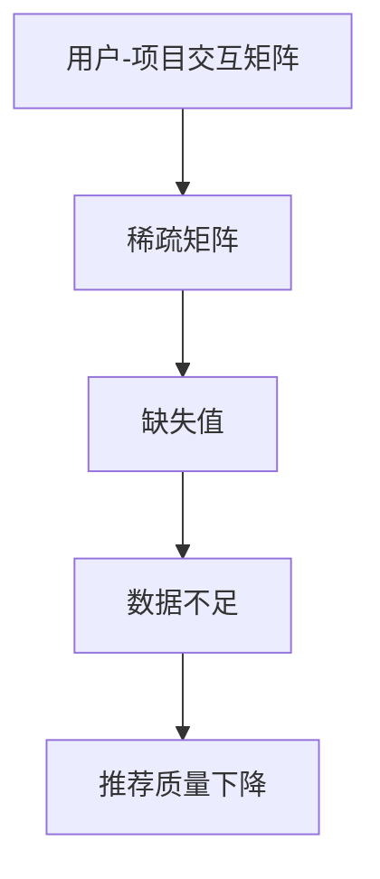

# 第八篇：数据稀疏性：推荐系统面临的挑战

## 1. 背景介绍

### 1.1 推荐系统的重要性

在当今信息爆炸的时代,推荐系统已经成为帮助用户发现感兴趣的项目(如产品、服务、信息等)的关键工具。无论是电子商务网站推荐商品、视频流媒体平台推荐电影还是社交媒体推荐好友,推荐系统都扮演着重要角色。它们通过分析用户的过往行为和偏好,为用户提供个性化的推荐,从而提高用户体验、增加转化率和收入。

### 1.2 数据稀疏性问题

然而,推荐系统面临一个重大挑战:数据稀疏性问题。这个问题源于用户-项目交互数据的稀疏性,即大多数用户只对少数项目有过显式反馈(如评分、购买等),而对绝大多数项目没有任何反馈。这导致用户-项目交互矩阵高度稀疏,给推荐系统的准确性带来了巨大挑战。

## 2. 核心概念与联系

### 2.1 用户-项目交互矩阵

推荐系统的核心数据结构是用户-项目交互矩阵,其中每一行代表一个用户,每一列代表一个项目,矩阵元素表示用户对该项目的反馈(如评分、购买等)。这个矩阵通常是高度稀疏的,因为大多数用户只对少数项目有过反馈。



### 2.2 协同过滤算法

推荐系统中常用的协同过滤算法(如基于用户的协同过滤和基于项目的协同过滤)严重依赖于用户-项目交互矩阵中的数据。当矩阵过于稀疏时,这些算法的性能会大幅下降,因为缺乏足够的相似度信息来进行有效的推荐。

## 3. 核心算法原理具体操作步骤

### 3.1 基于用户的协同过滤

基于用户的协同过滤算法的核心思想是:对于给定的目标用户,找到与其有相似兴趣的其他用户(称为邻居),然后根据这些邻居用户对项目的评分,为目标用户预测感兴趣的项目。算法步骤如下:

1. 计算用户之间的相似度,通常使用皮尔逊相关系数或余弦相似度等度量。
2. 对于目标用户,找到与其最相似的 K 个邻居用户。
3. 对于每个目标项目,基于 K 个邻居用户对该项目的评分,预测目标用户对该项目的评分。
4. 将预测评分最高的项目推荐给目标用户。

然而,当用户-项目交互矩阵过于稀疏时,用户之间的相似度计算会受到严重影响,从而导致推荐质量下降。

### 3.2 基于项目的协同过滤

基于项目的协同过滤算法与基于用户的算法思路类似,但是将相似度计算的对象从用户转移到项目。算法步骤如下:

1. 计算项目之间的相似度,通常使用调整余弦相似度等度量。
2. 对于目标用户和目标项目,找到与目标项目最相似的 K 个邻居项目。
3. 基于目标用户对 K 个邻居项目的评分,预测目标用户对目标项目的评分。
4. 将预测评分最高的项目推荐给目标用户。

虽然基于项目的算法在一定程度上缓解了数据稀疏性问题,但当用户-项目交互矩阵过于稀疏时,项目之间的相似度计算仍然会受到影响,导致推荐质量下降。

## 4. 数学模型和公式详细讲解举例说明

### 4.1 皮尔逊相关系数

皮尔逊相关系数是计算两个变量之间线性相关程度的常用度量,在基于用户的协同过滤算法中用于计算用户之间的相似度。对于两个用户 $u$ 和 $v$,皮尔逊相关系数定义如下:

$$r_{uv} = \frac{\sum_{i \in I}(r_{ui} - \overline{r_u})(r_{vi} - \overline{r_v})}{\sqrt{\sum_{i \in I}(r_{ui} - \overline{r_u})^2}\sqrt{\sum_{i \in I}(r_{vi} - \overline{r_v})^2}}$$

其中:
- $I$ 是用户 $u$ 和 $v$ 都对项目 $i$ 有评分的项目集合
- $r_{ui}$ 是用户 $u$ 对项目 $i$ 的评分
- $\overline{r_u}$ 是用户 $u$ 的平均评分

皮尔逊相关系数的值域为 $[-1, 1]$,值越接近 1 表示两个用户越相似,值越接近 -1 表示两个用户越不相似。

在数据稀疏的情况下,用户之间共同评分的项目数量会变少,从而影响皮尔逊相关系数的计算准确性。

### 4.2 调整余弦相似度

调整余弦相似度是计算两个向量之间相似度的一种方法,在基于项目的协同过滤算法中用于计算项目之间的相似度。对于两个项目 $i$ 和 $j$,调整余弦相似度定义如下:

$$\text{sim}(i, j) = \frac{\sum_{u \in U}(r_{ui} - \overline{r_u})(r_{uj} - \overline{r_u})}{\sqrt{\sum_{u \in U}(r_{ui} - \overline{r_u})^2}\sqrt{\sum_{u \in U}(r_{uj} - \overline{r_u})^2}}$$

其中:
- $U$ 是对项目 $i$ 和 $j$ 都有评分的用户集合
- $r_{ui}$ 是用户 $u$ 对项目 $i$ 的评分
- $\overline{r_u}$ 是用户 $u$ 的平均评分

调整余弦相似度的值域为 $[-1, 1]$,值越接近 1 表示两个项目越相似,值越接近 -1 表示两个项目越不相似。

在数据稀疏的情况下,项目之间共同被评分的用户数量会变少,从而影响调整余弦相似度的计算准确性。

## 5. 项目实践:代码实例和详细解释说明

以下是使用 Python 和 Surprise 库实现基于用户的协同过滤算法的示例代码:

```python
from surprise import Dataset, Reader, SVD
from surprise.model_selection import train_test_split

# 加载数据集
file_path = 'data/ratings.csv'
reader = Reader(line_format='user item rating timestamp', sep=',')
data = Dataset.load_from_file(file_path, reader=reader)

# 拆分数据集
trainset, testset = train_test_split(data, test_size=0.2)

# 训练模型
algo = SVD()
algo.fit(trainset)

# 预测评分
uid = 10  # 目标用户ID
iid = 50  # 目标项目ID
pred = algo.predict(uid, iid)
print(f'预测评分: {pred.est}')
```

在这个示例中,我们使用了 Surprise 库中的 SVD 算法,它是一种基于矩阵分解的协同过滤算法。

1. 首先,我们从文件加载了一个包含用户、项目、评分和时间戳的数据集。
2. 然后,我们将数据集拆分为训练集和测试集,用于模型训练和评估。
3. 接下来,我们实例化了 SVD 算法对象,并使用训练集数据进行模型训练。
4. 最后,我们为给定的目标用户和目标项目预测评分。

需要注意的是,在数据稀疏的情况下,协同过滤算法的性能会受到影响。为了缓解这个问题,我们可以尝试以下策略:

- 数据填充:使用各种技术(如平均值填充、基于内容的填充等)来填充缺失值,从而减少数据稀疏性。
- 降维技术:使用矩阵分解或其他降维技术将高维稀疏数据转换为低维密集表示,从而提高算法性能。
- 混合推荐:将协同过滤算法与基于内容的推荐算法相结合,利用多种数据源来缓解数据稀疏性问题。

## 6. 实际应用场景

数据稀疏性问题在许多推荐系统应用场景中都存在,例如:

### 6.1 电子商务产品推荐

在电子商务网站上,大多数用户只对少数产品有过购买或评分行为,导致用户-产品交互矩阵高度稀疏。这给基于协同过滤的产品推荐算法带来了挑战,需要采取相应的策略来缓解数据稀疏性问题。

### 6.2 社交媒体好友推荐

在社交媒体平台上,用户之间的关系网络通常是稀疏的,大多数用户只与少数其他用户有直接联系。这使得基于协同过滤的好友推荐算法面临数据稀疏性挑战,需要引入其他辅助信息(如用户个人资料、兴趣爱好等)来提高推荐质量。

### 6.3 新闻推荐

在新闻推荐系统中,大多数用户只对少数新闻主题感兴趣,导致用户-新闻交互矩阵高度稀疏。为了缓解这个问题,可以结合用户的浏览历史、地理位置等信息,并利用基于内容的推荐算法与协同过滤算法相结合。

## 7. 工具和资源推荐

### 7.1 Python 库

- Surprise: 一个用于构建和分析推荐系统的开源 Python 库,提供了多种协同过滤算法和评估指标。
- TensorRec: 一个基于 TensorFlow 的推荐系统库,支持多种模型和技术,如矩阵分解、序列模型和深度学习模型。
- LightFM: 一个用于混合推荐的 Python 库,结合了协同过滤和基于内容的推荐技术。

### 7.2 数据集

- MovieLens: 一个广泛使用的电影评分数据集,包含了用户对电影的评分数据。
- Amazon Review Data: 亚马逊产品评论数据集,包含了用户对各种产品的评论和评分数据。
- Last.fm: 一个音乐推荐数据集,包含了用户对艺术家和歌曲的播放记录。

### 7.3 在线课程和教程

- Coursera 上的 "推荐系统专项课程"
- edX 上的 "推荐系统导论"
- 斯坦福大学的 "机器学习推荐系统"公开课

## 8. 总结:未来发展趋势与挑战

### 8.1 深度学习在推荐系统中的应用

近年来,深度学习技术在推荐系统领域得到了广泛应用,如基于神经协同过滤的模型、序列模型等。这些模型能够从复杂的用户行为数据中自动学习特征表示,从而提高推荐质量。未来,深度学习技术在推荐系统中的应用将会继续扩大。

### 8.2 融合多种数据源

为了缓解数据稀疏性问题,未来的推荐系统将会更多地融合多种数据源,如用户个人资料、社交网络信息、上下文数据等。通过综合利用这些辅助信息,可以更好地理解用户偏好,提高推荐的准确性和多样性。

### 8.3 隐私和安全挑战

随着推荐系统在各个领域的广泛应用,用户隐私和数据安全问题也日益受到关注。如何在保护用户隐私的同时,仍然能够提供高质量的个性化推荐,将是推荐系统面临的一大挑战。

### 8.4 实时推荐和在线学习

未来的推荐系统需要能够实时响应用户行为,并在新数据到来时快速更新模型。这需要推荐算法具有在线学习和实时更新的能力,以及高效的分布式计算架构。

## 9. 附录:常见问题与解答

### 9.1 什么是数据稀疏性问