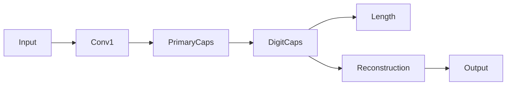

# 胶囊网络 原理与代码实例讲解

## 1.背景介绍
### 1.1 深度学习的局限性
深度学习技术在计算机视觉、自然语言处理等领域取得了巨大成功,但它仍然存在一些局限性。传统的卷积神经网络(CNN)通过堆叠卷积层和池化层来提取特征,但这种方式存在以下问题:
- 缺乏空间关系建模能力。CNN只能提取局部特征,无法很好地捕捉不同特征之间的空间关系。
- 对旋转、平移等变换敏感。CNN对图像的旋转、平移等变换非常敏感,泛化能力有限。
- 需要大量标注数据。CNN通常需要大量的标注样本来训练,获取标注数据的成本很高。

### 1.2 胶囊网络的提出
为了克服CNN的局限性,Geoffrey Hinton等人在2017年提出了胶囊网络(Capsule Network)的概念。与CNN不同,胶囊网络引入了向量化的特征表示以及动态路由机制,能够更好地建模空间层次关系,具有更强的鲁棒性和泛化能力。

## 2.核心概念与联系
### 2.1 胶囊 Capsule
胶囊是胶囊网络的基本组成单元,每个胶囊是一组神经元的向量化表示。与标量的神经元不同,胶囊的每个元素表示一个特定实体的不同属性,如位置、大小、方向、颜色等。一个胶囊的长度表示实体存在的概率,方向表示实体的属性。

### 2.2 动态路由 Dynamic Routing
胶囊之间通过动态路由算法连接。低层胶囊通过变换矩阵将其输出传递给高层胶囊,高层胶囊通过协议算法动态调整系数,使低层胶囊更倾向于传递给与其一致的高层胶囊。这种软化的路由机制使得网络能够自适应地学习特征之间的层次关系。

### 2.3 胶囊网络架构
典型的胶囊网络由以下几个部分组成:
- 输入层:接收原始图像数据
- 卷积层:提取低层局部特征
- 主胶囊层:将局部特征表示为胶囊向量
- 数字胶囊层:通过动态路由聚合低层胶囊,形成高层语义表示
- 重构层:根据胶囊输出重构原始图像

下图展示了胶囊网络的整体架构:



## 3.核心算法原理具体操作步骤
### 3.1 主胶囊映射
将卷积层提取的局部特征重塑为向量形式,得到主胶囊$u_i$。主胶囊的每个元素对应一个局部特征图上的神经元。

### 3.2 预测向量计算
对于第$i$个低层胶囊$u_i$和第$j$个高层胶囊$v_j$,通过变换矩阵$W_{ij}$计算预测向量$\hat{u}_{j|i}$:

$$\hat{u}_{j|i} = W_{ij}u_i$$

其中$W_{ij}$是一个需要学习的权重矩阵。

### 3.3 动态路由
通过动态路由算法,将低层胶囊的预测向量加权求和,得到高层胶囊$v_j$的输入向量$s_j$:

$$s_j = \sum_i c_{ij} \hat{u}_{j|i}$$

其中$c_{ij}$是动态计算的耦合系数,表示第$i$个低层胶囊对第$j$个高层胶囊的重要性。

耦合系数通过协议算法迭代更新:

$$c_{ij} = \frac{\exp(b_{ij})}{\sum_k \exp(b_{ik})}$$

$$b_{ij} \gets b_{ij} + \hat{u}_{j|i} \cdot v_j$$

其中$b_{ij}$初始化为0,每次迭代后根据预测向量与高层胶囊的一致性更新。

### 3.4 Squash激活
对路由得到的高层胶囊输入向量$s_j$应用Squash非线性激活函数,将其长度压缩到0~1之间,得到高层胶囊输出$v_j$:

$$v_j = \frac{||s_j||^2}{1+||s_j||^2} \frac{s_j}{||s_j||}$$

Squash函数可以看作是一种软化的向量归一化操作,使得长度较大的向量缩放到接近1,长度较小的向量缩放到接近0。

### 3.5 胶囊长度计算
对于分类任务,使用数字胶囊层的输出长度作为分类结果:

$$L_k = ||v_k||$$

其中$L_k$表示第$k$类的激活度。

## 4.数学模型和公式详细讲解举例说明
以上已经给出了胶囊网络中涉及的主要数学公式,下面我们以手写数字识别为例,对其中的一些细节进行说明。

假设我们要识别的是MNIST手写数字图像,输入图像大小为28x28。经过卷积层和主胶囊层,得到1152个8维的主胶囊。

对于数字$k$,设其对应的高层胶囊为$v_k$,维度为16。我们希望通过动态路由,将主胶囊$u_i$的信息传递给对应数字的高层胶囊$v_k$。

首先,使用变换矩阵$W_{ik}$将主胶囊$u_i$映射为预测向量:

$$\hat{u}_{k|i} = W_{ik}u_i, \quad W_{ik} \in \mathbb{R}^{16 \times 8}$$

然后,通过动态路由算法,计算数字胶囊$v_k$的输入向量:

$$s_k = \sum_i c_{ik} \hat{u}_{k|i}$$

其中耦合系数$c_{ik}$通过协议算法迭代更新:

$$c_{ik} = \frac{\exp(b_{ik})}{\sum_j \exp(b_{ij})}, \quad b_{ik} \gets b_{ik} + \hat{u}_{k|i} \cdot v_k$$

最后,对$s_k$应用Squash激活函数,得到数字胶囊$v_k$的输出:

$$v_k = \frac{||s_k||^2}{1+||s_k||^2} \frac{s_k}{||s_k||}$$

数字$k$的激活度由$v_k$的长度给出:

$$L_k = ||v_k||$$

激活度最大的数字即为分类结果。

## 5.项目实践：代码实例和详细解释说明
下面我们使用TensorFlow 2实现一个简单的胶囊网络,以MNIST手写数字识别为例。

```python
import tensorflow as tf

# 定义主胶囊
def primary_caps(inputs, num_capsules, vec_len, name='primary_caps'):
    with tf.name_scope(name):
        caps = tf.keras.layers.Conv2D(num_capsules*vec_len, 9, 2, activation='relu')(inputs)
        caps = tf.keras.layers.Reshape((num_capsules, vec_len))(caps)
        return caps

# 定义数字胶囊
def digit_caps(inputs, num_capsules, vec_len, num_routing, name='digit_caps'):
    with tf.name_scope(name):
        W = tf.keras.layers.Dense(num_capsules*vec_len, activation='relu')(inputs)
        W = tf.reshape(W, (-1, inputs.shape[1], num_capsules, vec_len))
        b = tf.zeros((1, inputs.shape[1], num_capsules, 1))

        for r in range(num_routing):
            c = tf.nn.softmax(b, axis=2)
            s = tf.reduce_sum(c * W, axis=1, keepdims=True)
            v = squash(s)
            b += tf.reduce_sum(W * v, axis=-1, keepdims=True)

        v = tf.squeeze(v, axis=1)
        return v

# 定义Squash激活函数
def squash(s, axis=-1, name='squash'):
    with tf.name_scope(name):
        squared_norm = tf.reduce_sum(tf.square(s), axis=axis, keepdims=True)
        scale = squared_norm / (1 + squared_norm)
        return scale * s / tf.sqrt(squared_norm)

# 定义胶囊网络模型
def capsule_net(input_shape, num_classes, routings):
    inputs = tf.keras.Input(shape=input_shape)

    conv1 = tf.keras.layers.Conv2D(256, 9, activation='relu')(inputs)
    primary_caps = primary_caps(conv1, 32, 8, 'primary_caps')
    digit_caps = digit_caps(primary_caps, num_classes, 16, routings, 'digit_caps')

    outputs = tf.keras.layers.Lambda(lambda z: tf.norm(z, axis=-1))(digit_caps)
    return tf.keras.Model(inputs, outputs)

# 创建模型
model = capsule_net((28, 28, 1), num_classes=10, routings=3)

# 编译模型
model.compile(optimizer='adam', loss='sparse_categorical_crossentropy', metrics=['accuracy'])

# 训练模型
model.fit(x_train, y_train, batch_size=128, epochs=10, validation_data=(x_test, y_test))
```

代码说明:
- `primary_caps`函数定义了主胶囊层,通过9x9卷积将特征图转换为向量表示。
- `digit_caps`函数定义了数字胶囊层,通过动态路由算法聚合主胶囊信息。其中`W`是变换矩阵,$b$是耦合系数,$c$通过softmax归一化得到。
- `squash`函数定义了Squash激活操作,对向量长度进行压缩。
- `capsule_net`函数定义了完整的胶囊网络模型,包括输入层、卷积层、主胶囊层和数字胶囊层。
- 最后,我们创建了胶囊网络模型,并使用MNIST数据集进行训练和评估。

## 6.实际应用场景
胶囊网络在以下场景中具有广阔的应用前景:
- 图像分类:胶囊网络能够更好地捕捉物体之间的空间关系,有望提升图像分类的性能,尤其是在数据量有限的情况下。
- 目标检测:通过引入胶囊表示,可以更好地建模目标的属性和关系,提高检测精度。
- 人脸识别:胶囊网络对姿态、表情等变化更加鲁棒,有望提升人脸识别的泛化能力。
- 医学图像分析:胶囊网络能够更好地建模层次化的解剖结构,在医学图像分割、疾病诊断等任务中具有应用潜力。
- 自然语言处理:将词语、短语表示为胶囊,有望更好地建模语言的层次结构和语义关系。

## 7.工具和资源推荐
- TensorFlow: https://www.tensorflow.org/
- Keras: https://keras.io/
- PyTorch: https://pytorch.org/
- CapsNet-Tensorflow: https://github.com/naturomics/CapsNet-Tensorflow
- CapsNet-Keras: https://github.com/XifengGuo/CapsNet-Keras
- Dynamic-Routing-Between-Capsules: https://github.com/Sarasra/models/tree/master/research/capsules

## 8.总结：未来发展趋势与挑战
胶囊网络是一种有前景的神经网络架构,为解决传统卷积网络的局限性提供了新的思路。通过引入胶囊表示和动态路由机制,胶囊网络能够更好地建模空间层次关系,具有更强的鲁棒性和泛化能力。

然而,胶囊网络的研究仍处于起步阶段,还面临着一些挑战:
- 计算复杂度高:动态路由算法需要迭代计算,计算开销较大,在处理大规模数据时效率有待提高。
- 训练不稳定:胶囊网络对权重初始化和超参数选择较为敏感,训练过程中可能出现不稳定的情况。
- 理论基础有待加强:胶囊网络的一些核心概念和原理还需要进一步的理论分析和证明。
- 大规模应用有待验证:目前胶囊网络主要在一些小型数据集上进行了实验,在大规模实际应用中的表现还有待验证。

未来,胶囊网络的研究可能围绕以下几个方向展开:
- 改进动态路由算法,提高计算效率和训练稳定性。
- 探索更有效的胶囊表示方法,如矩阵