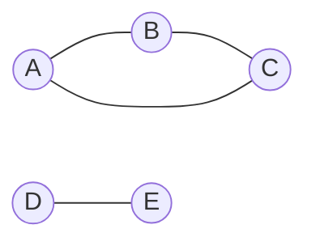

# 腾讯：使用Cosmos进行社交网络分析

## 1.背景介绍

### 1.1 社交网络分析的重要性
在当今互联网时代,社交网络已经成为人们生活中不可或缺的一部分。通过社交网络,人们可以与朋友、家人以及世界各地的人建立联系,分享信息和观点。对于企业而言,社交网络也提供了一个与客户互动、了解市场趋势、进行营销推广的重要渠道。因此,对社交网络进行深入分析具有重要意义。

### 1.2 腾讯的社交网络布局
作为中国互联网巨头之一,腾讯在社交网络领域有着广泛的布局。旗下拥有微信、QQ、QQ空间等多个社交平台,覆盖了数亿用户。这些海量的社交网络数据蕴含着巨大的价值,通过对其进行分析挖掘,可以洞察用户行为、社交关系、兴趣爱好等,为业务决策提供数据支撑。

### 1.3 Cosmos 简介
Cosmos 是腾讯自主研发的分布式存储和计算平台,可以支持 PB 级别的海量数据存储和高效分析。它采用了类似 Google Bigtable 的数据模型,支持结构化、半结构化和非结构化数据的存储。同时,Cosmos 还内置了 MapReduce、Spark 等分布式计算框架,可以方便地进行大规模数据处理和分析。

## 2.核心概念与联系

### 2.1 图模型
在社交网络分析中,图模型是一种常用的数据抽象方式。将社交网络看作一个图,其中节点表示用户,边表示用户之间的关系(如好友关系、互动关系等)。通过图模型,可以直观地表示社交网络的结构特征。

### 2.2 社区发现
社区发现是社交网络分析的一个重要任务,旨在从社交网络中识别出紧密联系的用户群体。这些社区通常具有相似的兴趣爱好、行为模式等特征。常见的社区发现算法有 Louvain、Infomap 等。

### 2.3 影响力分析
在社交网络中,某些用户可能具有较大的影响力,他们的言行往往能够影响更多的人。影响力分析旨在识别出这些关键用户,评估其影响力的大小。常见的影响力指标有 PageRank、中心性等。

### 2.4 链路预测
链路预测旨在预测社交网络中潜在的用户关系。通过分析用户属性、行为等特征,可以预测两个用户之间是否可能成为好友,或者是否会产生互动。常见的链路预测算法有基于邻域的方法、基于路径的方法等。

## 3.核心算法原理具体操作步骤

### 3.1 Louvain 社区发现算法

Louvain 是一种基于模块度优化的社区发现算法,具体步骤如下:

1. 初始时,每个节点都是一个独立的社区。
2. 对于每个节点 i,尝试将其移动到邻居节点 j 所在的社区,计算模块度的变化。
3. 将节点 i 移动到能够使模块度提升最大的社区。
4. 重复步骤 2-3,直到模块度不再提升。
5. 将每个社区看作一个新的节点,社区内部的边看作节点的自环,社区之间的边根据权重合并。
6. 重复步骤 2-5,直到模块度达到最大。

### 3.2 PageRank 影响力计算算法

PageRank 最初用于评估网页的重要性,后来被广泛用于社交网络的影响力分析。其基本思想是,一个节点的影响力取决于指向它的其他节点的影响力。具体计算公式为:

$$
PR(u) = \frac{1-d}{N} + d \sum_{v \in B_u} \frac{PR(v)}{L(v)}
$$

其中,$PR(u)$表示节点$u$的影响力,$N$为网络中节点的总数,$d$为阻尼系数(一般取0.85),$B_u$为指向节点$u$的节点集合,$L(v)$为节点$v$的出度。

算法具体步骤如下:

1. 初始时,每个节点的PageRank值为$\frac{1}{N}$。
2. 对于每个节点$u$,根据公式计算其新的PageRank值。
3. 重复步骤2,直到PageRank值收敛。

### 3.3 基于邻域的链路预测算法

基于邻域的链路预测算法的基本思想是,如果两个节点的邻居重叠度高,那么它们之间形成链路的可能性就越大。常见的邻域相似度指标有 Common Neighbors、Jaccard 系数等。

以 Common Neighbors 为例,其计算公式为:

$$
CN(u,v) = |N(u) \cap N(v)|
$$

其中,$N(u)$和$N(v)$分别表示节点$u$和$v$的邻居集合。

算法具体步骤如下:

1. 对于网络中每对没有边相连的节点$(u,v)$,计算其 Common Neighbors 值。
2. 根据 Common Neighbors 值的大小,对所有潜在链路进行排序。
3. 选取 Common Neighbors 值最大的若干对节点,作为预测的潜在链路。

## 4.数学模型和公式详细讲解举例说明

### 4.1 模块度

模块度是衡量社区划分质量的一个重要指标。直观地说,一个好的社区划分应该是:社区内部的边多,社区之间的边少。模块度的定义为:

$$
Q = \frac{1}{2m}\sum_{i,j} \left[ A_{ij} - \frac{k_i k_j}{2m} \right] \delta(c_i, c_j)
$$

其中,$m$为网络中边的总数,$A$为邻接矩阵,$k_i$为节点$i$的度,$c_i$表示节点$i$所属的社区,$\delta(x,y)$为克罗内克函数,当$x=y$时取1,否则为0。

举例来说,假设我们有如下一个社交网络:



可以将其划分为两个社区:{A,B,C}和{D,E}。此时的模块度为:

$$
Q = \frac{1}{10} \left[ (1-\frac{2 \times 2}{10}) + (1-\frac{2 \times 2}{10}) + (1-\frac{2 \times 2}{10}) + (1-\frac{1 \times 1}{10}) \right] = 0.4
$$

可以看出,该社区划分的模块度较高,说明划分质量较好。

### 4.2 Jaccard 系数

Jaccard 系数是衡量两个集合相似度的一个指标,定义为两个集合交集的大小除以并集的大小:

$$
J(A,B) = \frac{|A \cap B|}{|A \cup B|}
$$

在链路预测任务中,可以用 Jaccard 系数来衡量两个节点邻居的重叠度。例如,对于节点 u 和 v,其 Jaccard 系数为:

$$
J(u,v) = \frac{|N(u) \cap N(v)|}{|N(u) \cup N(v)|}
$$

举例来说,假设在一个社交网络中,节点 u 的邻居为{a,b,c},节点 v 的邻居为{b,c,d},则它们的 Jaccard 系数为:

$$
J(u,v) = \frac{|\{b,c\}|}{|\{a,b,c,d\}|} = \frac{2}{4} = 0.5
$$

可以看出,u 和 v 的邻居重叠度较高,它们之间形成链路的可能性较大。

## 5.项目实践：代码实例和详细解释说明

下面以 Python 语言为例,演示如何使用 NetworkX 库进行社交网络分析。

### 5.1 创建社交网络图

首先,我们创建一个简单的社交网络图:

```python
import networkx as nx

G = nx.Graph()
G.add_edges_from([('A', 'B'), ('A', 'C'), ('B', 'C'), ('D', 'E')])
```

这里我们创建了一个无向图`G`,并添加了4条边。

### 5.2 可视化社交网络图

利用 NetworkX 内置的绘图功能,可以方便地可视化社交网络图:

```python
import matplotlib.pyplot as plt

pos = nx.spring_layout(G)
nx.draw(G, pos, with_labels=True)
plt.show()
```

这里使用 spring 布局算法计算节点的位置,然后调用`nx.draw`函数绘制图形。

### 5.3 计算模块度

利用 NetworkX 提供的`community`模块,可以方便地进行社区发现和模块度计算:

```python
from networkx.algorithms import community

partition = community.best_partition(G)
modularity = community.modularity(G, partition)
print(f"Modularity: {modularity:.2f}")
```

这里调用`best_partition`函数对图进行社区划分,然后通过`modularity`函数计算模块度。

### 5.4 计算 PageRank

NetworkX 内置了 PageRank 算法,可以直接调用:

```python
pr = nx.pagerank(G)
print("PageRank:")
for node, score in pr.items():
    print(f"{node}: {score:.2f}")
```

这里调用`nx.pagerank`函数计算每个节点的 PageRank 值,然后打印出来。

### 5.5 链路预测

利用 Jaccard 系数进行链路预测:

```python
def jaccard_coefficient(G, u, v):
    u_neighbors = set(G[u])
    v_neighbors = set(G[v])
    return len(u_neighbors & v_neighbors) / len(u_neighbors | v_neighbors)

potential_edges = [(u, v) for u, v in nx.non_edges(G) if jaccard_coefficient(G, u, v) > 0]
print("Potential edges:")
print(potential_edges)
```

这里定义了一个`jaccard_coefficient`函数来计算两个节点的 Jaccard 系数,然后遍历所有不存在的边,找出 Jaccard 系数大于0的作为潜在链路。

## 6.实际应用场景

社交网络分析在腾讯的多个业务场景中得到了广泛应用,例如:

### 6.1 微信好友推荐
通过分析用户的社交关系网络,可以发现潜在的好友关系,从而为用户推荐可能认识的人。这里可以使用链路预测算法。

### 6.2 QQ 兴趣部落
通过对 QQ 用户的社交网络进行社区发现,可以识别出具有相似兴趣爱好的用户群体,形成兴趣部落。这里可以使用 Louvain 等社区发现算法。

### 6.3 微信公众号影响力分析
通过分析微信公众号的用户互动网络,可以评估不同公众号的影响力大小,发现意见领袖。这里可以使用 PageRank 等影响力计算算法。

### 6.4 社交网络异常检测
通过分析社交网络结构和用户交互行为,可以发现一些异常用户和异常行为,例如水军、僵尸粉等。这里可以使用图的异常检测算法。

## 7.工具和资源推荐

以下是一些常用的社交网络分析工具和资源:

- NetworkX: Python 的网络分析库,提供了丰富的图算法和社区发现算法。
- Gephi: 一个开源的交互式可视化和探索平台,用于各种网络和复杂系统。
- Pajek: 一个用于大型网络分析和可视化的程序包。
- SNAP: 斯坦福大学开发的网络分析和图挖掘库。
- Cytoscape: 一个开源的生物信息网络分析和可视化平台。

同时,腾讯也开源了一些相关的工具和系统:

- Angel: 腾讯开源的高性能分布式机器学习平台,支持大规模图计算。
- Plato: 腾讯开源的高性能分布式图计算框架。

## 8.总结：未来发展趋势与挑战

社交网络分析是一个快速发展的领域,未来还有很多值得探索的方向:

### 8.1 动态社交网络分析
现有的很多算法都是针对静态社交网络的,但实际上社交网络是动态演化的。如何有效地分析动态社交网络,捕捉其演化规律,是一个值得研究的问题。

### 8.2 社交网络与深度学习结合