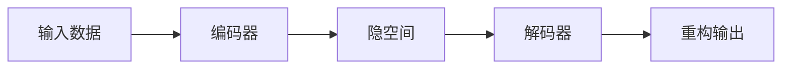

# 自编码器原理与代码实战案例讲解

## 1.背景介绍
自编码器(Autoencoder)是一种无监督学习的神经网络模型,它能够学习数据的高效编码表示。自编码器在降维、特征提取、数据去噪等领域有广泛应用。本文将深入探讨自编码器的原理,并提供代码实战案例,帮助读者全面掌握这一强大的工具。

### 1.1 自编码器的起源与发展
自编码器的概念最早由Hinton等人在1986年提出。最初的自编码器是一种浅层网络,包含输入层、隐藏层和输出层。通过无监督学习,自编码器能够学习输入数据的压缩表示。

### 1.2 自编码器的应用领域
- 数据压缩与降维
- 特征提取与表示学习
- 数据去噪与异常检测
- 生成模型与图像合成

### 1.3 自编码器的类型
- 普通自编码器(Vanilla Autoencoder)
- 稀疏自编码器(Sparse Autoencoder)
- 降噪自编码器(Denoising Autoencoder)
- 变分自编码器(Variational Autoencoder)

## 2.核心概念与联系

### 2.1 编码器(Encoder)与解码器(Decoder)
自编码器由编码器和解码器两部分组成。编码器将高维输入映射到低维隐空间,解码器则将隐空间表示重构为原始输入。

### 2.2 重构误差(Reconstruction Error)
自编码器通过最小化输入数据与重构数据之间的重构误差来学习数据的压缩表示。常用的重构误差度量包括均方误差(MSE)和交叉熵误差(Cross-entropy)。

### 2.3 隐空间(Latent Space)
隐空间是自编码器学习到的低维表示空间,它捕捉了输入数据的本质特征。隐空间维度通常远小于输入维度,起到降维压缩的作用。

### 2.4 信息瓶颈(Information Bottleneck)
编码器和解码器之间的隐藏层起到信息瓶颈的作用,迫使自编码器学习数据的高效压缩表示。适当设置隐藏层维度,可以平衡压缩率和重构质量。

### 2.5 自编码器与其他模型的关系
- 主成分分析(PCA):线性自编码器等价于PCA
- 受限玻尔兹曼机(RBM):堆叠自编码器与深度信念网络(DBN)关系密切
- 生成对抗网络(GAN):变分自编码器与GAN都是生成模型



## 3.核心算法原理具体操作步骤

### 3.1 普通自编码器
1. 定义编码器和解码器网络结构
2. 初始化模型参数(权重和偏置)
3. 前向传播:输入数据通过编码器得到隐空间表示,再通过解码器重构输出
4. 计算重构误差:比较输入数据与重构输出的差异
5. 反向传播:根据重构误差计算梯度,更新模型参数
6. 重复步骤3-5,直到模型收敛或达到预设的训练轮数

### 3.2 稀疏自编码器
稀疏自编码器在普通自编码器的基础上,引入了稀疏性约束。具体步骤如下:

1. 定义编码器和解码器网络结构,在隐藏层使用稀疏激活函数(如Sigmoid)
2. 初始化模型参数
3. 前向传播,得到隐空间表示和重构输出
4. 计算重构误差和稀疏性惩罚项(如KL散度)
5. 反向传播,更新模型参数
6. 重复步骤3-5,直到模型收敛或达到预设的训练轮数

### 3.3 降噪自编码器
降噪自编码器通过对输入数据添加噪声,提高模型的鲁棒性。具体步骤如下:

1. 定义编码器和解码器网络结构
2. 初始化模型参数
3. 对输入数据添加随机噪声(如高斯噪声)
4. 前向传播,得到隐空间表示和重构输出
5. 计算原始输入(无噪声)与重构输出的误差
6. 反向传播,更新模型参数
7. 重复步骤3-6,直到模型收敛或达到预设的训练轮数

### 3.4 变分自编码器
变分自编码器引入了概率图模型,对隐空间施加先验分布。具体步骤如下:

1. 定义编码器(推断模型)和解码器(生成模型)网络结构
2. 初始化模型参数
3. 从先验分布(通常为标准正态分布)采样隐变量
4. 前向传播,根据隐变量生成重构输出
5. 计算重构误差和KL散度正则化项
6. 反向传播,更新模型参数
7. 重复步骤3-6,直到模型收敛或达到预设的训练轮数

## 4.数学模型和公式详细讲解举例说明
### 4.1 自编码器的数学表示
给定输入数据$\mathbf{x} \in \mathbb{R}^d$,自编码器的目标是学习一个编码函数$f(\cdot)$和解码函数$g(\cdot)$,使得重构输出$\hat{\mathbf{x}} = g(f(\mathbf{x}))$尽可能接近原始输入$\mathbf{x}$。

编码器:
$$\mathbf{z} = f(\mathbf{x}) = \sigma(\mathbf{W}_1\mathbf{x} + \mathbf{b}_1)$$

解码器:
$$\hat{\mathbf{x}} = g(\mathbf{z}) = \sigma(\mathbf{W}_2\mathbf{z} + \mathbf{b}_2)$$

其中,$\mathbf{W}_1, \mathbf{W}_2$分别为编码器和解码器的权重矩阵,$\mathbf{b}_1, \mathbf{b}_2$为偏置向量,$\sigma(\cdot)$为激活函数(如Sigmoid或ReLU)。

### 4.2 重构误差
自编码器通过最小化重构误差来学习参数。常用的重构误差度量有:

均方误差(MSE):
$$L_{\text{MSE}}(\mathbf{x}, \hat{\mathbf{x}}) = \frac{1}{N}\sum_{i=1}^N(\mathbf{x}_i - \hat{\mathbf{x}}_i)^2$$

交叉熵误差(Cross-entropy):
$$L_{\text{CE}}(\mathbf{x}, \hat{\mathbf{x}}) = -\frac{1}{N}\sum_{i=1}^N[\mathbf{x}_i\log\hat{\mathbf{x}}_i + (1-\mathbf{x}_i)\log(1-\hat{\mathbf{x}}_i)]$$

### 4.3 稀疏自编码器的稀疏性约束
稀疏自编码器在重构误差的基础上,引入了稀疏性惩罚项。常用的稀疏性度量有:

L1正则化:
$$L_{\text{sparse}} = \lambda\sum_{j=1}^m|\mathbf{z}_j|$$

KL散度:
$$L_{\text{sparse}} = \lambda\sum_{j=1}^mKL(\rho\|\hat{\rho}_j) = \lambda\sum_{j=1}^m[\rho\log\frac{\rho}{\hat{\rho}_j} + (1-\rho)\log\frac{1-\rho}{1-\hat{\rho}_j}]$$

其中,$\lambda$为稀疏性权重,$\rho$为目标稀疏度,$\hat{\rho}_j$为第$j$个隐藏单元的平均激活度。

### 4.4 变分自编码器的变分推断
变分自编码器引入了隐变量$\mathbf{z}$的概率分布。编码器学习近似后验分布$q_{\phi}(\mathbf{z}|\mathbf{x})$,解码器学习条件概率分布$p_{\theta}(\mathbf{x}|\mathbf{z})$。

目标函数为变分下界(ELBO):
$$\mathcal{L}(\theta, \phi; \mathbf{x}) = \mathbb{E}_{q_{\phi}(\mathbf{z}|\mathbf{x})}[\log p_{\theta}(\mathbf{x}|\mathbf{z})] - KL(q_{\phi}(\mathbf{z}|\mathbf{x})\|p(\mathbf{z}))$$

其中,第一项为重构误差,第二项为近似后验分布与先验分布的KL散度。通过最大化ELBO,变分自编码器可以同时学习生成模型和推断模型。

## 5.项目实践：代码实例和详细解释说明

下面以PyTorch为例,展示如何实现一个简单的自编码器。

```python
import torch
import torch.nn as nn
import torch.optim as optim

# 定义自编码器模型
class Autoencoder(nn.Module):
    def __init__(self, input_dim, hidden_dim):
        super(Autoencoder, self).__init__()
        self.encoder = nn.Sequential(
            nn.Linear(input_dim, hidden_dim),
            nn.ReLU(),
        )
        self.decoder = nn.Sequential(
            nn.Linear(hidden_dim, input_dim),
            nn.Sigmoid(),
        )

    def forward(self, x):
        z = self.encoder(x)
        x_recon = self.decoder(z)
        return x_recon

# 设置参数
input_dim = 784  # 输入维度(MNIST图像大小: 28*28)
hidden_dim = 128  # 隐空间维度
num_epochs = 10  # 训练轮数
batch_size = 128  # 批大小
learning_rate = 0.001  # 学习率

# 加载MNIST数据集
from torchvision import datasets, transforms
train_dataset = datasets.MNIST(root='./data', train=True, transform=transforms.ToTensor(), download=True)
train_loader = torch.utils.data.DataLoader(train_dataset, batch_size=batch_size, shuffle=True)

# 初始化模型、损失函数和优化器
model = Autoencoder(input_dim, hidden_dim)
criterion = nn.MSELoss()
optimizer = optim.Adam(model.parameters(), lr=learning_rate)

# 训练模型
for epoch in range(num_epochs):
    for batch_idx, (data, _) in enumerate(train_loader):
        data = data.view(data.size(0), -1)  # 将图像展平为向量

        # 前向传播
        recon_data = model(data)
        loss = criterion(recon_data, data)

        # 反向传播和优化
        optimizer.zero_grad()
        loss.backward()
        optimizer.step()

        # 打印训练信息
        if (batch_idx+1) % 100 == 0:
            print(f"Epoch [{epoch+1}/{num_epochs}], Batch [{batch_idx+1}/{len(train_loader)}], Loss: {loss.item():.4f}")
```

代码解释:

1. 定义了一个简单的自编码器模型`Autoencoder`,包含编码器和解码器两部分。编码器将输入数据映射到隐空间,解码器将隐空间表示重构为原始输入。

2. 设置了输入维度、隐空间维度、训练轮数、批大小和学习率等参数。

3. 加载了MNIST手写数字数据集,并创建了数据加载器`train_loader`。

4. 初始化了自编码器模型、均方误差损失函数和Adam优化器。

5. 在训练循环中,对每个批次的数据进行前向传播,计算重构误差,然后进行反向传播和参数更新。

6. 定期打印训练信息,包括当前轮数、批次、损失值等。

通过运行该代码,可以在MNIST数据集上训练一个简单的自编码器模型。训练完成后,可以使用训练好的模型对新的输入数据进行编码和重构。

## 6.实际应用场景

自编码器在许多领域都有广泛应用,下面列举几个典型场景:

### 6.1 数据压缩与降维
自编码器可以学习数据的低维表示,实现数据压缩和降维。这在处理高维数据时非常有用,如图像、音频、文本等。降维后的数据更易于存储、传输和可视化。

### 6.2 特征提取与表示学习
自编码器的隐空间表示可以捕捉数据的本质特征,用于特征提取和表示学习。这些特征可以作为下游任务(如分类、聚类)的输入,提高任务性能。

### 6.3 数据去噪与异常检测
降噪自编码器可以学习去除输入数据中的噪声,实现数据去噪。同时,