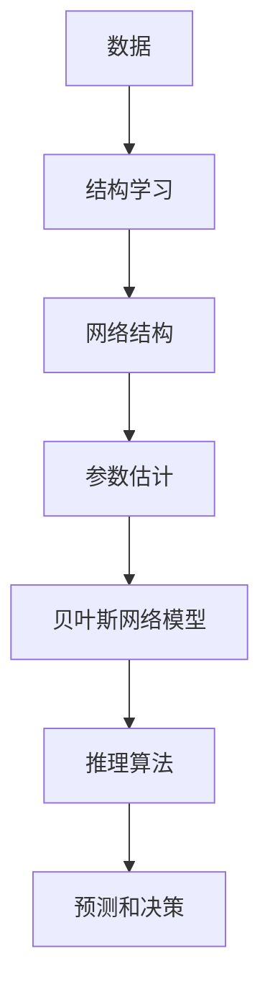

# 贝叶斯网络 (Bayesian Networks) 原理与代码实例讲解

## 1. 背景介绍

### 1.1 什么是贝叶斯网络?

贝叶斯网络(Bayesian Networks)是一种基于概率论的图形模型,用于表示随机变量之间的条件独立性关系。它由一组节点(表示随机变量)和有向边(表示变量之间的条件依赖关系)组成。贝叶斯网络可以有效地捕捉问题域中的不确定性和复杂性,并通过概率推理来进行预测和决策。

### 1.2 贝叶斯网络的应用

贝叶斯网络在许多领域都有广泛的应用,例如:

- 医疗诊断系统
- 风险分析和管理
- 语音和图像识别
- 基因调控网络分析
- 故障诊断和预测
- 博弈决策理论

### 1.3 贝叶斯网络的优势

相比于其他机器学习模型,贝叶斯网络具有以下优势:

- 直观的图形表示
- 处理不确定性和缺失数据
- 结合先验知识和数据
- 可解释性和可视化
- 高效的推理算法

## 2. 核心概念与联系

### 2.1 有向无环图 (DAG)

贝叶斯网络的基础结构是一个有向无环图(Directed Acyclic Graph, DAG)。在这个图中,节点表示随机变量,有向边表示变量之间的条件依赖关系。无环性质确保了网络中不存在循环依赖,从而简化了概率推理过程。

### 2.2 条件独立性

贝叶斯网络的核心思想是利用条件独立性来简化复杂的联合概率分布。在网络中,每个节点在给定其父节点的情况下,与其非后代节点条件独立。这种条件独立性关系可以大大减少计算联合概率分布所需的参数数量。

### 2.3 贝叶斯定理

贝叶斯定理是贝叶斯网络推理的基础,它提供了一种在给定证据的情况下更新先验概率的方法。贝叶斯定理可以表示为:

$$P(A|B) = \frac{P(B|A)P(A)}{P(B)}$$

其中,P(A|B)是在给定证据B的情况下,事件A发生的后验概率;P(A)是事件A的先验概率;P(B|A)是在事件A发生的情况下,观察到证据B的概率;P(B)是证据B的边缘概率。

### 2.4 Mermaid 流程图


## 3. 核心算法原理具体操作步骤

### 3.1 网络结构学习

网络结构学习是构建贝叶斯网络的第一步,目标是从数据中发现变量之间的条件独立性关系。常用的结构学习算法包括:

1. **约束基础结构学习算法**:
   - 先验知识约束
   - 条件独立性测试
   - 搜索和评分

2. **基于评分的结构学习算法**:
   - 贪婪搜索
   - 模拟退火
   - 进化算法

### 3.2 参数估计

在确定了网络结构后,需要估计每个节点在给定父节点的情况下的条件概率分布。常用的参数估计方法包括:

1. **最大似然估计**:利用训练数据来估计参数值,使得观测数据的似然函数最大化。

2. **贝叶斯估计**:将先验分布与数据的似然函数相结合,以获得参数的后验分布。

### 3.3 推理算法

推理是贝叶斯网络的核心操作,用于计算给定证据下,目标变量的后验概率分布。常用的推理算法包括:

1. **精确推理算法**:
   - 变量消除
   - 连接树算法

2. **近似推理算法**:
   - 随机采样 (例如 Gibbs 采样)
   - 变分推理

### 3.4 Mermaid 流程图



## 4. 数学模型和公式详细讲解举例说明

### 4.1 联合概率分布

在贝叶斯网络中,每个节点的条件概率分布可以通过网络结构和参数来表示。对于一个包含n个节点的贝叶斯网络,其联合概率分布可以表示为:

$$P(X_1, X_2, \dots, X_n) = \prod_{i=1}^n P(X_i | \text{Parents}(X_i))$$

其中,$ \text{Parents}(X_i) $表示节点$ X_i $的父节点集合。

### 4.2 边缘化

在推理过程中,我们通常需要计算目标变量的边缘概率分布。对于一个包含n个节点的贝叶斯网络,目标变量$ X_i $的边缘概率可以通过对联合概率分布进行边缘化来计算:

$$P(X_i) = \sum_{X_1} \sum_{X_2} \dots \sum_{X_{i-1}} \sum_{X_{i+1}} \dots \sum_{X_n} P(X_1, X_2, \dots, X_n)$$

### 4.3 条件概率

在给定部分证据的情况下,我们可以通过贝叶斯定理计算目标变量的条件概率分布。假设我们观测到了证据$ \mathbf{e} $,目标变量为$ X_i $,则条件概率可以表示为:

$$P(X_i | \mathbf{e}) = \frac{P(X_i, \mathbf{e})}{P(\mathbf{e})}$$

其中,$ P(X_i, \mathbf{e}) $是联合概率分布,$ P(\mathbf{e}) $是证据的边缘概率。

### 4.4 示例: 简单医疗诊断网络

考虑一个简单的医疗诊断网络,包含三个节点:疾病(D)、症状(S)和测试结果(T)。我们假设疾病和症状之间存在依赖关系,症状和测试结果之间也存在依赖关系。网络结构如下:


假设各节点的条件概率分布如下:

- $ P(D=\text{true}) = 0.2 $
- $ P(S=\text{positive} | D=\text{true}) = 0.8 $
- $ P(S=\text{positive} | D=\text{false}) = 0.3 $
- $ P(T=\text{positive} | S=\text{positive}) = 0.9 $
- $ P(T=\text{positive} | S=\text{negative}) = 0.1 $

现在,如果我们观测到测试结果为阳性($ T=\text{positive} $),我们可以计算患病的后验概率:

$$\begin{aligned}
P(D=\text{true} | T=\text{positive}) &= \frac{P(T=\text{positive} | D=\text{true}) P(D=\text{true})}{P(T=\text{positive})} \
&= \frac{\sum_S P(T=\text{positive} | S) P(S | D=\text{true}) P(D=\text{true})}{P(T=\text{positive})} \
&= \frac{0.9 \times 0.8 \times 0.2 + 0.1 \times 0.2 \times 0.8}{0.9 \times 0.8 \times 0.2 + 0.1 \times 0.7 \times 0.8} \
&\approx 0.62
\end{aligned}$$

因此,在观测到阳性测试结果的情况下,患病的后验概率为0.62。

## 5. 项目实践: 代码实例和详细解释说明

在这一部分,我们将使用 Python 中的 `pgmpy` 库来构建一个简单的贝叶斯网络模型,并进行推理。

### 5.1 安装 pgmpy 库

首先,我们需要安装 `pgmpy` 库,可以使用 `pip` 进行安装:

```bash
pip install pgmpy
```

### 5.2 构建网络结构

让我们考虑一个简单的天气预报网络,包含三个节点:天气(Weather)、气压(Barometer)和湿度(Humidity)。我们假设天气会影响气压和湿度,而气压和湿度之间没有直接依赖关系。

```python
from pgmpy.models import BayesianModel

# 创建网络结构
weather_model = BayesianModel([('Weather', 'Barometer'),
                               ('Weather', 'Humidity')])
```

### 5.3 添加条件概率表

接下来,我们需要为每个节点添加条件概率表(CPT)。在这个示例中,我们手动指定了每个节点的 CPT。

```python
# 添加 CPT
weather_model.add_nodes_from(['Weather', 'Barometer', 'Humidity'])

# 天气节点的 CPT
weather_cpd = TabularCPD('Weather', 2, [[0.6], [0.4]])
weather_model.add_cpds(weather_cpd)

# 气压节点的 CPT
barometer_cpd = TabularCPD('Barometer', 2, 
                           [[0.9, 0.2], [0.1, 0.8]],
                           evidence=['Weather'],
                           evidence_card=[2])
weather_model.add_cpds(barometer_cpd)

# 湿度节点的 CPT
humidity_cpd = TabularCPD('Humidity', 2,
                          [[0.7, 0.4], [0.3, 0.6]],
                          evidence=['Weather'],
                          evidence_card=[2])
weather_model.add_cpds(humidity_cpd)
```

### 5.4 推理

现在,我们可以使用 `pgmpy` 库进行推理。假设我们观测到气压为高(Barometer=1),我们可以计算天气为晴朗(Weather=0)的后验概率。

```python
from pgmpy.inference import VariableElimination

# 创建推理引擎
infer = VariableElimination(weather_model)

# 计算后验概率
posterior_weather = infer.query(['Weather'], 
                                evidence={'Barometer': 1})
print(posterior_weather)
```

输出结果:

```
+----------+----------------------+
| Weather  |   phi(Weather)       |
+----------+----------------------+
| Weather(0) | 0.16666666666666666 |
| Weather(1) | 0.8333333333333334  |
+----------+----------------------+
```

从结果可以看出,在观测到气压为高的情况下,天气为晴朗的后验概率为0.167,而天气为阴雨的后验概率为0.833。

## 6. 实际应用场景

贝叶斯网络在许多实际应用场景中发挥着重要作用,例如:

### 6.1 医疗诊断系统

在医疗领域,贝叶斯网络可以用于建立疾病和症状之间的关系模型,帮助医生进行诊断和预测。例如,一个医疗诊断系统可以基于患者的症状和检查结果,计算出各种疾病的概率,从而为医生提供决策支持。

### 6.2 风险分析和管理

在金融、保险和工程领域,贝叶斯网络可以用于建立风险模型,评估各种因素对风险的影响。例如,一个保险公司可以使用贝叶斯网络来预测客户的理赔概率,从而制定合理的保费策略。

### 6.3 语音和图像识别

在自然语言处理和计算机视觉领域,贝叶斯网络可以用于建立特征和目标之间的关系模型,从而实现语音识别、图像分类和目标检测等任务。例如,一个语音识别系统可以使用贝叶斯网络来捕捉语音特征和单词之间的依赖关系。

### 6.4 基因调控网络分析

在生物信息学领域,贝叶斯网络可以用于建立基因调控网络模型,探索基因之间的调控关系。这对于理解基因功能、疾病机理和药物作用机制等具有重要意义。

## 7. 工具和资源推荐

### 7.1 Python 库

- `pgmpy`: 一个用于构建和推理概率图模型(包括贝叶斯网络和马尔可夫网络)的开源 Python 库。
- `pomegranate`: 另一个用于构建和推理概率图模型的 Python 库,具有良好的文档和易