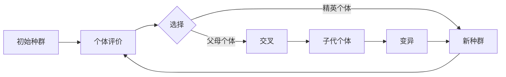

# 进化计算：遗传算法的未来发展方向

## 1.背景介绍

### 1.1 进化计算概述
进化计算(Evolutionary Computation, EC)是一类借鉴生物进化机制,模拟达尔文生物进化论中"适者生存"原理的启发式算法。它是人工智能和计算智能领域的重要分支之一,主要包括遗传算法(Genetic Algorithm, GA)、进化策略(Evolution Strategy, ES)、进化规划(Evolutionary Programming, EP)、遗传编程(Genetic Programming, GP)等。

### 1.2 遗传算法发展历程
遗传算法作为进化计算的代表,由美国密歇根大学的 John Holland 教授于 1975 年正式提出。之后经过几十年的发展,遗传算法已成为求解复杂优化问题的重要工具,在人工智能、机器学习、组合优化、自动控制等领域得到了广泛应用。

### 1.3 遗传算法研究现状
目前,遗传算法的研究主要集中在算法性能的改进、算法理论基础的完善以及算法在各领域的应用拓展等方面。一些新型遗传算法不断涌现,如量子遗传算法、差分进化算法、协同进化算法等,极大地丰富了遗传算法的内涵。

## 2.核心概念与联系

### 2.1 基本概念
- 个体(Individual):问题的一个候选解,通常由一个编码后的染色体表示。
- 种群(Population):由一定数量个体组成的集合,代表问题的多个候选解。
- 适应度(Fitness):衡量个体优劣的指标,与优化目标紧密相关。
- 选择(Selection):依据个体适应度,从当前种群中选出优良个体。
- 交叉(Crossover):模拟生物繁殖过程,通过父母个体的染色体重组产生新个体。
- 变异(Mutation):对个体的基因进行随机扰动,引入新的基因以维持种群多样性。

### 2.2 关键要素之间的联系


## 3.核心算法原理具体操作步骤

### 3.1 初始化
随机生成一定数量的个体,构成初始种群。个体通常采用二进制编码或实数编码。

### 3.2 适应度评价
根据问题的优化目标,计算每个个体的适应度值。适应度函数设计至关重要,直接决定了算法的优化性能。

### 3.3 选择操作
采用一定的选择策略,如轮盘赌选择、锦标赛选择等,依据个体适应度从当前种群中选出一组个体,遗传到下一代。一般适应度高的个体被选中的概率更大。

### 3.4 交叉操作
对选出的父母个体,按照一定的交叉概率执行交叉。常见的交叉算子有单点交叉、两点交叉、均匀交叉等。

### 3.5 变异操作
对新个体的每个基因,按照一定的变异概率进行变异。变异旨在引入新的基因,防止种群过早收敛。

### 3.6 终止条件判断
若满足预设的终止条件(如达到最大进化代数、找到满意解等),则输出当前最优解;否则,回到步骤 2,开始新一轮迭代。

## 4.数学模型和公式详细讲解举例说明

### 4.1 个体编码
以二进制编码为例,假设问题的解由4个变量组成,每个变量用 8bit 表示。则个体的染色体可表示为:

$$
X = (x_1, x_2, x_3, x_4),\quad x_i \in \{0,1\}^8
$$

### 4.2 适应度函数
以优化问题 $\min f(x)$ 为例,可构造适应度函数:

$$
F(X) = \frac{C}{f(X)+\epsilon}
$$

其中 $C$ 为常数, $\epsilon$ 为小正数,避免分母为零。该适应度函数可将最小化问题转化为适应度最大化问题。

### 4.3 选择操作
以轮盘赌选择为例,个体 $X_i$ 被选中的概率为:

$$
P(X_i) = \frac{F(X_i)}{\sum_{j=1}^N F(X_j)}
$$

其中 $N$ 为种群大小。适应度越高的个体,被选中的概率越大。

### 4.4 交叉操作
以单点交叉为例,随机选择一个交叉点,对两个父个体 $X_A$ 和 $X_B$ 执行交叉:

$$
\begin{aligned}
X_A &= (x_1^A, x_2^A, \underline{x_3^A}, x_4^A) \\
X_B &= (x_1^B, x_2^B, \underline{x_3^B}, x_4^B) \\
\Downarrow \\
X_A' &= (x_1^A, x_2^A, \underline{x_3^B}, x_4^B) \\
X_B' &= (x_1^B, x_2^B, \underline{x_3^A}, x_4^A)
\end{aligned}
$$

### 4.5 变异操作
以二进制编码的位翻转变异为例,对每个基因 $x_{ij}$,以概率 $p_m$ 进行翻转:

$$
x_{ij}' =
\begin{cases}
1-x_{ij}, & \text{rand() < } p_m \\
x_{ij}, & \text{otherwise}
\end{cases}
$$

其中 rand() 为 $[0,1]$ 上的均匀随机数。

## 5.项目实践：代码实例和详细解释说明

下面以 Python 为例,给出遗传算法求解函数优化问题 $\min f(x)=x^2, x\in[-1,1]$ 的简要实现:

```python
import numpy as np

def fitness(x):
    """适应度函数"""
    return 1 / (x**2 + 1e-6)

def selection(pop, fit):
    """轮盘赌选择"""
    idx = np.random.choice(len(pop), size=len(pop), replace=True, p=fit/fit.sum())
    return pop[idx]

def crossover(parent, pop):
    """单点交叉"""
    if np.random.rand() < 0.9:
        i = np.random.randint(0, parent.shape[1], size=1)
        parent[i:] = pop[np.random.randint(0, len(pop))][i:]
    return parent

def mutation(child):
    """均匀变异"""
    if np.random.rand() < 0.1:
        i = np.random.randint(0, child.shape[1], size=1)
        child[i] = 1 - child[i]
    return child

pop = np.random.randint(0, 2, (50, 10))  # 初始化种群,50个个体,每个个体10个二进制基因
for _ in range(100):  # 迭代100代
    F = fitness(pop.dot(2)/1023 - 1)  # 解码并计算适应度
    pop = selection(pop, F)  # 选择
    pop_copy = pop.copy()
    for parent in pop:
        child = crossover(parent, pop_copy)  # 交叉
        child = mutation(child)  # 变异
        parent[:] = child

best = pop[np.argmax(fitness(pop.dot(2)/1023 - 1))]  # 解码并输出最优解
print(best.dot(2)/1023 - 1)
```

关键步骤说明:
1. 初始化二进制编码的种群,每个个体有 10 个基因,共 50 个个体。
2. 在迭代的每一代中,先对种群解码并计算适应度,然后执行选择、交叉、变异操作,生成新一代种群。
3. 迭代结束后,对最终种群解码,输出适应度最高的个体作为最优解。

该代码仅为示例,实际应用中还需要根据具体问题设计更加复杂的编码方式、遗传算子以及参数调优等。

## 6.实际应用场景

遗传算法具有良好的通用性和鲁棒性,在许多领域得到了成功应用,例如:

### 6.1 组合优化
- 旅行商问题(TSP):找到访问所有城市的最短路径。
- 背包问题:在满足背包容量限制下,选择总价值最大的物品组合。
- 车间调度:合理安排生产任务,使得总加工时间最短。

### 6.2 参数优化
- 神经网络参数优化:优化神经网络的权重、偏置、学习率等参数。
- 模型超参数优化:优化机器学习模型的超参数,如SVM的C和γ等。
- PID控制器参数整定:优化PID控制器的比例、积分、微分系数。

### 6.3 机器学习
- 特征选择:从高维特征中选出最具判别力的特征子集。
- 分类规则学习:从样本数据中学习分类规则,用于模式识别等任务。
- 聚类:通过优化个体划分,将数据点分成若干簇。

### 6.4 工程设计
- 电路设计:优化模拟电路的元器件参数,如电阻、电容值等。
- 天线设计:优化天线的形状、尺寸参数,提高增益和方向性。
- 结构设计:优化桁架、机翼等结构的尺寸和拓扑,降低应力和变形。

遗传算法通过模拟生物进化,实现了复杂问题的高效求解,在上述领域展现出了独特的优势和魅力。

## 7.工具和资源推荐

### 7.1 开源库
- DEAP: Python 进化算法工具箱,支持 GA、GP、ES 等算法,自定义灵活。
- JGAP: Java 遗传算法包,提供了通用 GA 框架,可扩展性强。
- GAlib: C++ 遗传算法库,包含多种 GA 实现,使用简单。
- Jenetics: 现代 Java 遗传算法库,面向对象设计,支持并行化。

### 7.2 优秀书籍
- 《遗传算法原理》(Melanie Mitchell):系统介绍 GA 的基本原理和应用,适合入门。
- 《遗传算法与工程优化》(David E. Goldberg):详细讲解 GA 理论基础和工程应用,经典之作。
- 《进化计算手册》(Janusz Kacprzyk):全面介绍进化计算的各类算法及发展动态。
- 《多目标优化进化算法》(Kalyanmoy Deb):系统阐述多目标优化的进化算法及应用。

### 7.3 学习资源
- [遗传算法可视化网站](https://rednuht.org/genetic_walkers/):直观展示 GA 求解过程的动态变化。
- [遗传算法交互式教程](https://www.khanacademy.org/computing/computer-science/algorithms/intro-to-genetic-algorithms/a/an-interactive-guide-to-genetic-algorithms):在线学习 GA 原理,提供了可交互的案例。
- [进化计算学习资源大列表](https://github.com/jianxinyu/awesome-evolutionary-computation):收录了大量优质的 EC 学习资源。

以上资源可供遗传算法学习者和研究者参考,助力进一步探索进化计算的奥秘。

## 8.总结：未来发展趋势与挑战

遗传算法经过半个多世纪的发展,已成为启发式优化领域的重要分支。展望未来,遗传算法仍大有可为,其发展趋势和面临的挑战如下:

### 8.1 理论基础的进一步完善
现有的遗传算法理论大多基于经验和实践,尚缺乏严格的数学证明。未来需要在算法收敛性、计算复杂度、参数设置等方面开展更深入的理论研究,夯实遗传算法的理论基础。

### 8.2 多学科交叉融合
遗传算法与其他学科的交叉融合将是大势所趋。如何将遗传算法与深度学习、强化学习、博弈论等新兴领域结合,设计出更加高效、智能的优化算法,是值得期待的研究方向。

### 8.3 从经典优化走向复杂优化
现实世界中存在大量的复杂优化问题,如动态优化、多目标优化、多模态优化等。传统遗传算法在处理这些问题时往往力不从心。未来需要针对不同类型的复杂优化问题,设计出专门的遗